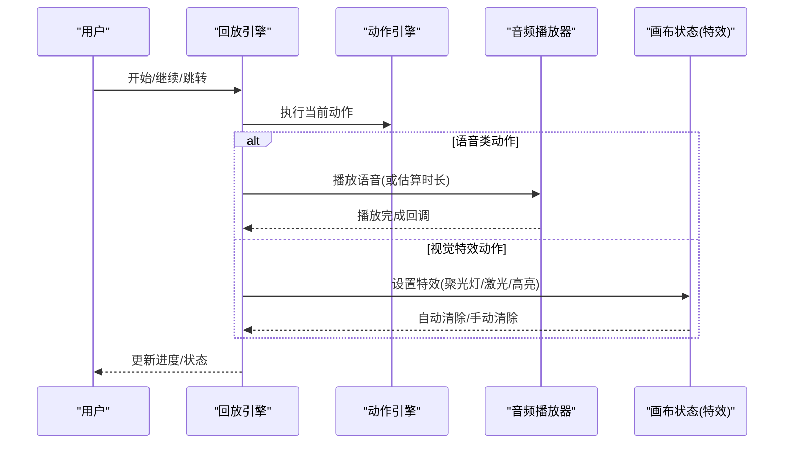
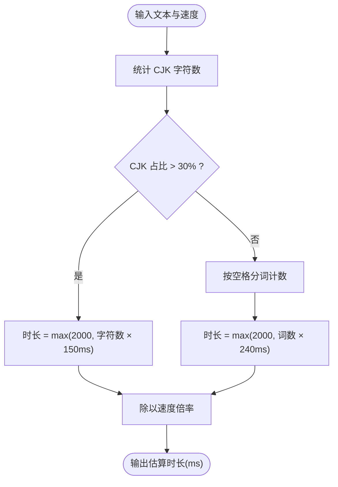
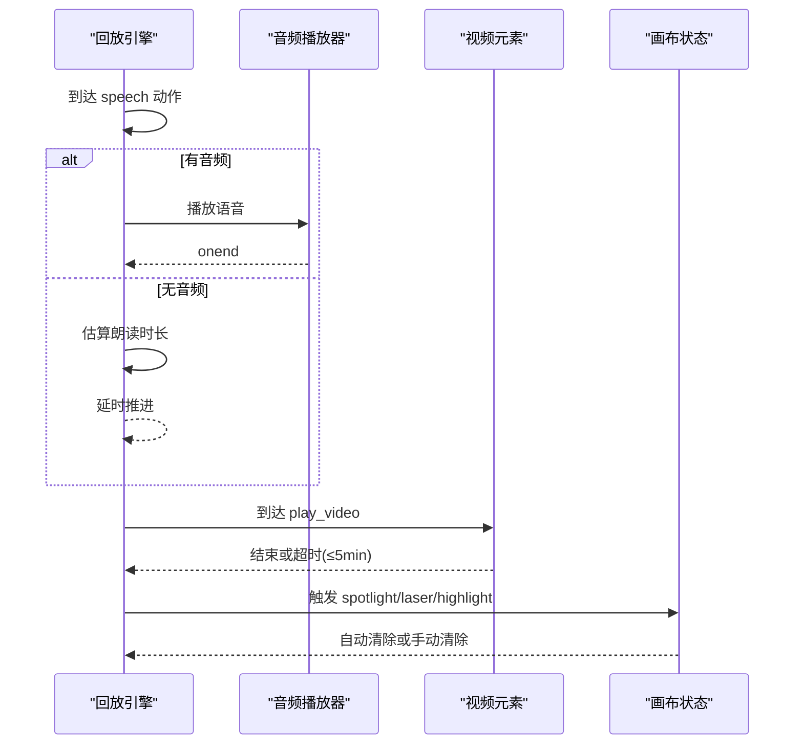
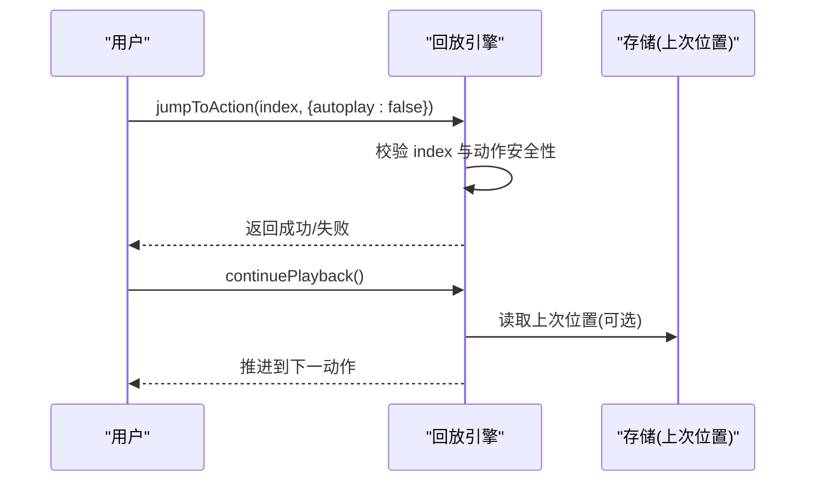
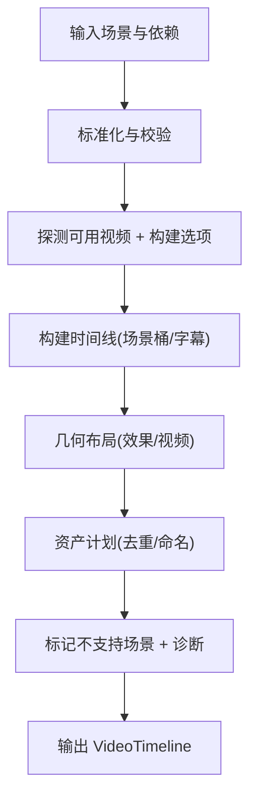

# 时间轴同步

<cite>
**本文引用的文件**   
- [lib/choreography/timing.ts](file://lib/choreography/timing.ts)
- [components/edit/scene-timeline.ts](file://components/edit/scene-timeline.ts)
- [tests/playback/action-navigation.test.ts](file://tests/playback/action-navigation.test.ts)
- [lib/video-export/compile.ts](file://lib/video-export/compile.ts)
- [lib/video-export/passes/assets.ts](file://lib/video-export/passes/assets.ts)
- [lib/store/canvas.ts](file://lib/store/canvas.ts)
</cite>

## 产品概述
本文件聚焦 OpenMAIC 课堂回放的时间轴同步机制，围绕“场景切换、动作时序控制与进度跟踪”展开，解释无音频朗读时间的估算算法（CJK 与非 CJK 文本的语速差异），并说明时间轴与媒体播放（语音、视频、动画）的精确对齐策略。同时提供时间轴导航 API 的使用要点（跳转、快进快退、可视化）、时间精度控制、延迟处理与性能优化建议，帮助编辑与回放使用者获得一致且稳定的体验。

## 核心业务流程
- 场景与动作：每个场景包含一组动作（如 speech、spotlight、play_video、discussion 等）。回放引擎按顺序执行动作，依据动作类型与时长推进时间轴。
- 时间估算：当没有预生成音频时，使用统一的朗读时长估算函数，确保应用与导出视频的时间一致。
- 媒体同步：语音播放器、视频元素与视觉特效（聚光灯、激光、高亮）由时间轴驱动，保证三者对齐。
- 进度跟踪：支持跳转到指定动作、暂停/继续、恢复上次位置，并在 UI 上呈现当前动作索引与场景状态。

图表来源 
- [lib/choreography/timing.ts:1-122](file://lib/choreography/timing.ts#L1-L122)
- [components/edit/scene-timeline.ts:1-18](file://components/edit/scene-timeline.ts#L1-L18)
- [tests/playback/action-navigation.test.ts:357-457](file://tests/playback/action-navigation.test.ts#L357-L457)

章节来源
- [lib/choreography/timing.ts:1-122](file://lib/choreography/timing.ts#L1-L122)
- [components/edit/scene-timeline.ts:1-18](file://components/edit/scene-timeline.ts#L1-L18)
- [tests/playback/action-navigation.test.ts:357-457](file://tests/playback/action-navigation.test.ts#L357-L457)

## 功能模块清单
- 时间轴规范与估算
  - 职责：集中定义效果持续时间、讨论触发延迟、自动跳过时长、最大等待时长；提供无音频朗读时长估算函数。
  - 验收要点：估算结果与应用与导出一致；常量变更影响所有消费者。
- 场景时间轴支持判定
  - 职责：决定哪些场景类型支持旁白时间轴（含有注册画布表面或仅旁白类型）。
  - 验收要点：slide/quiz 与 interactive/pbl 的正确判定。
- 回放动作导航与进度
  - 职责：支持跳转到指定动作、暂停/继续、恢复上次动作边界；保护不安全目标（需重建上下文的操作）。
  - 验收要点：跳转后状态正确、不会调度过期完成事件、旧计时器不推进旧动作。
- 视频导出时间线编译
  - 职责：标准化场景、探测可用媒体、构建时间线、几何布局、资产计划与诊断标记。
  - 验收要点：不可用媒体以 0ms dwell 跳过且不偏移后续动作；资产去重与命名计划稳定。
- 画布状态与特效管理
  - 职责：维护聚光灯、高亮、激光、缩放等视觉效果的状态与生命周期；与回放动作联动。
  - 验收要点：切换场景时重置状态；视频播放生命周期不被自动清除打断。

章节来源
- [lib/choreography/timing.ts:16-34](file://lib/choreography/timing.ts#L16-L34)
- [components/edit/scene-timeline.ts:10-17](file://components/edit/scene-timeline.ts#L10-L17)
- [tests/playback/action-navigation.test.ts:261-290](file://tests/playback/action-navigation.test.ts#L261-L290)
- [lib/video-export/compile.ts:131-155](file://lib/video-export/compile.ts#L131-L155)
- [lib/video-export/passes/assets.ts:202-229](file://lib/video-export/passes/assets.ts#L202-L229)
- [lib/store/canvas.ts:399-467](file://lib/store/canvas.ts#L399-L467)

## 数据与状态
- 核心数据模型
  - 场景与动作：场景包含有序动作列表；动作类型包括 speech、spotlight、play_video、discussion 等。
  - 时间轴选项：速度倍率、是否启用 TTS、是否允许自动跳过讨论等。
  - 资产与媒体：元素到媒体资源的映射、视频时长缓存、资产计划条目。
- 关键状态流转
  - 回放模式：idle → playing → paused → idle（完成或中断）。
  - 动作边界：保存/恢复 actionIndex、actionId、actionType，用于断点续播。
  - 特效状态：聚光灯/高亮/激光/缩放的开启与自动清除。
- 数据所有权边界
  - 时间估算与常量集中在 timing.ts，供应用与导出共同消费。
  - 画布状态在 store/canvas.ts 中统一维护，避免渲染层直接修改。
  - 视频导出时间线编译在 compile.ts 中产出确定性结构，assets.ts 负责资源计划与诊断。

章节来源
- [lib/choreography/timing.ts:76-121](file://lib/choreography/timing.ts#L76-L121)
- [lib/video-export/compile.ts:131-155](file://lib/video-export/compile.ts#L131-L155)
- [lib/video-export/passes/assets.ts:202-229](file://lib/video-export/passes/assets.ts#L202-L229)
- [lib/store/canvas.ts:399-467](file://lib/store/canvas.ts#L399-L467)
- [tests/playback/action-navigation.test.ts:221-252](file://tests/playback/action-navigation.test.ts#L221-L252)

## 关键约束与边界
- 时间精度与延迟
  - 无音频朗读时长估算：CJK 文本按字符速率（约 150ms/字），非 CJK 按词速率（约 240ms/词，≈250 WPM），最小值 2000ms，再除以播放速度倍率。
  - 效果自动清除：聚光灯/激光默认 5000ms 后自动清除；讨论触发延迟 3000ms，自动跳过 5000ms。
  - 视频等待上限：最长等待 5 分钟，超时视为跳过以避免阻塞后续动作。
- 依赖与集成边界
  - 导出与运行时必须共用同一套 timing 常量与估算函数，避免漂移。
  - 不支持的场景类型或无画布表面的未知类型不提供旁白时间轴。
- 业务约束
  - 跳转目标限制：需要重建上下文的动作（如 widget_setState、discussion、play_video）不允许直接跳转，防止状态不一致。
  - 过时回调防护：跳转后旧的语音播放或朗读计时器不得推进旧动作或触发旧完成事件。

章节来源
- [lib/choreography/timing.ts:16-34](file://lib/choreography/timing.ts#L16-L34)
- [lib/choreography/timing.ts:76-121](file://lib/choreography/timing.ts#L76-L121)
- [components/edit/scene-timeline.ts:10-17](file://components/edit/scene-timeline.ts#L10-L17)
- [tests/playback/action-navigation.test.ts:261-290](file://tests/playback/action-navigation.test.ts#L261-L290)
- [tests/playback/action-navigation.test.ts:433-473](file://tests/playback/action-navigation.test.ts#L433-L473)

## 详细技术解析

### 时间估算算法（无音频朗读）
- 规则
  - CJK 判定：CJK 字符占比超过 30% 即视为 CJK 文本。
  - CJK 速率：每字符约 150ms，取最小 2000ms。
  - 非 CJK 速率：按空格分词计数，每词约 240ms（≈250 WPM），取最小 2000ms。
  - 速度倍率：最终时长除以 speed（默认 1）。
- 复杂度
  - 时间复杂度 O(n)，n 为文本长度；正则匹配与分词均为线性扫描。
  - 空间复杂度 O(1)，仅统计计数与阈值比较。
- 一致性
  - 该函数被应用与导出共同引用，确保回放与导出视频的对齐。

图表来源 
- [lib/choreography/timing.ts:76-121](file://lib/choreography/timing.ts#L76-L121)

章节来源
- [lib/choreography/timing.ts:76-121](file://lib/choreography/timing.ts#L76-L121)

### 时间轴与媒体播放同步
- 语音与朗读
  - 若有预生成音频：由播放器驱动完成回调推进时间轴。
  - 若无音频：使用估算时长作为 dwell，确保朗读时间与视觉停留一致。
- 视频与元素
  - play_video 动作若无可用的媒体资源，时间线为其分配 0ms dwell 并跳过，不影响后续动作时序。
  - 视频播放的生命周期独立于特效自动清除，避免被误中断。
- 视觉特效
  - spotlight/laser/highlight 等特效由动作触发，默认在一定时长后自动清除，或通过 UI 操作清除。

图表来源 
- [lib/choreography/timing.ts:16-34](file://lib/choreography/timing.ts#L16-L34)
- [lib/video-export/passes/assets.ts:202-229](file://lib/video-export/passes/assets.ts#L202-L229)
- [lib/store/canvas.ts:399-467](file://lib/store/canvas.ts#L399-L467)

章节来源
- [lib/choreography/timing.ts:16-34](file://lib/choreography/timing.ts#L16-L34)
- [lib/video-export/passes/assets.ts:202-229](file://lib/video-export/passes/assets.ts#L202-L229)
- [lib/store/canvas.ts:399-467](file://lib/store/canvas.ts#L399-L467)

### 时间轴导航 API（跳转、快进快退、可视化）
- 跳转至指定动作
  - 接口：jumpToAction(index, options)
  - 行为：可设置 autoplay=false 仅定位不自动播放；对不安全目标进行守卫拒绝。
  - 验证：越界索引、需重建上下文的动作类型会被拒绝。
- 暂停/继续
  - 接口：pause()/continuePlayback()
  - 行为：暂停后跳转仅移动光标，不触发播放；继续从当前位置推进。
- 恢复上次位置
  - 存储：保存 sceneId → {actionIndex, actionId, actionType}。
  - 恢复：读取有效位置并跳转到对应动作，必要时禁用自动播放。
- 可视化
  - 通过 getSnapshot().actionIndex 获取当前动作索引，结合场景缩略图与侧边栏展示进度。

图表来源 
- [tests/playback/action-navigation.test.ts:261-290](file://tests/playback/action-navigation.test.ts#L261-L290)
- [tests/playback/action-navigation.test.ts:382-431](file://tests/playback/action-navigation.test.ts#L382-L431)
- [tests/playback/action-navigation.test.ts:221-252](file://tests/playback/action-navigation.test.ts#L221-L252)

章节来源
- [tests/playback/action-navigation.test.ts:261-290](file://tests/playback/action-navigation.test.ts#L261-L290)
- [tests/playback/action-navigation.test.ts:382-431](file://tests/playback/action-navigation.test.ts#L382-L431)
- [tests/playback/action-navigation.test.ts:221-252](file://tests/playback/action-navigation.test.ts#L221-L252)

### 视频导出时间线编译与资产计划
- 编译流程
  - 标准化场景与动作校验。
  - 探测可用视频资源，将 TimingProbe 适配为编排选项。
  - 构建时间线（索引→时间展开，场景桶+字幕）。
  - 几何布局（效果与视频元素放置，缺失降级）。
  - 资产计划（去重与命名，标注段级资产引用）。
  - 不支持场景标记与诊断信息收集。
- 不可用媒体处理
  - 无关联媒体：时间线赋予 0ms dwell 并跳过，不偏移后续动作。
  - 引用但缺失：仍生成资产条目 present:false，便于导出区分“无关联”和“引用缺失”。

图表来源 
- [lib/video-export/compile.ts:131-155](file://lib/video-export/compile.ts#L131-L155)
- [lib/video-export/passes/assets.ts:202-229](file://lib/video-export/passes/assets.ts#L202-L229)

章节来源
- [lib/video-export/compile.ts:131-155](file://lib/video-export/compile.ts#L131-L155)
- [lib/video-export/passes/assets.ts:202-229](file://lib/video-export/passes/assets.ts#L202-L229)

### 场景时间轴支持判定
- 规则
  - 已注册画布表面（slide/quiz）：支持旁白时间轴。
  - 仅旁白类型（interactive/pbl）：即使无画布表面也支持旁白时间轴。
  - 未知/不支持类型且无表面：不提供时间轴。
- 价值
  - 解耦旁白时间轴与画布编辑器，确保不同场景类型的统一体验。

章节来源
- [components/edit/scene-timeline.ts:10-17](file://components/edit/scene-timeline.ts#L10-L17)

## 性能考虑
- 估算与计算
  - 朗读时长估算为线性复杂度，适合高频调用；避免重复创建正则对象。
- 媒体等待上限
  - 视频等待上限 5 分钟，避免长时间阻塞；超时视为跳过以保证整体时间线稳定性。
- 特效清理
  - 自动清除定时器避免内存泄漏；切换场景时统一重置状态，减少残留。
- 导出优化
  - 资产去重与命名计划减少冗余；不可用媒体以 0ms dwell 跳过，避免时间线偏移。

[本节为通用指导，不直接分析具体文件]

## 故障排查指南
- 跳转后旧完成事件未触发
  - 现象：跳转后旧的语音播放或朗读计时器无法推进旧动作。
  - 原因：回放引擎对过时回调进行守卫，避免错误推进。
  - 处理：确认跳转参数与 autoplay 设置；检查是否有未取消的旧 Promise。
- 不可用媒体导致时间线偏移
  - 现象：视频缺失导致后续动作延迟。
  - 原因：未正确处理不可用媒体的 dwell。
  - 处理：确保 assets pass 为不可用媒体分配 0ms dwell 并跳过。
- 特效未自动清除
  - 现象：聚光灯/激光持续显示。
  - 原因：自动清除定时器未触发或被覆盖。
  - 处理：检查 EFFECT_AUTO_CLEAR_MS 与 clearAllEffects 调用时机。

章节来源
- [tests/playback/action-navigation.test.ts:433-473](file://tests/playback/action-navigation.test.ts#L433-L473)
- [lib/video-export/passes/assets.ts:202-229](file://lib/video-export/passes/assets.ts#L202-L229)
- [lib/choreography/timing.ts:16-34](file://lib/choreography/timing.ts#L16-L34)

## 结论
OpenMAIC 的时间轴同步通过统一的 timing 规范与估算函数，确保应用与导出的一致性；回放引擎对动作导航、媒体同步与特效生命周期进行严格管控，保障视觉、语音与动画的精确对齐。通过合理的等待上限、过时回调守卫与资产计划，系统在复杂场景下仍能保持稳定与高性能。建议在扩展新动作类型时，遵循现有规范与约束，保持时间轴的一致性与可预测性。