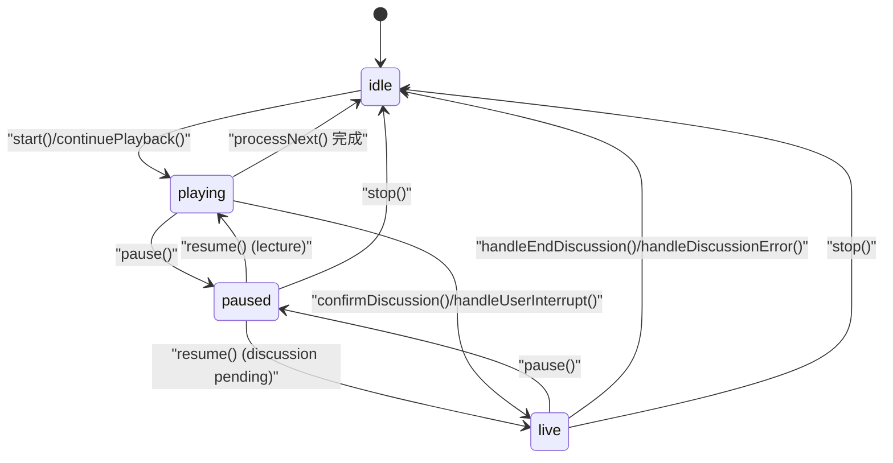
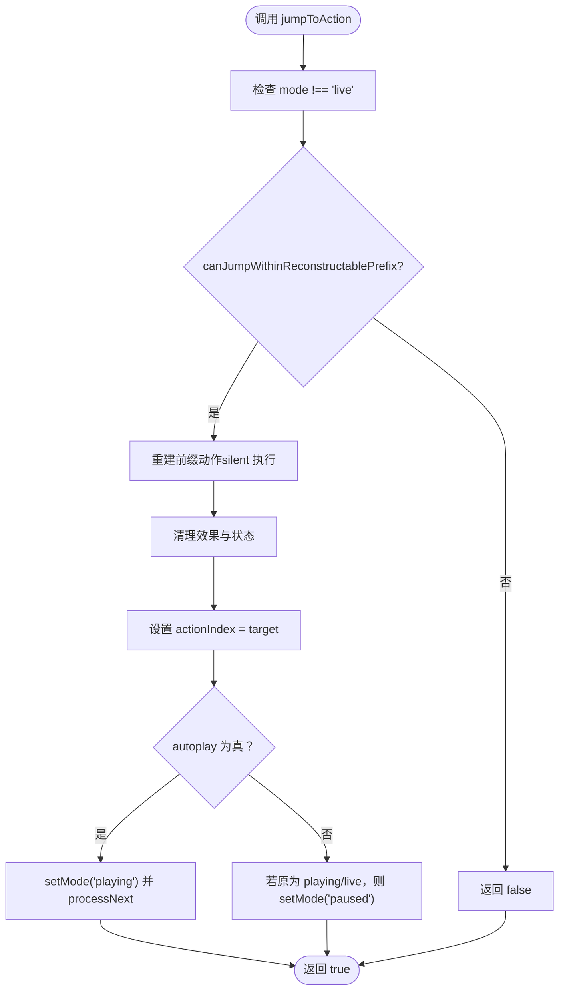
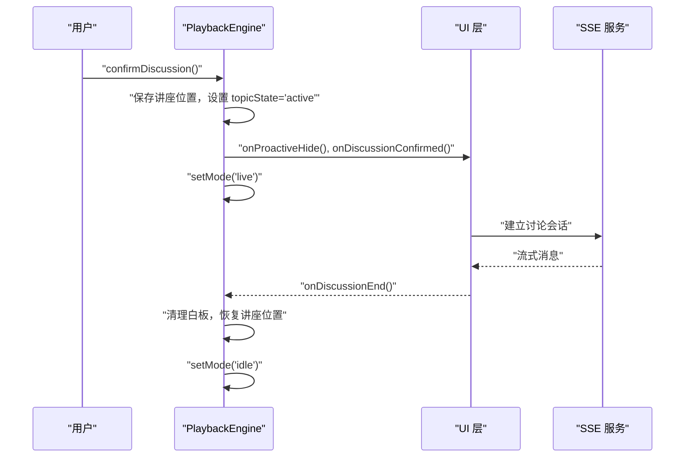
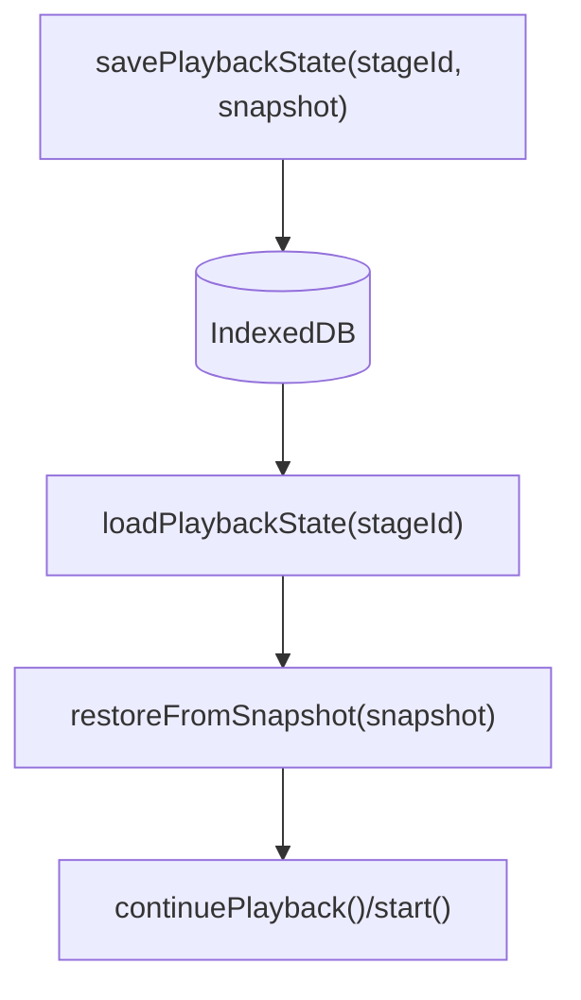
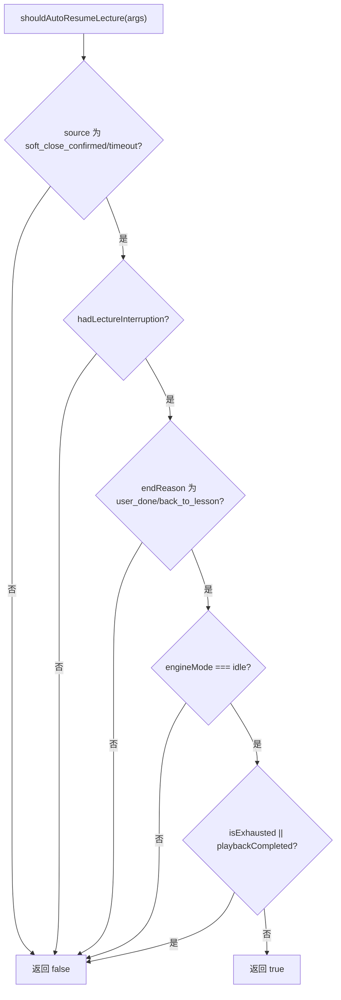
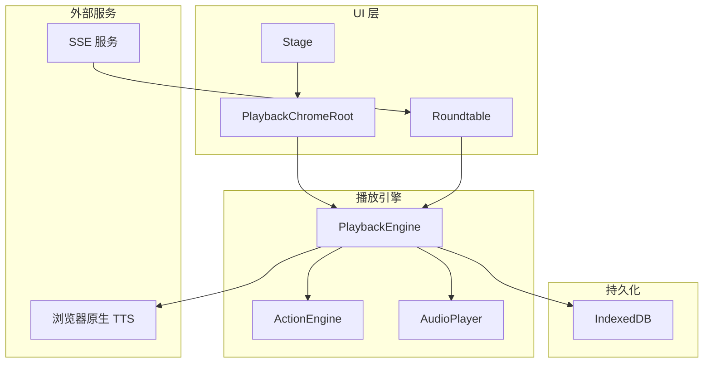
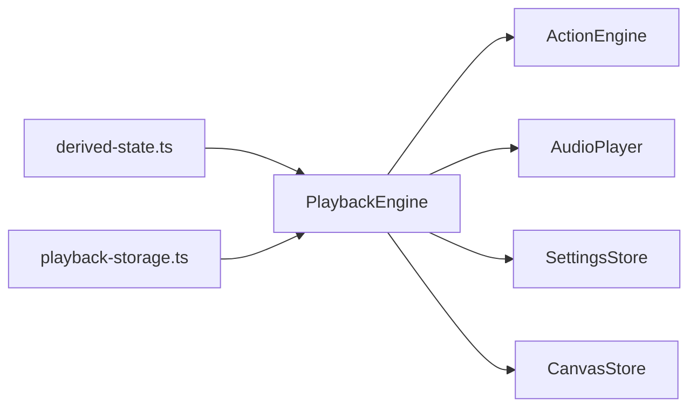

# 状态机管理

<cite>
**本文引用的文件**   
- [engine.ts](file://lib/playback/engine.ts)
- [types.ts](file://lib/playback/types.ts)
- [derived-state.ts](file://lib/playback/derived-state.ts)
- [action-navigation.ts](file://lib/playback/action-navigation.ts)
- [action-resume.ts](file://lib/playback/action-resume.ts)
- [auto-resume.ts](file://lib/playback/auto-resume.ts)
- [playback-storage.ts](file://lib/utils/playback-storage.ts)
- [index.ts](file://lib/playback/index.ts)
- [stage.tsx](file://components/stage.tsx)
- [auto-resume.test.ts](file://tests/lib/playback/auto-resume.test.ts)
</cite>

## 产品概述
本文件面向课堂回放与讨论交互的播放引擎状态机，围绕 idle、playing、paused、live 四种核心状态及其转换规则进行系统化说明。该状态机由 PlaybackEngine 实现，负责驱动课件动作（演讲、白板、视频、特效、讨论触发等），并与音频播放器、ActionEngine、浏览器原生 TTS、以及 UI 回调协同工作。同时提供状态持久化、自动恢复、错误处理与性能优化建议，帮助开发者与使用者理解并正确使用状态机。

## 核心业务流程
- 正常播放流程：从 idle 进入 playing，逐条执行动作；遇到 speech 时优先尝试预生成音频，失败则回退到浏览器原生 TTS 或阅读计时器；完成所有动作后回到 idle。
- 暂停与恢复：在 playing 或 live 下可暂停至 paused；resume() 根据当前上下文恢复音频/TTS/阅读计时器或进入 live。
- 讨论模式（live）：当出现 discussion 动作时，延迟展示“主动提示卡”，用户可选择确认进入 live 讨论或跳过；用户中断（发送消息）也会直接进入 live。
- 讨论结束：清理白板和话题状态，恢复被中断的讲座位置，回到 idle，可由上层决定是否自动继续播放。
- 自动恢复：在特定软关闭场景且满足条件时，自动从 idle 继续播放被中断的讲座。

**章节来源**
- [engine.ts:148-339](file://lib/playback/engine.ts#L148-L339)
- [engine.ts:666-701](file://lib/playback/engine.ts#L666-L701)
- [engine.ts:427-456](file://lib/playback/engine.ts#L427-L456)
- [engine.ts:386-402](file://lib/playback/engine.ts#L386-L402)
- [auto-resume.ts:37-44](file://lib/playback/auto-resume.ts#L37-L44)

## 功能模块清单
- 播放引擎（PlaybackEngine）
  - 职责：维护四态机、动作调度、TTS/音频控制、讨论生命周期、进度快照、跳转与重建前缀校验。
  - 验收要点：start/pause/resume/stop/jumpToAction/handleUserInterrupt/confirmDiscussion/skipDiscussion/handleEndDiscussion/handleDiscussionError 行为符合状态图；isExhausted/onComplete 正确；进度回调与持久化一致。
- 类型与回调（types.ts）
  - 职责：定义 EngineMode、TopicState、TriggerEvent、Effect、PlaybackEngineCallbacks。
  - 验收要点：UI 层通过 onModeChange/onProgress/onSpeechStart/onSpeechEnd/onProactiveShow 等回调同步状态与事件。
- 派生视图（derived-state.ts）
  - 职责：将底层多变量汇总为统一的 PlaybackView（phase/sourceText/bubbleRole/activeRole/buttonState/isInLiveFlow/isTopicActive）。
  - 验收要点：UI 渲染基于单一视图对象，避免重复推导逻辑。
- 动作导航与跳转（action-navigation.ts）
  - 职责：判断可跳转性、构建安全目标、计算行号进度、前后安全 speech 定位。
  - 验收要点：对 unsafe action types 的保护；仅支持可重建前缀的 speech 跳转。
- 动作断点恢复（action-resume.ts）
  - 职责：按 sceneId + actionIndex 持久化 speech 断点，读取并验证有效性，返回可恢复光标。
  - 验收要点：版本校验、字段校验、JSON 读写异常容错。
- 自动恢复策略（auto-resume.ts）
  - 职责：在软关闭确认后或超时结束时，依据严格条件决定是否自动继续讲座。
  - 验收要点：仅 soft_close_confirmed/soft_close_timeout 且 hadLectureInterruption=true、endReason=user_done/back_to_lesson、engineMode=idle、未耗尽/未完成。
- 播放状态持久化（playback-storage.ts）
  - 职责：IndexedDB 存储 sceneIndex/actionIndex/consumedDiscussions/sceneId，提供 save/load/clear。
  - 验收要点：跨会话恢复一致性；sceneId 不一致时丢弃快照。

**章节来源**
- [types.ts:14-62](file://lib/playback/types.ts#L14-L62)
- [derived-state.ts:77-213](file://lib/playback/derived-state.ts#L77-L213)
- [action-navigation.ts:40-78](file://lib/playback/action-navigation.ts#L40-L78)
- [action-resume.ts:40-112](file://lib/playback/action-resume.ts#L40-L112)
- [auto-resume.ts:37-44](file://lib/playback/auto-resume.ts#L37-L44)
- [playback-storage.ts:21-58](file://lib/utils/playback-storage.ts#L21-L58)

## 数据与状态
- 核心状态模型
  - EngineMode：idle | playing | paused | live
  - TopicState：active | pending | closed
  - TriggerEvent：id/question/prompt/agentId
  - Effect：spotlight/laser 视觉效果
  - PlaybackSnapshot：sceneIndex/actionIndex/consumedDiscussions/sceneId
- 关键状态流转
  - start(): idle → playing（重置索引，进入 processNext）
  - continuePlayback(): idle → playing（从当前位置继续）
  - pause(): playing/live → paused（取消定时器、冻结 TTS/音频、讨论 pending）
  - resume(): paused → playing/live（恢复 TTS/音频/阅读计时器或进入 live）
  - stop(): 任意 → idle（清理所有资源，复位索引与状态）
  - confirmDiscussion(): 触发 → live（保存讲座位置，隐藏提示卡，通知上层）
  - skipDiscussion(): 触发 → 继续 playing（标记 consumed，隐藏提示卡）
  - handleUserInterrupt(): playing/paused → live（保存位置，停止音频/TTS，通知上层）
  - handleEndDiscussion(): live → idle（清理白板与话题，恢复讲座位置）
  - handleDiscussionError(): live/paused(pending) → idle（错误路径恢复）
- 数据所有权边界
  - PlaybackEngine 拥有 engineMode、topicState、trigger、consumedDiscussions、索引与定时器。
  - ActionEngine 负责具体动作执行与效果清理。
  - AudioPlayer 负责音频播放/暂停/停止。
  - IndexedDB 存储最小快照用于恢复。
  - derived-state.ts 消费 Stage 的多变量输出统一视图，不修改原始状态。



**图表来源**
- [engine.ts:148-339](file://lib/playback/engine.ts#L148-L339)
- [engine.ts:341-402](file://lib/playback/engine.ts#L341-L402)
- [engine.ts:427-456](file://lib/playback/engine.ts#L427-L456)

**章节来源**
- [types.ts:14-26](file://lib/playback/types.ts#L14-L26)
- [playback-storage.ts:10-15](file://lib/utils/playback-storage.ts#L10-L15)
- [derived-state.ts:16-32](file://lib/playback/derived-state.ts#L16-L32)

## 关键约束与边界
- 非功能性需求
  - 性能：processNext 使用 queueMicrotask 避免深递归；TTS 分句避免 Chrome 长文本截断；speechTimer 估算阅读时长以兼容无音频场景。
  - 可靠性：generation 机制防止旧任务回调污染新任务；onEnded 回调中检查 isCurrentGeneration。
  - 兼容性：Firefox 不支持 speechSynthesis.pause()/resume()，采用 cancel+re-speak 模式。
- 依赖与集成边界
  - ActionEngine：execute() 执行动作，clearEffects() 清理效果；jumpToAction 会重置视觉状态。
  - AudioPlayer：play()/pause()/resume()/stop()；onEnded 驱动 processNext。
  - SettingsStore：ttsEnabled/ttsProviderId/ttsSpeed/ttsVolume/ttsVoice 影响 TTS 行为。
  - CanvasStore：讨论期间打开白板，结束后关闭；jumpToAction 暂停视频。
- 业务约束
  - 跳转限制：仅允许跳转到可重建前缀的 speech 动作；unsafe action types（如 play_video、discussion、widget_*）禁止跳转。
  - 讨论跳过：若 agent 不在用户选择列表，直接标记 consumed 并继续。
  - 自动恢复：仅在特定软关闭场景且满足严格条件时自动继续讲座。

**章节来源**
- [engine.ts:173-218](file://lib/playback/engine.ts#L173-L218)
- [engine.ts:540-734](file://lib/playback/engine.ts#L540-L734)
- [engine.ts:736-800](file://lib/playback/engine.ts#L736-L800)
- [action-navigation.ts:16-78](file://lib/playback/action-navigation.ts#L16-L78)
- [auto-resume.ts:37-44](file://lib/playback/auto-resume.ts#L37-L44)

## 详细组件分析

### 播放引擎（PlaybackEngine）
- 设计模式
  - 状态机：集中式 mode 切换，setMode() 触发 onModeChange。
  - 生成隔离：playbackGeneration 确保异步回调只处理当前任务。
  - 回调驱动：onSpeechStart/onSpeechEnd/onProgress/onComplete 等解耦 UI。
- 关键方法
  - start()/continuePlayback()：初始化索引，进入 playing，启动 processNext。
  - pause()/resume()：暂停/恢复音频、TTS、阅读计时器；讨论 pending 时进入 live。
  - jumpToAction(actionIndex, options)：安全跳转，重建前缀，可选 autoplay。
  - confirmDiscussion()/skipDiscussion()：讨论触发后的用户决策。
  - handleUserInterrupt(text)：打断讲座进入 live，保存位置。
  - handleEndDiscussion()/handleDiscussionError()：讨论结束/错误路径恢复。
- 错误处理
  - TTS 错误降级到阅读计时器；onerror('canceled') 忽略。
  - 未知 action 类型直接跳过。
- 性能优化
  - queueMicrotask 避免同步递归；speechTimer 估算时长；TTS 分句。

```mermaid
classDiagram
class PlaybackEngine {
-scenes : Scene[]
-sceneIndex : number
-actionIndex : number
-mode : EngineMode
-consumedDiscussions : Set<string>
-savedSceneIndex : number|null
-savedActionIndex : number|null
-currentTopicState : TopicState|null
-audioPlayer : AudioPlayer
-actionEngine : ActionEngine
-callbacks : PlaybackEngineCallbacks
-sceneId : string|undefined
-currentTrigger : TriggerEvent|null
-triggerDelayTimer : Timeout|null
-speechTimer : Timeout|null
-speechTimerStart : number
-browserTTSActive : boolean
-browserTTSChunks : string[]
-browserTTSChunkIndex : number
-browserTTSPausedChunks : string[]
-speechTimerRemaining : number
-playbackGeneration : number
+getMode() : EngineMode
+hasLectureInterruption() : boolean
+getCurrentSceneId() : string|null
+getSnapshot() : PlaybackSnapshot
+restoreFromSnapshot(snapshot) : void
+start() : void
+continuePlayback() : void
+canJumpToAction(actionIndex) : boolean
+jumpToAction(actionIndex, options) : Promise<boolean>
+pause() : void
+resume() : void
+stop() : void
+confirmDiscussion() : void
+skipDiscussion() : void
+handleEndDiscussion() : void
+handleDiscussionError() : void
+handleUserInterrupt(text) : void
+isExhausted() : boolean
-invalidatePlaybackGeneration() : number
-isCurrentGeneration(generation) : boolean
-cancelActivePlaybackWork() : void
-setMode(mode) : void
-restoreSavedLectureState() : void
-getCurrentAction() : {action, sceneId}|null
-processNext(generation) : Promise<void>
-splitIntoChunks(text) : string[]
-playBrowserTTS(speechAction, generation) : void
-playBrowserTTSChunk(generation) : Promise<void>
}
```

**图表来源**
- [engine.ts:61-108](file://lib/playback/engine.ts#L61-L108)
- [engine.ts:110-339](file://lib/playback/engine.ts#L110-L339)
- [engine.ts:479-521](file://lib/playback/engine.ts#L479-L521)
- [engine.ts:529-734](file://lib/playback/engine.ts#L529-L734)
- [engine.ts:736-800](file://lib/playback/engine.ts#L736-L800)

**章节来源**
- [engine.ts:148-339](file://lib/playback/engine.ts#L148-L339)
- [engine.ts:540-734](file://lib/playback/engine.ts#L540-L734)
- [engine.ts:736-800](file://lib/playback/engine.ts#L736-L800)

### 动作导航与跳转
- 安全跳转规则
  - canJumpWithinReconstructablePrefix：仅允许跳转到 speech 且前缀不含 unsafe action types。
  - buildActionNavigationTargets：为每个 speech 生成可跳转目标与行号。
  - getPreviousSafeSpeechActionIndex/getNextSafeSpeechActionIndex：前后安全 speech 定位。
- 使用示例
  - jumpToAction(2, {autoplay: false})：跳转到第 2 个 speech，不自动播放。
  - continuePlayback()：从当前位置继续播放。



**图表来源**
- [engine.ts:181-218](file://lib/playback/engine.ts#L181-L218)
- [action-navigation.ts:65-78](file://lib/playback/action-navigation.ts#L65-L78)

**章节来源**
- [action-navigation.ts:40-95](file://lib/playback/action-navigation.ts#L40-L95)
- [engine.ts:181-218](file://lib/playback/engine.ts#L181-L218)

### 讨论模式与普通播放模式
- 普通播放模式（playing/paused）
  - 顺序执行 speech/特效/白板/视频等动作；TTS/音频/阅读计时器驱动进度。
- 讨论模式（live）
  - 触发条件：confirmDiscussion() 或 handleUserInterrupt()。
  - 行为：保存讲座位置，隐藏提示卡，进入 live；SSE 流式对话；结束后恢复讲座位置并回到 idle。
- 区别
  - live 模式下暂停会设置 currentTopicState='pending'，resume() 时进入 live 而非 playing。
  - 用户中断会立即停止音频/TTS，进入 live。



**图表来源**
- [engine.ts:341-370](file://lib/playback/engine.ts#L341-L370)
- [engine.ts:386-402](file://lib/playback/engine.ts#L386-L402)

**章节来源**
- [engine.ts:341-402](file://lib/playback/engine.ts#L341-L402)
- [engine.ts:427-456](file://lib/playback/engine.ts#L427-L456)

### 状态持久化与恢复
- 快照结构：sceneIndex/actionIndex/consumedDiscussions/sceneId。
- 持久化：savePlaybackState/loadPlaybackState/clearPlaybackState。
- 恢复：restoreFromSnapshot() 设置索引与 consumedDiscussions。
- 动作断点：action-resume.ts 按 sceneId + actionIndex 存储 speech 断点，读取并验证有效性。



**图表来源**
- [playback-storage.ts:21-58](file://lib/utils/playback-storage.ts#L21-L58)
- [engine.ts:141-146](file://lib/playback/engine.ts#L141-L146)
- [action-resume.ts:67-112](file://lib/playback/action-resume.ts#L67-L112)

**章节来源**
- [playback-storage.ts:10-58](file://lib/utils/playback-storage.ts#L10-L58)
- [engine.ts:131-146](file://lib/playback/engine.ts#L131-L146)
- [action-resume.ts:40-112](file://lib/playback/action-resume.ts#L40-L112)

### 自动恢复策略
- 条件：source 为 soft_close_confirmed/soft_close_timeout；hadLectureInterruption=true；endReason 为 user_done/back_to_lesson；engineMode=idle；未耗尽/未完成。
- 使用：上层在讨论结束后调用 shouldAutoResumeLecture(args) 决定是否继续播放。



**图表来源**
- [auto-resume.ts:37-44](file://lib/playback/auto-resume.ts#L37-L44)

**章节来源**
- [auto-resume.ts:37-44](file://lib/playback/auto-resume.ts#L37-L44)
- [auto-resume.test.ts:13-62](file://tests/lib/playback/auto-resume.test.ts#L13-L62)

## 架构总览


**图表来源**
- [stage.tsx:121-165](file://components/stage.tsx#L121-L165)
- [engine.ts:61-108](file://lib/playback/engine.ts#L61-L108)
- [playback-storage.ts:21-58](file://lib/utils/playback-storage.ts#L21-L58)

## 依赖分析
- 组件耦合
  - PlaybackEngine 依赖 ActionEngine、AudioPlayer、SettingsStore、CanvasStore。
  - derived-state.ts 消费 Stage 的多变量，输出统一视图给 Roundtable。
- 外部依赖
  - IndexedDB 用于持久化；浏览器 Web Speech API 用于 TTS。
- 循环依赖
  - 无直接循环依赖；回调机制解耦 UI 与引擎。



**图表来源**
- [engine.ts:61-108](file://lib/playback/engine.ts#L61-L108)
- [derived-state.ts:77-213](file://lib/playback/derived-state.ts#L77-L213)
- [playback-storage.ts:21-58](file://lib/utils/playback-storage.ts#L21-L58)

**章节来源**
- [engine.ts:61-108](file://lib/playback/engine.ts#L61-L108)
- [derived-state.ts:77-213](file://lib/playback/derived-state.ts#L77-L213)
- [playback-storage.ts:21-58](file://lib/utils/playback-storage.ts#L21-L58)

## 性能考虑
- 避免深递归：processNext 使用 queueMicrotask 处理连续 spotlight/laser 动作。
- TTS 分句：splitIntoChunks 避免 Chrome 长文本截断。
- 阅读计时器：无音频时估算阅读时长，减少不必要的 TTS 调用。
- 生成隔离：playbackGeneration 防止旧回调污染新任务。
- 资源清理：stop()/jumpToAction() 清理定时器、音频、TTS、效果。

[本节为通用指导，无需引用具体文件]

## 故障排查指南
- 常见问题
  - 播放卡住：检查 TTS 是否启用、浏览器是否支持 speechSynthesis；查看 onSpeechEnd 是否触发。
  - 讨论无法进入：确认 triggerDelayTimer 是否被清除；检查 isAgentSelected 过滤。
  - 跳转失败：验证 canJumpWithinReconstructablePrefix；检查 unsafe action types。
  - 自动恢复未生效：检查 shouldAutoResumeLecture 条件；确认 hadLectureInterruption 与 engineMode。
- 调试技巧
  - 监听 onModeChange/onProgress/onSpeechStart/onSpeechEnd 回调。
  - 打印 getSnapshot() 与 isExhausted() 结果。
  - 检查 IndexedDB 中的 playbackState 记录。

**章节来源**
- [engine.ts:540-734](file://lib/playback/engine.ts#L540-L734)
- [auto-resume.ts:37-44](file://lib/playback/auto-resume.ts#L37-L44)
- [playback-storage.ts:21-58](file://lib/utils/playback-storage.ts#L21-L58)

## 结论
PlaybackEngine 的状态机设计清晰、健壮，覆盖正常播放、暂停恢复、讨论交互、错误处理与自动恢复等核心场景。通过 generation 隔离、TTS 分句、阅读计时器等优化手段，确保了性能与兼容性。结合持久化与派生视图，为上层 UI 提供了稳定一致的抽象。建议在实际使用中严格遵循跳转规则与自动恢复条件，充分利用回调机制进行状态同步与错误处理。

[本节为总结，无需引用具体文件]