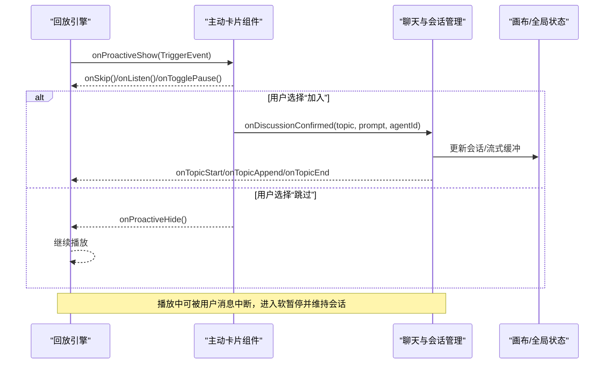
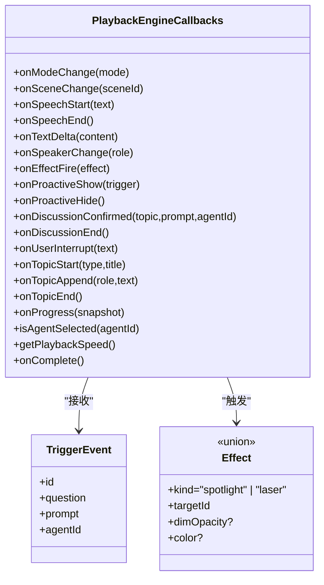
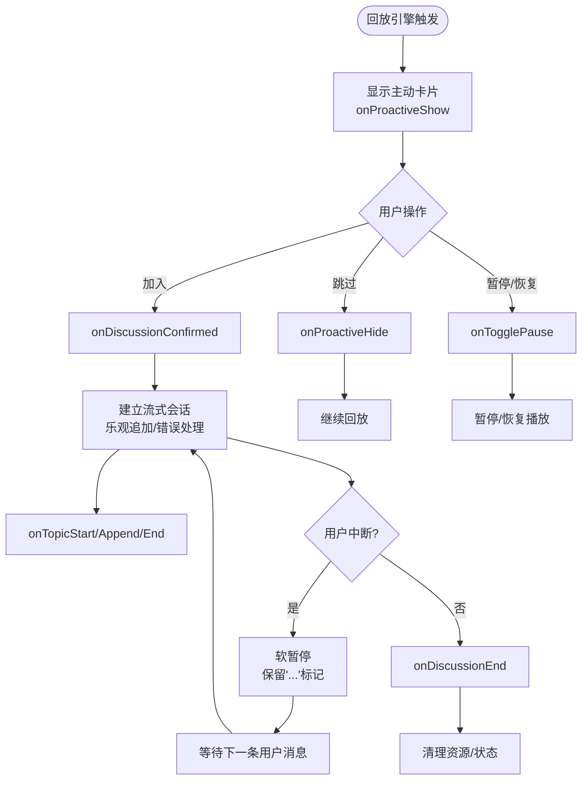
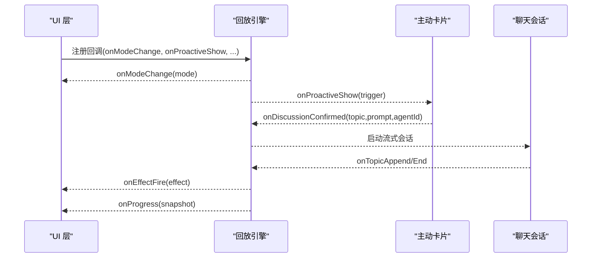

# 用户交互处理

<cite>
**本文引用的文件**   
- [lib/playback/types.ts](file://lib/playback/types.ts)
- [lib/choreography/timing.ts](file://lib/choreography/timing.ts)
- [components/chat/proactive-card.tsx](file://components/chat/proactive-card.tsx)
- [components/scene-renderers/pbl/v2/chat.tsx](file://components/scene-renderers/pbl/v2/chat.tsx)
- [lib/store/canvas.ts](file://lib/store/canvas.ts)
- [components/slide-renderer/Editor/Canvas/ElementCreateSelection.tsx](file://components/slide-renderer/Editor/Canvas/ElementCreateSelection.tsx)
- [packages/@openmaic/renderer/src/editing/useLineHandleGesture.ts](file://packages/@openmaic/renderer/src/editing/useLineHandleGesture.ts)
- [tests/playback/action-navigation.test.ts](file://tests/playback/action-navigation.test.ts)
</cite>

## 产品概述
本文件聚焦 OpenMAIC 课堂回放中的“用户交互处理”，覆盖键盘快捷键、鼠标点击与触摸手势等输入方式，并深入讲解讨论模式的触发与处理流程（主动卡片显示、确认/跳过、实时对话集成）。同时给出中断机制说明、交互事件 API 使用示例，以及无障碍访问与移动端适配要点。

## 核心业务流程
- 播放引擎模式：空闲/播放/暂停/直播（live）状态机驱动回放与讨论切换。
- 主动讨论触发：在播放过程中，根据时间线或动作触发“主动讨论卡片”；倒计时结束后自动跳过，或由用户选择加入/暂停/跳过。
- 讨论生命周期：用户确认后进入实时对话；支持软暂停与恢复；结束时清理资源并回到回放。
- 中断机制：播放中响应用户消息，打断当前流式输出，保持会话活跃以便继续对话。

**图表来源** 
- [lib/playback/types.ts:1-63](file://lib/playback/types.ts#L1-L63)
- [components/chat/proactive-card.tsx:1-250](file://components/chat/proactive-card.tsx#L1-L250)
- [components/scene-renderers/pbl/v2/chat.tsx:481-513](file://components/scene-renderers/pbl/v2/chat.tsx#L481-L513)

**章节来源**
- [lib/playback/types.ts:1-63](file://lib/playback/types.ts#L1-L63)
- [lib/choreography/timing.ts:1-31](file://lib/choreography/timing.ts#L1-L31)
- [components/chat/proactive-card.tsx:1-250](file://components/chat/proactive-card.tsx#L1-L250)
- [components/scene-renderers/pbl/v2/chat.tsx:481-513](file://components/scene-renderers/pbl/v2/chat.tsx#L481-L513)

## 功能模块清单
- 回放引擎与类型定义
  - 职责：定义引擎模式、效果、触发事件、回调接口与进度快照。
  - 验收要点：模式切换、效果回调、主动讨论回调、中断回调均能正确触发。
- 主动讨论卡片
  - 职责：展示讨论主题、倒计时、加入/暂停/跳过按钮；Portal 渲染避免层级问题。
  - 验收要点：位置自适应锚点、倒计时与自动跳过、暂停时进度冻结。
- 聊天与会话管理（PBL v2）
  - 职责：发送消息、乐观追加、流式响应、错误提示、软暂停与恢复。
  - 验收要点：Enter/Shift+Enter 行为、中断后保留“...”标记、错误统一提示。
- 画布与教学特效
  - 职责：聚光灯、激光笔、高亮、缩放、白板开关等教学辅助能力。
  - 验收要点：特效自动清除、批量操作与状态重置。
- 编辑区交互（鼠标/指针）
  - 职责：元素创建拖拽、对齐锁定、右键取消、最小尺寸限制。
  - 验收要点：Ctrl/Shift 锁定比例/方向、右击取消、拖拽阈值判断。
- 触摸手势（线条手柄）
  - 职责：Pointer 事件统一处理移动/抬起/取消，提交元素变更。
  - 验收要点：多指隔离、阈值判定、取消态清理。

**章节来源**
- [lib/playback/types.ts:1-63](file://lib/playback/types.ts#L1-L63)
- [components/chat/proactive-card.tsx:1-250](file://components/chat/proactive-card.tsx#L1-L250)
- [components/scene-renderers/pbl/v2/chat.tsx:481-513](file://components/scene-renderers/pbl/v2/chat.tsx#L481-L513)
- [lib/store/canvas.ts:156-191](file://lib/store/canvas.ts#L156-L191)
- [components/slide-renderer/Editor/Canvas/ElementCreateSelection.tsx:35-83](file://components/slide-renderer/Editor/Canvas/ElementCreateSelection.tsx#L35-L83)
- [packages/@openmaic/renderer/src/editing/useLineHandleGesture.ts:105-150](file://packages/@openmaic/renderer/src/editing/useLineHandleGesture.ts#L105-L150)

## 数据与状态
- 回放引擎模式
  - 状态：idle / playing / paused / live
  - 关键回调：模式变化、场景切换、语音开始/结束、文本增量、说话人变化、效果触发、主动讨论显示/隐藏、讨论确认/结束、用户中断、话题开始/追加/结束、进度快照、完成回调。
- 主动讨论触发
  - 数据结构：TriggerEvent（id、question、prompt、agentId）
  - 时序常量：讨论触发延迟、自动跳过时长（用于卡片倒计时与时间线一致性）。
- 聊天会话
  - 状态：会话列表、流式缓冲、是否正在流式传输、软关闭生命周期。
  - 中断语义：软暂停时保留最后助手消息的“...”标记，保持会话 active 等待下一条用户消息。
- 画布与特效
  - 状态：聚光灯/激光/高亮/缩放/白板开关/缩略图焦点/编辑器焦点/禁用热键等。
  - 批量操作：重置画布状态（切换场景时使用）。

**图表来源** 
- [lib/playback/types.ts:1-63](file://lib/playback/types.ts#L1-L63)

**章节来源**
- [lib/playback/types.ts:1-63](file://lib/playback/types.ts#L1-L63)
- [lib/choreography/timing.ts:1-31](file://lib/choreography/timing.ts#L1-L31)
- [lib/store/canvas.ts:156-191](file://lib/store/canvas.ts#L156-L191)

## 关键约束与边界
- 非功能性需求
  - 回放与导出需共享同一套时序常量，保证视频导出与前端回放一致。
  - 主动卡片倒计时与时间线严格同步，避免漂移。
- 依赖与集成边界
  - 回放引擎通过回调与 UI 解耦；聊天与会话管理通过流式缓冲与 AbortController 管理中断。
  - 画布特效由全局 store 提供，供渲染层消费。
- 业务约束
  - 讨论触发需在语音结束后延迟显示，避免遮挡。
  - 自动跳过仅在播放模式下生效；暂停时进度冻结。
  - 中断后不立即结束会话，保持活跃以支持连续对话。

**章节来源**
- [lib/choreography/timing.ts:1-31](file://lib/choreography/timing.ts#L1-L31)
- [components/chat/proactive-card.tsx:1-250](file://components/chat/proactive-card.tsx#L1-L250)
- [components/scene-renderers/pbl/v2/chat.tsx:481-513](file://components/scene-renderers/pbl/v2/chat.tsx#L481-L513)

## 详细交互机制与实现要点

### 键盘快捷键
- 生成/进入教室
  - 组合键：Meta/Ctrl + Enter 触发生成（首页输入框）。
- 聊天输入
  - Enter 发送；Shift+Enter 换行（支持粘贴代码片段等多行输入）。
- 画布编辑
  - Ctrl/Shift 配合拖拽：非线条元素锁定宽高比；线条元素锁定水平/垂直方向。
- 其他
  - 禁用热键开关：store 提供 setDisableHotkeysState 控制全局热键。

**章节来源**
- [app/page.tsx:425-430](file://app/page.tsx#L425-L430)
- [components/scene-renderers/pbl/v2/chat.tsx:508-513](file://components/scene-renderers/pbl/v2/chat.tsx#L508-L513)
- [components/slide-renderer/Editor/Canvas/ElementCreateSelection.tsx:35-83](file://components/slide-renderer/Editor/Canvas/ElementCreateSelection.tsx#L35-L83)
- [lib/store/canvas.ts:167](file://lib/store/canvas.ts#L167-L167)

### 鼠标点击与拖拽
- 元素创建与拖拽
  - 按下左键拖拽创建元素；右击取消；最小尺寸限制；拖拽距离超过阈值才提交。
- 主动卡片交互
  - 关闭按钮（X）跳过；加入按钮进入讨论；暂停/恢复按钮控制播放。
- 下拉菜单与工具栏
  - 点击外部区域关闭下拉；Tooltip 提示交互。

**章节来源**
- [components/slide-renderer/Editor/Canvas/ElementCreateSelection.tsx:35-83](file://components/slide-renderer/Editor/Canvas/ElementCreateSelection.tsx#L35-L83)
- [components/chat/proactive-card.tsx:139-148](file://components/chat/proactive-card.tsx#L139-L148)
- [components/chat/proactive-card.tsx:214-241](file://components/chat/proactive-card.tsx#L214-L241)

### 触摸手势与 Pointer 事件
- 线条手柄拖拽
  - 使用 Pointer 事件统一处理 move/up/cancel；按 pointerId 隔离多指；计算移动距离阈值决定是否提交更新。
- 移动端适配
  - Portal 渲染确保全屏模式下可见；固定定位与 rAF 持续跟踪锚点位置，适应布局变化。

**章节来源**
- [packages/@openmaic/renderer/src/editing/useLineHandleGesture.ts:105-150](file://packages/@openmaic/renderer/src/editing/useLineHandleGesture.ts#L105-L150)
- [components/chat/proactive-card.tsx:63-91](file://components/chat/proactive-card.tsx#L63-L91)

### 讨论模式触发与处理流程
- 触发时机
  - 回放引擎在适当时机调用 onProactiveShow，携带 TriggerEvent。
- 用户确认/跳过
  - 用户点击“加入”触发 onDiscussionConfirmed；点击“跳过”或倒计时结束触发 onProactiveHide。
- 实时对话集成
  - 聊天组件进行乐观追加、流式响应、错误提示；软暂停保留“...”标记；中断后继续对话。

**图表来源** 
- [lib/playback/types.ts:1-63](file://lib/playback/types.ts#L1-L63)
- [components/chat/proactive-card.tsx:1-250](file://components/chat/proactive-card.tsx#L1-L250)
- [components/scene-renderers/pbl/v2/chat.tsx:481-513](file://components/scene-renderers/pbl/v2/chat.tsx#L481-L513)

**章节来源**
- [lib/playback/types.ts:1-63](file://lib/playback/types.ts#L1-L63)
- [lib/choreography/timing.ts:1-31](file://lib/choreography/timing.ts#L1-L31)
- [components/chat/proactive-card.tsx:1-250](file://components/chat/proactive-card.tsx#L1-L250)
- [components/scene-renderers/pbl/v2/chat.tsx:481-513](file://components/scene-renderers/pbl/v2/chat.tsx#L481-L513)

### 用户中断机制
- 触发条件：播放中收到用户消息或显式中断路径。
- 处理逻辑：中止当前流式请求，保留最后助手消息的“...”标记，保持会话为 active 状态，等待下一次用户输入。
- 测试验证：中断最终语音后恢复，讨论结束时状态回退与索引恢复。

**章节来源**
- [components/scene-renderers/pbl/v2/chat.tsx:1479-1538](file://components/scene-renderers/pbl/v2/chat.tsx#L1479-L1538)
- [tests/playback/action-navigation.test.ts:536-577](file://tests/playback/action-navigation.test.ts#L536-L577)

### 交互事件 API 使用示例
- 监听模式变化
  - 通过 onModeChange 订阅回放状态，驱动 UI 显示播放/暂停/直播指示。
- 处理主动讨论
  - onProactiveShow 显示卡片；onProactiveHide 隐藏卡片；onDiscussionConfirmed 启动对话；onDiscussionEnd 清理。
- 效果触发
  - onEffectFire 接收聚光灯/激光效果，渲染层据此绘制叠加层。
- 进度与快照
  - onProgress 返回快照，用于持久化与断点续播。
- 自定义交互逻辑
  - 结合 isAgentSelected 与 getPlaybackSpeed 实现选择性跳过与速度感知行为。

**图表来源** 
- [lib/playback/types.ts:1-63](file://lib/playback/types.ts#L1-L63)
- [components/chat/proactive-card.tsx:1-250](file://components/chat/proactive-card.tsx#L1-L250)

**章节来源**
- [lib/playback/types.ts:1-63](file://lib/playback/types.ts#L1-L63)

### 无障碍访问支持
- 按钮与控件
  - aria-pressed 表达切换状态；aria-expanded 表达展开/收起；title 提供工具提示。
- 键盘可达性
  - 所有交互按钮支持键盘焦点与 Enter/Space 触发；组合键明确且可配置。
- 屏幕阅读器友好
  - 图标按钮附带 title；文本内容具备可读顺序；动态内容更新通过语义化标签呈现。

**章节来源**
- [components/generation/interactive-mode-button.tsx:21-46](file://components/generation/interactive-mode-button.tsx#L21-L46)
- [components/scene-renderers/pbl/v2/sidebar.tsx:345-374](file://components/scene-renderers/pbl/v2/sidebar.tsx#L345-L374)

### 移动端适配考虑
- Portal 与固定定位
  - 主动卡片使用 React Portal 渲染到 body，确保在全屏演示模式下可见。
- 触摸与指针
  - 统一使用 Pointer 事件处理拖拽与手势，兼容多指与取消态。
- 布局自适应
  - 基于 rAF 持续计算卡片位置，适应侧边栏折叠、窗口缩放等动态布局。

**章节来源**
- [components/chat/proactive-card.tsx:63-91](file://components/chat/proactive-card.tsx#L63-L91)
- [packages/@openmaic/renderer/src/editing/useLineHandleGesture.ts:105-150](file://packages/@openmaic/renderer/src/editing/useLineHandleGesture.ts#L105-L150)

## 结论
OpenMAIC 的用户交互体系以回放引擎为核心，通过明确的回调接口将播放、讨论、效果与进度串联起来；主动卡片作为讨论入口，兼顾倒计时与用户控制；聊天与会话管理提供流畅的流式体验与健壮的中断恢复；画布与手势层则保障编辑与教学场景的易用性与跨端一致性。遵循本文档的约束与实践，可在回放与互动场景中构建稳定、可访问且高性能的用户交互体验。