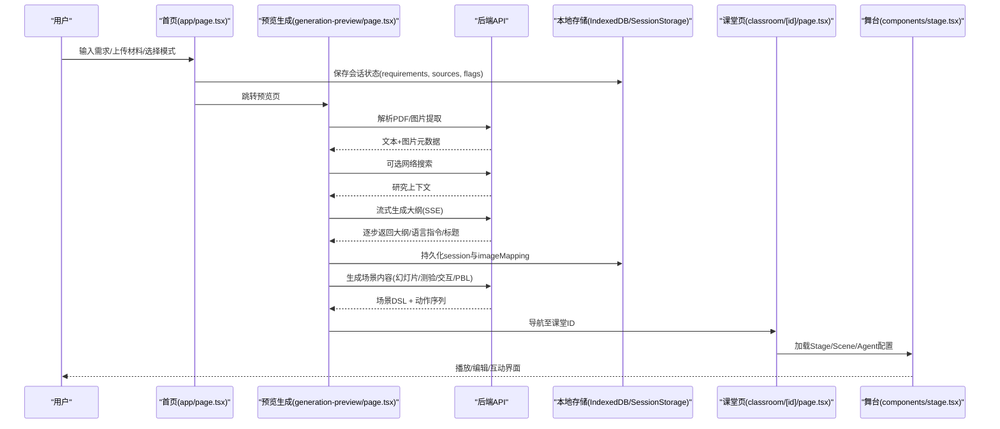
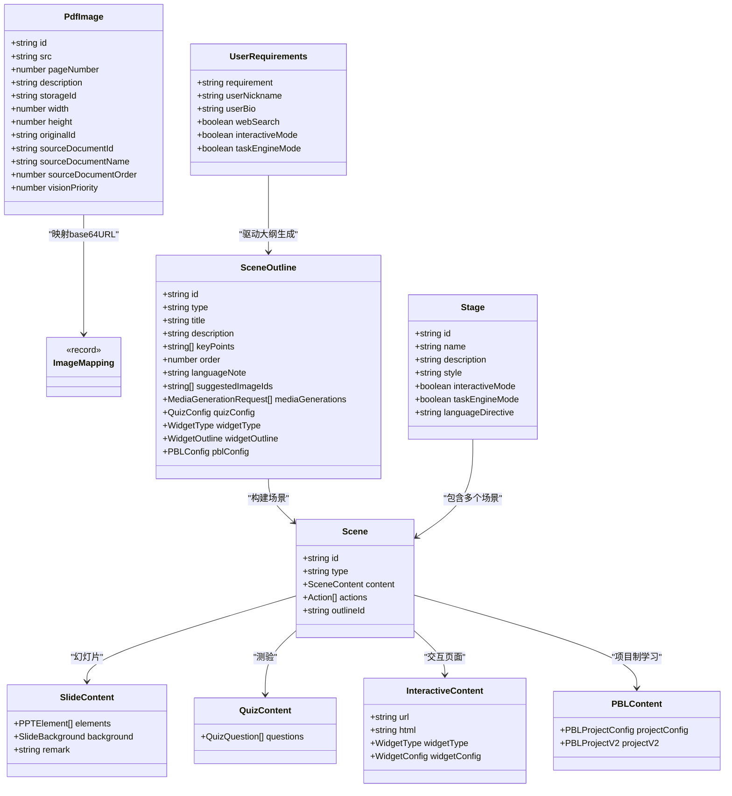

# 核心功能

<cite>
**本文引用的文件**   
- [app/page.tsx](file://app/page.tsx)
- [app/layout.tsx](file://app/layout.tsx)
- [app/generation-preview/page.tsx](file://app/generation-preview/page.tsx)
- [app/classroom/[id]/page.tsx](file://app/classroom/[id]/page.tsx)
- [components/stage.tsx](file://components/stage.tsx)
- [lib/types/generation.ts](file://lib/types/generation.ts)
- [lib/types/stage.ts](file://lib/types/stage.ts)
- [README-zh.md](file://README-zh.md)
</cite>

## 产品概述
OpenMAIC 是一个 AI 驱动的交互式课件（MAIC）生成与课堂管理平台。用户通过自然语言或上传学习材料，一键生成包含幻灯片、测验、交互式模拟与项目制学习（PBL）的完整课堂；平台支持多智能体实时授课与讨论、白板绘图与语音合成，并可将成果导出为 PPTX 或 HTML。其核心价值在于将“需求/文档”快速转化为“可回放、可编辑、可互动”的教学内容，覆盖备课、授课、复习与评估全链路。

适用场景：
- 教师快速制作课程讲义与互动练习
- 学生自主探索交互式实验与知识图谱
- 企业培训与技能实操演练（任务引擎模式）
- 在聊天应用中直接生成课堂（集成 OpenClaw）

**章节来源**
- [README-zh.md:50-62](file://README-zh.md#L50-L62)

## 核心业务流程
整体流程分为“首页输入 → 预览生成 → 课堂回放/编辑”三阶段，贯穿数据准备、AI 编排、媒体生成与持久化。

**图表来源**
- [app/page.tsx:317-409](file://app/page.tsx#L317-L409)
- [app/generation-preview/page.tsx:317-746](file://app/generation-preview/page.tsx#L317-L746)
- [app/classroom/[id]/page.tsx:44-107](file://app/classroom/[id]/page.tsx#L44-L107)
- [components/stage.tsx:33-89](file://components/stage.tsx#L33-L89)

**章节来源**
- [app/page.tsx:317-409](file://app/page.tsx#L317-L409)
- [app/generation-preview/page.tsx:317-746](file://app/generation-preview/page.tsx#L317-L746)
- [app/classroom/[id]/page.tsx:44-107](file://app/classroom/[id]/page.tsx#L44-L107)

## 功能模块清单
- 一键课程生成
  - 职责：收集用户需求与材料，驱动两阶段生成（大纲→场景），支持网络搜索增强上下文。
  - 用户价值：从一句话到完整课堂，减少备课时间。
  - 验收要点：SSE 流式大纲、自动继续/人工审阅、错误提示与重试。
- 多智能体课堂
  - 职责：基于 LangGraph 的状态机管理智能体轮次、讨论与问答。
  - 用户价值：AI 教师与智能体同学协同授课与互动。
  - 验收要点：角色生成、对话线程、动作触发（白板/高亮/语音）。
- 丰富场景类型
  - 职责：生成幻灯片、测验、HTML 交互式模拟与 PBL 项目。
  - 用户价值：多样化教学形式，适配不同学习目标。
  - 验收要点：各类型 DSL 结构、渲染器与编辑器支持。
- 白板与语音合成
  - 职责：智能体实时绘图/书写与 TTS 讲解。
  - 用户价值：增强表达力与沉浸感。
  - 验收要点：TTS 配置、语音切换、白板上色与历史。
- 多格式导出
  - 职责：导出可编辑 PPTX 与交互式 HTML。
  - 用户价值：跨平台分享与二次编辑。
  - 验收要点：导出能力检测、渲染一致性、资源打包。

**章节来源**
- [README-zh.md:56-62](file://README-zh.md#L56-L62)
- [README-zh.md:442-457](file://README-zh.md#L442-L457)
- [README-zh.md:459-477](file://README-zh.md#L459-L477)

## 数据与状态
- 核心数据模型
  - 生成输入/输出：UserRequirements、PdfImage、ImageMapping、SceneOutline、GeneratedSlideContent/QuizContent/InteractiveContent/PBLContent。
  - 课堂骨架：Stage、Scene（含 SlideContent/QuizContent/InteractiveContent/PBLContent）、Action、Whiteboard、VideoManifest。
- 关键状态流转
  - 首页表单状态（需求、材料、开关）→ 会话状态（requirements、sources、pdfText/images、previewPhase）→ 课堂状态（stage/scenes/outlines/agents）。
  - 预览阶段：preparing → outline-ready → review → generating-content → classroom。
- 数据所有权边界
  - 前端负责 IndexedDB 图片映射与 SessionStorage 会话；后端提供 PDF 解析、Web Search、LLM 生成与媒体生成。
  - 课堂页按 ID 加载 Stage/Scenes，避免跨课堂污染（清理媒体任务与白板历史）。

**图表来源**
- [lib/types/generation.ts:75-169](file://lib/types/generation.ts#L75-L169)
- [lib/types/stage.ts:54-117](file://lib/types/stage.ts#L54-L117)

**章节来源**
- [lib/types/generation.ts:75-169](file://lib/types/generation.ts#L75-L169)
- [lib/types/stage.ts:54-117](file://lib/types/stage.ts#L54-L117)

## 关键约束与边界
- 非功能性需求
  - 生成流水线分两阶段：先大纲后场景，便于审阅与重试。
  - 媒体生成（图像/视频）需遵循预算限制（如最大图片数、总大小）。
  - 课堂切换需清理媒体任务与白板历史，防止跨课堂污染。
- 依赖与集成边界
  - LLM 提供商凭据通过请求头注入（modelString/apiKey/baseUrl/providerType）。
  - 图片/视频提供商配置独立，支持开关控制。
  - Web Search 提供商可配置（如 SearXNG、百度等），支持子源设置。
- 业务约束
  - 可用 LLM 提供商存在时才允许生成（单条件门控）。
  - 职教任务模式由大纲完成事件推断，影响后续生成路径。
  - 导入 PPTX 目前受特性开关控制，未完全接入 UI 入口。

**章节来源**
- [app/generation-preview/page.tsx:265-290](file://app/generation-preview/page.tsx#L265-L290)
- [app/generation-preview/page.tsx:88-104](file://app/generation-preview/page.tsx#L88-L104)
- [app/classroom/[id]/page.tsx:89-98](file://app/classroom/[id]/page.tsx#L89-L98)
- [app/page.tsx:114-118](file://app/page.tsx#L114-L118)
- [README-zh.md:672-677](file://README-zh.md#L672-L677)