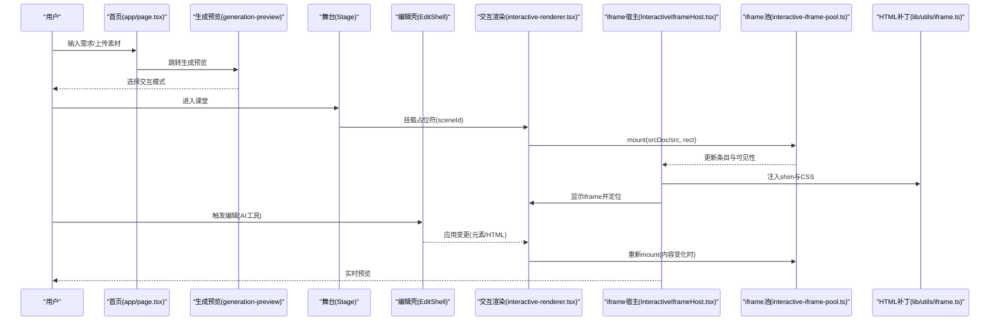

# 交互式内容编辑器

<cite>
**本文引用的文件**   
- [app/page.tsx](file://app/page.tsx)
- [app/layout.tsx](file://app/layout.tsx)
- [components/scene-renderers/InteractiveIframeHost.tsx](file://components/scene-renderers/InteractiveIframeHost.tsx)
- [components/scene-renderers/interactive-renderer.tsx](file://components/scene-renderers/interactive-renderer.tsx)
- [lib/store/interactive-iframe-pool.ts](file://lib/store/interactive-iframe-pool.ts)
- [lib/utils/iframe.ts](file://lib/utils/iframe.ts)
- [components/edit/EditShell/EditShell.tsx](file://components/edit/EditShell/EditShell.tsx)
- [components/edit/AgentPanel/edit-interactive-html-tool-ui.tsx](file://components/edit/AgentPanel/edit-interactive-html-tool-ui.tsx)
- [lib/agent/tools/edit-elements-patch.ts](file://lib/agent/tools/edit-elements-patch.ts)
- [tests/generation/interactive-inventory-fallback.test.ts](file://tests/generation/interactive-inventory-fallback.test.ts)
- [e2e/tests/interactive-iframe-keepalive-619.spec.ts](file://e2e/tests/interactive-iframe-keepalive-619.spec.ts)
- [packages/@openmaic/renderer/rollup.config.js](file://packages/@openmaic/renderer/rollup.config.js)
- [README-zh.md](file://README-zh.md)
</cite>

## 产品概述
OpenMAIC 是一个 AI 驱动的交互式课件（MAIC）生成与课堂管理平台。其核心目标是为教师与开发者提供一套完整的交互式课件编辑与回放框架，支持自然语言生成、实时预览、调试与多场景渲染（幻灯片、问答、PBL 等）。在“深度交互模式”下，系统可生成并运行自包含的 HTML 交互式组件（如 3D 可视化、模拟实验、游戏、思维导图、在线编程），并通过 iframe 沙箱隔离执行，确保安全性与稳定性。

核心价值：
- 代码级编辑与实时预览：通过编辑壳（EditShell）与工具面板，对元素与交互 HTML 进行自然语言或结构化编辑，即时生效。
- 安全沙箱与错误诊断：iframe 内嵌脚本与存储 shim，配合运行时错误捕获与回放，便于定位空白页等问题。
- 状态同步与事件处理：基于 postMessage 的父/子通信机制，实现宿主与应用间的事件驱动与状态同步。
- 第三方库集成与样式定制：通过注入 CSS 与脚本补丁，兼容主流前端库；同时保持沙箱隔离。
- 模板与示例：内置多种交互界面类型与提示模板，快速构建教学互动体验。

适用场景：
- 课堂讲授中的动态演示与互动练习
- 学生自主探索的实验与模拟环境
- 在线编程与即时反馈的学习任务
- 知识图谱与思维导图的结构化组织

**章节来源**
- [README-zh.md:298-369](file://README-zh.md#L298-L369)

## 核心业务流程
交互式内容的编辑与播放流程如下：
- 用户输入需求与素材，进入生成预览页面，选择交互模式后进入课堂。
- 课堂中，交互式场景以占位符形式注册到 keep-alive 池，实际 iframe 由稳定宿主管理，避免切换导致的状态丢失。
- 编辑模式下，AI 工具可对元素属性或交互 HTML 进行精准修改，并在沙箱中即时预览。
- 运行时错误通过 postMessage 上报，辅助诊断与自动修复。

**图表来源**
- [app/page.tsx:317-409](file://app/page.tsx#L317-L409)
- [components/scene-renderers/interactive-renderer.tsx:22-69](file://components/scene-renderers/interactive-renderer.tsx#L22-L69)
- [components/scene-renderers/InteractiveIframeHost.tsx:32-75](file://components/scene-renderers/InteractiveIframeHost.tsx#L32-L75)
- [lib/store/interactive-iframe-pool.ts:96-124](file://lib/store/interactive-iframe-pool.ts#L96-L124)
- [lib/utils/iframe.ts:110-145](file://lib/utils/iframe.ts#L110-L145)

**章节来源**
- [app/page.tsx:317-409](file://app/page.tsx#L317-L409)
- [components/scene-renderers/interactive-renderer.tsx:22-69](file://components/scene-renderers/interactive-renderer.tsx#L22-L69)
- [components/scene-renderers/InteractiveIframeHost.tsx:32-75](file://components/scene-renderers/InteractiveIframeHost.tsx#L32-L75)
- [lib/store/interactive-iframe-pool.ts:96-124](file://lib/store/interactive-iframe-pool.ts#L96-L124)
- [lib/utils/iframe.ts:110-145](file://lib/utils/iframe.ts#L110-L145)

## 功能模块清单
- 首页与生成入口：收集需求、素材与选项，准备会话并跳转预览。
- 编辑壳（EditShell）：统一编辑 UI 框架，按场景类型解析表面组件，提供命令栏、浮动工具栏与提示轨。
- 交互渲染器（interactive-renderer.tsx）：将场景内容注册到 keep-alive 池，计算屏幕矩形，控制可见性与激活状态。
- iframe 宿主（InteractiveIframeHost.tsx）：稳定挂载 iframe，管理消息通道、错误捕获与全屏适配。
- iframe 池（interactive-iframe-pool.ts）：LRU 缓存与生命周期管理，避免重复重建与内存泄漏。
- HTML 补丁（lib/utils/iframe.ts）：注入存储 shim、错误捕获与样式补丁，保障沙箱内运行。
- 编辑工具（edit-interactive-html-tool-ui.tsx）：展示 AI 工具调用状态与还原操作。
- 元素编辑补丁（edit-elements-patch.ts）：校验与映射 DSL 属性变更，生成编辑意图。
- 测试与 E2E：验证交互元素检测、iframe 保活与运行时行为。

验收要点：
- 切换场景与模式不丢失 iframe 状态
- 运行时错误能上报并用于诊断
- 编辑操作可撤销/还原，且符合 DSL 约束
- 沙箱隔离有效，postMessage 通信正常

**章节来源**
- [components/edit/EditShell/EditShell.tsx:74-123](file://components/edit/EditShell/EditShell.tsx#L74-L123)
- [components/scene-renderers/interactive-renderer.tsx:22-69](file://components/scene-renderers/interactive-renderer.tsx#L22-L69)
- [components/scene-renderers/InteractiveIframeHost.tsx:32-75](file://components/scene-renderers/InteractiveIframeHost.tsx#L32-L75)
- [lib/store/interactive-iframe-pool.ts:96-173](file://lib/store/interactive-iframe-pool.ts#L96-L173)
- [lib/utils/iframe.ts:110-145](file://lib/utils/iframe.ts#L110-L145)
- [components/edit/AgentPanel/edit-interactive-html-tool-ui.tsx:16-82](file://components/edit/AgentPanel/edit-interactive-html-tool-ui.tsx#L16-L82)
- [lib/agent/tools/edit-elements-patch.ts:408-447](file://lib/agent/tools/edit-elements-patch.ts#L408-L447)

## 数据与状态
- 交互内容模型：包含 html/url 与 widgetType/widgetConfig，html 经 patchHtmlForIframe 处理后作为 srcDoc 注入。
- iframe 池条目：srcDoc/src、rect、owner、tick，用于定位、可见性与 LRU 淘汰。
- 运行时错误：按 sceneId 聚合，支持 replay 请求恢复早期错误。
- 编辑状态：SurfaceState 包含 content、history、insertItems、commands、floatingActions、hints，使用浅比较避免无限循环。
- 会话与持久化：generationSession 暂存于 sessionStorage，stage/scenes 持久化至 IndexedDB（DSL 文档与运行时记录分离）。

关键状态流转：
- 占位符 mount → 池更新条目 → 宿主渲染 iframe → 测量 rect → 显示/隐藏
- 编辑触发 → 内容变化 → 重新 mount → 宿主清理旧错误 → 新页面加载
- 错误捕获 → postMessage → 宿主 addError → 编辑器诊断

**章节来源**
- [components/scene-renderers/interactive-renderer.tsx:22-69](file://components/scene-renderers/interactive-renderer.tsx#L22-L69)
- [lib/store/interactive-iframe-pool.ts:30-49](file://lib/store/interactive-iframe-pool.ts#L30-L49)
- [components/scene-renderers/InteractiveIframeHost.tsx:125-145](file://components/scene-renderers/InteractiveIframeHost.tsx#L125-L145)
- [components/edit/EditShell/EditShell.tsx:188-226](file://components/edit/EditShell/EditShell.tsx#L188-L226)
- [app/page.tsx:386-402](file://app/page.tsx#L386-L402)

## 关键约束与边界
- 沙箱隔离：iframe 启用 allow-scripts/allow-forms/allow-popups，但不允许 allow-same-origin，防止跨域访问宿主状态。
- 存储限制：localStorage/sessionStorage 在 null-origin 下不可用，需注入 shim 以避免崩溃。
- 性能边界：iframe 池容量上限（IFRAME_POOL_CAP=3），LRU 淘汰非活跃场景，避免内存膨胀。
- 兼容性：Rollup 保留 'use client' 指令，确保 Next App Router 消费者正确识别客户端边界。
- 业务约束：交互元素检测失败时使用占位提示；编辑操作需通过 DSL 校验，拒绝非法属性变更。

最佳实践：
- 在交互 HTML 末尾注册 postMessage 监听，响应 SET_WIDGET_STATE/HIGHLIGHT_ELEMENT/ANNOTATE_ELEMENT/REVEAL_ELEMENT。
- 使用唯一 id/class 命名元素，便于高亮与标注。
- 避免依赖同源存储，改用 shim 提供的内存存储。
- 控制动画与布局复杂度，减少重排与回流。

**章节来源**
- [components/scene-renderers/InteractiveIframeHost.tsx:89-99](file://components/scene-renderers/InteractiveIframeHost.tsx#L89-L99)
- [lib/utils/iframe.ts:1-34](file://lib/utils/iframe.ts#L1-L34)
- [lib/store/interactive-iframe-pool.ts:21](file://lib/store/interactive-iframe-pool.ts#L21)
- [packages/@openmaic/renderer/rollup.config.js:37-42](file://packages/@openmaic/renderer/rollup.config.js#L37-L42)
- [tests/generation/interactive-inventory-fallback.test.ts:35-87](file://tests/generation/interactive-inventory-fallback.test.ts#L35-L87)
- [lib/agent/tools/edit-elements-patch.ts:408-447](file://lib/agent/tools/edit-elements-patch.ts#L408-L447)