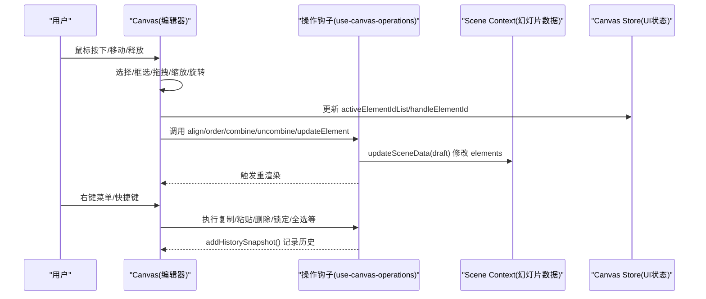
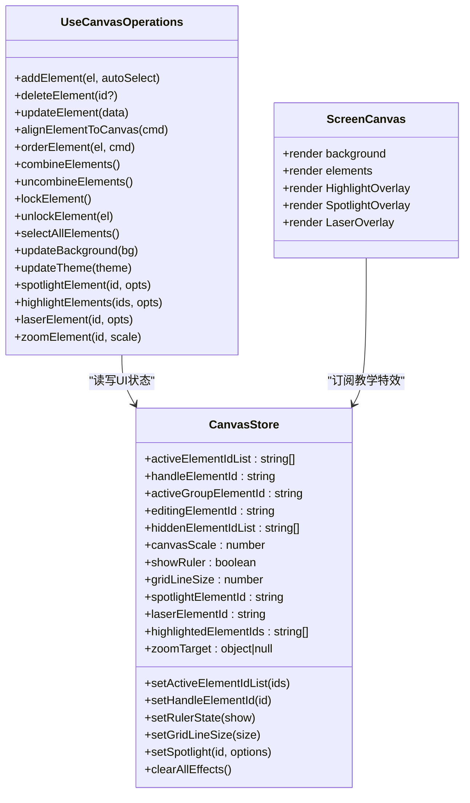

# 元素操作

<cite>
**本文引用的文件**   
- [components/slide-renderer/Editor/Canvas/index.tsx](file://components/slide-renderer/Editor/Canvas/index.tsx)
- [components/slide-renderer/Editor/EditableElement.tsx](file://components/slide-renderer/Editor/EditableElement.tsx)
- [lib/store/canvas.ts](file://lib/store/canvas.ts)
- [lib/hooks/use-canvas-operations.ts](file://lib/hooks/use-canvas-operations.ts)
- [components/slide-renderer/Editor/ScreenCanvas.tsx](file://components/slide-renderer/Editor/ScreenCanvas.tsx)
</cite>

## 产品概述
本文件面向 OpenMAIC 的“元素操作系统”，聚焦课件编辑与回放场景中的元素交互能力。系统基于 React + Zustand，提供拖拽移动、缩放调整、旋转变换、多选与批量编辑、对齐与层级管理、组合/解组合、锁定/解锁等核心功能；同时支持框选、单选、智能选择（忽略锁定与隐藏）、快捷键与右键菜单、以及教学演示时的聚光灯、高亮、激光笔与局部放大等视觉反馈。数据层通过 Scene Context 维护幻灯片内容，UI 状态由 Canvas Store 管理，操作钩子集中封装在 use-canvas-operations 中，保证可复用与一致性。

## 核心业务流程
- 选择流程：点击空白区域清空选择并触发框选；点击元素进行单选或多选（Ctrl/Cmd 辅助）；框选矩形根据象限与边界检测计算命中集合；智能选择自动过滤锁定与隐藏元素。
- 操作流程：选中后显示操作手柄（Operate/MultiSelectOperate），支持拖拽、缩放、旋转、连线关键点拖动、形状关键点拖动；操作过程中实时计算对齐辅助线、约束与边界，更新本地元素列表并在提交时写入 Scene Context。
- 批量编辑：多选状态下统一执行缩放、对齐、层级、组合/解组合等操作；历史记录快照在关键变更处记录，支持撤销重做扩展点。
- 教学演示：屏幕渲染层根据 Canvas Store 的聚光灯、高亮、激光笔、缩放目标计算几何与动画，叠加于元素之上，不影响编辑态数据。

图表来源 
- [components/slide-renderer/Editor/Canvas/index.tsx](file://components/slide-renderer/Editor/Canvas/index.tsx)
- [lib/hooks/use-canvas-operations.ts](file://lib/hooks/use-canvas-operations.ts)
- [lib/store/canvas.ts](file://lib/store/canvas.ts)

章节来源
- [components/slide-renderer/Editor/Canvas/index.tsx](file://components/slide-renderer/Editor/Canvas/index.tsx)
- [lib/hooks/use-canvas-operations.ts](file://lib/hooks/use-canvas-operations.ts)
- [lib/store/canvas.ts](file://lib/store/canvas.ts)

## 功能模块清单
- 画布与视口
  - 职责：承载元素、网格/标尺、视口缩放与平移、拖拽遮罩（空格键）。
  - 验收要点：视口尺寸与缩放正确；空格拖拽流畅；网格/标尺开关有效。
- 元素渲染与上下文菜单
  - 职责：按类型渲染元素组件；提供剪切/复制/粘贴、对齐、层级、组合/解组合、锁定、删除等菜单项。
  - 验收要点：菜单项可用性随多选/锁定状态变化；命令执行生效且可撤销。
- 选择机制
  - 职责：单选、多选、框选、智能选择（忽略锁定/隐藏）。
  - 验收要点：框选矩形方向与命中判定准确；多选状态与 UI 一致。
- 操作处理器
  - 职责：拖拽移动（含吸附对齐）、缩放（单/多元素）、旋转、连线关键点拖动、形状关键点拖动。
  - 验收要点：边界检测与约束生效；对齐辅助线可见；多元素同步更新。
- 批量编辑
  - 职责：多选下统一对齐、层级、组合/解组合、属性批量更新。
  - 验收要点：批量操作原子性；历史记录快照记录。
- 教学演示覆盖层
  - 职责：聚光灯、高亮、激光笔、局部放大等视觉反馈。
  - 验收要点：覆盖层与元素几何同步；动画平滑；不影响编辑数据。

章节来源
- [components/slide-renderer/Editor/EditableElement.tsx](file://components/slide-renderer/Editor/EditableElement.tsx)
- [components/slide-renderer/Editor/ScreenCanvas.tsx](file://components/slide-renderer/Editor/ScreenCanvas.tsx)

## 数据与状态
- 数据所有权
  - 幻灯片内容（elements、background、theme 等）由 Scene Context 管理；Canvas 组件通过 selector 订阅 elements 并拷贝到本地 ref/state 用于高频交互。
  - UI 状态（选择、缩放、工具栏、创建态、教学特效等）由 Canvas Store 管理。
- 核心状态字段（节选）
  - 选择：activeElementIdList、handleElementId、activeGroupElementId、editingElementId、hiddenElementIdList
  - 视口：canvasScale、canvasPercentage、viewportSize、viewportRatio、canvasDragged
  - 辅助：showRuler、gridLineSize
  - 教学：spotlight/laser/highlight/zoomTarget/pickTarget
- 数据流
  - 操作钩子统一通过 updateSceneData(draft) 修改 elements，随后触发重渲染；关键操作后调用 addHistorySnapshot() 记录历史。
  - 教学覆盖层读取 Canvas Store 的状态，结合 findElementGeometry 计算百分比坐标，渲染叠加效果。

图表来源 
- [lib/store/canvas.ts](file://lib/store/canvas.ts)
- [lib/hooks/use-canvas-operations.ts](file://lib/hooks/use-canvas-operations.ts)
- [components/slide-renderer/Editor/ScreenCanvas.tsx](file://components/slide-renderer/Editor/ScreenCanvas.tsx)

章节来源
- [lib/store/canvas.ts](file://lib/store/canvas.ts)
- [lib/hooks/use-canvas-operations.ts](file://lib/hooks/use-canvas-operations.ts)
- [components/slide-renderer/Editor/ScreenCanvas.tsx](file://components/slide-renderer/Editor/ScreenCanvas.tsx)

## 关键约束与边界
- 选择与交互约束
  - 锁定元素不可被选择或操作；隐藏元素不参与选择与渲染。
  - 框选命中需考虑 canvasScale 与视口偏移；象限影响选择逻辑。
- 操作边界与约束
  - 拖拽/缩放/旋转需进行边界检测与约束限制，避免越界；多元素操作需保持相对位置与比例。
  - 对齐与层级操作需基于当前视口尺寸与元素范围计算。
- 性能与渲染
  - 高频操作使用本地 ref/state 缓存元素列表，减少 store 订阅抖动；仅对必要部分进行重渲染。
  - 教学覆盖层使用百分比坐标与动画库，避免频繁 DOM 测量。
- 可扩展性
  - 新增元素类型需在 EditableElement 的类型映射中添加对应组件。
  - 新增操作可通过 use-canvas-operations 暴露方法，并在 Canvas 的 hooks 中集成。
- 键盘与手势
  - 快捷键（如 Ctrl+A/C/V/X/L/G/Delete 等）通过上下文菜单与操作钩子联动；空格键切换画布拖拽模式。
  - 触摸手势与鼠标事件统一抽象至各操作 hook（拖拽、缩放、旋转等），确保跨设备一致体验。
- 撤销重做与冲突
  - 关键操作后调用 addHistorySnapshot() 记录历史；未来可结合 undo/redo 栈实现回滚。
  - 多标签页/协作场景下的冲突解决策略可在 updateSceneData 层面合并差异（当前为草稿模式更新）。

章节来源
- [components/slide-renderer/Editor/Canvas/index.tsx](file://components/slide-renderer/Editor/Canvas/index.tsx)
- [components/slide-renderer/Editor/EditableElement.tsx](file://components/slide-renderer/Editor/EditableElement.tsx)
- [lib/hooks/use-canvas-operations.ts](file://lib/hooks/use-canvas-operations.ts)
- [lib/store/canvas.ts](file://lib/store/canvas.ts)
- [components/slide-renderer/Editor/ScreenCanvas.tsx](file://components/slide-renderer/Editor/ScreenCanvas.tsx)