# 图形绘制

<cite>
**本文引用的文件**   
- [BaseShapeElement.tsx](file://components/slide-renderer/components/element/ShapeElement/BaseShapeElement.tsx)
- [GradientDefs.tsx](file://components/slide-renderer/components/element/ShapeElement/GradientDefs.tsx)
- [PatternDefs.tsx](file://components/slide-renderer/components/element/ShapeElement/PatternDefs.tsx)
- [ShapeElementOperate.tsx](file://components/slide-renderer/Editor/Canvas/Operate/ShapeElementOperate.tsx)
- [ScreenCanvas.tsx](file://components/slide-renderer/Editor/ScreenCanvas.tsx)
- [LineElement/index.tsx](file://components/slide-renderer/components/element/LineElement/index.tsx)
- [BaseLineElement.tsx](file://components/slide-renderer/components/element/LineElement/BaseLineElement.tsx)
- [image-polygon-outline.tsx](file://components/slide-renderer/components/element/ImageElement/ImageOutline/image-polygon-outline.tsx)
- [ImageOutline.tsx](file://packages/@openmaic/renderer/src/elements/image/ImageOutline.tsx)
- [whiteboard-canvas.tsx](file://components/whiteboard/whiteboard-canvas.tsx)
- [canvas-toolbar.tsx](file://components/canvas/canvas-toolbar.tsx)
- [CommandBar.tsx](file://components/edit/EditShell/CommandBar.tsx)
- [edge.tsx](file://components/ai-elements/edge.tsx)
- [shapeArc.ts](file://packages/@openmaic/importer/src/shapes/shapeArc.ts)
- [core-interfaces.ts](file://packages/pptxgenjs/src/core-interfaces.ts)
- [gen-charts.ts](file://packages/pptxgenjs/src/gen-charts.ts)
</cite>

## 产品概述
本系统提供面向课件与白板场景的图形绘制能力，覆盖矩形、圆形、三角形、箭头、多边形等基础形状创建与编辑；支持线条绘制、贝塞尔曲线与自由手绘；提供填充颜色、边框样式、渐变与阴影等属性配置；支持图形组合、布尔运算与路径编辑；集成导出为 PPTX/PDF（通过 pptxgenjs）与 SVG 渲染；配套绘图工具栏、快捷键操作与撤销重做。

## 核心业务流程
- 画布与视图：屏幕画布负责缩放、平移与元素层叠，白板画布提供独立的平移缩放与动画过渡。
- 元素渲染：形状、线条、图片等统一以 SVG path 渲染，结合渐变、图案、阴影与描边。
- 交互编辑：选择、旋转、缩放、关键点拖拽、路径编辑与对齐辅助线。
- 导出与集成：将元素转换为 PPTX 对象模型，生成图表与形状 XML，并保留阴影、边框等效果。

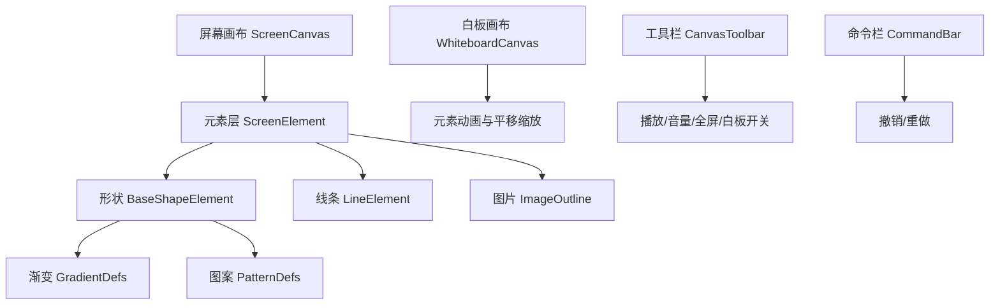

**章节来源**
- [ScreenCanvas.tsx:61-99](file://components/slide-renderer/Editor/ScreenCanvas.tsx#L61-L99)
- [whiteboard-canvas.tsx:318-382](file://components/whiteboard/whiteboard-canvas.tsx#L318-L382)
- [canvas-toolbar.tsx:150-462](file://components/canvas/canvas-toolbar.tsx#L150-L462)
- [CommandBar.tsx:39-63](file://components/edit/EditShell/CommandBar.tsx#L39-L63)

## 功能模块清单
- 形状绘制与编辑
  - 基础形状：矩形、圆形、三角形、箭头、多边形等，基于 path 公式与关键点控制。
  - 属性：填充（纯色/渐变/图案）、描边（颜色/宽度/虚线）、阴影、翻转、旋转。
- 线条与曲线
  - 直线与折线：起点/终点坐标与可选端点标记（箭头/圆点）。
  - 贝塞尔曲线：用于连线与动态路径。
- 图像与裁剪
  - 图片轮廓与多边形裁剪，支持自定义路径。
- 白板与手绘
  - 平移、缩放、双击复位、滚动缩放、指针捕获。
- 工具栏与快捷键
  - 播放控制、音量调节、全屏切换、白板开关、撤销/重做。
- 导出与集成
  - PPTX 生成接口与图表/形状 XML 输出；SVG 渲染与路径转换。

**章节来源**
- [BaseShapeElement.tsx:1-119](file://components/slide-renderer/components/element/ShapeElement/BaseShapeElement.tsx#L1-L119)
- [ShapeElementOperate.tsx:1-147](file://components/slide-renderer/Editor/Canvas/Operate/ShapeElementOperate.tsx#L1-L147)
- [LineElement/index.tsx:1-38](file://components/slide-renderer/components/element/LineElement/index.tsx#L1-L38)
- [BaseLineElement.tsx:1-34](file://components/slide-renderer/components/element/LineElement/BaseLineElement.tsx#L1-L34)
- [image-polygon-outline.tsx:1-40](file://components/slide-renderer/components/element/ImageElement/ImageOutline/image-polygon-outline.tsx#L1-L40)
- [whiteboard-canvas.tsx:104-176](file://components/whiteboard/whiteboard-canvas.tsx#L104-L176)
- [canvas-toolbar.tsx:150-462](file://components/canvas/canvas-toolbar.tsx#L150-L462)
- [CommandBar.tsx:39-63](file://components/edit/EditShell/CommandBar.tsx#L39-L63)

## 数据与状态
- 形状元素
  - 位置与尺寸：left/top/width/height、viewBox、rotate、opacity。
  - 路径与关键点：pathFormula、keypoints、relative 定位规则。
  - 外观：fill、gradient（type/colors/rotate）、pattern（src）、outline（color/width/dasharray）、shadow、flipH/flipV。
- 线条元素
  - 起点/终点：start/end 坐标；可选端点标记 markerStart/markerEnd。
  - 动画：stroke-dashoffset 绘制动画。
- 图片元素
  - 裁剪路径：createPath(width,height) 生成多边形路径。
- 白板状态
  - 视图：zoom、panX/panY、isPanning、isResetting。
  - 容器：containerWidth/containerHeight、containerScale。
- 导出模型
  - PPTX 对象：ISlideObject/ISlideRelMedia，包含 shape/formula/media/image 等字段。
  - 图表：seriesColor、lineSize、dataBorder、shadow 等。

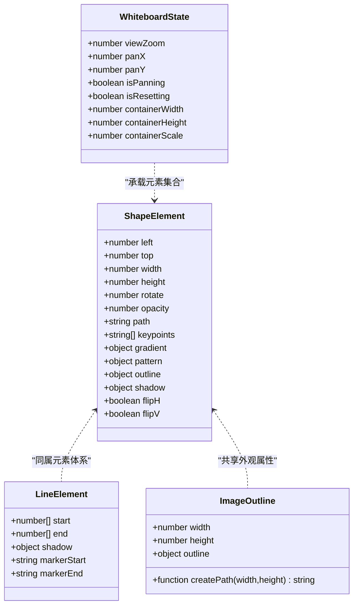

**章节来源**
- [BaseShapeElement.tsx:18-118](file://components/slide-renderer/components/element/ShapeElement/BaseShapeElement.tsx#L18-L118)
- [BaseLineElement.tsx:21-34](file://components/slide-renderer/components/element/LineElement/BaseLineElement.tsx#L21-L34)
- [image-polygon-outline.tsx:16-40](file://components/slide-renderer/components/element/ImageElement/ImageOutline/image-polygon-outline.tsx#L16-L40)
- [whiteboard-canvas.tsx:122-176](file://components/whiteboard/whiteboard-canvas.tsx#L122-L176)
- [core-interfaces.ts:1663-1711](file://packages/pptxgenjs/src/core-interfaces.ts#L1663-L1711)

## 关键约束与边界
- 渲染性能
  - 使用 SVG path 与 defs（渐变/图案）减少重复计算；对频繁更新的元素进行 memo 化。
  - 白板画布在平移/缩放时避免不必要的重排，使用投影与布局优化。
- 路径与几何
  - 弧线转换遵循 OOXML 顺时针扫掠约定，处理角度环绕与大弧判定。
  - 关键点相对定位需严格匹配 pathFormula 的 getBaseSize 与 relative 规则。
- 导出兼容性
  - PPTX 生成需映射 fill/stroke/shadow 到 a:solidFill/a:ln/a:effectLst 等标签。
  - 图表系列颜色、线宽、虚线与标记符号需按类型设置。
- 交互边界
  - 白板平移范围受容器与缩放限制，确保至少一条边可见。
  - 撤销/重做依赖历史栈，需在命令栏中暴露可用状态。

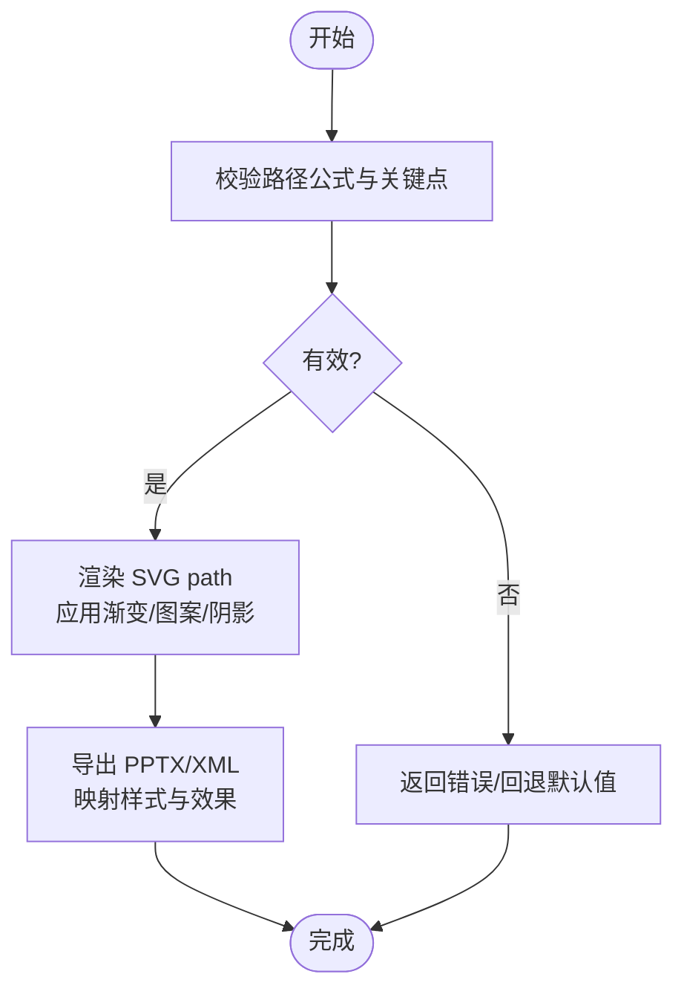

**章节来源**
- [shapeArc.ts:14-44](file://packages/@openmaic/importer/src/shapes/shapeArc.ts#L14-L44)
- [gen-charts.ts:845-1108](file://packages/pptxgenjs/src/gen-charts.ts#L845-L1108)
- [whiteboard-canvas.tsx:134-176](file://components/whiteboard/whiteboard-canvas.tsx#L134-L176)
- [CommandBar.tsx:39-63](file://components/edit/EditShell/CommandBar.tsx#L39-L63)

## 架构总览
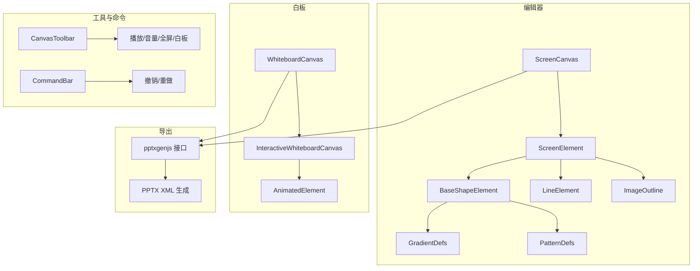

**图示来源**
- [ScreenCanvas.tsx:61-99](file://components/slide-renderer/Editor/ScreenCanvas.tsx#L61-L99)
- [BaseShapeElement.tsx:18-118](file://components/slide-renderer/components/element/ShapeElement/BaseShapeElement.tsx#L18-L118)
- [GradientDefs.tsx:10-36](file://components/slide-renderer/components/element/ShapeElement/GradientDefs.tsx#L10-L36)
- [PatternDefs.tsx:6-19](file://components/slide-renderer/components/element/ShapeElement/PatternDefs.tsx#L6-L19)
- [whiteboard-canvas.tsx:318-382](file://components/whiteboard/whiteboard-canvas.tsx#L318-L382)
- [canvas-toolbar.tsx:150-462](file://components/canvas/canvas-toolbar.tsx#L150-L462)
- [CommandBar.tsx:39-63](file://components/edit/EditShell/CommandBar.tsx#L39-L63)
- [core-interfaces.ts:1663-1711](file://packages/pptxgenjs/src/core-interfaces.ts#L1663-L1711)

## 详细组件分析

### 形状元素渲染与属性
- 渲染流程
  - 通过 viewBox 与 scale 变换将 path 适配到元素尺寸。
  - 使用 defs 定义渐变与图案，path 应用 fill/stroke 与 dasharray。
  - 文本内容叠加于形状之上，支持对齐、行距与字间距。
- 属性配置
  - 填充：纯色、线性/径向渐变、图案填充。
  - 描边：颜色、宽度、虚线数组。
  - 阴影：drop-shadow 滤镜。
  - 翻转与旋转：flipH/flipV、rotate。
- 关键点编辑
  - 根据 pathFormula 计算关键点位置，支持相对定位（left/right/center/top/bottom 等）。

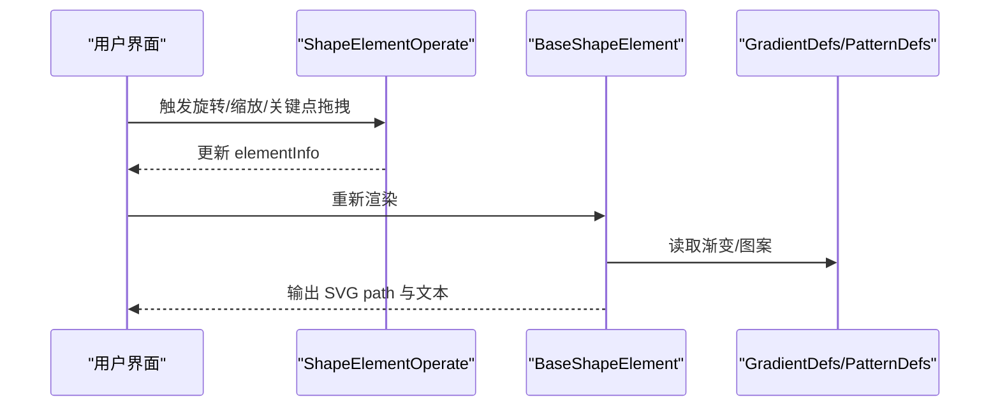

**图示来源**
- [ShapeElementOperate.tsx:27-146](file://components/slide-renderer/Editor/Canvas/Operate/ShapeElementOperate.tsx#L27-L146)
- [BaseShapeElement.tsx:18-118](file://components/slide-renderer/components/element/ShapeElement/BaseShapeElement.tsx#L18-L118)
- [GradientDefs.tsx:10-36](file://components/slide-renderer/components/element/ShapeElement/GradientDefs.tsx#L10-L36)
- [PatternDefs.tsx:6-19](file://components/slide-renderer/components/element/ShapeElement/PatternDefs.tsx#L6-L19)

**章节来源**
- [BaseShapeElement.tsx:18-118](file://components/slide-renderer/components/element/ShapeElement/BaseShapeElement.tsx#L18-L118)
- [ShapeElementOperate.tsx:27-146](file://components/slide-renderer/Editor/Canvas/Operate/ShapeElementOperate.tsx#L27-L146)

### 线条与贝塞尔曲线
- 直线与折线
  - 基于 start/end 坐标计算 SVG 尺寸，最小尺寸阈值保证可读性。
  - 支持端点标记（箭头/圆点），通过 markerStart/markerEnd 引用。
- 贝塞尔曲线
  - 连线组件使用 getBezierPath 生成平滑路径，支持动画粒子沿路径运动。
- 绘制动画
  - 使用 stroke-dashoffset 实现“描边”动画，完成后显示端点标记。

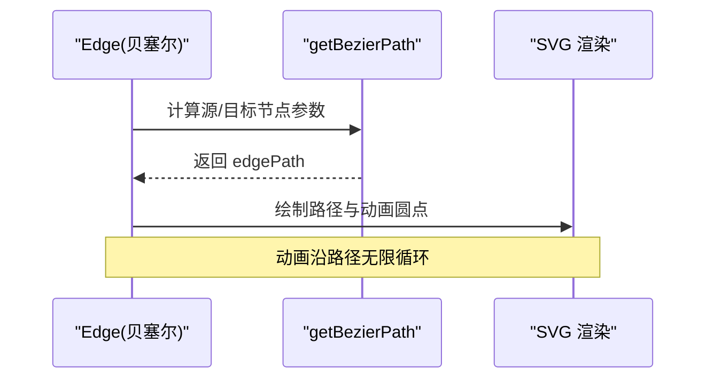

**图示来源**
- [edge.tsx:99-131](file://components/ai-elements/edge.tsx#L99-L131)
- [BaseLineElement.tsx:21-34](file://components/slide-renderer/components/element/LineElement/BaseLineElement.tsx#L21-L34)
- [LineElement/index.tsx:20-38](file://components/slide-renderer/components/element/LineElement/index.tsx#L20-L38)

**章节来源**
- [BaseLineElement.tsx:21-34](file://components/slide-renderer/components/element/LineElement/BaseLineElement.tsx#L21-L34)
- [LineElement/index.tsx:20-38](file://components/slide-renderer/components/element/LineElement/index.tsx#L20-L38)
- [edge.tsx:99-131](file://components/ai-elements/edge.tsx#L99-L131)

### 图像裁剪与轮廓
- 多边形裁剪
  - 通过 createPath(width,height) 生成路径，用于图片裁剪与轮廓描边。
- 通用轮廓
  - ElementOutline 与 ImageOutline 统一处理描边颜色、宽度与虚线。

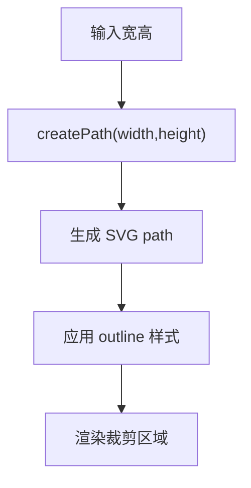

**章节来源**
- [image-polygon-outline.tsx:16-40](file://components/slide-renderer/components/element/ImageElement/ImageOutline/image-polygon-outline.tsx#L16-L40)
- [ImageOutline.tsx:18-42](file://packages/@openmaic/renderer/src/elements/image/ImageOutline.tsx#L18-L42)

### 白板画布与手绘
- 视图控制
  - 平移：指针捕获与移动事件，计算 canvas-space 位移。
  - 缩放：滚轮缩放，保持光标下点静止，限制最大/最小缩放。
  - 复位：双击或调用 resetView 恢复初始视图。
- 元素动画
  - 使用 motion 的 AnimatePresence 实现添加/清除时的入场与退出动画。

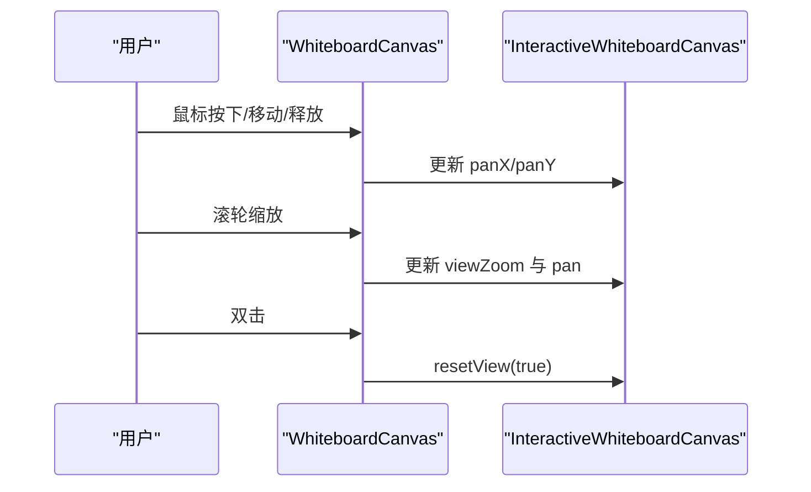

**图示来源**
- [whiteboard-canvas.tsx:184-271](file://components/whiteboard/whiteboard-canvas.tsx#L184-L271)
- [whiteboard-canvas.tsx:304-310](file://components/whiteboard/whiteboard-canvas.tsx#L304-L310)

**章节来源**
- [whiteboard-canvas.tsx:122-176](file://components/whiteboard/whiteboard-canvas.tsx#L122-L176)
- [whiteboard-canvas.tsx:184-271](file://components/whiteboard/whiteboard-canvas.tsx#L184-L271)
- [whiteboard-canvas.tsx:304-310](file://components/whiteboard/whiteboard-canvas.tsx#L304-L310)

### 工具栏与快捷键
- 工具栏功能
  - 播放/暂停、上一张/下一张、音量调节（垂直滑块）、自动播放、全屏切换、白板开关。
- 撤销/重做
  - 命令栏提供 undo/redo 按钮，禁用状态由 history.canUndo/canRedo 控制。

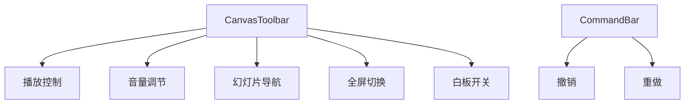

**章节来源**
- [canvas-toolbar.tsx:150-462](file://components/canvas/canvas-toolbar.tsx#L150-L462)
- [CommandBar.tsx:39-63](file://components/edit/EditShell/CommandBar.tsx#L39-L63)

### 导出与集成（PPTX/SVG）
- PPTX 生成
  - ISlideObject/ISlideRelMedia 描述形状、媒体、链接等对象。
  - 图表生成时设置 seriesColor、lineSize、dataBorder、shadow 等。
- SVG 渲染
  - 形状与线条均以 SVG path 渲染，支持渐变、图案与阴影。
  - 弧线转换遵循 OOXML 规范，确保导入一致性。

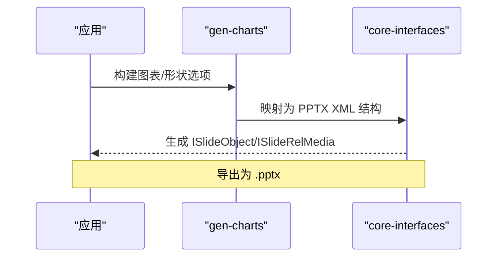

**图示来源**
- [gen-charts.ts:845-1108](file://packages/pptxgenjs/src/gen-charts.ts#L845-L1108)
- [core-interfaces.ts:1663-1711](file://packages/pptxgenjs/src/core-interfaces.ts#L1663-L1711)
- [shapeArc.ts:14-44](file://packages/@openmaic/importer/src/shapes/shapeArc.ts#L14-L44)

**章节来源**
- [gen-charts.ts:845-1108](file://packages/pptxgenjs/src/gen-charts.ts#L845-L1108)
- [core-interfaces.ts:1663-1711](file://packages/pptxgenjs/src/core-interfaces.ts#L1663-L1711)
- [shapeArc.ts:14-44](file://packages/@openmaic/importer/src/shapes/shapeArc.ts#L14-L44)

## 依赖分析
- 组件耦合
  - ScreenCanvas 依赖 ScreenElement，后者再分派到具体元素组件（形状/线条/图片）。
  - 形状元素依赖 GradientDefs/PatternDefs 与 useElement* hooks（outline/shadow/flip/fill）。
  - 白板画布依赖 ScreenElement 复用渲染逻辑，并通过 motion 管理动画。
- 外部依赖
  - pptxgenjs 提供 PPTX 生成接口与 XML 结构。
  - JSZip 用于解析 .pptx 压缩包（导入器）。
- 潜在循环
  - 当前未发现直接循环依赖；注意 hooks 与 store 的使用边界。

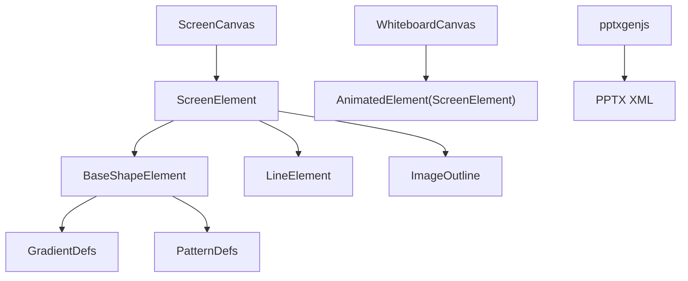

**图示来源**
- [ScreenCanvas.tsx:61-99](file://components/slide-renderer/Editor/ScreenCanvas.tsx#L61-L99)
- [BaseShapeElement.tsx:18-118](file://components/slide-renderer/components/element/ShapeElement/BaseShapeElement.tsx#L18-L118)
- [whiteboard-canvas.tsx:318-382](file://components/whiteboard/whiteboard-canvas.tsx#L318-L382)
- [core-interfaces.ts:1663-1711](file://packages/pptxgenjs/src/core-interfaces.ts#L1663-L1711)

**章节来源**
- [ScreenCanvas.tsx:61-99](file://components/slide-renderer/Editor/ScreenCanvas.tsx#L61-L99)
- [BaseShapeElement.tsx:18-118](file://components/slide-renderer/components/element/ShapeElement/BaseShapeElement.tsx#L18-L118)
- [whiteboard-canvas.tsx:318-382](file://components/whiteboard/whiteboard-canvas.tsx#L318-L382)
- [core-interfaces.ts:1663-1711](file://packages/pptxgenjs/src/core-interfaces.ts#L1663-L1711)

## 性能考虑
- 使用 memo 与 useMemo 减少不必要重渲染（如 AnimatedElement、scaleWidth/scaleHeight）。
- SVG defs 复用渐变与图案，避免重复定义。
- 白板画布在平移/缩放时使用 pointer capture 与 clampPan 限制，降低抖动与越界。
- 导出时批量构建 XML，避免频繁字符串拼接。

[本节为通用指导，不直接分析具体文件]

## 故障排查指南
- 形状关键点错位
  - 检查 pathFormula 的 getBaseSize 与 relative 映射是否正确。
- 弧线渲染异常
  - 确认角度换算与 sweep 方向符合 OOXML 顺时针约定。
- 导出样式丢失
  - 核对 PPTX 生成代码中 shadow/line 标签是否完整映射。
- 白板平移卡顿
  - 检查 pointer 事件监听与 releasePointerCapture 是否成对调用。

**章节来源**
- [shapeArc.ts:14-44](file://packages/@openmaic/importer/src/shapes/shapeArc.ts#L14-L44)
- [gen-charts.ts:845-1108](file://packages/pptxgenjs/src/gen-charts.ts#L845-L1108)
- [whiteboard-canvas.tsx:218-224](file://components/whiteboard/whiteboard-canvas.tsx#L218-L224)

## 结论
本图形绘制系统以 SVG 为核心渲染引擎，结合 React 组件与 hooks 实现丰富的形状与线条编辑能力；通过 pptxgenjs 完成 PPTX 导出，保障跨平台一致性。白板画布提供流畅的平移缩放与动画体验，工具栏与命令栏完善交互闭环。建议持续优化关键点编辑与导出映射，提升复杂图形的布尔运算与路径编辑能力。

[本节为总结，不直接分析具体文件]