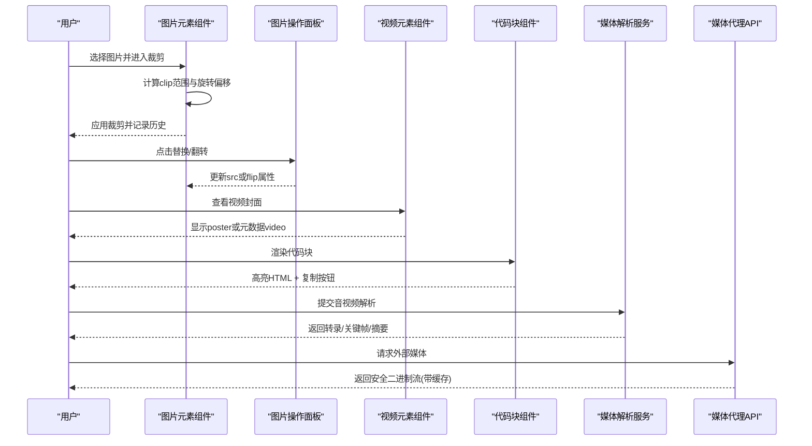
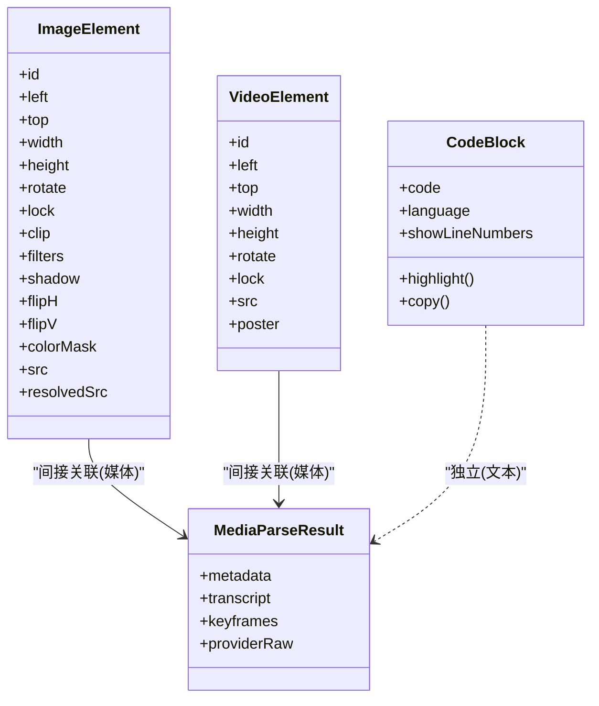
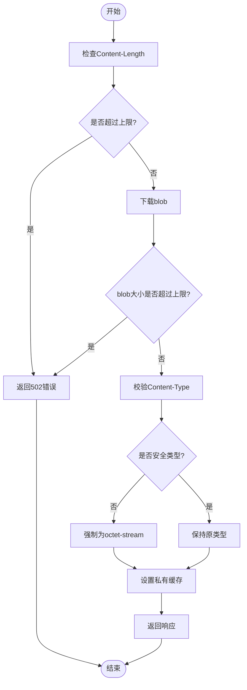

# 媒体元素

<cite>
**本文引用的文件**   
- [components/slide-renderer/components/element/ImageElement/index.tsx](file://components/slide-renderer/components/element/ImageElement/index.tsx)
- [components/slide-renderer/components/element/VideoElement/index.tsx](file://components/slide-renderer/components/element/VideoElement/index.tsx)
- [components/edit/surfaces/slide/ImageActions.tsx](file://components/edit/surfaces/slide/ImageActions.tsx)
- [lib/media-parse/index.ts](file://lib/media-parse/index.ts)
- [lib/media-parse/media-parse-providers.ts](file://lib/media-parse/media-parse-providers.ts)
- [app/api/proxy-media/route.ts](file://app/api/proxy-media/route.ts)
- [lib/document/mime.ts](file://lib/document/mime.ts)
- [components/ai-elements/code-block.tsx](file://components/ai-elements/code-block.tsx)
</cite>

## 产品概述
本系统为 OpenMAIC 课件编辑与渲染中的“媒体元素”能力，覆盖图片、视频与代码块三类核心内容。面向教师与内容创作者，提供：
- 图片：上传替换、形状裁剪、滤镜效果、翻转、阴影、透明度遮罩、占位符解析与加载优化。
- 视频：封面图展示、元数据预取、懒播放、占位符识别与错误兜底。
- 代码块：语法高亮（双主题）、行号、一键复制、错误处理与性能预算控制。
- 媒体解析：音视频转写、关键帧提取、摘要生成与元数据收集。
- 资源代理与安全：统一代理、类型白名单、大小限制与缓存策略。
- 格式支持：统一的 MIME/扩展名映射，便于上传选择器与展示标签。

## 核心业务流程
- 图片编辑流程：选中图片 → 打开操作面板（替换/翻转）→ 进入裁剪模式 → 计算旋转中心偏移并更新 clip 范围 → 写入历史快照。
- 视频编辑流程：显示封面或仅元数据的 video 节点 → 不自动播放避免干扰编辑 → 点击触发选择而非播放。
- 代码块渲染流程：异步生成高亮 HTML（浅色/深色主题）→ 通过上下文注入原始代码 → 复制按钮调用剪贴板 API。
- 媒体解析流程：选择解析提供者 → 调用对应实现（如 AliDocMind）→ 输出转录、关键帧与摘要等结构化结果。
- 媒体代理流程：前端请求代理 → 校验上游响应长度与类型 → 返回安全二进制流并设置私有缓存。

**章节来源**
- [components/slide-renderer/components/element/ImageElement/index.tsx:24-95](file://components/slide-renderer/components/element/ImageElement/index.tsx#L24-L95)
- [components/slide-renderer/components/element/VideoElement/index.tsx:16-73](file://components/slide-renderer/components/element/VideoElement/index.tsx#L16-L73)
- [components/ai-elements/code-block.tsx:52-97](file://components/ai-elements/code-block.tsx#L52-L97)
- [lib/media-parse/media-parse-providers.ts:29-51](file://lib/media-parse/media-parse-providers.ts#L29-L51)
- [app/api/proxy-media/route.ts:67-93](file://app/api/proxy-media/route.ts#L67-L93)

## 功能模块清单
- 图片元素
  - 职责：承载 PPTImageElement 的交互与渲染；支持占位符解析、滤镜、翻转、阴影、颜色遮罩、形状裁剪与旋转对齐。
  - 用户价值：直观编辑图片外观与构图，提升课件视觉质量。
  - 验收要点：裁剪后位置与尺寸正确；旋转时中心偏移计算准确；滤镜生效；占位符可被解析为真实资源。
- 视频元素
  - 职责：编辑模式下以封面或元数据形式呈现，禁止自动播放，保障编辑体验。
  - 用户价值：快速预览视频内容而不打断编辑流程。
  - 验收要点：有 poster 优先显示；无 poster 且非占位符时显示 video 并预取元数据；占位符显示占位背景。
- 图片操作面板
  - 职责：提供替换图片与水平/垂直翻转快捷操作。
  - 用户价值：常用编辑动作一键完成。
  - 验收要点：替换后 src 更新；翻转状态切换正常；不影响画布选择。
- 代码块
  - 职责：基于 Shiki 的高亮渲染（浅色/深色主题），可选行号，一键复制。
  - 用户价值：增强可读性与复用性。
  - 验收要点：主题切换正确；复制成功反馈；异常路径回调 onError。
- 媒体解析
  - 职责：根据 providerId 路由到具体解析实现，产出 MediaArtifact（转录、关键帧、摘要）。
  - 用户价值：将音视频转化为可检索、可定位的结构化内容。
  - 验收要点：未知 provider 抛错；处理耗时写入 metadata；AliDocMind 字段映射正确。
- 媒体代理
  - 职责：对外部媒体进行安全代理，限制大小、校验 Content-Type、设置缓存。
  - 用户价值：统一访问入口，规避跨域与安全风险。
  - 验收要点：超大资源拒绝；非法类型降级为 octet-stream；私有缓存命中。
- 媒体格式映射
  - 职责：集中维护 MIME、扩展名与标签，支撑上传选择器与 UI 展示。
  - 用户价值：一致的格式识别与提示。
  - 验收要点：常见音视频与图片格式齐全；别名映射正确。

**章节来源**
- [components/slide-renderer/components/element/ImageElement/index.tsx:1-167](file://components/slide-renderer/components/element/ImageElement/index.tsx#L1-L167)
- [components/slide-renderer/components/element/VideoElement/index.tsx:1-75](file://components/slide-renderer/components/element/VideoElement/index.tsx#L1-L75)
- [components/edit/surfaces/slide/ImageActions.tsx:1-66](file://components/edit/surfaces/slide/ImageActions.tsx#L1-L66)
- [components/ai-elements/code-block.tsx:1-175](file://components/ai-elements/code-block.tsx#L1-L175)
- [lib/media-parse/index.ts:1-14](file://lib/media-parse/index.ts#L1-L14)
- [lib/media-parse/media-parse-providers.ts:1-152](file://lib/media-parse/media-parse-providers.ts#L1-L152)
- [app/api/proxy-media/route.ts:67-93](file://app/api/proxy-media/route.ts#L67-L93)
- [lib/document/mime.ts:57-105](file://lib/document/mime.ts#L57-L105)

## 数据与状态
- 图片元素数据模型
  - 关键字段：id、left/top/width/height、rotate、lock、clip（shape、range）、filters、shadow、flipH/flipV、colorMask、src/resolvedSrc。
  - 状态流转：选中 → 进入裁剪 → 计算新 range 与位置 → 更新元素 → 写入历史快照。
- 视频元素数据模型
  - 关键字段：id、left/top/width/height、rotate、lock、src、poster。
  - 状态流转：编辑态优先展示 poster；若无 poster 且非占位符则使用 video 并 preload=metadata。
- 代码块数据模型
  - 输入：code、language、showLineNumbers。
  - 输出：light/dark 两套高亮 HTML；上下文暴露原始 code 供复制。
- 媒体解析结果模型
  - MediaArtifact：metadata（fileName、fileSize、mimeType、durationMs、providerId、processingTime）、transcript、keyframes、providerRaw。
- 代理响应头
  - Cache-Control: private, max-age=3600；Content-Type 白名单过滤；Content-Length 上限校验。

**图表来源**
- [components/slide-renderer/components/element/ImageElement/index.tsx:16-40](file://components/slide-renderer/components/element/ImageElement/index.tsx#L16-L40)
- [components/slide-renderer/components/element/VideoElement/index.tsx:6-22](file://components/slide-renderer/components/element/VideoElement/index.tsx#L6-L22)
- [components/ai-elements/code-block.tsx:17-30](file://components/ai-elements/code-block.tsx#L17-L30)
- [lib/media-parse/media-parse-providers.ts:82-149](file://lib/media-parse/media-parse-providers.ts#L82-L149)

**章节来源**
- [components/slide-renderer/components/element/ImageElement/index.tsx:24-95](file://components/slide-renderer/components/element/ImageElement/index.tsx#L24-L95)
- [components/slide-renderer/components/element/VideoElement/index.tsx:16-73](file://components/slide-renderer/components/element/VideoElement/index.tsx#L16-L73)
- [components/ai-elements/code-block.tsx:52-97](file://components/ai-elements/code-block.tsx#L52-L97)
- [lib/media-parse/media-parse-providers.ts:29-51](file://lib/media-parse/media-parse-providers.ts#L29-L51)

## 关键约束与边界
- 加载与缓存
  - 代理层对上游 Content-Length 与 blob.size 做双重上限检查（默认 25 MiB），超限返回 502 错误码。
  - 代理响应设置私有缓存（max-age=3600），减少重复请求。
  - 视频在编辑态仅预取元数据，避免自动播放影响编辑。
- 安全与类型
  - 代理仅放行 image/video/audio 开头的 Content-Type，其他强制降级为 application/octet-stream。
  - 媒体解析对未知 providerId 抛出明确错误，防止未定义行为。
- 性能与预算
  - 代码块高亮采用 Promise.all 并行生成双主题 HTML，避免阻塞。
  - 媒体解析记录 processingTime 至 metadata，便于监控。
- 业务约束
  - 图片裁剪需考虑 rotate 的中心偏移，确保 clip 范围与位置一致。
  - 视频占位符需在编辑态隐藏真实播放器，保持占位背景。
  - 图片操作面板的按钮需阻止默认事件，维持画布选择状态。

**图表来源**
- [app/api/proxy-media/route.ts:67-93](file://app/api/proxy-media/route.ts#L67-L93)

**章节来源**
- [app/api/proxy-media/route.ts:67-93](file://app/api/proxy-media/route.ts#L67-L93)
- [components/slide-renderer/components/element/VideoElement/index.tsx:42-60](file://components/slide-renderer/components/element/VideoElement/index.tsx#L42-L60)
- [lib/media-parse/media-parse-providers.ts:30-45](file://lib/media-parse/media-parse-providers.ts#L30-L45)
- [components/ai-elements/code-block.tsx:59-71](file://components/ai-elements/code-block.tsx#L59-L71)