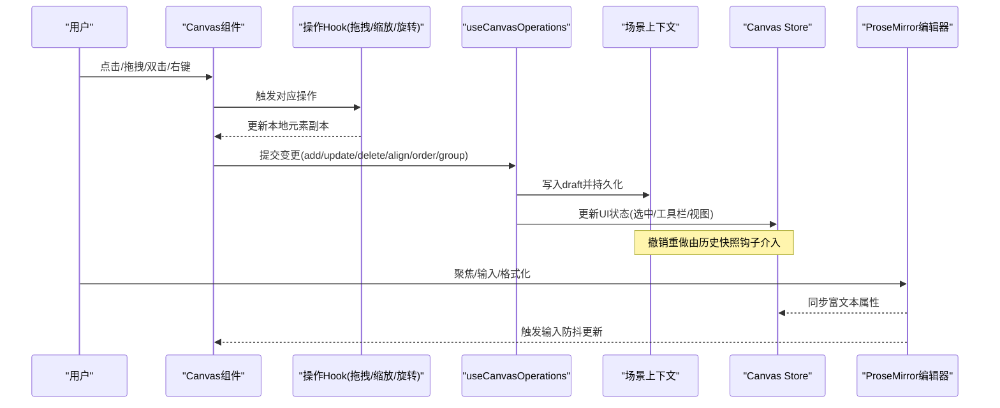
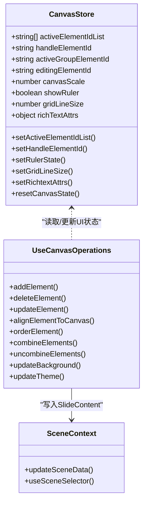
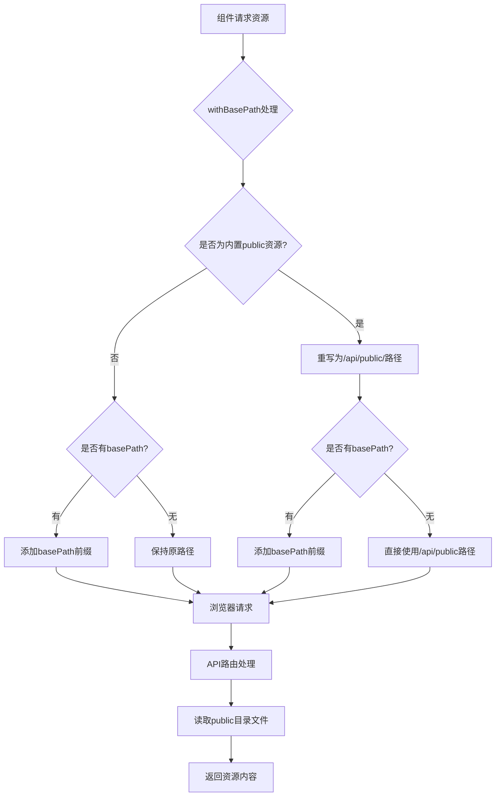

# 幻灯片编辑器

<cite>
**本文引用的文件**   
- [components/slide-renderer/Editor/index.tsx](file://components/slide-renderer/Editor/index.tsx)
- [components/slide-renderer/Editor/Canvas/index.tsx](file://components/slide-renderer/Editor/Canvas/index.tsx)
- [components/slide-renderer/components/element/ProsemirrorEditor.tsx](file://components/slide-renderer/components/element/ProsemirrorEditor.tsx)
- [lib/store/canvas.ts](file://lib/store/canvas.ts)
- [lib/hooks/use-canvas-operations.ts](file://lib/hooks/use-canvas-operations.ts)
- [components/edit/SlideNavRail/SlideNavRail.tsx](file://components/edit/SlideNavRail/SlideNavRail.tsx)
- [lib/utils/base-path.ts](file://lib/utils/base-path.ts)
- [app/api/public/[...path]/route.ts](file://app/api/public/[...path]/route.ts)
</cite>

## 更新摘要
**所做更改**   
- 更新了幻灯片导航栏组件的资源加载机制说明
- 新增了 basePath 资源路径处理系统的详细文档
- 补充了开发环境和生产环境下的静态资源加载策略
- 增强了与 Next.js 16 + Turbopack 兼容性相关的技术细节

## 目录
- 产品概述
- 核心业务流程
- 功能模块清单
- 数据与状态
- 关键约束与边界
- 资源管理与部署适配

## 产品概述
本幻灯片编辑器基于 ProseMirror 构建富文本能力，结合 React + Zustand 实现画布渲染、元素操作（拖拽、缩放、旋转）、实时预览与撤销重做。系统支持多种元素类型（文本、图片、形状、表格、图表、代码块等），提供选择机制、批量操作、键盘快捷键与鼠标交互，并适配触摸设备。面向用户：快速编辑与预览；面向开发者：可扩展的元素体系与清晰的架构分层。

**重要更新**：幻灯片导航栏组件已更新为使用 `withBasePath` 函数处理 logo 引用，确保在开发和生产环境中都能正确加载静态资源。

## 核心业务流程
- 画布初始化与渲染
  - 编辑器入口根据模式切换 Canvas 或 ScreenCanvas。
  - Canvas 订阅场景上下文中的幻灯片内容，渲染视口、网格、标尺、对齐辅助线及元素层。
- 元素操作
  - 选择、多选框选、拖拽移动、缩放、旋转、线条端点拖动、形状关键点拖动。
  - 右键菜单提供粘贴、全选、标尺/网格开关、重置当前页等操作。
- 富文本编辑
  - 文本元素通过 ProseMirror 编辑器承载，支持加粗、斜体、下划线、删除线、上/下标、引用、代码、颜色、字号、字体、列表、链接、缩进与对齐等。
  - 输入变更经防抖同步到上层状态，焦点变化控制快捷键禁用策略。
- 撤销重做
  - 通过历史快照钩子对关键操作（新增、删除、对齐、层级调整、分组/取消分组、背景/主题更新）记录快照，支持 Ctrl/Cmd+Z/Y 回退/重做。
- 教学特效
  - 聚光灯、高亮、激光笔、局部放大等教学演示效果由统一 Store 管理，便于在播放与编辑间切换。



**章节来源**
- [components/slide-renderer/Editor/index.tsx:10-18](file://components/slide-renderer/Editor/index.tsx#L10-L18)
- [components/slide-renderer/Editor/Canvas/index.tsx:62-174](file://components/slide-renderer/Editor/Canvas/index.tsx#L62-L174)
- [lib/hooks/use-canvas-operations.ts:76-157](file://lib/hooks/use-canvas-operations.ts#L76-L157)
- [components/slide-renderer/components/element/ProsemirrorEditor.tsx:91-170](file://components/slide-renderer/components/element/ProsemirrorEditor.tsx#L91-L170)

## 功能模块清单
- 画布与视口
  - 视口尺寸与缩放、平移、网格线、标尺、对齐辅助线、空白区域点击与双击行为。
- 元素操作
  - 单选/多选、拖拽移动、缩放、旋转、线条端点拖动、形状关键点拖动、锁定/解锁、分组/取消分组、层级调整、对齐到画布。
- 富文本编辑器
  - 基于 ProseMirror 的文本编辑与格式命令，支持字体、字号、颜色、背景色、列表、链接、缩进、对齐、清除格式等。
- 工具与面板
  - 右键菜单、浮动工具栏、右侧设计/AI面板、搜索替换面板、选择面板。
- 教学特效
  - 聚光灯、高亮、激光笔、局部放大，支持像素/百分比模式与动画参数。
- 历史与撤销重做
  - 关键操作自动记录快照，支持撤销/重做。
- 导入导出与协作（扩展方向）
  - 导入 PPTX/MAIC、导出 PPTX/PDF、协作编辑（CRDT/OT）可基于现有 Store 与场景上下文扩展。

**章节来源**
- [components/slide-renderer/Editor/Canvas/index.tsx:176-224](file://components/slide-renderer/Editor/Canvas/index.tsx#L176-L224)
- [lib/store/canvas.ts:51-189](file://lib/store/canvas.ts#L51-189)
- [lib/hooks/use-canvas-operations.ts:283-436](file://lib/hooks/use-canvas-operations.ts#L283-436)
- [components/slide-renderer/components/element/ProsemirrorEditor.tsx:171-376](file://components/slide-renderer/components/element/ProsemirrorEditor.tsx#L171-376)

## 数据与状态
- 核心数据模型
  - 幻灯片内容包含 canvas.elements、background、theme 等；元素类型为 PPTElement，具备 id、type、位置、尺寸、样式、分组、锁定等属性。
- 状态管理
  - Canvas Store 管理 UI 状态：选中集合、处理中元素、编辑中元素、隐藏集合、缩放、标尺/网格、工具栏状态、创建态、富文本属性、教学特效等。
  - 场景上下文提供 SlideContent 读写，使用 draft 模式进行不可变更新。
- 选择机制
  - activeElementIdList 维护选中集合；handleElementId 为当前操作目标；activeGroupElementId 用于组内独立操作；editingElementId 标记富文本编辑目标。
- 批量操作
  - 全选、批量对齐、批量层级调整、批量分组/取消分组、批量删除、批量属性更新。
- 撤销重做
  - 通过 useHistorySnapshot 在关键操作后记录快照，配合快捷键触发回退/重放。



**图示来源**
- [lib/store/canvas.ts:51-189](file://lib/store/canvas.ts#L51-189)
- [lib/hooks/use-canvas-operations.ts:76-157](file://lib/hooks/use-canvas-operations.ts#L76-157)

**章节来源**
- [lib/store/canvas.ts:191-254](file://lib/store/canvas.ts#L191-254)
- [lib/hooks/use-canvas-operations.ts:50-75](file://lib/hooks/use-canvas-operations.ts#L50-75)

## 关键约束与边界
- 性能优化
  - 使用 useSceneSelector 精确订阅 elements 字段，避免全量重渲染。
  - 富文本输入采用防抖（约300ms）减少频繁更新。
  - 本地 elementListRef 缓存用于拖拽/缩放/旋转的瞬时计算，降低状态抖动。
- 交互边界
  - 空白区域点击清空选中；按住 Space 时转为画布拖拽。
  - 右键菜单项部分功能暂未实现（如复制/粘贴），以提示占位。
  - 双击空白区域插入文本逻辑待完善。
- 快捷键与焦点
  - 进入富文本编辑时禁用全局快捷键，避免冲突；退出恢复。
  - 撤销/重做快捷键在输入时按组合键触发历史记录处理。
- 教学特效
  - 聚光灯/高亮/激光/放大效果由 Store 统一管理，clearAllEffects 会清理除视频播放外的所有视觉特效。
- 扩展性
  - 元素类型通过 PPTElement.type 区分，新增类型需补充渲染与操作 Hook。
  - 自定义元素开发建议遵循"渲染组件 + 操作 Hook + Store 状态"的分层模式。

**章节来源**
- [components/slide-renderer/Editor/Canvas/index.tsx:138-168](file://components/slide-renderer/Editor/Canvas/index.tsx#L138-L168)
- [components/slide-renderer/components/element/ProsemirrorEditor.tsx:112-126](file://components/slide-renderer/components/element/ProsemirrorEditor.tsx#L112-126)
- [lib/hooks/use-canvas-operations.ts:182-215](file://lib/hooks/use-canvas-operations.ts#L182-215)
- [lib/store/canvas.ts:451-467](file://lib/store/canvas.ts#L451-467)

## 资源管理与部署适配

### basePath 资源路径处理系统

OpenMAIC 支持两种部署模式：独立运行（basePath 为空）和被 Philochora 以 `/openmaic` 子路径反向代理嵌入。为解决 Next.js 16 + Turbopack 在开发模式下 public 静态资源的 404 问题，系统实现了完善的资源路径处理机制。

#### withBasePath 函数机制

`withBasePath` 函数负责处理静态资源路径，确保在不同部署环境下都能正确加载资源：

- **智能路径重写**：自动将内置 public 资源（/avatars/、/logos/、/vendor/、/logo-horizontal.png、/openmaic-mark.png）改写到 `/api/public/` 路径
- **basePath 前缀处理**：在非空 basePath 环境下自动添加前缀
- **协议兼容**：跳过 data:、blob:、http(s): 等绝对 URL，保持用户上传资源的完整性

#### API 公共路由服务

`/api/public/[...path]` 路由作为开发模式下的 fallback，直接读取 public 目录文件并返回内容：

- **安全白名单**：仅允许 avatars、logos、vendor 等已知公共资源前缀
- **路径验证**：防止目录遍历攻击，拒绝包含 `..` 的路径
- **MIME 类型识别**：根据文件扩展名设置正确的 Content-Type
- **流式传输**：使用 Node.js 流处理大文件，避免内存溢出

#### SlideNavRail 组件的资源加载优化

幻灯片导航栏组件已全面更新为使用 `withBasePath` 处理 logo 引用：

```tsx
// 在 SlideNavRail.tsx 第389行

```

这种处理方式确保了：
- **开发环境**：绕过 Turbopack 的 public 资源 404 bug
- **生产环境**：正确处理 basePath 前缀
- **子路径部署**：在 Philochora 嵌入模式下正确加载资源

#### 资源加载流程图



**章节来源**
- [components/edit/SlideNavRail/SlideNavRail.tsx:389](file://components/edit/SlideNavRail/SlideNavRail.tsx#L389)
- [lib/utils/base-path.ts:65-89](file://lib/utils/base-path.ts#L65-89)
- [app/api/public/[...path]/route.ts:52-96](file://app/api/public/[...path]/route.ts#L52-96)

### 部署兼容性保证

系统通过以下机制确保在各种部署环境下的稳定性：

- **开发环境优化**：针对 Next.js 16 + Turbopack 的已知问题进行专门处理
- **生产环境兼容**：利用 Next.js 自身的 production build 优化
- **子路径部署支持**：完整支持被其他应用反向代理嵌入的场景
- **资源缓存策略**：公共资源设置合理的缓存头，提升加载性能

**章节来源**
- [lib/utils/base-path.ts:1-26](file://lib/utils/base-path.ts#L1-26)
- [app/api/public/[...path]/route.ts:1-16](file://app/api/public/[...path]/route.ts#L1-16)