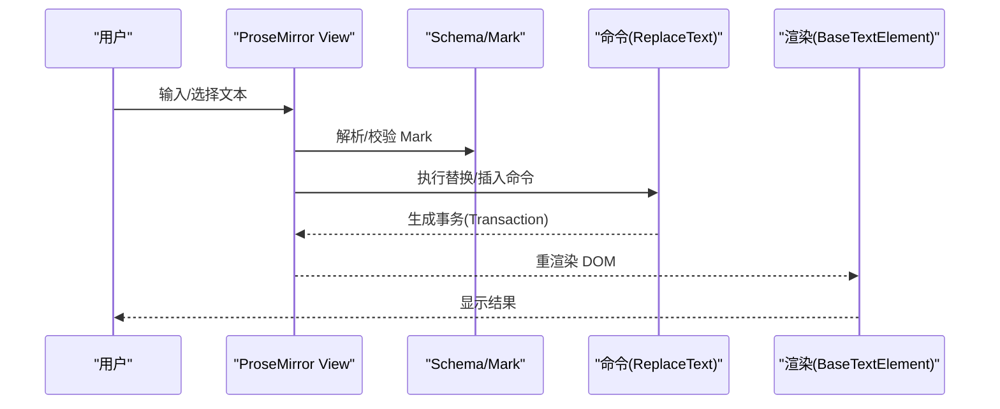
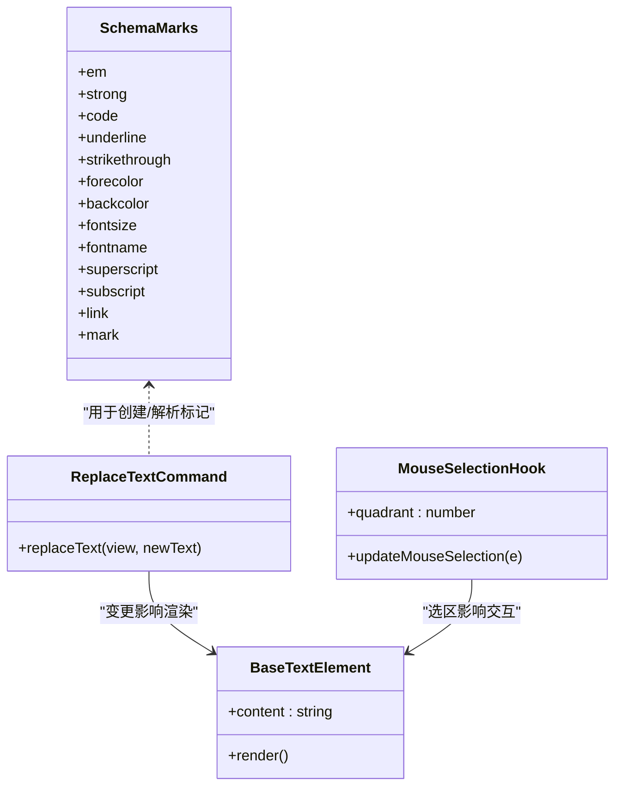

# 文本编辑器

<cite>
**本文引用的文件**   
- [lib/prosemirror/schema/marks.ts](file://lib/prosemirror/schema/marks.ts)
- [lib/prosemirror/commands/replaceText.ts](file://lib/prosemirror/commands/replaceText.ts)
- [app/globals.css](file://app/globals.css)
- [packages/@openmaic/renderer/src/elements/text/BaseTextElement.tsx](file://packages/@openmaic/renderer/src/elements/text/BaseTextElement.tsx)
- [components/slide-renderer/Editor/Canvas/hooks/useMouseSelection.ts](file://components/slide-renderer/Editor/Canvas/hooks/useMouseSelection.ts)
- [tests/edit/surfaces/slide/text-format-bar.test.ts](file://tests/edit/surfaces/slide/text-format-bar.test.ts)
</cite>

## 产品概述
本编辑器基于 ProseMirror，为 OpenMAIC 课件编辑场景提供富文本能力。支持文本格式化（粗体、斜体、下划线、删除线、颜色、背景色、字体大小、字体族）、段落样式与列表（有序/无序），并提供输入处理、光标与选区管理、内容序列化/反序列化、版本控制思路、以及扩展点用于拼写检查、自动完成、搜索替换、格式刷与模板等高级功能。

## 核心业务流程
- 用户输入与格式化：在可编辑区域输入或选择文本，通过标记（Mark）应用样式（如加粗、颜色、字号等）。
- 选区与操作：鼠标拖拽选区、键盘快捷键触发命令，更新文档状态并渲染。
- 内容持久化：将文档序列化为 DSL/JSON，保存至存储层；加载时反序列化为 ProseMirror 文档树。
- 回放与渲染：播放模式下以静态 HTML 渲染，保持编辑时的样式与结构一致。

图表来源 
- [lib/prosemirror/commands/replaceText.ts](file://lib/prosemirror/commands/replaceText.ts)
- [lib/prosemirror/schema/marks.ts](file://lib/prosemirror/schema/marks.ts)
- [packages/@openmaic/renderer/src/elements/text/BaseTextElement.tsx](file://packages/@openmaic/renderer/src/elements/text/BaseTextElement.tsx)

章节来源
- [lib/prosemirror/commands/replaceText.ts](file://lib/prosemirror/commands/replaceText.ts)
- [lib/prosemirror/schema/marks.ts](file://lib/prosemirror/schema/marks.ts)
- [packages/@openmaic/renderer/src/elements/text/BaseTextElement.tsx](file://packages/@openmaic/renderer/src/elements/text/BaseTextElement.tsx)

## 功能模块清单
- 文本格式化
  - 粗体/斜体/代码：使用基础 Mark（em、strong、code）。
  - 下划线/删除线：underline、strikethrough。
  - 颜色/背景色：forecolor、backcolor。
  - 字体大小/字体族：fontsize、fontname（含安全过滤与 CSS 转义）。
  - 上标/下标：superscript、subscript。
  - 链接：link（href/title/target）。
  - 高亮标记：mark（data-index）。
- 段落与列表
  - 段落节点与有序/无序列表，CSS 强制列表样式可见性。
- 输入与选区
  - 鼠标选区计算与方向判定。
  - 批量替换文本并保持原有样式与节点类型。
- 渲染与回放
  - 播放模式静态渲染，保留样式与结构。
- 扩展点（建议实现）
  - 拼写检查、自动完成、搜索替换、格式刷、模板插入、多语言与输入法适配、无障碍增强。

章节来源
- [lib/prosemirror/schema/marks.ts](file://lib/prosemirror/schema/marks.ts)
- [app/globals.css](file://app/globals.css)
- [lib/prosemirror/commands/replaceText.ts](file://lib/prosemirror/commands/replaceText.ts)
- [components/slide-renderer/Editor/Canvas/hooks/useMouseSelection.ts](file://components/slide-renderer/Editor/Canvas/hooks/useMouseSelection.ts)
- [packages/@openmaic/renderer/src/elements/text/BaseTextElement.tsx](file://packages/@openmaic/renderer/src/elements/text/BaseTextElement.tsx)

## 数据与状态
- 文档模型
  - 节点：paragraph、bulletList、orderedList、text 等。
  - 标记：em、strong、code、underline、strikethrough、forecolor、backcolor、fontsize、fontname、superscript、subscript、link、mark。
- 状态流转
  - 输入事件 → EditorView 状态更新 → Transaction → 重新渲染。
  - 选区变化驱动 UI 工具栏与命令可用性。
- 序列化/反序列化
  - 编辑态：ProseMirror JSON/HTML ↔ 文档树。
  - 回放态：BaseTextElement 以 HTML 字符串渲染，保证一致性。
- 版本控制（建议）
  - 在存储层记录 runtimeDslVersion 与时间戳，避免 DSL 版本漂移导致的不兼容。

图表来源 
- [lib/prosemirror/schema/marks.ts](file://lib/prosemirror/schema/marks.ts)
- [lib/prosemirror/commands/replaceText.ts](file://lib/prosemirror/commands/replaceText.ts)
- [packages/@openmaic/renderer/src/elements/text/BaseTextElement.tsx](file://packages/@openmaic/renderer/src/elements/text/BaseTextElement.tsx)
- [components/slide-renderer/Editor/Canvas/hooks/useMouseSelection.ts](file://components/slide-renderer/Editor/Canvas/hooks/useMouseSelection.ts)

章节来源
- [lib/prosemirror/schema/marks.ts](file://lib/prosemirror/schema/marks.ts)
- [lib/prosemirror/commands/replaceText.ts](file://lib/prosemirror/commands/replaceText.ts)
- [packages/@openmaic/renderer/src/elements/text/BaseTextElement.tsx](file://packages/@openmaic/renderer/src/elements/text/BaseTextElement.tsx)
- [components/slide-renderer/Editor/Canvas/hooks/useMouseSelection.ts](file://components/slide-renderer/Editor/Canvas/hooks/useMouseSelection.ts)

## 关键约束与边界
- 样式与列表可见性
  - Tailwind preflight 会重置 ul/ol 的 list-style 与 padding，需在编辑器作用域内强制恢复，确保列表标记可见。
  - 编辑器聚焦环由自定义规则覆盖，避免与播放器焦点冲突。
- 字体族安全
  - fontname 在 toDOM 中需对引号与反斜杠进行过滤，防止注入非法 CSS。
- 输入与选区
  - 鼠标选区需考虑缩放比例与象限方向，最小选区阈值避免误触。
- 批量替换
  - replaceText 会继承首字符的 Mark 与父节点类型，按行拆分后重建文档，注意空行与换行行为。
- 回放一致性
  - 播放模式使用静态 HTML 渲染，不应包含编辑器专属类名，避免样式污染。
- 版本与兼容性
  - 运行时 DSL 版本应独立于文档行版本，避免混用导致解析错误。

章节来源
- [app/globals.css](file://app/globals.css)
- [lib/prosemirror/schema/marks.ts](file://lib/prosemirror/schema/marks.ts)
- [lib/prosemirror/commands/replaceText.ts](file://lib/prosemirror/commands/replaceText.ts)
- [components/slide-renderer/Editor/Canvas/hooks/useMouseSelection.ts](file://components/slide-renderer/Editor/Canvas/hooks/useMouseSelection.ts)
- [packages/@openmaic/renderer/src/elements/text/BaseTextElement.tsx](file://packages/@openmaic/renderer/src/elements/text/BaseTextElement.tsx)

## 扩展指南（建议实现）
- 文本验证
  - 在 Transaction 前钩子中校验长度、敏感词、必填字段；失败则撤销并提示。
- 拼写检查
  - 监听 onSelectionUpdate，异步调用拼写服务，返回下划线标记；合并到 mark 集合。
- 自动完成
  - 基于输入前缀匹配词典/历史，弹出候选；选中后插入文本并保留上下文 Mark。
- 搜索替换
  - 遍历文档树构建匹配索引，支持正则与全词匹配；批量替换时保持 Mark 与节点类型。
- 格式刷
  - 记录当前选区的 Mark 集合与节点属性；粘贴/选择目标时应用相同样式。
- 模板
  - 预置段落/列表/表格片段，插入时克隆节点树并合并 Mark。
- 多语言与输入法
  - 使用 compositionstart/compositionend 拦截 IME 输入；根据 locale 切换词典与占位符。
- 无障碍访问
  - 为工具按钮添加 aria-label；确保键盘可达与屏幕阅读器朗读顺序正确。

[本节为通用指导，不直接分析具体文件]

## 性能与可维护性建议
- 大文档优化
  - 增量更新：仅在必要范围触发 reflow；避免频繁重建整棵树。
  - 防抖/节流：自动完成与拼写检查请求去抖。
- 样式隔离
  - 编辑器与回放样式严格分离，避免全局污染。
- 可扩展性
  - 将 Mark 与命令模块化注册，便于按需启用与测试。

[本节为通用指导，不直接分析具体文件]

## 故障排查
- 列表不可见
  - 检查是否在编辑器作用域内设置了 list-style 与 padding；确认未受 preflight 覆盖。
- 字体异常
  - 检查 fontname 是否包含非法字符；确认 CSS 值被正确引用。
- 替换后样式丢失
  - 确认 replaceText 是否正确继承首字符 Mark 与父节点类型。
- 回放样式不一致
  - 检查 BaseTextElement 渲染的 HTML 是否包含编辑器专属类名。

章节来源
- [app/globals.css](file://app/globals.css)
- [lib/prosemirror/schema/marks.ts](file://lib/prosemirror/schema/marks.ts)
- [lib/prosemirror/commands/replaceText.ts](file://lib/prosemirror/commands/replaceText.ts)
- [packages/@openmaic/renderer/src/elements/text/BaseTextElement.tsx](file://packages/@openmaic/renderer/src/elements/text/BaseTextElement.tsx)

## 附录：关键实现要点速览
- 标记定义与解析
  - 所有文本样式通过 MarkSpec 定义 parseDOM/toDOM，确保 HTML↔树双向转换。
- 批量替换逻辑
  - 读取首字符 Mark 与父节点类型，按行拆分重建节点树，统一派发事务。
- 选区计算
  - 依据视口与缩放计算矩形，判断象限与最小阈值，驱动交互反馈。
- 回放渲染
  - 以静态 HTML 渲染，保持结构与样式一致，避免编辑器类名泄漏。

章节来源
- [lib/prosemirror/schema/marks.ts](file://lib/prosemirror/schema/marks.ts)
- [lib/prosemirror/commands/replaceText.ts](file://lib/prosemirror/commands/replaceText.ts)
- [components/slide-renderer/Editor/Canvas/hooks/useMouseSelection.ts](file://components/slide-renderer/Editor/Canvas/hooks/useMouseSelection.ts)
- [packages/@openmaic/renderer/src/elements/text/BaseTextElement.tsx](file://packages/@openmaic/renderer/src/elements/text/BaseTextElement.tsx)