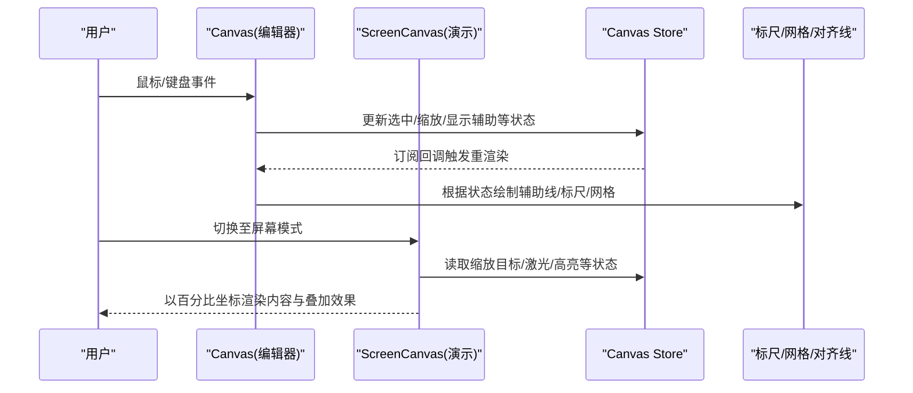
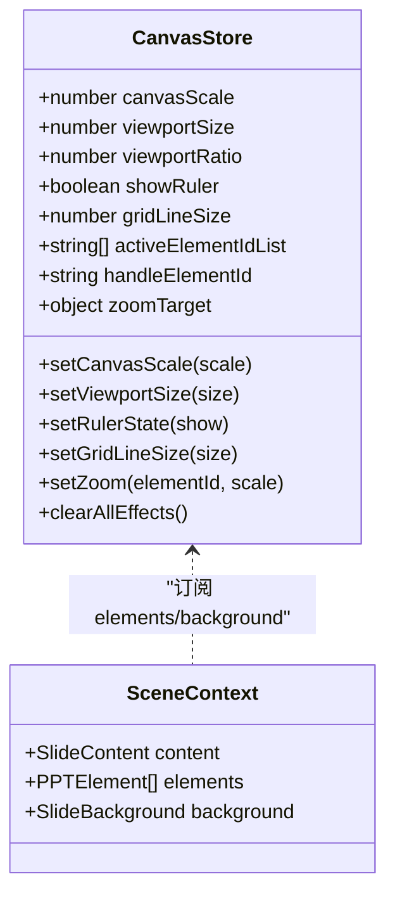
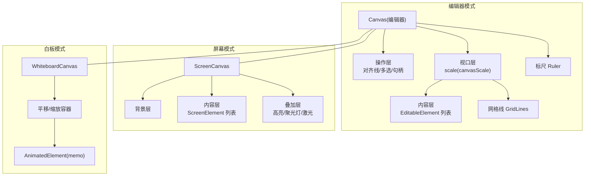
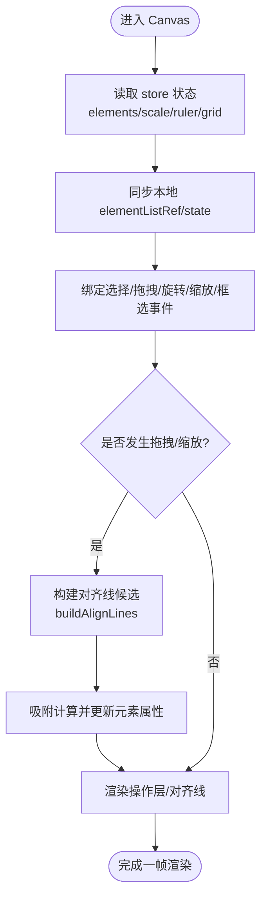
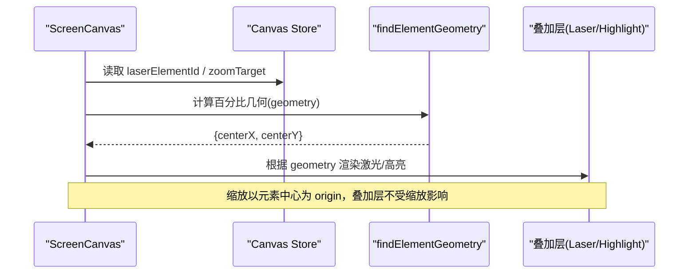
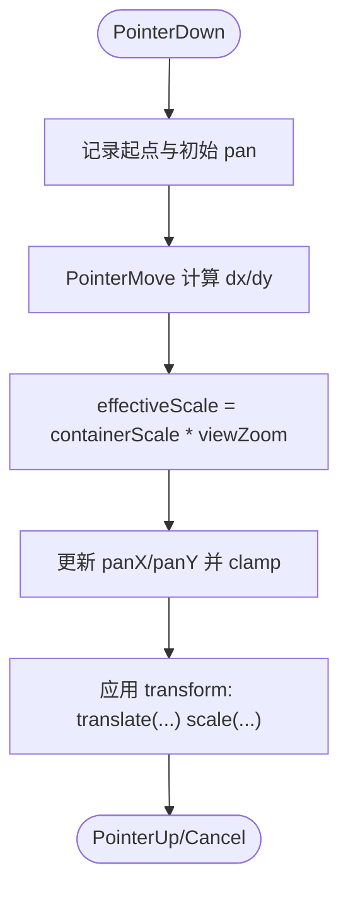
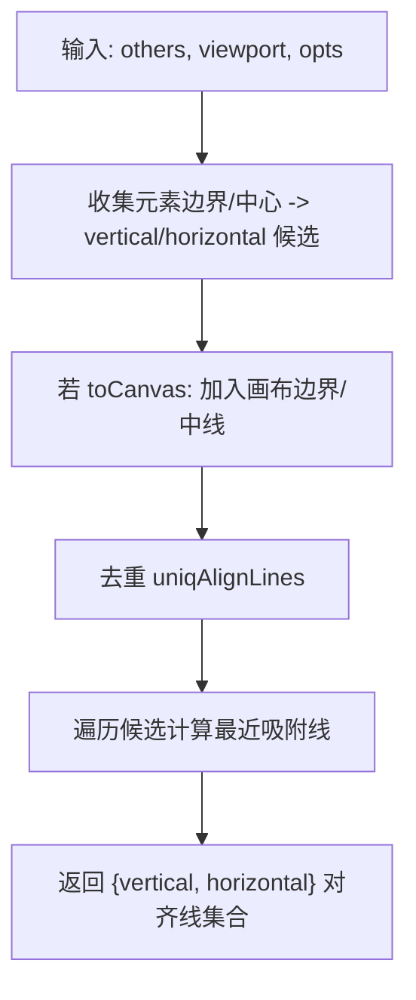
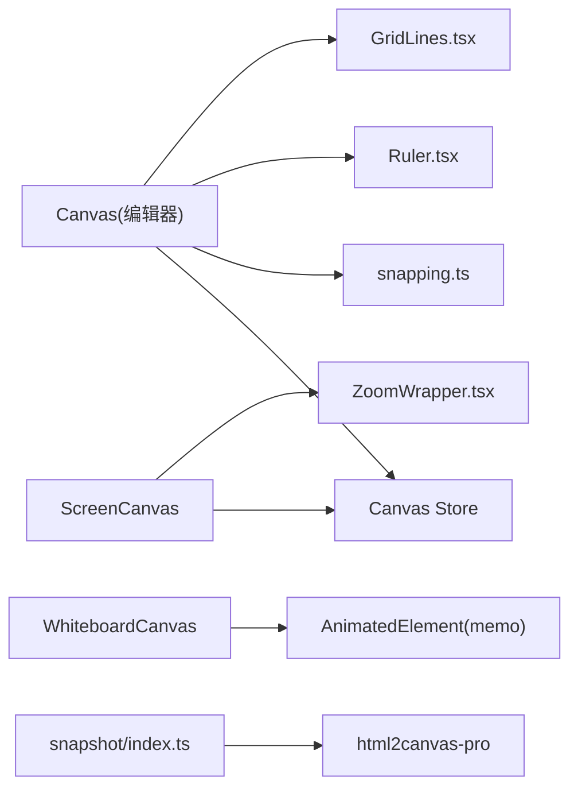

# 画布系统

<cite>
**本文引用的文件**   
- [components/slide-renderer/Editor/Canvas/index.tsx](file://components/slide-renderer/Editor/Canvas/index.tsx)
- [components/slide-renderer/Editor/ScreenCanvas.tsx](file://components/slide-renderer/Editor/ScreenCanvas.tsx)
- [components/slide-renderer/Editor/ZoomWrapper.tsx](file://components/slide-renderer/Editor/ZoomWrapper.tsx)
- [components/slide-renderer/Editor/Canvas/GridLines.tsx](file://components/slide-renderer/Editor/Canvas/GridLines.tsx)
- [components/slide-renderer/Editor/Canvas/Ruler.tsx](file://components/slide-renderer/Editor/Canvas/Ruler.tsx)
- [components/slide-renderer/Editor/Canvas/AlignmentLine.tsx](file://components/slide-renderer/Editor/Canvas/AlignmentLine.tsx)
- [lib/store/canvas.ts](file://lib/store/canvas.ts)
- [packages/@openmaic/renderer/src/editing/core/snapping.ts](file://packages/@openmaic/renderer/src/editing/core/snapping.ts)
- [packages/@openmaic/renderer/src/editing/core/resize.ts](file://packages/@openmaic/renderer/src/editing/core/resize.ts)
- [lib/edit/slide-ops.ts](file://lib/edit/slide-ops.ts)
- [components/whiteboard/whiteboard-canvas.tsx](file://components/whiteboard/whiteboard-canvas.tsx)
- [packages/@openmaic/renderer/src/snapshot/index.ts](file://packages/@openmaic/renderer/src/snapshot/index.ts)
</cite>

## 产品概述
本文件系统化梳理 OpenMAIC 的画布渲染与编辑子系统，聚焦基于 DOM + CSS Transform 的“类 Canvas”渲染引擎（非原生 Canvas API），涵盖视口管理、缩放与平移、网格线与标尺、对齐辅助线、元素定位算法与性能优化策略。同时解释屏幕模式与自主模式的差异与渲染行为，并提供扩展开发指南（自定义背景、水印、标注）以及触摸设备适配、高分屏支持与浏览器兼容性要点。

## 核心业务流程
- 视图初始化：根据 viewportSize 与 viewportRatio 计算画布尺寸，应用 canvasScale 进行整体缩放；可选启用标尺与网格线。
- 交互流程：选择、拖拽、旋转、缩放、多元素框选、右键菜单操作；拖拽过程中实时生成对齐辅助线并执行吸附。
- 渲染分层：背景层 → 内容层（元素列表）→ 叠加层（高亮、聚光灯、激光笔）→ 标尺/网格线等 UI 辅助。
- 状态管理：Zustand 统一维护选中态、工具栏、显示辅助、教学特效（聚光灯/高亮/激光）、白板状态等。

**章节来源**
- [components/slide-renderer/Editor/Canvas/index.tsx:62-174](file://components/slide-renderer/Editor/Canvas/index.tsx#L62-L174)
- [components/slide-renderer/Editor/ScreenCanvas.tsx:18-59](file://components/slide-renderer/Editor/ScreenCanvas.tsx#L18-L59)
- [lib/store/canvas.ts:36-189](file://lib/store/canvas.ts#L36-L189)

## 功能模块清单
- 视口与缩放
  - 通过 viewportSize/viewportRatio 定义基准画布尺寸与比例，canvasScale 控制整体缩放；支持以元素为中心的缩放动画。
- 拖拽与变换
  - 元素拖拽、旋转、缩放（含等比锁定与旋转路径下的局部轴计算），多元素框选与批量缩放。
- 对齐与吸附
  - 基于其他元素边界/中心与画布边界的候选对齐线，按阈值吸附并生成可视化辅助线。
- 标尺与网格
  - 水平/垂直标尺显示刻度与选中范围高亮；SVG 网格线按背景亮度自适应颜色。
- 叠加与教学特效
  - 高亮、聚光灯（像素/百分比两种模式）、激光笔动画，均通过独立叠加层实现。
- 白板模式
  - 独立的平移/缩放容器，支持滚轮缩放、拖拽平移、双击复位、清空动画与自动适配。

**章节来源**
- [components/slide-renderer/Editor/Canvas/index.tsx:226-352](file://components/slide-renderer/Editor/Canvas/index.tsx#L226-L352)
- [components/slide-renderer/Editor/ZoomWrapper.tsx:21-47](file://components/slide-renderer/Editor/ZoomWrapper.tsx#L21-L47)
- [packages/@openmaic/renderer/src/editing/core/snapping.ts:41-87](file://packages/@openmaic/renderer/src/editing/core/snapping.ts#L41-L87)
- [components/slide-renderer/Editor/Canvas/GridLines.tsx:6-49](file://components/slide-renderer/Editor/Canvas/GridLines.tsx#L6-L49)
- [components/slide-renderer/Editor/Canvas/Ruler.tsx:12-122](file://components/slide-renderer/Editor/Canvas/Ruler.tsx#L12-L122)
- [components/whiteboard/whiteboard-canvas.tsx:104-383](file://components/whiteboard/whiteboard-canvas.tsx#L104-L383)

## 数据与状态
- 核心状态（Zustand）
  - 元素选择与编辑：activeElementIdList、handleElementId、editingElementId、hiddenElementIdList
  - 视口与缩放：canvasScale、canvasPercentage、viewportSize、viewportRatio、canvasDragged
  - 显示辅助：showRuler、gridLineSize
  - 教学特效：spotlight/laser/highlight/zoomTarget/pickTarget
  - 白板：whiteboardOpen、whiteboardClearing
- 场景数据（Scene Context）
  - SlideContent.canvas.elements、background 等由 Scene Provider 提供，Canvas 组件仅订阅所需字段以提升性能。
- 几何与范围
  - getElementListRange 用于计算选中元素的包围盒，支撑对齐、标尺高亮与对齐命令。

**图表来源**
- [lib/store/canvas.ts:51-189](file://lib/store/canvas.ts#L51-L189)
- [components/slide-renderer/Editor/Canvas/index.tsx:67-84](file://components/slide-renderer/Editor/Canvas/index.tsx#L67-L84)

**章节来源**
- [lib/store/canvas.ts:191-254](file://lib/store/canvas.ts#L191-L254)
- [lib/edit/slide-ops.ts:310-359](file://lib/edit/slide-ops.ts#L310-L359)

## 关键约束与边界
- 坐标系统与定位
  - 编辑器模式使用像素坐标与 CSS Transform 缩放；屏幕模式采用百分比坐标与 transform-origin 居中缩放，确保演示时布局稳定。
- 对齐与吸附
  - 对齐线候选包含元素边缘/中心与画布边界；旋转元素不进行轴对齐吸附（保持视觉一致性）。
- 性能优化
  - 使用 useMemo/useCallback 缓存几何计算与事件处理；对频繁变动的父级（如白板平移/缩放）对子元素做 memo 隔离，避免不必要的重排与动画抖动。
- 导出与截图
  - 离屏渲染使用 html2canvas-pro 直接遍历 DOM 绘制到 Canvas，避免 SVG foreignObject 字体解码时序问题，保证文本换行一致。
- 兼容性与高分屏
  - 依赖 ResizeObserver、Pointer Events、CSS Transform；高分屏通过 devicePixelRatio 参与离屏导出配置。

**章节来源**
- [packages/@openmaic/renderer/src/editing/core/resize.ts:297-382](file://packages/@openmaic/renderer/src/editing/core/resize.ts#L297-L382)
- [packages/@openmaic/renderer/src/editing/core/snapping.ts:28-92](file://packages/@openmaic/renderer/src/editing/core/snapping.ts#L28-L92)
- [components/whiteboard/whiteboard-canvas.tsx:97-102](file://components/whiteboard/whiteboard-canvas.tsx#L97-L102)
- [packages/@openmaic/renderer/src/snapshot/index.ts:79-94](file://packages/@openmaic/renderer/src/snapshot/index.ts#L79-L94)

## 架构总览

**图表来源**
- [components/slide-renderer/Editor/Canvas/index.tsx:226-352](file://components/slide-renderer/Editor/Canvas/index.tsx#L226-L352)
- [components/slide-renderer/Editor/ScreenCanvas.tsx:61-123](file://components/slide-renderer/Editor/ScreenCanvas.tsx#L61-L123)
- [components/whiteboard/whiteboard-canvas.tsx:318-382](file://components/whiteboard/whiteboard-canvas.tsx#L318-L382)

## 详细组件分析

### 编辑器画布（Canvas）
- 职责
  - 聚合所有编辑交互 Hook（选择、拖拽、旋转、缩放、框选、拖拽线条、形状关键点移动、从选择插入元素、拖放）。
  - 渲染操作层（对齐线、多选操作、元素句柄）、视口层（元素列表）、网格线与标尺。
  - 提供右键菜单（粘贴、全选、标尺开关、网格线大小、重置当前页）。
- 关键实现要点
  - 本地 elementListRef 与 state 同步，避免高频操作导致的全量重渲染。
  - 通过 useViewportSize 获取视口样式，结合 canvasScale 控制整体缩放。
  - 对齐线由 drag/scale Hook 计算并传入 AlignmentLine 渲染。

**图表来源**
- [components/slide-renderer/Editor/Canvas/index.tsx:91-174](file://components/slide-renderer/Editor/Canvas/index.tsx#L91-L174)
- [packages/@openmaic/renderer/src/editing/core/snapping.ts:41-87](file://packages/@openmaic/renderer/src/editing/core/snapping.ts#L41-L87)

**章节来源**
- [components/slide-renderer/Editor/Canvas/index.tsx:62-174](file://components/slide-renderer/Editor/Canvas/index.tsx#L62-L174)
- [components/slide-renderer/Editor/Canvas/AlignmentLine.tsx:13-38](file://components/slide-renderer/Editor/Canvas/AlignmentLine.tsx#L13-L38)

### 屏幕画布（ScreenCanvas）
- 职责
  - 演示模式下的全屏渲染：背景层、内容层、叠加层（高亮/聚光灯/激光）。
  - 支持以元素为中心的缩放动画（ZoomWrapper），百分比坐标计算激光/缩放几何。
- 关键实现要点
  - 通过 findElementGeometry 计算百分比几何，驱动激光与缩放原点。
  - 叠加层位于缩放层之外，使用百分比坐标定位，避免受 scale 影响。

**图表来源**
- [components/slide-renderer/Editor/ScreenCanvas.tsx:34-59](file://components/slide-renderer/Editor/ScreenCanvas.tsx#L34-L59)
- [components/slide-renderer/Editor/ZoomWrapper.tsx:21-47](file://components/slide-renderer/Editor/ZoomWrapper.tsx#L21-L47)

**章节来源**
- [components/slide-renderer/Editor/ScreenCanvas.tsx:18-123](file://components/slide-renderer/Editor/ScreenCanvas.tsx#L18-L123)

### 白板画布（WhiteboardCanvas）
- 职责
  - 提供可平移/缩放的白板容器，支持滚轮缩放、拖拽平移、双击复位、清空动画。
  - 对元素渲染使用 memo 隔离，避免父级平移/缩放导致的子组件重排与动画抖动。
- 关键实现要点
  - clampPan 限制平移边界，随缩放动态调整。
  - wheel 事件中根据光标位置计算缩放中心，保持光标下点静止。
  - 首次加载或清空后自动 resetView。

**图表来源**
- [components/whiteboard/whiteboard-canvas.tsx:184-271](file://components/whiteboard/whiteboard-canvas.tsx#L184-L271)

**章节来源**
- [components/whiteboard/whiteboard-canvas.tsx:104-383](file://components/whiteboard/whiteboard-canvas.tsx#L104-L383)

### 对齐与吸附（Snapping）
- 候选对齐线
  - 来自其他元素的边界与中心，以及画布的左/中/右与上/中/下。
  - 去重后按阈值匹配最佳吸附线，返回 delta 与 line。
- 旋转元素
  - 旋转路径下将指针增量旋转到元素局部轴，再应用每句柄的尺寸计算与对角点修正，不执行轴对齐吸附。

**图表来源**
- [packages/@openmaic/renderer/src/editing/core/snapping.ts:41-87](file://packages/@openmaic/renderer/src/editing/core/snapping.ts#L41-L87)

**章节来源**
- [packages/@openmaic/renderer/src/editing/core/snapping.ts:28-92](file://packages/@openmaic/renderer/src/editing/core/snapping.ts#L28-L92)
- [packages/@openmaic/renderer/src/editing/core/resize.ts:297-382](file://packages/@openmaic/renderer/src/editing/core/resize.ts#L297-L382)

### 标尺与网格（Ruler & GridLines）
- 标尺
  - 根据 viewportSize 与 canvasScale 计算刻度间距，显示主/次刻度与选中范围高亮。
- 网格
  - 基于 SVG path 绘制横纵网格线，颜色根据背景亮度自适应（浅底深线/深底浅线）。

**章节来源**
- [components/slide-renderer/Editor/Canvas/Ruler.tsx:12-122](file://components/slide-renderer/Editor/Canvas/Ruler.tsx#L12-L122)
- [components/slide-renderer/Editor/Canvas/GridLines.tsx:6-49](file://components/slide-renderer/Editor/Canvas/GridLines.tsx#L6-L49)

### 元素定位与对齐命令
- 对齐命令
  - 基于 getElementListRange 计算选中元素包围盒，结合 viewportWidth/Height 计算偏移量，批量更新 left/top。
- 旋转与等比缩放
  - 旋转路径下将指针增量转换到元素局部轴，角点缩放时锁定宽高比，并对角点进行位置修正以保持固定点不动。

**章节来源**
- [lib/edit/slide-ops.ts:310-359](file://lib/edit/slide-ops.ts#L310-L359)
- [packages/@openmaic/renderer/src/editing/core/resize.ts:461-488](file://packages/@openmaic/renderer/src/editing/core/resize.ts#L461-L488)

## 依赖分析
- 组件耦合
  - Canvas 依赖 Zustand 的 Canvas Store 与 Scene Context；对齐线依赖 snapping 核心；标尺/网格依赖 store 中的显示辅助状态。
- 外部依赖
  - html2canvas-pro 用于离屏导出 PNG；motion/react 用于动画；ResizeObserver/Pointer Events 用于交互。
- 潜在循环依赖
  - 通过 hooks 与 store 解耦，避免组件间直接引用；Snapshot 在离屏挂载 React 根节点，不与运行时 UI 共享状态。

**图表来源**
- [components/slide-renderer/Editor/Canvas/index.tsx:62-174](file://components/slide-renderer/Editor/Canvas/index.tsx#L62-L174)
- [packages/@openmaic/renderer/src/editing/core/snapping.ts:41-87](file://packages/@openmaic/renderer/src/editing/core/snapping.ts#L41-L87)
- [components/slide-renderer/Editor/ScreenCanvas.tsx:18-59](file://components/slide-renderer/Editor/ScreenCanvas.tsx#L18-L59)
- [components/whiteboard/whiteboard-canvas.tsx:97-102](file://components/whiteboard/whiteboard-canvas.tsx#L97-L102)
- [packages/@openmaic/renderer/src/snapshot/index.ts:79-94](file://packages/@openmaic/renderer/src/snapshot/index.ts#L79-L94)

**章节来源**
- [lib/store/canvas.ts:36-189](file://lib/store/canvas.ts#L36-L189)
- [packages/@openmaic/renderer/src/snapshot/index.ts:1-22](file://packages/@openmaic/renderer/src/snapshot/index.ts#L1-L22)

## 性能考虑
- 渲染优化
  - 使用 useMemo/useCallback 缓存几何与事件处理；对频繁更新的父级（白板平移/缩放）对子元素做 memo 隔离，减少重排与动画抖动。
- 状态粒度
  - 仅订阅必要字段（如 elements/background），避免全量重渲染。
- 导出性能
  - 离屏渲染设置超时与像素比，避免跨域图片导致的 CORS 错误；优先使用 blob 输出便于后续处理。

[本节为通用指导，不直接分析具体文件]

## 故障排查指南
- 对齐线不出现
  - 检查 snapping 候选是否生成（toElements/toCanvas 选项），确认阈值与视觉范围。
- 旋转缩放异常
  - 确认旋转路径下的局部轴转换与对角点修正逻辑；检查等比锁定的 corner 句柄分支。
- 屏幕模式激光/缩放错位
  - 核对 findElementGeometry 返回值与 transformOrigin 百分比坐标；确认叠加层不在缩放层内。
- 导出图片文字换行不一致
  - 确认使用 html2canvas-pro 而非 svg foreignObject 路径；检查字体加载与超时配置。

**章节来源**
- [packages/@openmaic/renderer/src/editing/core/snapping.ts:41-87](file://packages/@openmaic/renderer/src/editing/core/snapping.ts#L41-L87)
- [packages/@openmaic/renderer/src/editing/core/resize.ts:297-382](file://packages/@openmaic/renderer/src/editing/core/resize.ts#L297-L382)
- [components/slide-renderer/Editor/ScreenCanvas.tsx:34-59](file://components/slide-renderer/Editor/ScreenCanvas.tsx#L34-L59)
- [packages/@openmaic/renderer/src/snapshot/index.ts:79-94](file://packages/@openmaic/renderer/src/snapshot/index.ts#L79-L94)

## 结论
本画布系统以 DOM + CSS Transform 为核心，配合 Zustand 状态管理与模块化 Hooks，实现了稳定的视口管理、缩放平移、网格标尺与对齐辅助，并在屏幕模式与白板模式下提供了不同的交互体验。通过几何计算与性能优化策略，系统在复杂编辑场景下仍保持流畅。扩展方面，可通过叠加层与 store 配置轻松实现自定义背景、水印与标注能力，并兼顾触摸设备与高分屏兼容性。