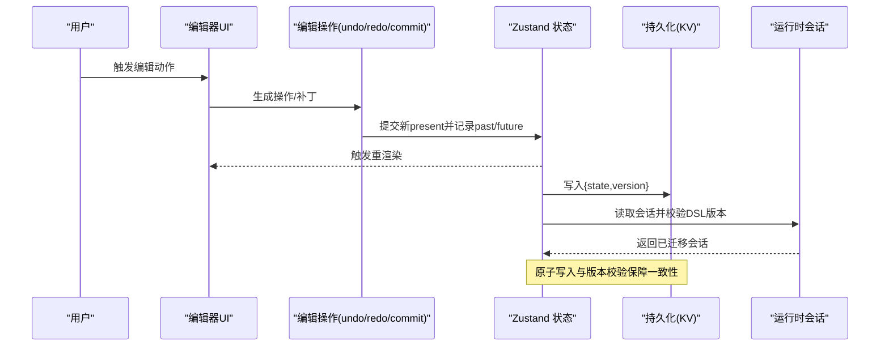
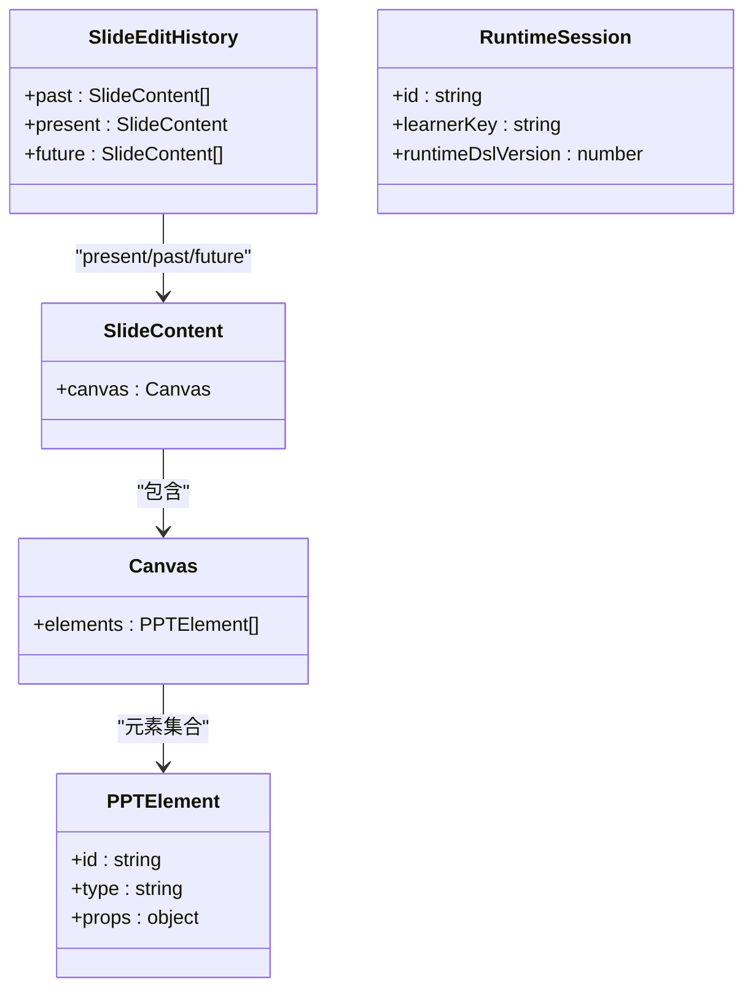
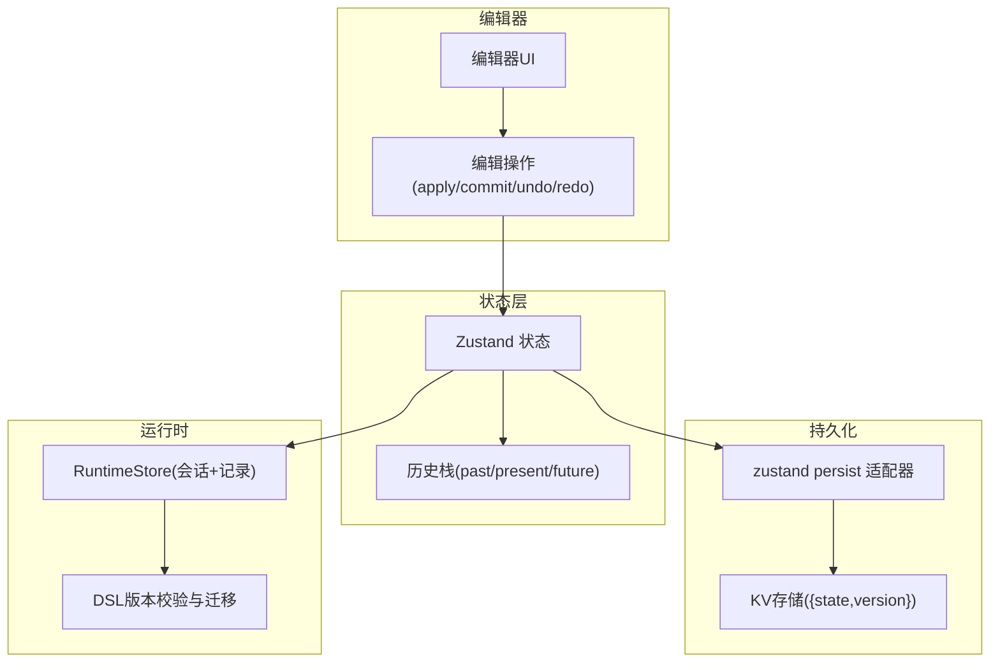
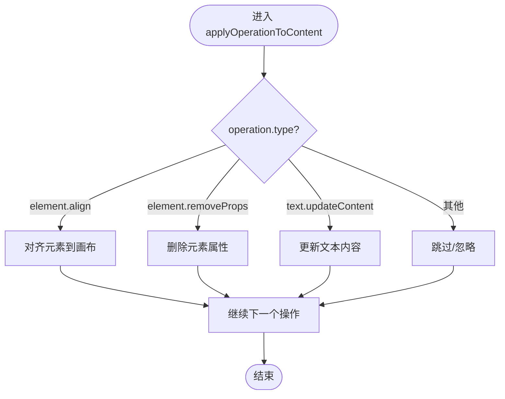
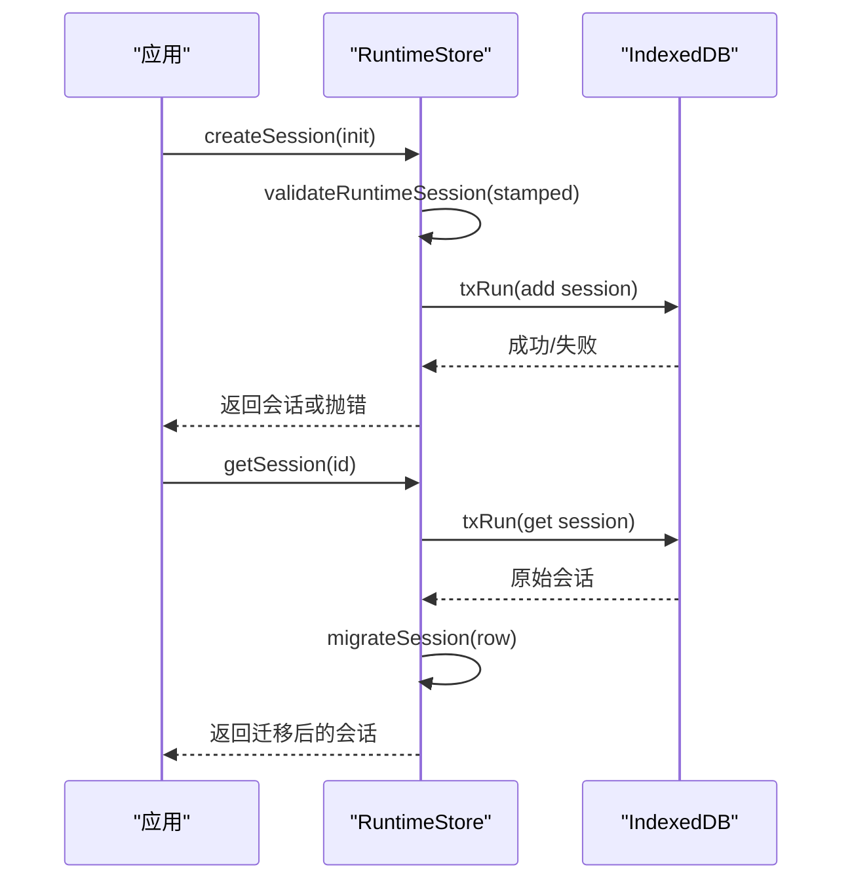
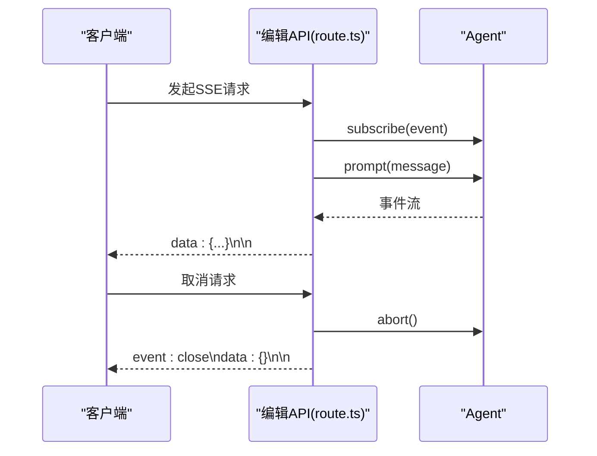
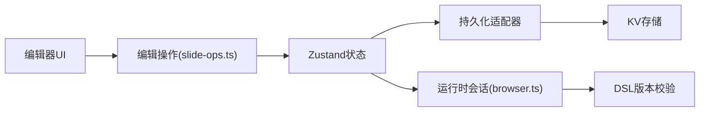

# 编辑状态管理

<cite>
**本文引用的文件**   
- [slide-ops.ts](file://lib/edit/slide-ops.ts)
- [editing-state.ts](file://components/edit/surfaces/slide/editing-state.ts)
- [edit-tool-state.ts](file://components/edit/AgentPanel/edit-tool-state.ts)
- [route.ts](file://app/api/agent/edit/route.ts)
- [browser.ts](file://packages/@openmaic/storage/src/runtime/browser.ts)
- [persist-adapter.test.ts](file://packages/@openmaic/storage/test/persist-adapter.test.ts)
- [scene-edit-bridge.test.ts](file://tests/edit/scene-edit-bridge.test.ts)
</cite>

## 产品概述
本文件聚焦 OpenMAIC 的“编辑状态管理”，围绕编辑会话中的元素状态、选择状态与操作状态的统一建模，阐述状态持久化、版本控制与冲突解决策略；解释撤销/重做系统的实现（历史栈、快照与增量更新）；说明状态监听、事件订阅与跨组件通信机制；并覆盖并发编辑、实时协作与乐观更新的实践方案。同时给出状态验证、数据迁移与性能优化建议，帮助读者在复杂编辑场景中构建稳定、可维护的状态系统。

## 核心业务流程
- 用户交互触发编辑操作（如拖拽、缩放、文本输入），由编辑器层生成最小化的操作意图或补丁。
- 操作经“提交”流程合并为新的 present 状态，并推入 past 历史栈；future 栈在新提交后清空，保证撤销/重做一致性。
- 状态变更通过 Zustand 订阅与 React Hook 驱动 UI 更新；必要时通过 SSE 将 AI 编辑结果流式推送至前端。
- 持久化层以 KV 形式保存 { state, version } 信封，支持按作用域隔离（account/device）与读写原子性。
- 运行时会话携带 DSL 版本戳，读取时进行迁移校验，确保跨版本兼容。

**章节来源**
- [slide-ops.ts:126-308](file://lib/edit/slide-ops.ts#L126-L308)
- [persist-adapter.test.ts:13-41](file://packages/@openmaic/storage/test/persist-adapter.test.ts#L13-L41)
- [browser.ts:220-246](file://packages/@openmaic/storage/src/runtime/browser.ts#L220-L246)

## 功能模块清单
- 幻灯片编辑操作与历史管理
  - 职责：定义操作类型、应用操作到草稿、提交合并、撤销/重做、历史长度限制。
  - 验收要点：多元素批量提交仅产生一次撤销步；无变化提交为幂等；新提交清除 future 栈。
- 编辑工具状态（Agent Panel）
  - 职责：管理工具面板的交互状态（选中工具、参数、预览等），与编辑会话解耦。
  - 验收要点：状态变更不污染全局编辑历史；与工具卡片联动正确。
- 运行时存储与会话
  - 职责：会话创建、读取、事务性写入、版本戳与迁移校验。
  - 验收要点：重复创建报错；读取自动迁移；payload 校验失败拒绝写入。
- 持久化适配器（KV + zustand persist）
  - 职责：提供 getItem/setItem/removeItem 能力，支持作用域隔离与默认 account。
  - 验收要点：未写入键返回 null；round-trip 保持 {state,version}；作用域隔离有效。
- 实时编辑流（SSE）
  - 职责：服务端流式推送编辑事件，客户端订阅并应用。
  - 验收要点：连接关闭与取消处理；事件序列化与错误日志。

**章节来源**
- [slide-ops.ts:126-308](file://lib/edit/slide-ops.ts#L126-L308)
- [scene-edit-bridge.test.ts:153-190](file://tests/edit/scene-edit-bridge.test.ts#L153-L190)
- [edit-tool-state.ts](file://components/edit/AgentPanel/edit-tool-state.ts)
- [browser.ts:184-246](file://packages/@openmaic/storage/src/runtime/browser.ts#L184-L246)
- [persist-adapter.test.ts:1-41](file://packages/@openmaic/storage/test/persist-adapter.test.ts#L1-L41)
- [route.ts:169-210](file://app/api/agent/edit/route.ts#L169-L210)

## 数据与状态
- 核心数据模型
  - SlideEditHistory：包含 past、present、future 三段结构，用于撤销/重做。
  - SlideContent：当前幻灯片内容（canvas.elements 等）。
  - PPTElement：元素对象（文本、图片、形状等），支持属性级更新。
  - RuntimeSession：运行时会话，携带 runtimeDslVersion 与 learnerKey 等元信息。
  - KV 持久化信封：{ state, version }，version 用于向前/向后兼容。
- 关键状态流转
  - 提交：commitSlideEdit(history, next) 合并差异，若不变则返回原 history；否则追加 past，清空 future。
  - 撤销：undoSlideEditOperation(history) 从 past 弹出 present，并将旧 present 推入 future。
  - 重做：redoSlideEditOperation(history) 从 future 取下一状态，回写 present 并裁剪 past。
  - 应用操作：applyOperationToContent(draft, operation) 根据 operation.type 对元素执行增删改。
- 数据所有权边界
  - 编辑器层持有 present 与历史栈；持久化层负责 {state,version} 的存取；运行时层负责会话与事件记录。
  - 工具面板状态与编辑历史分离，避免互相污染。

**图表来源**
- [slide-ops.ts:126-308](file://lib/edit/slide-ops.ts#L126-L308)
- [browser.ts:220-246](file://packages/@openmaic/storage/src/runtime/browser.ts#L220-L246)

**章节来源**
- [slide-ops.ts:126-308](file://lib/edit/slide-ops.ts#L126-L308)
- [scene-edit-bridge.test.ts:153-190](file://tests/edit/scene-edit-bridge.test.ts#L153-L190)

## 关键约束与边界
- 非功能性需求
  - 撤销/重做历史长度上限（MAX_HISTORY）防止内存膨胀。
  - 提交幂等：相同 present 不产生新历史。
  - 原子写入：事务失败不改变任何 store 状态。
- 依赖与集成边界
  - Zustand 作为状态容器，配合持久化适配器完成本地持久化。
  - 运行时会话需通过 DSL 版本校验与迁移，避免数据结构不一致。
- 业务约束
  - 多元素批量编辑应合并为单一撤销步，提升用户体验。
  - 新提交必须清理 future 栈，保证撤销/重做路径唯一。
- 并发与协作
  - 使用事务与锁（如 withRuntimeStorageExclusiveLock）避免竞态。
  - 乐观更新结合冲突检测：当远端变更与本地不一致时，提示合并或回滚。
- 性能优化
  - 结构化克隆（structuredClone）与最小化补丁减少深拷贝开销。
  - 选择性订阅（useSelector）避免无关组件重渲染。
  - 节流/防抖高频输入（如文本输入）降低状态更新频率。

**章节来源**
- [slide-ops.ts:294-308](file://lib/edit/slide-ops.ts#L294-L308)
- [browser.ts:184-213](file://packages/@openmaic/storage/src/runtime/browser.ts#L184-L213)
- [persist-adapter.test.ts:13-41](file://packages/@openmaic/storage/test/persist-adapter.test.ts#L13-L41)

## 架构总览
编辑状态管理由“编辑器操作层 + 状态容器 + 持久化 + 运行时会话”构成，形成清晰的分层与职责边界。

**图表来源**
- [slide-ops.ts:126-308](file://lib/edit/slide-ops.ts#L126-L308)
- [persist-adapter.test.ts:13-41](file://packages/@openmaic/storage/test/persist-adapter.test.ts#L13-L41)
- [browser.ts:220-246](file://packages/@openmaic/storage/src/runtime/browser.ts#L220-L246)

## 详细组件分析

### 幻灯片编辑操作与历史管理（slide-ops.ts）
- 设计模式
  - 操作分发：基于 operation.type 的 switch-case 分支，分别处理对齐、属性删除、文本内容更新等。
  - 不可变更新：draft 副本上修改，最终 commit 合并为新 present。
- 复杂度与优化
  - 应用操作时间复杂度 O(n)（n 为元素数量），可通过索引或增量补丁进一步优化。
  - 历史裁剪 capHistory 限制 past 长度，避免内存增长。
- 错误处理
  - 元素不存在或类型不匹配时跳过更新，保证健壮性。
- 撤销/重做
  - undo/redo 严格维护 past/present/future 三栈关系，提交新 present 时清空 future。

**图表来源**
- [slide-ops.ts:272-291](file://lib/edit/slide-ops.ts#L272-L291)

**章节来源**
- [slide-ops.ts:126-308](file://lib/edit/slide-ops.ts#L126-L308)

### 编辑工具状态（edit-tool-state.ts）
- 职责
  - 管理 Agent 面板的工具状态（选中工具、参数、预览、交互反馈）。
  - 与编辑历史解耦，避免工具状态污染撤销/重做栈。
- 关键点
  - 工具状态变更应触发局部重渲染，不影响全局编辑状态。
  - 与工具卡片（tool-card.tsx）双向绑定，确保 UI 与状态一致。

**章节来源**
- [edit-tool-state.ts](file://components/edit/AgentPanel/edit-tool-state.ts)

### 运行时存储与会话（browser.ts）
- 事务性写入
  - txRun 封装 IDBTransaction，确保失败时回滚，避免部分写入。
- 会话创建与校验
  - createSession 在写入前校验 payload，重复创建抛出确定性错误。
- 读取与迁移
  - getSession 读取后调用 migrateSession 进行版本迁移，保证兼容性。

**图表来源**
- [browser.ts:184-246](file://packages/@openmaic/storage/src/runtime/browser.ts#L184-L246)

**章节来源**
- [browser.ts:184-246](file://packages/@openmaic/storage/src/runtime/browser.ts#L184-L246)

### 持久化适配器（persist-adapter.test.ts）
- 行为契约
  - getItem 未写入返回 null。
  - setItem 写入 {state,version} 信封，round-trip 保持一致。
  - removeItem 清空对应键。
  - 作用域隔离：device/account 命名空间独立。
- 适用场景
  - 作为 Zustand 的 persist 适配器，实现本地持久化与版本管理。

**章节来源**
- [persist-adapter.test.ts:1-41](file://packages/@openmaic/storage/test/persist-adapter.test.ts#L1-L41)

### 实时编辑流（route.ts）
- SSE 推送
  - 服务端通过 ReadableStream 推送 Agent 编辑事件，客户端订阅并应用。
- 生命周期
  - start 阶段建立订阅与发送；cancel 阶段中止代理与控制器。
- 错误处理
  - 捕获异常并记录日志，确保连接稳定关闭。

**图表来源**
- [route.ts:169-210](file://app/api/agent/edit/route.ts#L169-L210)

**章节来源**
- [route.ts:169-210](file://app/api/agent/edit/route.ts#L169-L210)

## 依赖分析
- 组件耦合
  - 编辑器操作层依赖 Zustand 状态容器；持久化适配器依赖 KV 存储；运行时依赖 DSL 版本校验。
- 外部依赖
  - IndexedDB（浏览器后端）、SSE（实时推送）、Zustand（状态管理）。
- 潜在循环依赖
  - 工具状态与编辑历史分离，避免循环引用。
- 接口契约
  - RuntimeStore 的 createSession/getSession 与 KV 适配器的 getItem/setItem/removeItem 有明确契约。

**图表来源**
- [slide-ops.ts:126-308](file://lib/edit/slide-ops.ts#L126-L308)
- [persist-adapter.test.ts:13-41](file://packages/@openmaic/storage/test/persist-adapter.test.ts#L13-L41)
- [browser.ts:220-246](file://packages/@openmaic/storage/src/runtime/browser.ts#L220-L246)

**章节来源**
- [slide-ops.ts:126-308](file://lib/edit/slide-ops.ts#L126-L308)
- [persist-adapter.test.ts:13-41](file://packages/@openmaic/storage/test/persist-adapter.test.ts#L13-L41)
- [browser.ts:220-246](file://packages/@openmaic/storage/src/runtime/browser.ts#L220-L246)

## 性能考虑
- 历史栈裁剪：capHistory 限制 past 长度，避免内存泄漏。
- 结构化克隆：structuredClone 替代 JSON.parse/stringify，提升性能与安全性。
- 选择性订阅：useSelector 精确订阅所需字段，减少重渲染。
- 批量提交：多元素编辑合并为单次提交，减少历史步数与渲染次数。
- 节流/防抖：高频输入（如文本编辑）采用节流策略，降低状态更新频率。

[本节为通用指导，无需特定文件来源]

## 故障排查指南
- 撤销/重做异常
  - 检查 commit 是否幂等（相同 present 不应新增历史）。
  - 确认 future 栈在新提交后是否被清空。
- 持久化失败
  - 查看 KV 适配器是否正确实现 getItem/setItem/removeItem。
  - 检查作用域隔离是否导致读取不到数据。
- 运行时会话问题
  - 校验 DSL 版本是否匹配；迁移函数是否正确处理旧版本。
  - 事务失败是否导致未写入或部分写入。
- 实时编辑流中断
  - 检查 SSE 连接是否被意外关闭；客户端是否正确处理 cancel。

**章节来源**
- [scene-edit-bridge.test.ts:153-190](file://tests/edit/scene-edit-bridge.test.ts#L153-L190)
- [persist-adapter.test.ts:1-41](file://packages/@openmaic/storage/test/persist-adapter.test.ts#L1-L41)
- [browser.ts:184-246](file://packages/@openmaic/storage/src/runtime/browser.ts#L184-L246)
- [route.ts:169-210](file://app/api/agent/edit/route.ts#L169-L210)

## 结论
OpenMAIC 的编辑状态管理通过清晰的分层与严格的契约，实现了元素状态、选择状态与操作状态的统一管理。借助历史栈、快照与增量更新，提供了健壮的撤销/重做能力；通过 KV 持久化与运行时会话的版本校验，保障了数据一致性与兼容性。结合 SSE 实时推送与事务性写入，系统在并发与协作场景下具备良好稳定性。未来可进一步引入更细粒度的增量补丁与冲突合并策略，以提升大规模协作编辑的性能与体验。