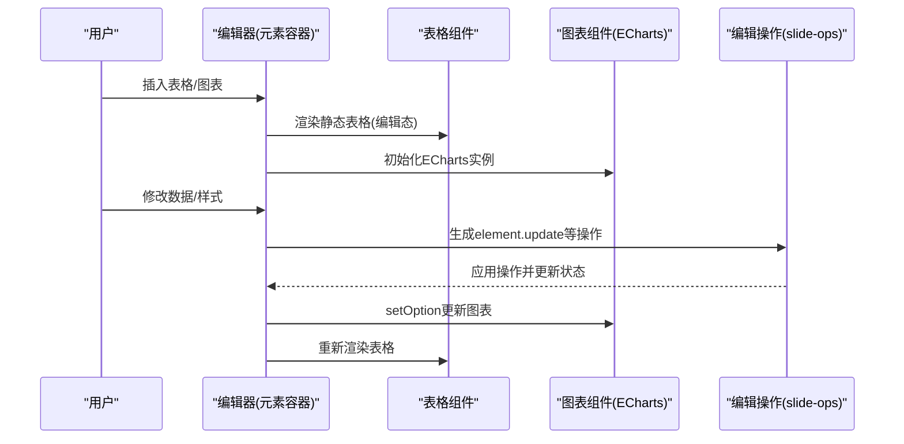
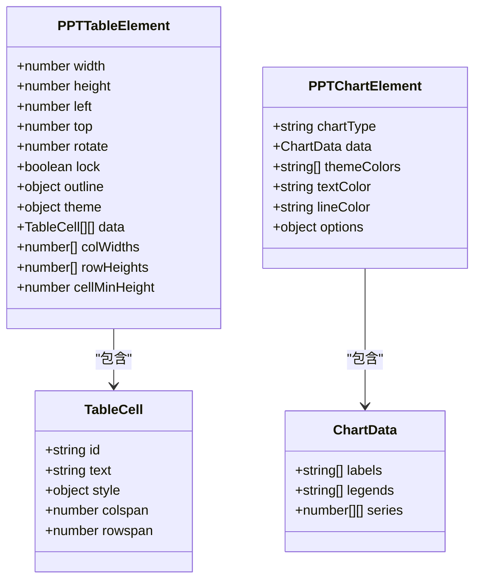
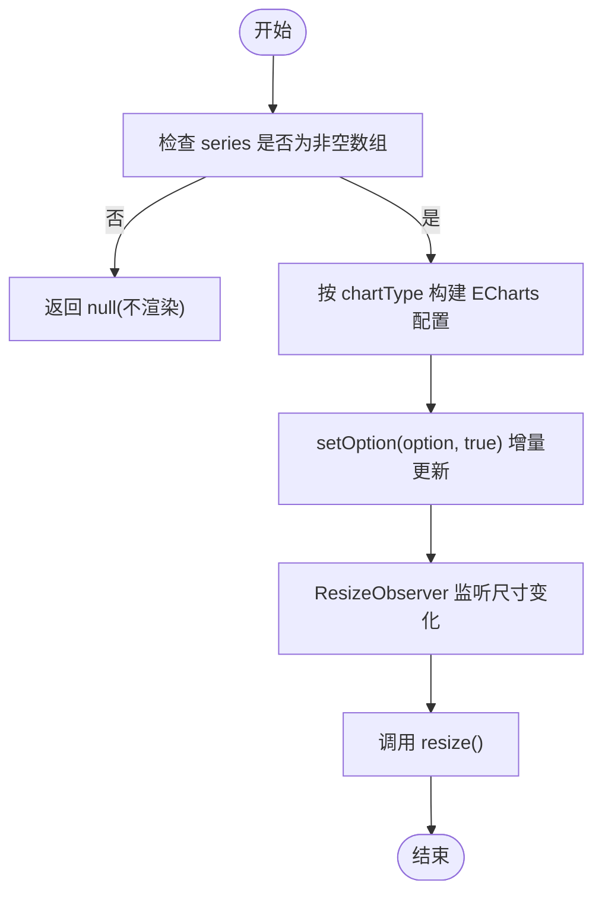
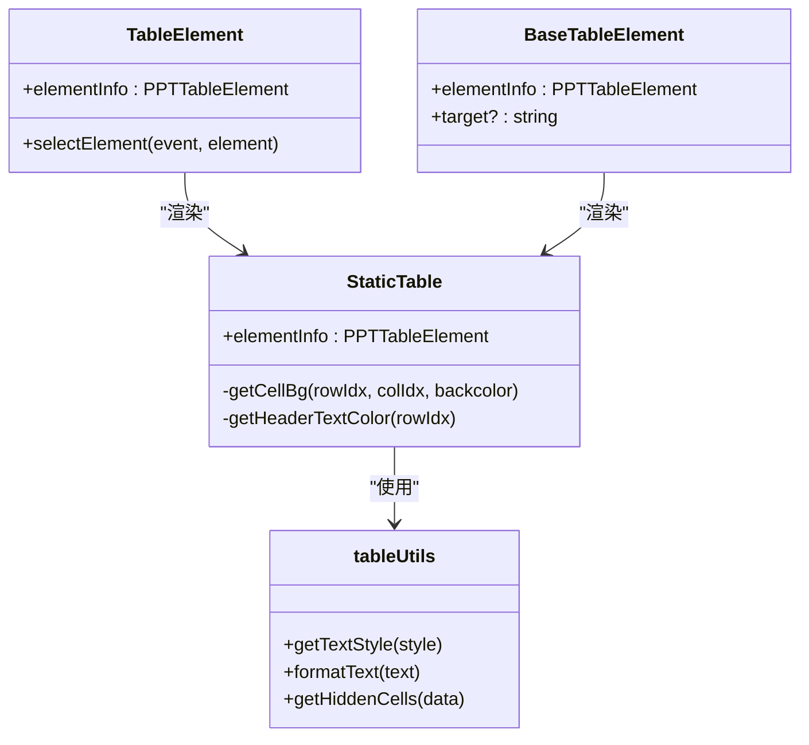
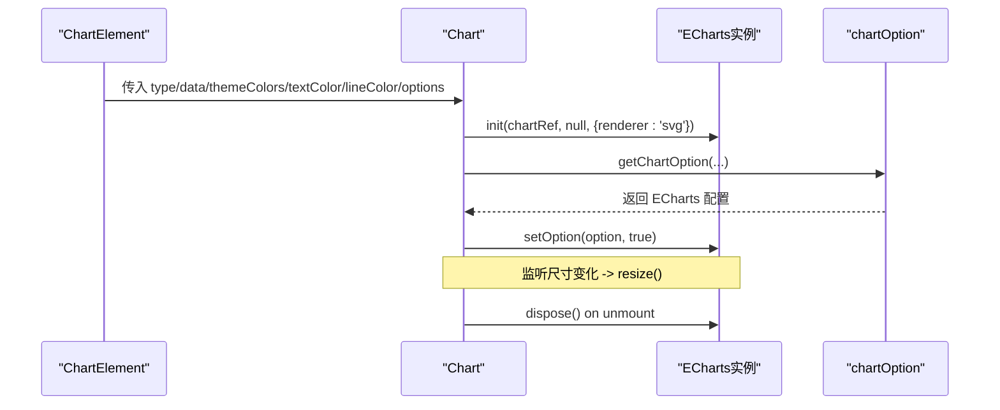
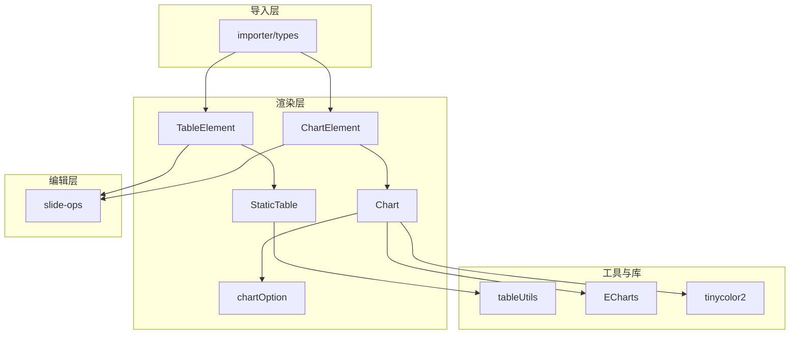

# 表格与图表

<cite>
**本文引用的文件**   
- [components/slide-renderer/components/element/TableElement/index.tsx](file://components/slide-renderer/components/element/TableElement/index.tsx)
- [components/slide-renderer/components/element/TableElement/StaticTable.tsx](file://components/slide-renderer/components/element/TableElement/StaticTable.tsx)
- [components/slide-renderer/components/element/TableElement/tableUtils.ts](file://components/slide-renderer/components/element/TableElement/tableUtils.ts)
- [components/slide-renderer/components/element/TableElement/BaseTableElement.tsx](file://components/slide-renderer/components/element/TableElement/BaseTableElement.tsx)
- [components/slide-renderer/components/element/ChartElement/index.tsx](file://components/slide-renderer/components/element/ChartElement/index.tsx)
- [components/slide-renderer/components/element/ChartElement/Chart.tsx](file://components/slide-renderer/components/element/ChartElement/Chart.tsx)
- [components/slide-renderer/components/element/ChartElement/chartOption.ts](file://components/slide-renderer/components/element/ChartElement/chartOption.ts)
- [components/slide-renderer/components/element/ChartElement/BaseChartElement.tsx](file://components/slide-renderer/components/element/ChartElement/BaseChartElement.tsx)
- [packages/@openmaic/importer/src/adapter/types.ts](file://packages/@openmaic/importer/src/adapter/types.ts)
- [lib/edit/slide-ops.ts](file://lib/edit/slide-ops.ts)
- [tests/lib/agent/tools/edit-elements-gate.test.ts](file://tests/lib/agent/tools/edit-elements-gate.test.ts)
</cite>

## 产品概述
本模块提供课件中的“表格”和“图表”两大可视化能力。表格用于结构化展示数据，支持主题配色、边框样式、行列尺寸控制以及单元格合并；图表基于 ECharts 实现，支持柱状图、折线图、饼图、环形图、面积图和雷达图等类型，具备主题色生成、文本与线条颜色定制、堆叠与平滑线等配置项，并支持响应式缩放与动画效果。两者均遵循统一的元素模型（位置、尺寸、旋转、锁定、描边、填充），在编辑模式与只读/回放模式下分别渲染。

## 核心业务流程
- 插入与渲染
  - 编辑器中插入表格或图表元素后，进入编辑态：表格通过静态渲染组件输出，图表通过 ECharts 实例渲染。
  - 只读/回放模式使用 Base* 组件渲染，禁用交互事件，提升性能。
- 数据绑定与更新
  - 图表根据 props（类型、数据、主题色、文本/线条颜色、选项）计算 ECharts 配置，并在属性变化时自动更新。
  - 表格根据 data、colWidths、rowHeights、theme、outline 等属性进行布局与样式渲染。
- 编辑操作与状态管理
  - 统一通过 slide-ops 的 element.update / element.add / element.delete / element.reorder 等操作驱动内容变更，支持撤销/重做。
- 导入导出
  - 导入阶段将 PPTX 中的表格与图表转换为内部 DSL 结构；导出阶段由上层导出器处理（本仓库未包含具体导出实现）。

**章节来源**
- [components/slide-renderer/components/element/TableElement/index.tsx](file://components/slide-renderer/components/element/TableElement/index.tsx)
- [components/slide-renderer/components/element/ChartElement/index.tsx](file://components/slide-renderer/components/element/ChartElement/index.tsx)
- [lib/edit/slide-ops.ts](file://lib/edit/slide-ops.ts)

## 功能模块清单
- 表格模块
  - 职责：渲染表格数据、主题背景、边框样式、行列尺寸、单元格合并与隐藏。
  - 用户价值：快速呈现结构化数据，保持与主题一致的外观。
  - 验收要点：合并单元格显示正确；行高列宽生效；主题头尾行背景与文字颜色符合预期；隐藏单元格不渲染。
- 图表模块
  - 职责：根据类型生成 ECharts 配置，渲染柱状/折线/饼/环/面积/雷达等图表，支持主题色、文本/线条颜色、堆叠、平滑线。
  - 用户价值：直观表达趋势与对比，支持多种可视化形态。
  - 验收要点：多系列 legend 显示；空数据返回 null 不崩溃；resize 自适应；动画与交互默认可用。
- 基础/只读模式
  - 职责：Base* 组件用于回放/缩略图场景，禁用交互以提升性能。
  - 验收要点：与编辑态视觉一致，无鼠标事件。
- 导入适配
  - 职责：将外部文档（如 PPTX）中的表格与图表映射为内部 DSL 结构。
  - 验收要点：字段映射完整，兼容缺失字段。

**章节来源**
- [components/slide-renderer/components/element/TableElement/StaticTable.tsx](file://components/slide-renderer/components/element/TableElement/StaticTable.tsx)
- [components/slide-renderer/components/element/ChartElement/Chart.tsx](file://components/slide-renderer/components/element/ChartElement/Chart.tsx)
- [components/slide-renderer/components/element/TableElement/BaseTableElement.tsx](file://components/slide-renderer/components/element/TableElement/BaseTableElement.tsx)
- [components/slide-renderer/components/element/ChartElement/BaseChartElement.tsx](file://components/slide-renderer/components/element/ChartElement/BaseChartElement.tsx)
- [packages/@openmaic/importer/src/adapter/types.ts](file://packages/@openmaic/importer/src/adapter/types.ts)

## 数据与状态
- 表格数据模型
  - 元素级：width、height、left、top、rotate、lock、outline、theme、data、colWidths、rowHeights、cellMinHeight。
  - 单元格级：id、text、style（字体、颜色、背景）、colspan、rowspan。
  - 工具函数：getTextStyle、formatText、getHiddenCells。
- 图表数据模型
  - 元素级：chartType、data（labels、legends、series[]）、themeColors、textColor、lineColor、options（lineSmooth、stack 等）。
  - ECharts 配置生成：按 chartType 分支构造 xAxis/yAxis/legend/series 等。
- 状态流转
  - 编辑操作通过 slide-ops 的 element.update/updateMany/add/delete/reorder/duplicate 等类型驱动，保证可撤销/重做。
  - 图表组件在 props 变化时调用 setOption(true) 增量更新；ResizeObserver 监听容器尺寸变化触发 resize。

**图示来源**
- [components/slide-renderer/components/element/TableElement/StaticTable.tsx](file://components/slide-renderer/components/element/TableElement/StaticTable.tsx)
- [components/slide-renderer/components/element/ChartElement/Chart.tsx](file://components/slide-renderer/components/element/ChartElement/Chart.tsx)
- [components/slide-renderer/components/element/ChartElement/chartOption.ts](file://components/slide-renderer/components/element/ChartElement/chartOption.ts)

**章节来源**
- [components/slide-renderer/components/element/TableElement/tableUtils.ts](file://components/slide-renderer/components/element/TableElement/tableUtils.ts)
- [components/slide-renderer/components/element/ChartElement/chartOption.ts](file://components/slide-renderer/components/element/ChartElement/chartOption.ts)
- [lib/edit/slide-ops.ts](file://lib/edit/slide-ops.ts)

## 关键约束与边界
- 表格
  - 当前为静态渲染，不支持单元格内联编辑（与图表保持一致的 display-only 模式）。
  - 合并单元格通过 colspan/rowspan 计算隐藏位置，避免重复渲染。
  - 主题背景与头尾行样式受 theme 控制；outline 仅支持 solid/dashed 两种风格。
- 图表
  - 支持的类型：bar、column、line、pie、ring、area、radar、scatter。
  - 当 series 为空或非法时，配置生成返回 null，避免无效渲染。
  - radar 类型存在上游限制（indicator max 缺失导致显示问题），当前以规避方式处理。
  - 主题色生成策略：若输入少于10个颜色，则基于最后一个颜色生成类似色扩展至所需数量。
- 编辑能力
  - 通过 element.update/updateMany 批量更新元素属性；删除/重排/复制均有对应操作类型。
  - 测试用例对表格/图表的属性能力做了边界校验（如 themeColors 非空、outline 风格限制等）。
- 性能与交互
  - 图表使用 SVG 渲染，ResizeObserver 监听尺寸变化；组件卸载时释放实例。
  - 只读模式禁用指针事件，适合缩略图与回放。

**图示来源**
- [components/slide-renderer/components/element/ChartElement/chartOption.ts](file://components/slide-renderer/components/element/ChartElement/chartOption.ts)
- [components/slide-renderer/components/element/ChartElement/Chart.tsx](file://components/slide-renderer/components/element/ChartElement/Chart.tsx)

**章节来源**
- [tests/lib/agent/tools/edit-elements-gate.test.ts](file://tests/lib/agent/tools/edit-elements-gate.test.ts)
- [components/slide-renderer/components/element/ChartElement/chartOption.ts](file://components/slide-renderer/components/element/ChartElement/chartOption.ts)
- [components/slide-renderer/components/element/ChartElement/Chart.tsx](file://components/slide-renderer/components/element/ChartElement/Chart.tsx)

## 详细组件分析

### 表格组件分析
- 编辑态组件
  - 负责定位、旋转、选择事件转发给父容器；内部渲染 StaticTable。
- 静态表格渲染
  - 计算隐藏单元格集合，应用主题背景与头尾行样式；根据 outline 设置边框样式；支持 colspan/rowspan 合并。
- 只读/回放模式
  - BaseTableElement 禁用交互，复用 StaticTable 渲染。

**图示来源**
- [components/slide-renderer/components/element/TableElement/index.tsx](file://components/slide-renderer/components/element/TableElement/index.tsx)
- [components/slide-renderer/components/element/TableElement/StaticTable.tsx](file://components/slide-renderer/components/element/TableElement/StaticTable.tsx)
- [components/slide-renderer/components/element/TableElement/tableUtils.ts](file://components/slide-renderer/components/element/TableElement/tableUtils.ts)
- [components/slide-renderer/components/element/TableElement/BaseTableElement.tsx](file://components/slide-renderer/components/element/TableElement/BaseTableElement.tsx)

**章节来源**
- [components/slide-renderer/components/element/TableElement/index.tsx](file://components/slide-renderer/components/element/TableElement/index.tsx)
- [components/slide-renderer/components/element/TableElement/StaticTable.tsx](file://components/slide-renderer/components/element/TableElement/StaticTable.tsx)
- [components/slide-renderer/components/element/TableElement/tableUtils.ts](file://components/slide-renderer/components/element/TableElement/tableUtils.ts)
- [components/slide-renderer/components/element/TableElement/BaseTableElement.tsx](file://components/slide-renderer/components/element/TableElement/BaseTableElement.tsx)

### 图表组件分析
- 编辑态组件
  - 负责定位、旋转、选择事件；包裹 ElementOutline 与 Chart。
- 图表渲染
  - 使用 ECharts 初始化实例，注册 Bar/Line/Pie/Scatter/Radar 及 Legend/SVGRenderer。
  - 根据 props 生成主题色与配置，props 变化时调用 setOption(true) 更新。
  - 使用 ResizeObserver 监听容器尺寸变化，自动 resize。
- 只读/回放模式
  - BaseChartElement 禁用交互，复用 Chart 渲染。

**图示来源**
- [components/slide-renderer/components/element/ChartElement/index.tsx](file://components/slide-renderer/components/element/ChartElement/index.tsx)
- [components/slide-renderer/components/element/ChartElement/Chart.tsx](file://components/slide-renderer/components/element/ChartElement/Chart.tsx)
- [components/slide-renderer/components/element/ChartElement/chartOption.ts](file://components/slide-renderer/components/element/ChartElement/chartOption.ts)
- [components/slide-renderer/components/element/ChartElement/BaseChartElement.tsx](file://components/slide-renderer/components/element/ChartElement/BaseChartElement.tsx)

**章节来源**
- [components/slide-renderer/components/element/ChartElement/index.tsx](file://components/slide-renderer/components/element/ChartElement/index.tsx)
- [components/slide-renderer/components/element/ChartElement/Chart.tsx](file://components/slide-renderer/components/element/ChartElement/Chart.tsx)
- [components/slide-renderer/components/element/ChartElement/chartOption.ts](file://components/slide-renderer/components/element/ChartElement/chartOption.ts)
- [components/slide-renderer/components/element/ChartElement/BaseChartElement.tsx](file://components/slide-renderer/components/element/ChartElement/BaseChartElement.tsx)

## 依赖分析
- 组件耦合
  - TableElement 与 StaticTable 强耦合，tableUtils 提供纯函数工具。
  - ChartElement 与 Chart 强耦合，chartOption 提供配置生成逻辑。
- 外部依赖
  - ECharts（Bar/Line/Pie/Scatter/Radar/Legend/SVGRenderer）。
  - tinycolor2（主题色衍生）。
- 编辑层依赖
  - slide-ops 提供统一的操作类型与撤销/重做机制。
- 导入层依赖
  - importer 的 types 定义表格与图表的 DSL 结构，供上层转换使用。

**图示来源**
- [components/slide-renderer/components/element/TableElement/index.tsx](file://components/slide-renderer/components/element/TableElement/index.tsx)
- [components/slide-renderer/components/element/TableElement/StaticTable.tsx](file://components/slide-renderer/components/element/TableElement/StaticTable.tsx)
- [components/slide-renderer/components/element/TableElement/tableUtils.ts](file://components/slide-renderer/components/element/TableElement/tableUtils.ts)
- [components/slide-renderer/components/element/ChartElement/index.tsx](file://components/slide-renderer/components/element/ChartElement/index.tsx)
- [components/slide-renderer/components/element/ChartElement/Chart.tsx](file://components/slide-renderer/components/element/ChartElement/Chart.tsx)
- [components/slide-renderer/components/element/ChartElement/chartOption.ts](file://components/slide-renderer/components/element/ChartElement/chartOption.ts)
- [lib/edit/slide-ops.ts](file://lib/edit/slide-ops.ts)
- [packages/@openmaic/importer/src/adapter/types.ts](file://packages/@openmaic/importer/src/adapter/types.ts)

**章节来源**
- [lib/edit/slide-ops.ts](file://lib/edit/slide-ops.ts)
- [packages/@openmaic/importer/src/adapter/types.ts](file://packages/@openmaic/importer/src/adapter/types.ts)

## 性能考虑
- 表格渲染为纯 DOM 表格，复杂度主要取决于单元格数量与合并计算；getHiddenCells 使用 Set 去重，时间复杂度近似 O(N×M)。
- 图表渲染使用 ECharts SVG 渲染器，避免 Canvas 重绘开销；ResizeObserver 仅在尺寸变化时触发 resize。
- 组件卸载时主动 dispose ECharts 实例，防止内存泄漏。
- 只读模式禁用指针事件，降低交互成本。

[本节为通用指导，不直接分析具体文件]

## 故障排查指南
- 图表不显示
  - 检查 data.series 是否为非空数组；为空将返回 null 不渲染。
  - 确认 chartType 属于支持列表；否则配置生成返回 null。
- 主题色异常
  - 若 themeColors 长度不足，系统会基于最后一个颜色生成类似色；确保输入至少一个颜色。
- 表格合并错位
  - 检查单元格的 colspan/rowspan 是否合理；getHiddenCells 会标记应隐藏的单元格，确保数据一致性。
- 编辑操作无效
  - 确认通过 slide-ops 的 element.update/updateMany 等类型更新；删除/重排需匹配元素 id。
- 能力校验失败
  - 测试用例覆盖了 outline 风格、themeColors 非空等约束；若被拒绝，检查属性是否符合渲染能力。

**章节来源**
- [components/slide-renderer/components/element/ChartElement/chartOption.ts](file://components/slide-renderer/components/element/ChartElement/chartOption.ts)
- [components/slide-renderer/components/element/TableElement/tableUtils.ts](file://components/slide-renderer/components/element/TableElement/tableUtils.ts)
- [lib/edit/slide-ops.ts](file://lib/edit/slide-ops.ts)
- [tests/lib/agent/tools/edit-elements-gate.test.ts](file://tests/lib/agent/tools/edit-elements-gate.test.ts)

## 结论
表格与图表模块在编辑与只读模式下提供了稳定一致的渲染体验。表格侧重结构化数据的主题化展示与合并能力；图表基于 ECharts 实现丰富的可视化类型与动态更新。通过统一的元素模型与编辑操作体系，保证了可扩展性与可维护性。未来可在表格编辑、公式计算、数据验证、导出等方面进一步增强。