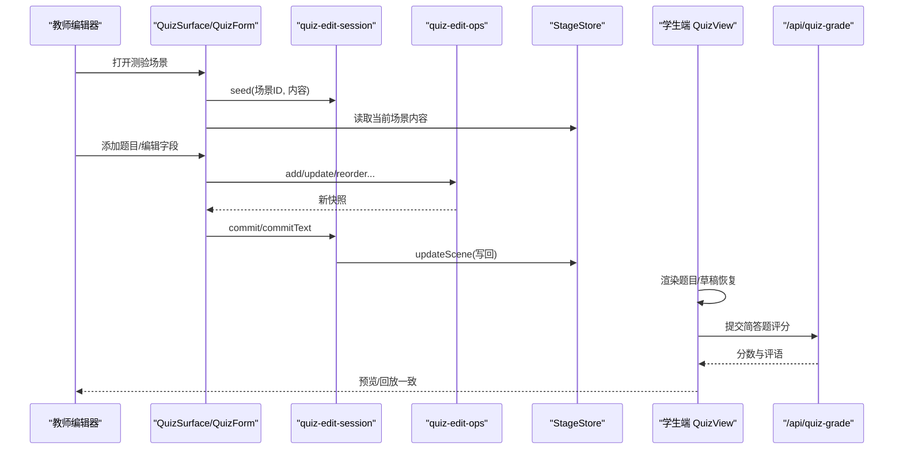
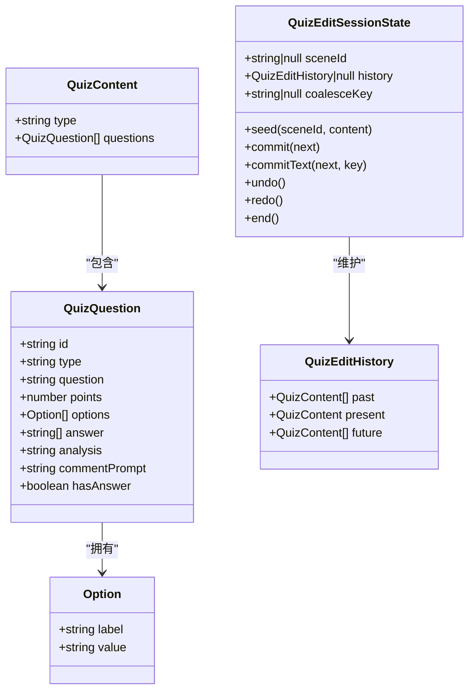

# 测验编辑器

<cite>
**本文引用的文件**   
- [QuizSurface.tsx](file://components/edit/surfaces/quiz/QuizSurface.tsx)
- [QuizForm.tsx](file://components/edit/surfaces/quiz/QuizForm.tsx)
- [use-quiz-surface.ts](file://components/edit/surfaces/quiz/use-quiz-surface.ts)
- [QuestionCard.tsx](file://components/edit/surfaces/quiz/QuestionCard.tsx)
- [AddQuestionMenu.tsx](file://components/edit/surfaces/quiz/AddQuestionMenu.tsx)
- [quiz-edit-ops.ts](file://components/edit/surfaces/quiz/quiz-edit-ops.ts)
- [quiz-edit-session.ts](file://components/edit/surfaces/quiz/quiz-edit-session.ts)
- [stage.ts](file://lib/types/stage.ts)
- [quiz-renderer.tsx](file://components/scene-renderers/quiz-renderer.tsx)
- [quiz-view.tsx](file://components/scene-renderers/quiz-view.tsx)
</cite>

## 产品概述
本文件面向教师与开发者，系统化说明 OpenMAIC 中的“测验编辑器”：从编辑界面、交互逻辑到评分规则与预览机制。该编辑器以结构化表单形式呈现，支持选择题（单选/多选）、填空题（简答）三类题型；提供题目创建、选项配置、答案设置、分值与评分提示配置、拖拽排序、撤销/重做、实时校验与提示、以及学生端答题与 AI 评分的完整链路。

## 核心业务流程
- 编辑流程
  - 进入测验场景后，编辑器加载当前场景内容或空模板，进入会话模式（可撤销/重做）。
  - 通过“添加题目”菜单选择题型并插入空白题目；在卡片中展开编辑题干、题型、分值、选项与解析等。
  - 对选择题进行选项增删改、上下移动、标记正确答案；简答题可配置评论提示用于 AI 评分。
  - 所有变更即时写入持久化存储，同时维护本地历史栈供撤销/重做。
- 预览与作答流程
  - 学生端渲染器展示题目，支持单选、多选与简答输入，草稿自动缓存。
  - 提交后，选择题本地判分，简答题调用服务端 AI 评分接口，合并结果进入回顾模式。
  - 回顾模式显示得分、正确/错误状态、AI 评语与解析。

**图表来源** 
- [QuizSurface.tsx:1-19](file://components/edit/surfaces/quiz/QuizSurface.tsx#L1-L19)
- [QuizForm.tsx:1-130](file://components/edit/surfaces/quiz/QuizForm.tsx#L1-L130)
- [use-quiz-surface.ts:1-204](file://components/edit/surfaces/quiz/use-quiz-surface.ts#L1-L204)
- [quiz-edit-ops.ts:1-301](file://components/edit/surfaces/quiz/quiz-edit-ops.ts#L1-L301)
- [quiz-edit-session.ts:1-114](file://components/edit/surfaces/quiz/quiz-edit-session.ts#L1-L114)
- [stage.ts:1-155](file://lib/types/stage.ts#L1-L155)
- [quiz-view.tsx:1-800](file://components/scene-renderers/quiz-view.tsx#L1-L800)

**章节来源**
- [QuizSurface.tsx:1-19](file://components/edit/surfaces/quiz/QuizSurface.tsx#L1-L19)
- [QuizForm.tsx:1-130](file://components/edit/surfaces/quiz/QuizForm.tsx#L1-L130)
- [use-quiz-surface.ts:1-204](file://components/edit/surfaces/quiz/use-quiz-surface.ts#L1-L204)
- [quiz-edit-session.ts:1-114](file://components/edit/surfaces/quiz/quiz-edit-session.ts#L1-L114)
- [quiz-edit-ops.ts:1-301](file://components/edit/surfaces/quiz/quiz-edit-ops.ts#L1-L301)
- [stage.ts:1-155](file://lib/types/stage.ts#L1-L155)
- [quiz-view.tsx:1-800](file://components/scene-renderers/quiz-view.tsx#L1-L800)

## 功能模块清单
- 场景表面与生命周期
  - 负责注册“quiz”类型场景的表面组件与状态钩子，统一接入 EditShell。
  - 生命周期钩子在进入/退出时初始化/销毁编辑会话。
- 表单与卡片
  - 列表式表单承载题目卡片；支持展开/折叠、拖拽排序、新增题目按钮。
  - 每个题目卡片包含题干、题型切换、分值、选项管理（选择题）、分析区与评论提示（简答题）。
- 操作与数据模型
  - 纯函数操作集：增删改查、类型转换、选项行中间表示、撤销/重做历史。
  - 选项值采用位置字母（A/B/C…），确保重排不破坏答案映射。
- 会话与持久化
  - 内存级编辑会话维护 past/present/future 历史；文本输入按字段合并为一次撤销步骤。
  - 每次提交都写回 StageStore（IndexedDB/Dexie 持久化）。
- 验证与提示
  - 构建编辑器提示：题干为空、选项不足、选项为空、未选正确答案等。
- 学生端渲染与评分
  - 渲染三种题型，支持语音输入、草稿缓存、提交后并行判分与回顾展示。
  - 选择题本地判分，简答题调用 /api/quiz-grade 获取分数与评语。

**章节来源**
- [QuizSurface.tsx:1-19](file://components/edit/surfaces/quiz/QuizSurface.tsx#L1-L19)
- [QuizForm.tsx:1-130](file://components/edit/surfaces/quiz/QuizForm.tsx#L1-L130)
- [QuestionCard.tsx:1-409](file://components/edit/surfaces/quiz/QuestionCard.tsx#L1-L409)
- [AddQuestionMenu.tsx:1-62](file://components/edit/surfaces/quiz/AddQuestionMenu.tsx#L1-L62)
- [quiz-edit-ops.ts:1-301](file://components/edit/surfaces/quiz/quiz-edit-ops.ts#L1-L301)
- [quiz-edit-session.ts:1-114](file://components/edit/surfaces/quiz/quiz-edit-session.ts#L1-L114)
- [use-quiz-surface.ts:1-204](file://components/edit/surfaces/quiz/use-quiz-surface.ts#L1-L204)
- [quiz-view.tsx:1-800](file://components/scene-renderers/quiz-view.tsx#L1-L800)

## 数据与状态
- 数据结构
  - 场景类型与内容：由 DSL 定义，应用层扩展出完整 SceneContent 联合类型。
  - 测验内容：包含 questions 数组，每项为 QuizQuestion（type、question、points、options、answer、analysis、commentPrompt 等）。
- 状态流转
  - 编辑态：useQuizEditSession 维护 history（past/present/future），commit/commitText 更新 present 并写回 StageStore。
  - 渲染态：QuizView 维护 phase（not_started/answering/grading/reviewing）、answers、results，提交后合并结果进入 reviewing。
- 数据所有权边界
  - 编辑会话仅持有临时历史与 coalesceKey；真实数据源为 StageStore。
  - 学生端答案草稿通过 draft cache 与 localStorage 持久化，提交后写入 submitted state。

**图表来源** 
- [stage.ts:1-155](file://lib/types/stage.ts#L1-L155)
- [quiz-edit-ops.ts:1-301](file://components/edit/surfaces/quiz/quiz-edit-ops.ts#L1-L301)
- [quiz-edit-session.ts:1-114](file://components/edit/surfaces/quiz/quiz-edit-session.ts#L1-L114)

**章节来源**
- [stage.ts:1-155](file://lib/types/stage.ts#L1-L155)
- [quiz-edit-ops.ts:1-301](file://components/edit/surfaces/quiz/quiz-edit-ops.ts#L1-L301)
- [quiz-edit-session.ts:1-114](file://components/edit/surfaces/quiz/quiz-edit-session.ts#L1-L114)
- [use-quiz-surface.ts:1-204](file://components/edit/surfaces/quiz/use-quiz-surface.ts#L1-L204)
- [quiz-view.tsx:1-800](file://components/scene-renderers/quiz-view.tsx#L1-L800)

## 关键约束与边界
- 题型与编辑能力
  - 支持题型：single（单选）、multiple（多选）、short_answer（简答）。
  - 选择题选项最多 A–Z（MAX_OPTIONS=26），重排不影响答案映射。
  - 单选题切换为多选题保留选项，但只保留第一个正确答案；反之则清空选项并初始化两个空选项。
- 验证与提示
  - 题干为空：建议提示。
  - 选择题选项少于 2：警告提示。
  - 选项标签为空：建议提示。
  - 未选择任何正确答案：警告提示（播放时会视为错误）。
- 评分规则
  - 选择题：本地根据 answer 集合判定正确/错误。
  - 简答题：调用 /api/quiz-grade，返回 score 与 comment；按阈值（≥80% 满分）判定 correct。
  - 失败降级：评分服务不可用时给予基础分（通常为 50%）。
- 预览与一致性
  - 编辑器与播放器均基于同一 QuizContent 结构，保证所见即所得。
  - 数学公式与富文本在播放器侧通过 renderQuizMathText 渲染，编辑器侧以纯文本编辑。
- 扩展性与集成
  - 题型扩展：在 quiz-edit-ops 的类型判断与 setQuestionType 中增加分支；在 QuestionCard 与 AddQuestionMenu 中添加 UI 与行为。
  - 评分扩展：在 grading 流程中增加新的判分策略或接入其他评分后端。

**章节来源**
- [quiz-edit-ops.ts:1-301](file://components/edit/surfaces/quiz/quiz-edit-ops.ts#L1-L301)
- [QuestionCard.tsx:1-409](file://components/edit/surfaces/quiz/QuestionCard.tsx#L1-L409)
- [AddQuestionMenu.tsx:1-62](file://components/edit/surfaces/quiz/AddQuestionMenu.tsx#L1-L62)
- [use-quiz-surface.ts:1-204](file://components/edit/surfaces/quiz/use-quiz-surface.ts#L1-L204)
- [quiz-view.tsx:1-800](file://components/scene-renderers/quiz-view.tsx#L1-L800)
- [quiz-renderer.tsx:1-84](file://components/scene-renderers/quiz-renderer.tsx#L1-L84)