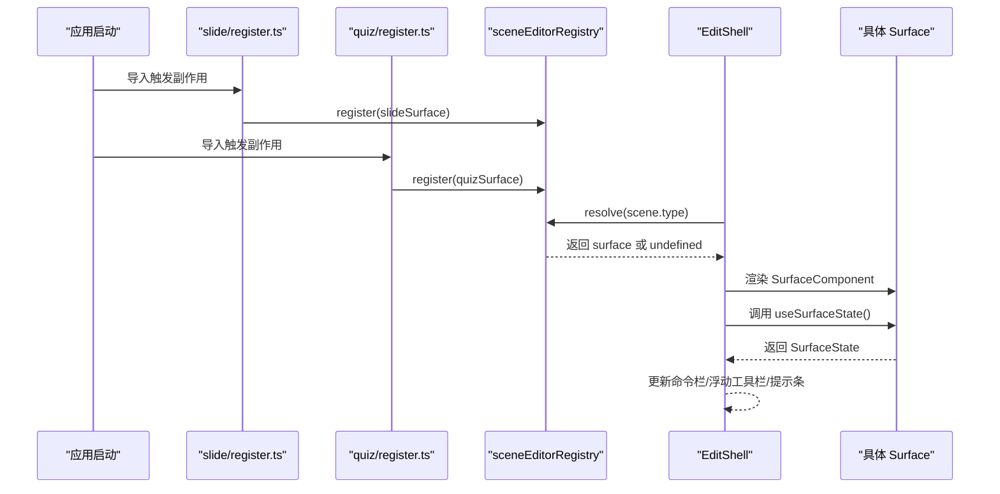
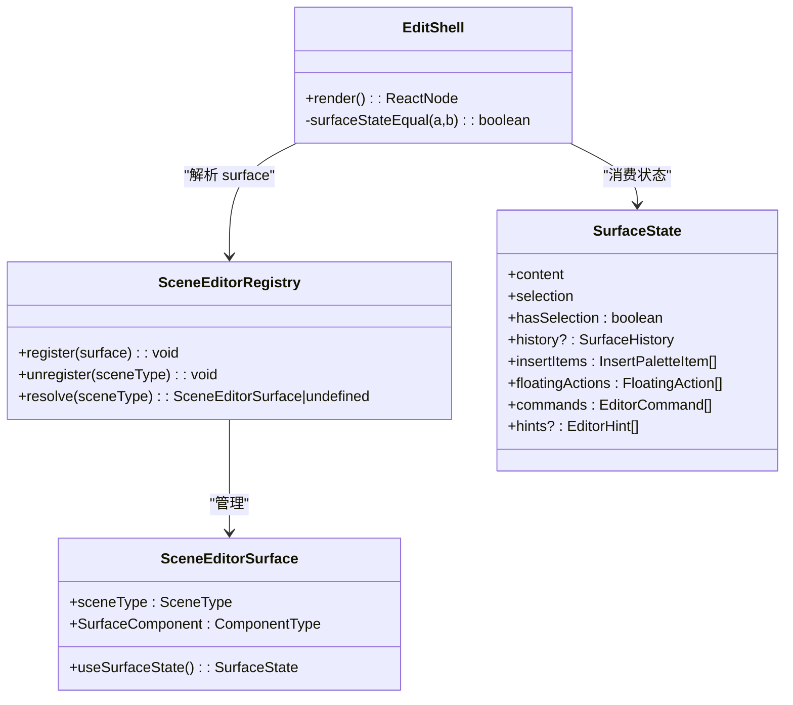
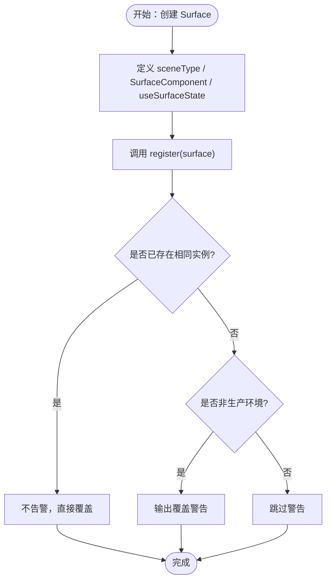

# 场景编辑器注册表

<cite>
**本文引用的文件**   
- [scene-editor-surface.ts](file://lib/edit/scene-editor-surface.ts)
- [scene-editor-registry.ts](file://lib/edit/scene-editor-registry.ts)
- [EditShell.tsx](file://components/edit/EditShell/EditShell.tsx)
- [SlideSurface.tsx](file://components/edit/surfaces/slide/SlideSurface.tsx)
- [register.ts（slide）](file://components/edit/surfaces/slide/register.ts)
- [QuizSurface.tsx](file://components/edit/surfaces/quiz/QuizSurface.tsx)
- [register.ts（quiz）](file://components/edit/surfaces/quiz/register.ts)
- [stage-mode.test.ts](file://tests/edit/stage-mode.test.ts)
</cite>

## 产品概述
本文件聚焦“场景编辑器注册表”的设计与实现，解释其核心职责：统一管理不同场景类型（如 slide、quiz 等）的编辑器表面实例，提供统一的注册、注销与解析接口。注册表基于 Map 数据结构存储 Surface 实例，支持 HMR（热模块替换）安全重入、重复注册警告、以及面向测试与开发环境的清理能力。通过该注册表，编辑外壳（EditShell）能够以场景类型为键，动态解析并渲染对应的编辑器表面，从而实现“壳面分离”的可插拔架构。

## 核心业务流程
- 模块初始化时，各场景类型的 surface 模块通过副作用导入触发注册（例如 slide/quiz 的 register.ts）。
- EditShell 在运行时根据当前 scene.type 调用注册表的 resolve 方法获取对应 surface；若未注册则回退到只读 NOOP_SURFACE。
- Shell 通过 surface.SurfaceComponent 渲染中心区域，并通过 surface.useSurfaceState() 订阅状态变化，将 insertItems、floatingActions、commands、history 等槽位贡献给命令栏、浮动工具栏与提示条。
- 当 HMR 或测试环境重新执行模块初始化时，注册表会检测重复注册：相同实例不告警，不同实例覆盖旧值并输出警告，便于定位潜在问题。

**图表来源** 
- [register.ts（slide）:1-8](file://components/edit/surfaces/slide/register.ts#L1-L8)
- [register.ts（quiz）:1-8](file://components/edit/surfaces/quiz/register.ts#L1-L8)
- [scene-editor-registry.ts:1-26](file://lib/edit/scene-editor-registry.ts#L1-L26)
- [EditShell.tsx:74-123](file://components/edit/EditShell/EditShell.tsx#L74-L123)

**章节来源**
- [scene-editor-registry.ts:1-26](file://lib/edit/scene-editor-registry.ts#L1-L26)
- [EditShell.tsx:74-123](file://components/edit/EditShell/EditShell.tsx#L74-L123)
- [register.ts（slide）:1-8](file://components/edit/surfaces/slide/register.ts#L1-L8)
- [register.ts（quiz）:1-8](file://components/edit/surfaces/quiz/register.ts#L1-L8)

## 功能模块清单
- 场景编辑器表面契约（SceneEditorSurface）
  - 定义场景类型标识、中心渲染组件、以及用于向壳层暴露状态的 Hook 返回值结构（SurfaceState），包括 content、selection、hasSelection、history、insertItems、floatingActions、commands、hints 等字段。
  - 提供 UI 贡献原语（UiAffordance、InsertPaletteItem、FloatingAction、EditorCommand、EditorHint），使同一项可在左侧插入面板或浮动工具栏中以不同形式呈现。
- 注册表（SceneEditorRegistry）
  - 维护一个 Map<SceneType, SceneEditorSurface>，提供 register、unregister、resolve 三个方法。
  - 支持 HMR 安全：重复注册相同实例不告警；不同实例覆盖旧值并在非生产环境下发出警告。
  - 提供 unregister 用于 HMR 清理与单元测试隔离。
- 编辑外壳（EditShell）
  - 通过注册表解析 surface，渲染 SurfaceComponent，并消费 useSurfaceState 返回的状态。
  - 使用浅比较函数 surfaceStateEqual 避免无限发布循环，确保仅当 chrome 实际读取的字段发生语义变化时才更新。
- 具体 Surface 实现示例
  - slideSurface：以 Canvas 为中心编辑界面。
  - quizSurface：以结构化表单为中心的编辑界面，证明契约不限于画布。

**章节来源**
- [scene-editor-surface.ts:20-159](file://lib/edit/scene-editor-surface.ts#L20-L159)
- [scene-editor-registry.ts:1-26](file://lib/edit/scene-editor-registry.ts#L1-L26)
- [EditShell.tsx:140-226](file://components/edit/EditShell/EditShell.tsx#L140-L226)
- [SlideSurface.tsx:1-17](file://components/edit/surfaces/slide/SlideSurface.tsx#L1-L17)
- [QuizSurface.tsx:1-19](file://components/edit/surfaces/quiz/QuizSurface.tsx#L1-L19)

## 数据与状态
- 核心数据结构
  - Map<SceneType, SceneEditorSurface>：以场景类型为键，保存 Surface 实例。
  - SurfaceState：由 surface.useSurfaceState() 返回，包含内容、选择、历史、插入项、浮动动作、命令、提示等。
- 关键状态流转
  - EditShell 通过 key={scene.type} 控制 SurfaceStateRunner 的重挂载边界，保证在不同 surface 切换时遵守 React Hooks 规则。
  - surfaceStateEqual 对 chrome 实际读取的字段进行逐字段比较，防止因每次渲染返回新对象导致的无限循环。
- 数据所有权边界
  - Surface 负责自身状态与渲染；Shell 仅消费状态并渲染 chrome。
  - 注册表仅持有 Surface 引用，不参与业务逻辑。

**图表来源** 
- [scene-editor-surface.ts:126-159](file://lib/edit/scene-editor-surface.ts#L126-L159)
- [scene-editor-registry.ts:1-26](file://lib/edit/scene-editor-registry.ts#L1-L26)
- [EditShell.tsx:140-226](file://components/edit/EditShell/EditShell.tsx#L140-L226)

**章节来源**
- [scene-editor-surface.ts:86-120](file://lib/edit/scene-editor-surface.ts#L86-L120)
- [EditShell.tsx:140-226](file://components/edit/EditShell/EditShell.tsx#L140-L226)

## 关键约束与边界
- 类型安全设计
  - SceneEditorSurface<TContent, TSelection> 泛型约束确保 content 与 selection 的类型一致性。
  - SceneType 为闭联合类型，未注册的类型将回退到 NOOP_SURFACE。
- HMR 支持与重复注册警告
  - 相同实例重复注册不告警；不同实例覆盖旧值并在非生产环境输出警告，帮助定位重复导入或 HMR 未清理的问题。
- 生命周期与内存泄漏防护
  - 提供 unregister 用于 HMR 与测试后清理，避免 Map 中残留引用导致内存泄漏。
  - EditShell 通过浅比较与稳定的 key 边界，避免不必要的重渲染与悬挂状态。
- 错误处理策略
  - 未注册场景类型时，resolve 返回 undefined，EditShell 回退到 NOOP_SURFACE，保证 UI 稳定。
  - 警告仅在非生产环境输出，避免影响性能与用户感知。
- 性能优化建议
  - 保持 insertItems、commands、floatingActions 的 id 稳定，减少数组比较开销。
  - 避免在回调中捕获易变闭包，必要时将可变状态放入 ref 或版本计数器，并在 surfaceStateEqual 中纳入比较。
- 最佳实践指南
  - 新增 Surface 时，遵循 SceneEditorSurface 契约，确保 useSurfaceState 返回稳定且可比较的状态。
  - 在模块副作用中注册 surface，避免在渲染路径中注册。
  - 扩展 SurfaceState 字段时，同步更新 surfaceStateEqual，确保 chrome 能正确响应变更。

**章节来源**
- [scene-editor-registry.ts:6-25](file://lib/edit/scene-editor-registry.ts#L6-L25)
- [EditShell.tsx:74-123](file://components/edit/EditShell/EditShell.tsx#L74-L123)
- [EditShell.tsx:188-226](file://components/edit/EditShell/EditShell.tsx#L188-L226)
- [stage-mode.test.ts:91-157](file://tests/edit/stage-mode.test.ts#L91-L157)

## 附录：新编辑器类型注册完整示例与接口说明
- 实现 SceneEditorSurface
  - 定义 sceneType、SurfaceComponent（React 组件）、useSurfaceState（返回 SurfaceState）。
  - 参考 slideSurface 与 quizSurface 的实现模式。
- 注册 surface
  - 在模块副作用中调用 sceneEditorRegistry.register(surface)。
  - 参考 slide/register.ts 与 quiz/register.ts 的写法。
- 验证与清理
  - 使用 sceneEditorRegistry.unregister(sceneType) 在测试或 HMR 后清理。
  - 使用 sceneEditorRegistry.resolve(sceneType) 验证注册是否生效。

**图表来源** 
- [scene-editor-registry.ts:6-20](file://lib/edit/scene-editor-registry.ts#L6-L20)
- [register.ts（slide）:1-8](file://components/edit/surfaces/slide/register.ts#L1-L8)
- [register.ts（quiz）:1-8](file://components/edit/surfaces/quiz/register.ts#L1-L8)

**章节来源**
- [SlideSurface.tsx:1-17](file://components/edit/surfaces/slide/SlideSurface.tsx#L1-L17)
- [QuizSurface.tsx:1-19](file://components/edit/surfaces/quiz/QuizSurface.tsx#L1-L19)
- [scene-editor-surface.ts:126-159](file://lib/edit/scene-editor-surface.ts#L126-L159)
- [scene-editor-registry.ts:6-25](file://lib/edit/scene-editor-registry.ts#L6-L25)