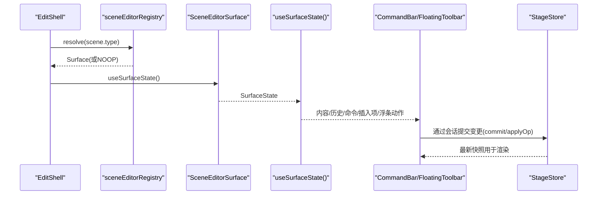
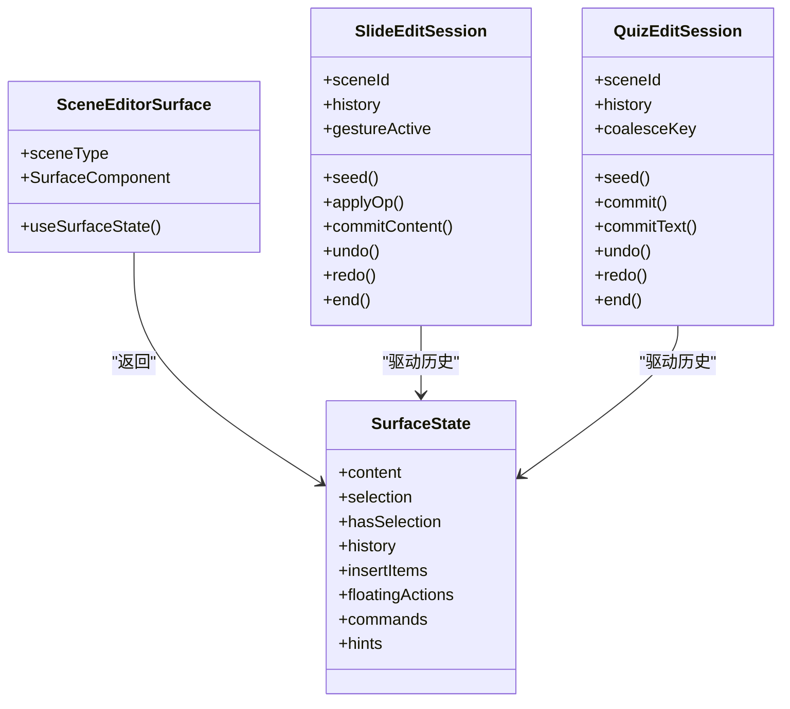
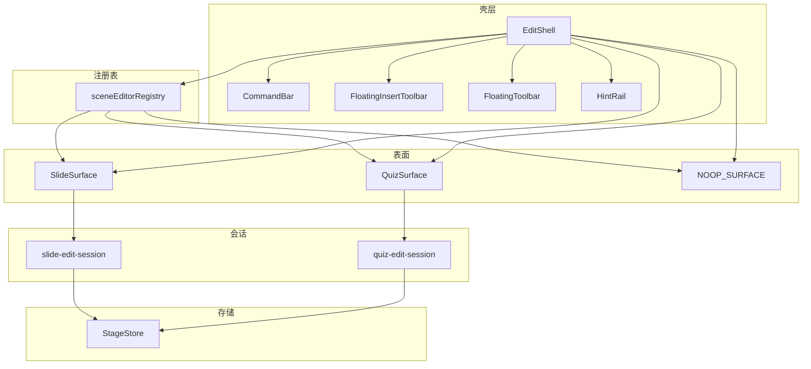
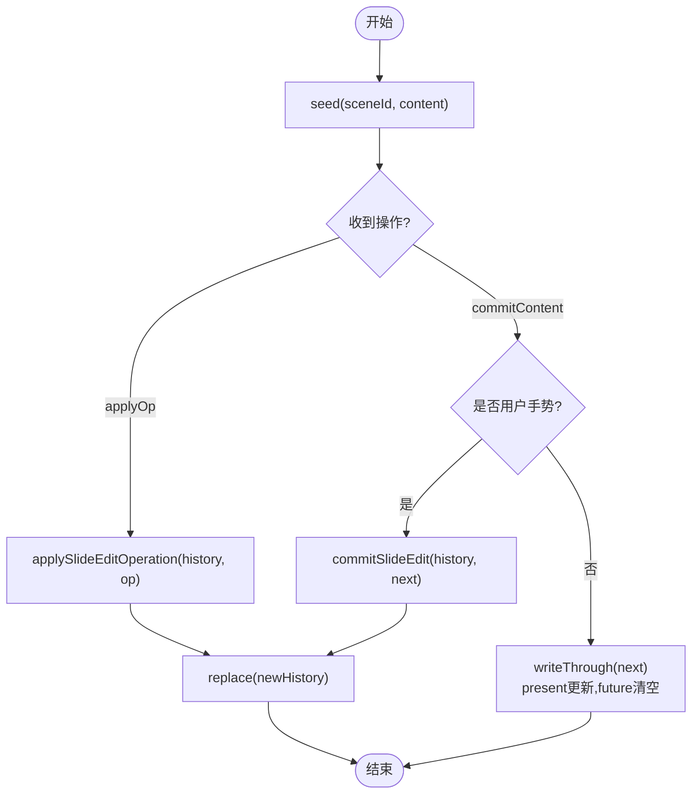
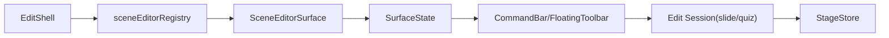

# 编辑器框架

<cite>
**本文引用的文件**   
- [EditShell.tsx](file://components/edit/EditShell/EditShell.tsx)
- [CommandBar.tsx](file://components/edit/EditShell/CommandBar.tsx)
- [scene-editor-surface.ts](file://lib/edit/scene-editor-surface.ts)
- [scene-editor-registry.ts](file://lib/edit/scene-editor-registry.ts)
- [noop-surface.tsx](file://lib/edit/noop-surface.tsx)
- [SlideSurface.tsx](file://components/edit/surfaces/slide/SlideSurface.tsx)
- [use-slide-surface.ts](file://components/edit/surfaces/slide/use-slide-surface.ts)
- [slide-edit-session.ts](file://components/edit/surfaces/slide/slide-edit-session.ts)
- [QuizSurface.tsx](file://components/edit/surfaces/quiz/QuizSurface.tsx)
- [use-quiz-surface.ts](file://components/edit/surfaces/quiz/use-quiz-surface.ts)
- [quiz-edit-session.ts](file://components/edit/surfaces/quiz/quiz-edit-session.ts)
</cite>

## 产品概述
本编辑器框架为 OpenMAIC 的课件编辑核心，提供统一的“场景编辑器注册表 + 表面抽象层 + 状态管理”架构。通过 SceneEditorSurface 契约，不同编辑会话（幻灯片、测验等）以插件化方式接入，壳层（EditShell）与命令栏（CommandBar）、浮动工具栏、插入条、提示轨道等 UI 保持解耦。框架内置撤销/重做、命令系统、插入面板与上下文浮条，支持快速扩展新的编辑器类型，满足交互式课件编辑与回放的一体化体验。

## 核心业务流程
- 进入编辑模式时，EditShell 根据当前 scene.type 从注册表解析对应 Surface；若未注册则回退到 NOOP_SURFACE（只读播放渲染）。
- Shell 调用 surface.useSurfaceState() 获取 SurfaceState（内容、选择、历史、插入项、命令、浮条动作、提示），并渲染 SurfaceComponent 作为中心画布。
- CommandBar 展示标题、撤销/重做、全局命令；FloatingInsertToolbar 与 FloatingToolbar 由 SurfaceState 驱动显示。
- 用户操作通过各表面的编辑会话（slide-edit-session / quiz-edit-session）写入，统一写回到 StageStore，确保持久化与回放一致性。

**图表来源** 
- [EditShell.tsx:74-123](file://components/edit/EditShell/EditShell.tsx#L74-L123)
- [scene-editor-registry.ts:6-25](file://lib/edit/scene-editor-registry.ts#L6-L25)
- [scene-editor-surface.ts:126-145](file://lib/edit/scene-editor-surface.ts#L126-L145)
- [use-slide-surface.ts:185-210](file://components/edit/surfaces/slide/use-slide-surface.ts#L185-L210)
- [use-quiz-surface.ts:158-178](file://components/edit/surfaces/quiz/use-quiz-surface.ts#L158-L178)

**章节来源**
- [EditShell.tsx:74-123](file://components/edit/EditShell/EditShell.tsx#L74-L123)
- [CommandBar.tsx:35-84](file://components/edit/EditShell/CommandBar.tsx#L35-L84)

## 功能模块清单
- 场景编辑器注册表：集中管理各场景类型的编辑器实现，支持 HMR 安全覆盖与注销。
- 表面抽象层：定义 Surface 契约（SurfaceComponent + useSurfaceState），屏蔽具体编辑形态（画布/表单）。
- 编辑会话与撤销重做：按表面类型维护独立的历史栈，区分离散编辑与文本合并提交。
- 命令系统与工具栏：顶部命令栏承载撤销/重做、全局命令；插入条与上下文浮条由 SurfaceState 驱动。
- 只读回退：未注册场景类型自动降级为 NOOP_SURFACE，保证壳层稳定不闪烁。

**章节来源**
- [scene-editor-registry.ts:6-25](file://lib/edit/scene-editor-registry.ts#L6-L25)
- [scene-editor-surface.ts:19-145](file://lib/edit/scene-editor-surface.ts#L19-L145)
- [slide-edit-session.ts:63-146](file://components/edit/surfaces/slide/slide-edit-session.ts#L63-L146)
- [quiz-edit-session.ts:51-113](file://components/edit/surfaces/quiz/quiz-edit-session.ts#L51-L113)
- [noop-surface.tsx:29-62](file://lib/edit/noop-surface.tsx#L29-L62)

## 数据与状态
- SurfaceState：包含 content、selection、hasSelection、history、insertItems、floatingActions、commands、hints。Shell 对字段进行浅比较以避免无限更新循环。
- Slide 编辑会话：维护 sceneId、history、gestureActive；commitContent 区分用户手势与非手势（ResizeObserver 规范化），避免破坏撤销栈。
- Quiz 编辑会话：维护 coalesceKey，将同一字段的连续输入折叠为一个撤销步，同时实时写回 StageStore。
- 数据所有权：StageStore 是权威源，编辑会话仅持有内存中的历史与差异；所有提交均通过 writeThrough 同步至 StageStore，确保回放与导出一致。

**图表来源** 
- [scene-editor-surface.ts:86-145](file://lib/edit/scene-editor-surface.ts#L86-L145)
- [slide-edit-session.ts:33-61](file://components/edit/surfaces/slide/slide-edit-session.ts#L33-L61)
- [quiz-edit-session.ts:33-49](file://components/edit/surfaces/quiz/quiz-edit-session.ts#L33-L49)

**章节来源**
- [scene-editor-surface.ts:86-145](file://lib/edit/scene-editor-surface.ts#L86-L145)
- [slide-edit-session.ts:109-126](file://components/edit/surfaces/slide/slide-edit-session.ts#L109-L126)
- [quiz-edit-session.ts:83-95](file://components/edit/surfaces/quiz/quiz-edit-session.ts#L83-L95)

## 关键约束与边界
- 注册表约束：重复注册相同实例无害；不同实例覆盖会发出警告（HMR 场景需先注销）。
- 状态比较约束：新增 SurfaceState 字段必须同步更新 EditShell 中的相等性比较，否则 chrome 可能读到陈旧值。
- 撤销栈保护：非用户手势的规范化提交不清空 past，但清空 future，防止 redo 分支失效。
- 文本合并约束：同一 coalesceKey 的多次 commitText 折叠为一步撤销，切换字段或离散提交开启新步。
- 只读回退：未注册场景类型使用 NOOP_SURFACE，壳层结构不变，避免闪烁与重新挂载。

**章节来源**
- [scene-editor-registry.ts:8-18](file://lib/edit/scene-editor-registry.ts#L8-L18)
- [EditShell.tsx:188-226](file://components/edit/EditShell/EditShell.tsx#L188-L226)
- [slide-edit-session.ts:109-126](file://components/edit/surfaces/slide/slide-edit-session.ts#L109-L126)
- [quiz-edit-session.ts:83-95](file://components/edit/surfaces/quiz/quiz-edit-session.ts#L83-L95)
- [noop-surface.tsx:29-62](file://lib/edit/noop-surface.tsx#L29-L62)

## 架构总览

**图表来源** 
- [EditShell.tsx:74-123](file://components/edit/EditShell/EditShell.tsx#L74-L123)
- [scene-editor-registry.ts:6-25](file://lib/edit/scene-editor-registry.ts#L6-L25)
- [SlideSurface.tsx:12-16](file://components/edit/surfaces/slide/SlideSurface.tsx#L12-L16)
- [QuizSurface.tsx:14-18](file://components/edit/surfaces/quiz/QuizSurface.tsx#L14-L18)
- [noop-surface.tsx:58-62](file://lib/edit/noop-surface.tsx#L58-L62)
- [slide-edit-session.ts:63-146](file://components/edit/surfaces/slide/slide-edit-session.ts#L63-L146)
- [quiz-edit-session.ts:51-113](file://components/edit/surfaces/quiz/quiz-edit-session.ts#L51-L113)

## 详细组件分析

### 场景编辑器注册表
- 职责：维护 SceneType → SceneEditorSurface 映射，提供 register/unregister/resolve。
- 行为：重复注册相同实例安全；不同实例覆盖在非生产环境告警；HMR 时需先 unregister。
- 集成：各表面在模块初始化时执行副作用注册，Shell 仅在运行时 resolve，避免直接耦合。

**章节来源**
- [scene-editor-registry.ts:6-25](file://lib/edit/scene-editor-registry.ts#L6-L25)
- [SlideSurface.tsx:12-16](file://components/edit/surfaces/slide/SlideSurface.tsx#L12-L16)
- [QuizSurface.tsx:14-18](file://components/edit/surfaces/quiz/QuizSurface.tsx#L14-L18)

### 表面抽象层（SceneEditorSurface）
- 契约：sceneType、SurfaceComponent、useSurfaceState。
- 贡献项：InsertPaletteItem、FloatingAction、EditorCommand、EditorHint。
- 设计要点：Shell 不关心具体渲染形态（画布/表单），仅消费 SurfaceState 插槽。

**章节来源**
- [scene-editor-surface.ts:19-145](file://lib/edit/scene-editor-surface.ts#L19-L145)

### 幻灯片表面（SlideSurface）
- 入口：SlideSurface 暴露 sceneType=slide、SurfaceComponent=SlideCanvas、useSurfaceState=useSlideSurfaceState。
- 状态：buildInsertItems 提供文本、图片、背景插入；useSlideSurfaceState 聚合 history、selection、insertItems、floatingActions、commands、hints。
- 交互：图片插入异步计算尺寸，基于自然宽高比缩放；元素删除、重排、替换 src、翻转等操作通过 applyOp 提交。

**章节来源**
- [SlideSurface.tsx:12-16](file://components/edit/surfaces/slide/SlideSurface.tsx#L12-L16)
- [use-slide-surface.ts:25-68](file://components/edit/surfaces/slide/use-slide-surface.ts#L25-L68)
- [use-slide-surface.ts:185-210](file://components/edit/surfaces/slide/use-slide-surface.ts#L185-L210)

### 测验表面（QuizSurface）
- 入口：QuizSurface 暴露 sceneType=quiz、SurfaceComponent=QuizForm、useSurfaceState=useQuizSurfaceState。
- 状态：无选择模型；hints 由 buildQuizHints 生成，限制最大显示数量，聚焦关键校验问题。
- 交互：结构化表单内完成增删改查；commit 与 commitText 分别处理离散编辑与文本合并。

**章节来源**
- [QuizSurface.tsx:14-18](file://components/edit/surfaces/quiz/QuizSurface.tsx#L14-L18)
- [use-quiz-surface.ts:102-130](file://components/edit/surfaces/quiz/use-quiz-surface.ts#L102-L130)
- [use-quiz-surface.ts:158-178](file://components/edit/surfaces/quiz/use-quiz-surface.ts#L158-L178)

### 撤销/重做与会话管理
- Slide 会话：seed 初始化 present；applyOp 应用操作；commitContent 区分用户手势与非手势，避免破坏撤销栈；writeThrough 同步 StageStore。
- Quiz 会话：commit 每次产生新步；commitText 同 key 合并为一部；coalesceKey 跟踪当前文本输入流。
- 退出清理：end 清空 session 状态，避免内存泄漏。

**图表来源** 
- [slide-edit-session.ts:90-126](file://components/edit/surfaces/slide/slide-edit-session.ts#L90-L126)
- [quiz-edit-session.ts:77-95](file://components/edit/surfaces/quiz/quiz-edit-session.ts#L77-L95)

**章节来源**
- [slide-edit-session.ts:63-146](file://components/edit/surfaces/slide/slide-edit-session.ts#L63-L146)
- [quiz-edit-session.ts:51-113](file://components/edit/surfaces/quiz/quiz-edit-session.ts#L51-L113)

### 命令系统与工具栏
- CommandBar：左侧返回、撤销/重做、标题；中间可承载插入原语；右侧命令按钮与 trailing 插槽（Stage 注入的全局控制）。
- FloatingInsertToolbar：由 insertItems 驱动，支持 popover 子选择器（如图片源选择、背景设置）。
- FloatingToolbar：由 floatingActions 驱动，针对选中元素提供上下文操作。

**章节来源**
- [CommandBar.tsx:35-84](file://components/edit/EditShell/CommandBar.tsx#L35-L84)
- [EditShell.tsx:114-120](file://components/edit/EditShell/EditShell.tsx#L114-L120)

### 只读回退（NOOP_SURFACE）
- 作用：当 scene.type 未注册编辑器时，回退到只读播放渲染，壳层保持稳定不闪烁。
- 特点：返回空 SurfaceState，无任何订阅与副作用。

**章节来源**
- [noop-surface.tsx:29-62](file://lib/edit/noop-surface.tsx#L29-L62)

## 依赖分析
- 组件耦合：EditShell 仅依赖 registry 与 surface 契约，不直接导入具体表面；各表面通过 register 副作用注册。
- 状态流向：SurfaceState 由 useSurfaceState 产出，Shell 消费；编辑操作经会话写回 StageStore，形成单向数据流。
- 外部依赖：StageStore 负责持久化与回放一致性；ProseMirror/Canvas 等渲染细节被封装在各表面内部。

**图表来源** 
- [EditShell.tsx:74-123](file://components/edit/EditShell/EditShell.tsx#L74-L123)
- [scene-editor-registry.ts:6-25](file://lib/edit/scene-editor-registry.ts#L6-L25)
- [scene-editor-surface.ts:126-145](file://lib/edit/scene-editor-surface.ts#L126-L145)
- [slide-edit-session.ts:63-146](file://components/edit/surfaces/slide/slide-edit-session.ts#L63-L146)
- [quiz-edit-session.ts:51-113](file://components/edit/surfaces/quiz/quiz-edit-session.ts#L51-L113)

**章节来源**
- [EditShell.tsx:74-123](file://components/edit/EditShell/EditShell.tsx#L74-L123)
- [scene-editor-registry.ts:6-25](file://lib/edit/scene-editor-registry.ts#L6-L25)

## 性能考虑
- 状态发布优化：EditShell 对 SurfaceState 进行字段级相等性比较，避免每渲染周期触发 setState 导致的无限循环。
- 动画与合成：Chrome 层采用纯 opacity 过渡，避免 transform 导致 backdrop-filter 重算与布局抖动。
- 文本输入合并：Quiz 的 commitText 将同一字段的连续输入折叠为一步撤销，减少历史膨胀。
- 非用户手势保护：Slide 的 ResizeObserver 规范化提交不清空 past，保障撤销栈完整性。

[本节为通用指导，不直接分析具体文件]

## 故障排查指南
- 注册冲突：若 HMR 后出现覆盖警告，请先 unregister 再重新注册；检查多路径导入导致的重复注册。
- 状态不同步：新增 SurfaceState 字段需同步更新 EditShell 的相等性比较函数，否则 chrome 可能读取旧值。
- 撤销异常：确认 commitContent 的 isUserEdit 标志是否正确设置；非手势提交不应创建新撤销步。
- 文本合并失效：检查 commitText 的 coalesceKey 是否稳定且唯一；切换字段应重置 coalesceKey。

**章节来源**
- [scene-editor-registry.ts:8-18](file://lib/edit/scene-editor-registry.ts#L8-L18)
- [EditShell.tsx:188-226](file://components/edit/EditShell/EditShell.tsx#L188-L226)
- [slide-edit-session.ts:109-126](file://components/edit/surfaces/slide/slide-edit-session.ts#L109-L126)
- [quiz-edit-session.ts:83-95](file://components/edit/surfaces/quiz/quiz-edit-session.ts#L83-L95)

## 结论
该编辑器框架以注册表与表面抽象为核心，实现了可扩展、低耦合、高一致的编辑体验。通过统一的 SurfaceState 契约与独立的编辑会话，支持快速构建多种课件编辑能力（画布、表单等），并在撤销/重做、命令系统、工具栏等方面提供完善的基础设施。遵循本文档的约束与实践，开发者可高效扩展新的编辑器类型并集成到现有壳层中。