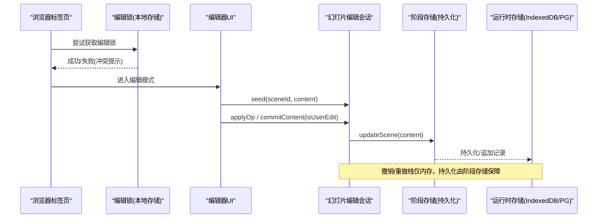
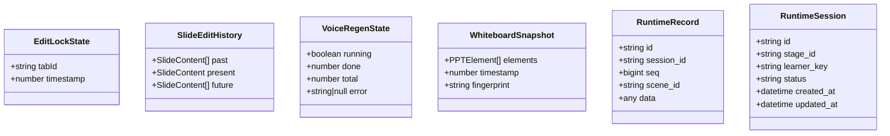
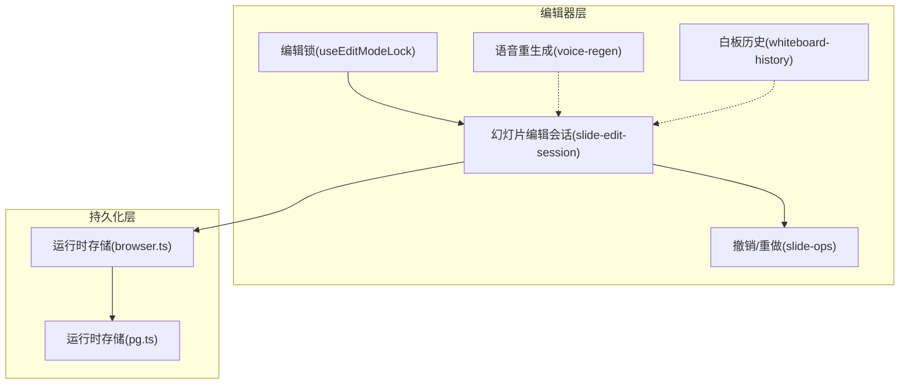
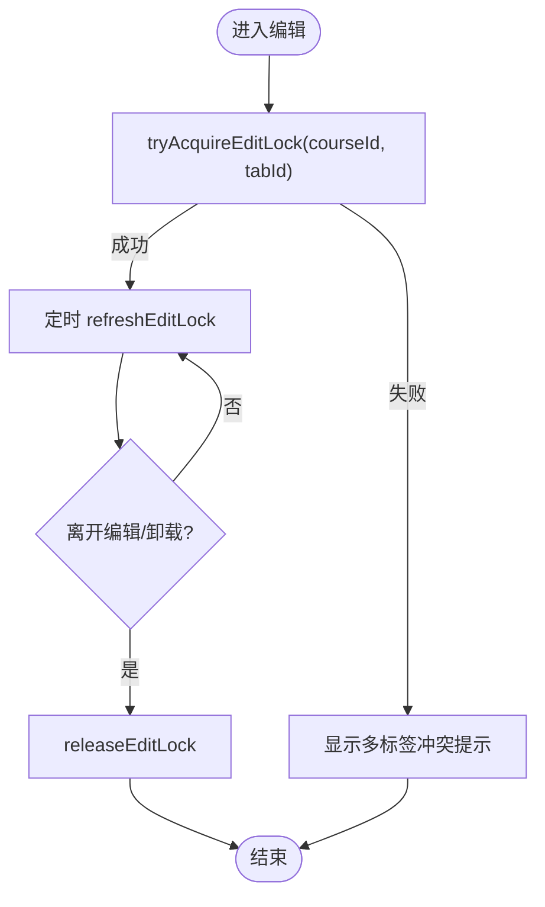
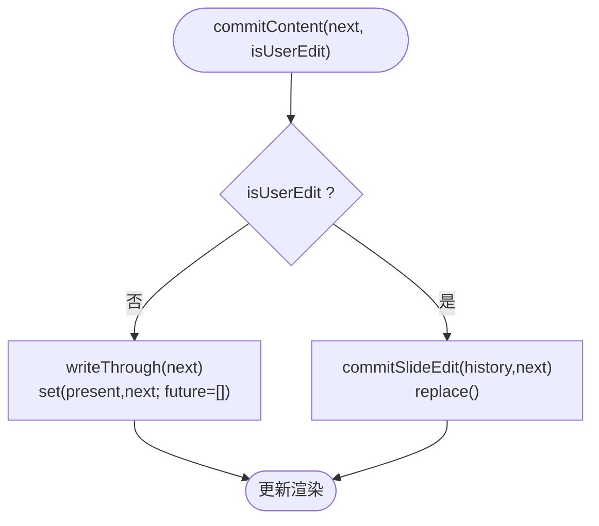
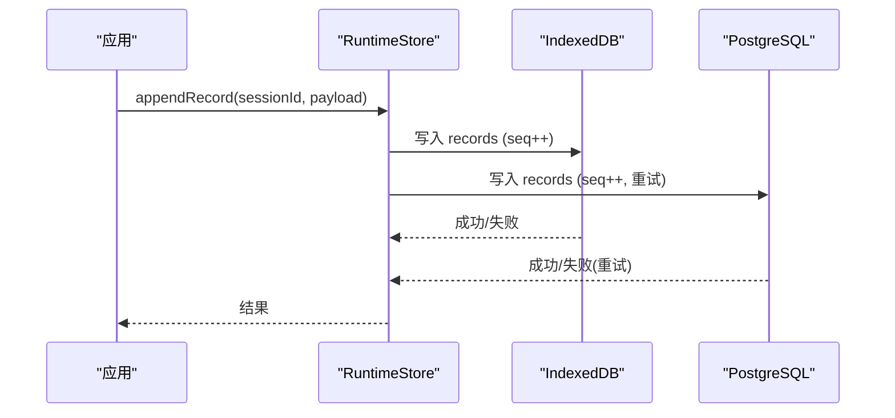
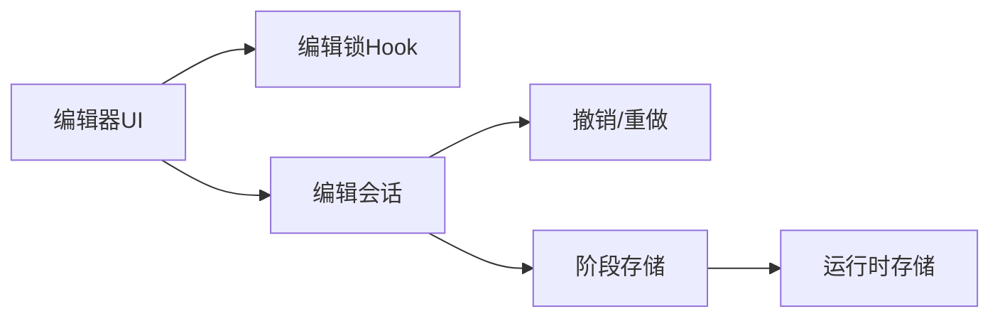

# 编辑器状态管理

<cite>
**本文引用的文件**   
- [lib/edit/edit-mode-lock.ts](file://lib/edit/edit-mode-lock.ts)
- [components/edit/use-edit-mode-lock.ts](file://components/edit/use-edit-mode-lock.ts)
- [components/edit/MultiTabEditConflictPrompt.tsx](file://components/edit/MultiTabEditConflictPrompt.tsx)
- [components/edit/surfaces/slide/slide-edit-session.ts](file://components/edit/surfaces/slide/slide-edit-session.ts)
- [lib/edit/slide-ops.ts](file://lib/edit/slide-ops.ts)
- [tests/edit/scene-edit-bridge.test.ts](file://tests/edit/scene-edit-bridge.test.ts)
- [lib/store/voice-regen.ts](file://lib/store/voice-regen.ts)
- [lib/store/whiteboard-history.ts](file://lib/store/whiteboard-history.ts)
- [packages/@openmaic/storage/src/runtime/browser.ts](file://packages/@openmaic/storage/src/runtime/browser.ts)
- [packages/@openmaic/storage/src/runtime/pg.ts](file://packages/@openmaic/storage/src/runtime/pg.ts)
- [tests/pbl/v2/drain.test.ts](file://tests/pbl/v2/drain.test.ts)
- [components/chat/use-chat-sessions.ts](file://components/chat/use-chat-sessions.ts)
</cite>

## 产品概述
本项目是一个 AI 驱动的交互式课件（MAIC）生成与课堂管理平台，核心编辑场景包括：幻灯片/白板等“表面”的可视化编辑、AI 内容再生成、课堂回放与实时互动。前端基于 Next.js + React + Zustand，采用“会话级内存历史 + 持久化层（IndexedDB/PG）+ 跨标签页锁”的组合模式，实现高效、可回滚、可并发控制的编辑体验。

## 核心业务流程
- 进入编辑模式：通过跨标签页编辑锁确保同一课程仅一个标签页处于编辑态；失败时展示冲突提示。
- 编辑操作：在“幻灯片编辑会话”中维护撤销/重做栈，用户操作产生增量操作，提交后写入阶段存储并触发渲染更新。
- 非用户驱动变更：如文本自动高度重排，仅更新 present 并清理 future，避免破坏撤销语义。
- 持久化与同步：阶段存储负责持久化；运行时记录以追加式序列号保证单调性，支持多端合并与恢复。
- 并发控制：编辑锁心跳保活、超时回收；运行时写路径具备重试与死锁恢复策略。

**章节来源**
- [components/edit/use-edit-mode-lock.ts:1-81](file://components/edit/use-edit-mode-lock.ts#L1-L81)
- [components/edit/MultiTabEditConflictPrompt.tsx:1-36](file://components/edit/MultiTabEditConflictPrompt.tsx#L1-L36)
- [components/edit/surfaces/slide/slide-edit-session.ts:1-147](file://components/edit/surfaces/slide/slide-edit-session.ts#L1-L147)
- [lib/edit/slide-ops.ts:84-149](file://lib/edit/slide-ops.ts#L84-L149)
- [packages/@openmaic/storage/src/runtime/browser.ts:1-38](file://packages/@openmaic/storage/src/runtime/browser.ts#L1-L38)
- [packages/@openmaic/storage/src/runtime/pg.ts:66-90](file://packages/@openmaic/storage/src/runtime/pg.ts#L66-L90)

## 功能模块清单
- 跨标签页编辑锁
  - 职责：按课程维度提供独占编辑权，心跳保活与过期回收，释放幂等。
  - 验收要点：同课不同标签互斥；自身刷新不覆盖他人；崩溃后可被抢占；无课程标识降级为单标签。
- 幻灯片编辑会话（撤销/重做）
  - 职责：维护 past/present/future 三栈；区分用户与非用户提交；统一写回阶段存储。
  - 验收要点：多元素一次提交合并为一个撤销步；无变更提交为 no-op；undo 后再提交清空 redo。
- 语音重生成状态
  - 职责：跟踪 TTS 批量重生成的运行门控与进度，阻止播放脏音频。
  - 验收要点：running 门控；done/total 进度；错误信息隔离；清除错误。
- 白板历史快照
  - 职责：对破坏性操作前保存快照，支持回溯与去重。
  - 验收要点：最大快照数限制；指纹去重；空快照跳过。
- 运行时存储（持久化）
  - 职责：会话与追加记录的读写、迁移、校验、并发安全（索引 DB/PG）。
  - 验收要点：单调 seq；场景锚定查询；学习者合并；事务重试与死锁恢复。

**章节来源**
- [lib/edit/edit-mode-lock.ts:1-114](file://lib/edit/edit-mode-lock.ts#L1-L114)
- [components/edit/use-edit-mode-lock.ts:1-81](file://components/edit/use-edit-mode-lock.ts#L1-L81)
- [components/edit/surfaces/slide/slide-edit-session.ts:1-147](file://components/edit/surfaces/slide/slide-edit-session.ts#L1-L147)
- [lib/edit/slide-ops.ts:84-149](file://lib/edit/slide-ops.ts#L84-L149)
- [tests/edit/scene-edit-bridge.test.ts:153-190](file://tests/edit/scene-edit-bridge.test.ts#L153-L190)
- [lib/store/voice-regen.ts:1-44](file://lib/store/voice-regen.ts#L1-L44)
- [lib/store/whiteboard-history.ts:1-44](file://lib/store/whiteboard-history.ts#L1-L44)
- [packages/@openmaic/storage/src/runtime/browser.ts:1-38](file://packages/@openmaic/storage/src/runtime/browser.ts#L1-L38)
- [packages/@openmaic/storage/src/runtime/pg.ts:460-498](file://packages/@openmaic/storage/src/runtime/pg.ts#L460-L498)

## 数据与状态
- 核心数据模型
  - 编辑锁状态：{ tabId, timestamp }，按课程键名隔离。
  - 幻灯片编辑历史：{ past[], present, future[] }，present 为当前内容，past/future 为快照数组。
  - 语音重生成状态：{ running, done, total, error }。
  - 白板快照：{ elements, timestamp, fingerprint }。
  - 运行时会话/记录：会话含 stageId/learnerKey/status/time；记录含 session_id/seq/scene_id/data。
- 关键状态流转
  - 编辑锁：tryAcquire → refresh（心跳）→ release（退出或卸载）。
  - 编辑历史：applyOp → commitContent → undo/redo；非用户提交仅替换 present 并清空 future。
  - 运行时记录：appendRecord(seq 单调递增) → listRecords(可选 sceneId 过滤)。
- 数据所有权边界
  - 撤销/重做栈为内存态，仅用于交互；真实内容以阶段存储为准，自动持久化。
  - 运行时记录为不可变追加日志，读取侧进行迁移与校验。

**图表来源**
- [lib/edit/edit-mode-lock.ts:24-35](file://lib/edit/edit-mode-lock.ts#L24-L35)
- [lib/edit/slide-ops.ts:84-99](file://lib/edit/slide-ops.ts#L84-L99)
- [lib/store/voice-regen.ts:13-32](file://lib/store/voice-regen.ts#L13-L32)
- [lib/store/whiteboard-history.ts:15-22](file://lib/store/whiteboard-history.ts#L15-L22)
- [packages/@openmaic/storage/src/runtime/pg.ts:66-90](file://packages/@openmaic/storage/src/runtime/pg.ts#L66-L90)

**章节来源**
- [lib/edit/edit-mode-lock.ts:24-35](file://lib/edit/edit-mode-lock.ts#L24-L35)
- [lib/edit/slide-ops.ts:84-149](file://lib/edit/slide-ops.ts#L84-L149)
- [lib/store/voice-regen.ts:1-44](file://lib/store/voice-regen.ts#L1-L44)
- [lib/store/whiteboard-history.ts:1-44](file://lib/store/whiteboard-history.ts#L1-L44)
- [packages/@openmaic/storage/src/runtime/pg.ts:66-90](file://packages/@openmaic/storage/src/runtime/pg.ts#L66-L90)

## 关键约束与边界
- 并发与一致性
  - 编辑锁：心跳间隔 5s，过期阈值 15s；跨课程隔离；无存储能力时降级为单标签。
  - 运行时写入：PostgreSQL 端对唯一约束/序列化/死锁进行有限次重试，保证 seq 单调。
- 性能优化
  - 撤销/重做栈仅在内存，避免频繁持久化；ResizeObserver 等非用户提交不清空 past，减少误删。
  - 运行时记录按场景过滤查询，减少不必要的数据传输。
- 错误恢复
  - 运行时存储异常返回明确错误码（如 SESSION_NOT_FOUND、VALIDATION_FAILED），调用方可据此降级或提示。
  - 聊天流式会话支持软关闭与资源回收，避免悬挂连接。
- 集成边界
  - 编辑器状态与运行时存储解耦：编辑器只关心 present 内容，持久化与合并由运行时层处理。
  - 多标签冲突通过 UI 提示而非静默丢弃，提升可观测性与用户体验。

**章节来源**
- [lib/edit/edit-mode-lock.ts:25-26](file://lib/edit/edit-mode-lock.ts#L25-L26)
- [packages/@openmaic/storage/src/runtime/pg.ts:460-498](file://packages/@openmaic/storage/src/runtime/pg.ts#L460-L498)
- [tests/pbl/v2/drain.test.ts:865-909](file://tests/pbl/v2/drain.test.ts#L865-L909)
- [components/chat/use-chat-sessions.ts:438-470](file://components/chat/use-chat-sessions.ts#L438-L470)

## 架构总览

**图表来源**
- [components/edit/use-edit-mode-lock.ts:1-81](file://components/edit/use-edit-mode-lock.ts#L1-L81)
- [components/edit/surfaces/slide/slide-edit-session.ts:1-147](file://components/edit/surfaces/slide/slide-edit-session.ts#L1-L147)
- [lib/edit/slide-ops.ts:84-149](file://lib/edit/slide-ops.ts#L84-L149)
- [lib/store/voice-regen.ts:1-44](file://lib/store/voice-regen.ts#L1-L44)
- [lib/store/whiteboard-history.ts:1-44](file://lib/store/whiteboard-history.ts#L1-L44)
- [packages/@openmaic/storage/src/runtime/browser.ts:1-38](file://packages/@openmaic/storage/src/runtime/browser.ts#L1-L38)
- [packages/@openmaic/storage/src/runtime/pg.ts:66-90](file://packages/@openmaic/storage/src/runtime/pg.ts#L66-L90)

## 详细组件分析

### 跨标签页编辑锁机制
- 设计要点
  - 基于 localStorage 的轻量锁，键按课程隔离；tabId 稳定且会话内复用。
  - tryAcquire 原子判断并写入；refresh 心跳保活；release 幂等释放。
  - 失败时通过弹窗提示用户关闭其他标签。
- 使用方式
  - 组件 Hook 封装生命周期：获取锁、定时刷新、卸载释放、冲突弹窗。
- 性能与健壮性
  - 读写均为 O(1)，失败吞错降级为单标签模式；过期时间三倍心跳，避免抖动。

**图表来源**
- [lib/edit/edit-mode-lock.ts:59-114](file://lib/edit/edit-mode-lock.ts#L59-L114)
- [components/edit/use-edit-mode-lock.ts:31-81](file://components/edit/use-edit-mode-lock.ts#L31-L81)
- [components/edit/MultiTabEditConflictPrompt.tsx:1-36](file://components/edit/MultiTabEditConflictPrompt.tsx#L1-L36)

**章节来源**
- [lib/edit/edit-mode-lock.ts:1-114](file://lib/edit/edit-mode-lock.ts#L1-L114)
- [components/edit/use-edit-mode-lock.ts:1-81](file://components/edit/use-edit-mode-lock.ts#L1-L81)
- [components/edit/MultiTabEditConflictPrompt.tsx:1-36](file://components/edit/MultiTabEditConflictPrompt.tsx#L1-L36)

### 撤销/重做栈与增量更新
- 数据结构
  - SlideEditHistory：past/present/future 三栈，present 为当前内容。
- 操作语义
  - applyOp：对 present 应用操作，若无变化直接返回原引用以避免多余步骤。
  - commitContent：用户提交入栈；非用户提交仅替换 present 并清空 future。
  - undo/redo：在三栈间移动指针，保持语义一致。
- 性能优化
  - 多元素变更在一次提交中合并为一个撤销步；无变更提交为 no-op。

**图表来源**
- [components/edit/surfaces/slide/slide-edit-session.ts:109-126](file://components/edit/surfaces/slide/slide-edit-session.ts#L109-L126)
- [lib/edit/slide-ops.ts:101-149](file://lib/edit/slide-ops.ts#L101-L149)
- [tests/edit/scene-edit-bridge.test.ts:153-190](file://tests/edit/scene-edit-bridge.test.ts#L153-L190)

**章节来源**
- [components/edit/surfaces/slide/slide-edit-session.ts:1-147](file://components/edit/surfaces/slide/slide-edit-session.ts#L1-L147)
- [lib/edit/slide-ops.ts:84-149](file://lib/edit/slide-ops.ts#L84-L149)
- [tests/edit/scene-edit-bridge.test.ts:153-190](file://tests/edit/scene-edit-bridge.test.ts#L153-L190)

### 运行时存储与并发控制
- 设计要点
  - IndexedDB/PG 双后端，记录追加式写入，seq 单调递增；支持按 sceneId 过滤。
  - PG 端对唯一约束/序列化/死锁进行有限次重试，保证一致性。
  - 会话状态机：active/completed 等状态转换，附带时间戳。
- 错误与恢复
  - 测试覆盖会话不存在、状态非法、慢追加超时等场景，确保系统可恢复。

**图表来源**
- [packages/@openmaic/storage/src/runtime/browser.ts:1-38](file://packages/@openmaic/storage/src/runtime/browser.ts#L1-L38)
- [packages/@openmaic/storage/src/runtime/pg.ts:460-498](file://packages/@openmaic/storage/src/runtime/pg.ts#L460-L498)
- [tests/pbl/v2/drain.test.ts:865-909](file://tests/pbl/v2/drain.test.ts#L865-L909)

**章节来源**
- [packages/@openmaic/storage/src/runtime/browser.ts:1-38](file://packages/@openmaic/storage/src/runtime/browser.ts#L1-L38)
- [packages/@openmaic/storage/src/runtime/pg.ts:66-90](file://packages/@openmaic/storage/src/runtime/pg.ts#L66-L90)
- [tests/pbl/v2/drain.test.ts:865-909](file://tests/pbl/v2/drain.test.ts#L865-L909)

### 状态订阅与中间件/Hook 示例
- 状态订阅
  - 使用 Zustand selector 订阅最小切片，避免无关重渲染。
  - 聊天会话从阶段存储恢复并维持流式缓冲，避免重复加载。
- 中间件扩展
  - 可在 create 时使用 middleware（如 persist、immer）增强持久化与不可变更新。
- 自定义 Hook
  - useEditModeLock 封装锁生命周期；可按需暴露 canUndo/canRedo 等派生状态。

**章节来源**
- [components/chat/use-chat-sessions.ts:438-470](file://components/chat/use-chat-sessions.ts#L438-L470)
- [components/edit/use-edit-mode-lock.ts:1-81](file://components/edit/use-edit-mode-lock.ts#L1-L81)

## 依赖分析
- 组件耦合
  - 编辑锁与 UI 层弱耦合，通过返回值与事件控制流程。
  - 幻灯片编辑会话与阶段存储单向依赖，写回集中。
- 外部依赖
  - 运行时存储抽象了底层介质（IndexedDB/PG），上层无需感知差异。
- 潜在循环依赖
  - 通过模块职责划分避免：编辑逻辑不依赖运行时存储细节。

**图表来源**
- [components/edit/use-edit-mode-lock.ts:1-81](file://components/edit/use-edit-mode-lock.ts#L1-L81)
- [components/edit/surfaces/slide/slide-edit-session.ts:1-147](file://components/edit/surfaces/slide/slide-edit-session.ts#L1-L147)
- [lib/edit/slide-ops.ts:84-149](file://lib/edit/slide-ops.ts#L84-L149)
- [packages/@openmaic/storage/src/runtime/browser.ts:1-38](file://packages/@openmaic/storage/src/runtime/browser.ts#L1-L38)

**章节来源**
- [components/edit/use-edit-mode-lock.ts:1-81](file://components/edit/use-edit-mode-lock.ts#L1-L81)
- [components/edit/surfaces/slide/slide-edit-session.ts:1-147](file://components/edit/surfaces/slide/slide-edit-session.ts#L1-L147)
- [lib/edit/slide-ops.ts:84-149](file://lib/edit/slide-ops.ts#L84-L149)
- [packages/@openmaic/storage/src/runtime/browser.ts:1-38](file://packages/@openmaic/storage/src/runtime/browser.ts#L1-L38)

## 性能考虑
- 撤销/重做栈内存化，避免 I/O 瓶颈；非用户提交不增加 past，降低栈膨胀。
- 运行时记录按场景过滤，减少查询开销；PG 端索引优化查询路径。
- 心跳间隔与过期阈值平衡稳定性与响应性；失败快速降级。

## 故障排查指南
- 编辑锁问题
  - 检查 localStorage 是否可用；确认 tabId 稳定；观察心跳刷新是否生效。
- 撤销/重做异常
  - 验证 commitContent 的 isUserEdit 分支；确认多元素提交合并行为。
- 运行时写入失败
  - 查看错误码（SESSION_NOT_FOUND、VALIDATION_FAILED）；检查 seq 单调性与重试次数。
- 聊天流式中断
  - 检查 AbortController 与缓冲区回收；确认软关闭注册表清理。

**章节来源**
- [lib/edit/edit-mode-lock.ts:51-57](file://lib/edit/edit-mode-lock.ts#L51-L57)
- [tests/edit/scene-edit-bridge.test.ts:153-190](file://tests/edit/scene-edit-bridge.test.ts#L153-L190)
- [packages/@openmaic/storage/src/runtime/pg.ts:460-498](file://packages/@openmaic/storage/src/runtime/pg.ts#L460-L498)
- [components/chat/use-chat-sessions.ts:529-564](file://components/chat/use-chat-sessions.ts#L529-L564)

## 结论
本方案以“内存历史 + 持久化日志 + 跨标签锁”为核心，兼顾编辑体验与系统可靠性。通过清晰的职责边界与可扩展的状态订阅/Hook 模式，支撑复杂编辑场景的高效同步与并发控制。建议后续引入中间件实现统一审计、性能埋点与调试面板，进一步提升可观测性与可维护性。