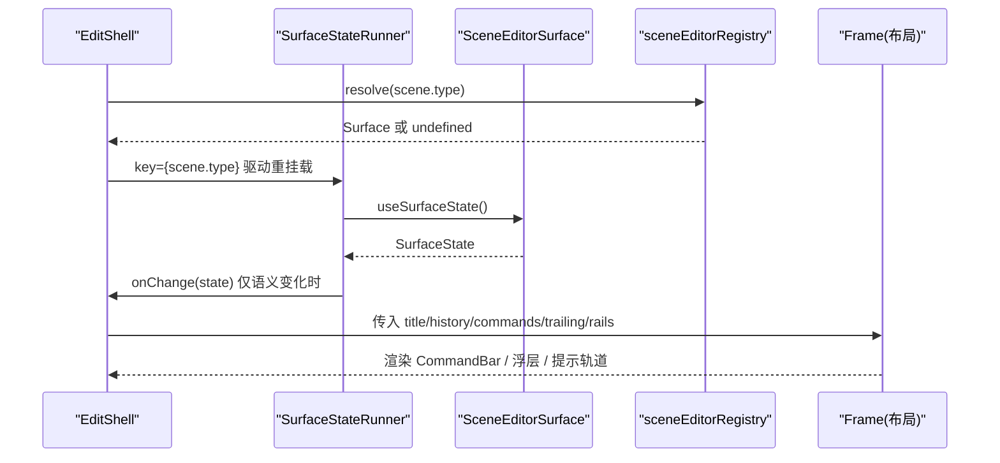
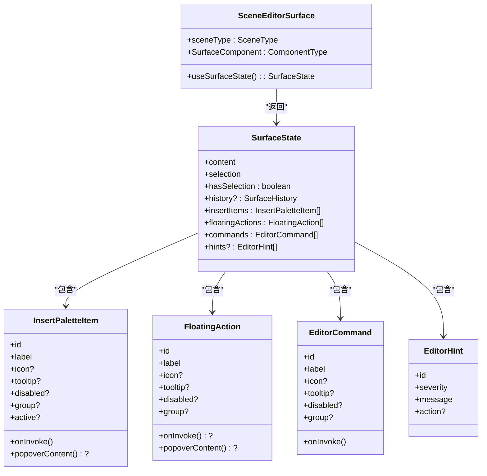

# 编辑外壳框架

<cite>
**本文引用的文件**   
- [EditShell.tsx](file://components/edit/EditShell/EditShell.tsx)
- [CommandBar.tsx](file://components/edit/EditShell/CommandBar.tsx)
- [FloatingToolbar.tsx](file://components/edit/EditShell/FloatingToolbar.tsx)
- [HintRail.tsx](file://components/edit/EditShell/HintRail.tsx)
- [InsertButton.tsx](file://components/edit/EditShell/InsertButton.tsx)
- [FloatingInsertToolbar.tsx](file://components/edit/EditShell/FloatingInsertToolbar.tsx)
- [index.ts](file://components/edit/EditShell/index.ts)
- [scene-editor-surface.ts](file://lib/edit/scene-editor-surface.ts)
- [scene-editor-registry.ts](file://lib/edit/scene-editor-registry.ts)
- [StageGrid.tsx](file://components/edit/StageGrid.tsx)
- [transitions.ts](file://lib/edit/transitions.ts)
</cite>

## 目录
- 产品概述
- 核心业务流程
- 功能模块清单
- 数据与状态
- 关键约束与边界

## 产品概述
本文件面向开发者，系统化阐述 OpenMAIC 的“编辑外壳框架”（EditShell）架构与实现要点。该框架以场景类型无关的方式，将命令栏、浮动工具栏、提示轨道与插入按钮等编辑 UI 统一编排到稳定的布局壳中，并通过插件化的“场景编辑器表面（SceneEditorSurface）”契约，让不同课件类型（如幻灯片、测验、交互式内容等）在不改动外壳的前提下接入编辑能力。其核心价值在于：
- 统一的编辑外壳与布局系统，确保多场景切换时 chrome 不闪烁、交互一致
- 可插拔的表面注册机制，支持快速扩展新的课件编辑模式
- 上下文感知的浮动工具栏与插入面板，提升创作效率
- 预留 AI 提示轨道与国际化、主题适配基础

## 核心业务流程
编辑外壳的核心流程围绕“场景类型解析 → 表面实例化 → 状态订阅 → UI 渲染”展开：
- 根据当前 scene.type 通过注册表解析对应 Surface；未注册则回退为只读 NOOP 表面
- 在隐藏 Runner 中调用 surface.useSurfaceState() 获取 SurfaceState，经浅比较后发布给外壳
- 外壳 Frame 渲染 CommandBar、左右侧轨、中心画布区域，并挂载 FloatingInsertToolbar、FloatingToolbar、HintRail
- 用户操作触发 surface 内部状态变更，重新计算 SurfaceState，外壳按需更新 UI

图表来源
- [EditShell.tsx:74-123](file://components/edit/EditShell/EditShell.tsx#L74-L123)
- [scene-editor-registry.ts:6-25](file://lib/edit/scene-editor-registry.ts#L6-L25)
- [scene-editor-surface.ts:126-145](file://lib/edit/scene-editor-surface.ts#L126-L145)

章节来源
- [EditShell.tsx:74-123](file://components/edit/EditShell/EditShell.tsx#L74-L123)
- [scene-editor-registry.ts:6-25](file://lib/edit/scene-editor-registry.ts#L6-L25)

## 功能模块清单
- EditShell（外壳容器）
  - 职责：按场景类型解析 Surface，维护插入条位置状态，组装 Frame 与各浮层
  - 关键点：key={scene.type} 作为重挂载边界；surfaceStateEqual 避免无限刷新循环
- CommandBar（命令栏）
  - 职责：展示标题、撤销/重做、表面命令、右侧扩展槽（trailing）
  - 关键点：图标按钮带 Tooltip；history 可选，未提供时自动隐藏
- FloatingInsertToolbar（浮动插入工具栏）
  - 职责：左侧边缘持久化插入面板，支持拖拽定位与键盘辅助
  - 关键点：使用 Motion drag + constraints；键盘方向键步进移动
- InsertButton（插入项按钮）
  - 职责：统一渲染插入项（图标/标签/激活态），支持 popoverContent
  - 关键点：asChild 链式组合 Tooltip/Popover，避免事件丢失
- FloatingToolbar（浮动工具栏）
  - 职责：选中内容时显示上下文操作（按钮或属性面板）
  - 关键点：分组渲染；popover 打开时阻止焦点外关闭，保持编辑连续性
- HintRail（提示轨道）
  - 职责：AI 内联教练占位区，预留空间并动态注入高度变量
  - 关键点：ResizeObserver 同步 --editor-hint-rail-height 供 CSS 使用
- StageGrid（五槽布局网格）
  - 职责：top/left/right/bottom/center 命名区域，响应式折叠
  - 关键点：gridTemplateAreas 固定模板，left 跨三行保证对齐
- transitions（过渡常量）
  - 职责：集中管理 chrome 动画时长、缓动曲线与交错延迟
  - 关键点：与外层 Stage 动画保持一致时序

章节来源
- [EditShell.tsx:94-123](file://components/edit/EditShell/EditShell.tsx#L94-L123)
- [CommandBar.tsx:35-84](file://components/edit/EditShell/CommandBar.tsx#L35-L84)
- [FloatingInsertToolbar.tsx:29-114](file://components/edit/EditShell/FloatingInsertToolbar.tsx#L29-L114)
- [InsertButton.tsx:23-76](file://components/edit/EditShell/InsertButton.tsx#L23-L76)
- [FloatingToolbar.tsx:18-37](file://components/edit/EditShell/FloatingToolbar.tsx#L18-L37)
- [HintRail.tsx:17-55](file://components/edit/EditShell/HintRail.tsx#L17-L55)
- [StageGrid.tsx:56-75](file://components/edit/StageGrid.tsx#L56-L75)
- [transitions.ts:12-29](file://lib/edit/transitions.ts#L12-L29)

## 数据与状态
- 表面契约（SceneEditorSurface）
  - 定义 SurfaceComponent 与 useSurfaceState() 钩子，返回 SurfaceState
  - 包含 insertItems、floatingActions、commands、hints、history、selection、content、hasSelection
- 表面状态（SurfaceState）
  - 由 surface hook 每次渲染返回新对象，外壳通过 surfaceStateEqual 进行字段级浅比较，仅当语义变化才 publish
  - 关键字段：content 引用稳定代表未提交；history 的 canUndo/canRedo 单独比较；数组项按 id+flags+label/tooltip 比较
- 注册表（sceneEditorRegistry）
  - register/unregister/resolve 生命周期，HMR 安全，重复注册会警告
- 布局与动画
  - Frame 使用 motion 淡入，CommandBar 与 leftRail 交错延迟；prefers-reduced-motion 降级
  - Grid 模板固定，left 全高，right/bottom 可选

图表来源
- [scene-editor-surface.ts:126-145](file://lib/edit/scene-editor-surface.ts#L126-L145)
- [scene-editor-surface.ts:101-120](file://lib/edit/scene-editor-surface.ts#L101-L120)
- [scene-editor-surface.ts:30-80](file://lib/edit/scene-editor-surface.ts#L30-L80)

章节来源
- [scene-editor-surface.ts:101-145](file://lib/edit/scene-editor-surface.ts#L101-L145)
- [scene-editor-registry.ts:6-25](file://lib/edit/scene-editor-registry.ts#L6-L25)
- [EditShell.tsx:140-226](file://components/edit/EditShell/EditShell.tsx#L140-L226)

## 关键约束与边界
- 组件耦合与职责边界
  - EditShell 不直接依赖具体 surface 实现，仅通过 registry.resolve() 与 Surface 契约交互
  - Frame 仅负责布局与动画，不参与业务逻辑；各浮层组件仅消费 SurfaceState 提供的插槽数据
- 性能与稳定性
  - surfaceStateEqual 防止因引用不稳定导致的无限刷新循环
  - prefers-reduced-motion 降级动画，减少重排与合成压力
  - gridTemplateAreas 静态模板避免运行时样式抖动
- 可扩展性与兼容性
  - 新增 SurfaceState 字段需同步更新 surfaceStateEqual 比较逻辑，否则 chrome 可能显示陈旧值
  - 表面可选择性提供 history/commands/insertItems/hints，外壳具备健壮的空值处理
- 无障碍与国际化
  - 插入按钮与浮动工具栏使用 Tooltip 提供可读文本；InsertButton 支持 aria-label/aria-pressed
  - CommandBar 使用 i18n 钩子渲染文案；插入项 label/tooltip 参与相等性比较，确保语言切换后文案同步
- 主题与暗色模式
  - 组件广泛采用 Tailwind 暗色类名，配合 backdrop-blur 与阴影，保证明暗主题一致性
- 集成点
  - trailing 插槽用于 Stage Header 隐藏时的全局控制（设置、Pro 开关、下载等）
  - rightRail/bottomRail 为未来扩展（属性面板、时间轴）预留

章节来源
- [EditShell.tsx:239-310](file://components/edit/EditShell/EditShell.tsx#L239-L310)
- [CommandBar.tsx:35-84](file://components/edit/EditShell/CommandBar.tsx#L35-L84)
- [FloatingInsertToolbar.tsx:36-66](file://components/edit/EditShell/FloatingInsertToolbar.tsx#L36-L66)
- [stage-grid.tsx:46-75](file://components/edit/StageGrid.tsx#L46-L75)
- [transitions.ts:12-29](file://lib/edit/transitions.ts#L12-L29)