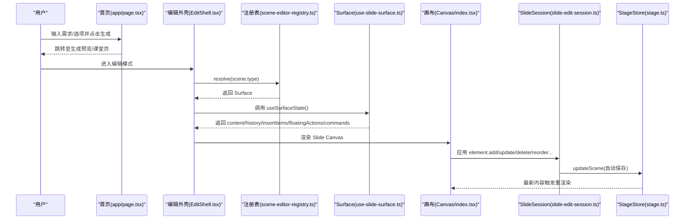
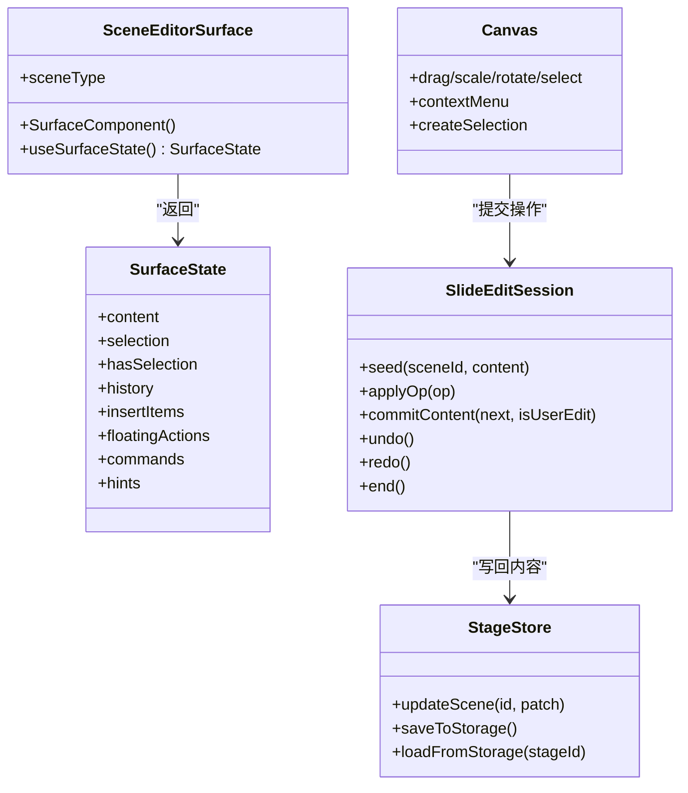
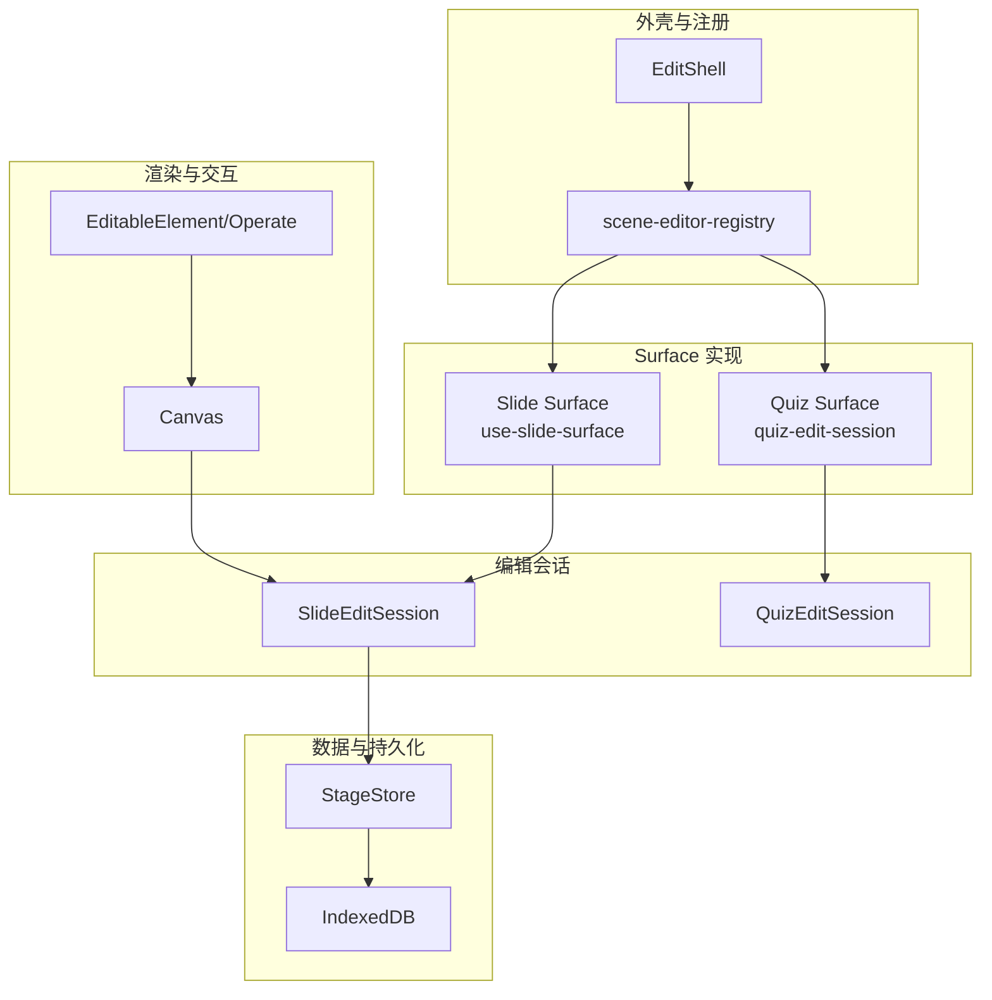
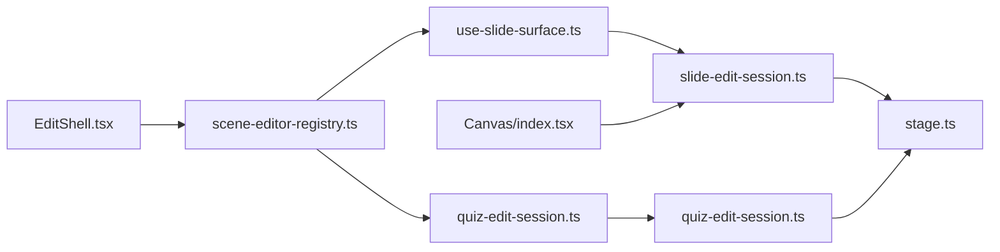

# 编辑器系统

<cite>
**本文引用的文件**   
- [app/page.tsx](file://app/page.tsx)
- [components/edit/EditShell/EditShell.tsx](file://components/edit/EditShell/EditShell.tsx)
- [lib/edit/scene-editor-surface.ts](file://lib/edit/scene-editor-surface.ts)
- [lib/edit/scene-editor-registry.ts](file://lib/edit/scene-editor-registry.ts)
- [components/edit/surfaces/slide/slide-edit-session.ts](file://components/edit/surfaces/slide/slide-edit-session.ts)
- [components/edit/surfaces/quiz/quiz-edit-session.ts](file://components/edit/surfaces/quiz/quiz-edit-session.ts)
- [lib/edit/slide-ops.ts](file://lib/edit/slide-ops.ts)
- [components/slide-renderer/Editor/Canvas/index.tsx](file://components/slide-renderer/Editor/Canvas/index.tsx)
- [components/edit/surfaces/slide/use-slide-surface.ts](file://components/edit/surfaces/slide/use-slide-surface.ts)
- [lib/types/stage.ts](file://lib/types/stage.ts)
- [lib/store/stage.ts](file://lib/store/stage.ts)
</cite>

## 产品概述
OpenMAIC 是一个 AI 驱动的交互式课件（MAIC）生成与课堂管理平台。编辑器系统围绕“幻灯片、测验、交互式 HTML”三类编辑会话构建，提供画布渲染、元素操作、实时预览、撤销重做、属性编辑、布局调整与样式定制等核心能力。前端基于 Next.js + React + Zustand，AI 编排层使用 LangGraph + Vercel AI SDK，课件格式采用自定义 DSL（@openmaic/dsl）。编辑器通过“场景类型注册表 + 表面（Surface）模式”将通用 Chrome（命令栏、插入条、浮动工具栏、提示轨）与具体编辑会话解耦，便于扩展新的场景类型与协作/版本控制机制。

## 核心业务流程
- 首页生成入口：用户在首页输入需求并选择选项后，进入“生成预览”流程，随后进入课堂/教室页面，切换至编辑模式。
- 编辑外壳装配：EditShell 根据当前 Scene.type 解析对应 Surface，挂载统一的 Chrome 与中心渲染区；Surface 暴露 useSurfaceState 返回内容、历史、插入项、浮动动作与命令。
- 幻灯片编辑流：Slide Surface 通过 useSlideCanvasController 建立编辑会话，将用户手势与渲染器提交的操作经 slide-edit-session 写入 stage store，自动持久化。
- 测验编辑流：Quiz Surface 以结构化表单驱动，支持离散结构与文本合并提交，同样通过 session 写入 stage store。
- 交互与预览：Canvas 负责拖拽、缩放、旋转、多选、对齐、标尺网格等；右侧/底部轨道承载命令与时间线；悬浮工具栏在选中时出现。

**章节来源**
- [app/page.tsx](file://app/page.tsx)
- [components/edit/EditShell/EditShell.tsx](file://components/edit/EditShell/EditShell.tsx)
- [lib/edit/scene-editor-registry.ts](file://lib/edit/scene-editor-registry.ts)
- [components/edit/surfaces/slide/use-slide-surface.ts](file://components/edit/surfaces/slide/use-slide-surface.ts)
- [components/slide-renderer/Editor/Canvas/index.tsx](file://components/slide-renderer/Editor/Canvas/index.tsx)
- [components/edit/surfaces/slide/slide-edit-session.ts](file://components/edit/surfaces/slide/slide-edit-session.ts)
- [lib/store/stage.ts](file://lib/store/stage.ts)

## 功能模块清单
- 编辑外壳（EditShell）
  - 职责：统一 Chrome 装配、Surface 解析与状态发布、动画过渡、插槽分发（左/右/下轨道）。
  - 验收要点：不同 scene.type 切换不闪烁；命令栏与轨道稳定挂载；插入条位置可记忆。
- 场景编辑器注册表（scene-editor-registry）
  - 职责：按 SceneType 注册/解析 Surface；HMR 安全覆盖与去注册。
  - 验收要点：重复注册有警告；resolve 返回未注册时的 NOOP_SURFACE。
- 幻灯片 Surface（use-slide-surface）
  - 职责：构建插入项（文本、图片、背景）、浮动动作、命令；管理编辑文本元素 ID 同步；控制器封装 getSnapshot/updateSceneData。
  - 验收要点：图片插入自适应尺寸；背景设置生效；文本编辑聚焦态正确。
- 幻灯片编辑会话（slide-edit-session）
  - 职责：内存级 undo/redo；区分用户手势与非手势提交（ResizeObserver 归一化）；写回 stage store。
  - 验收要点：非用户编辑不清空 future；撤销/重做栈长度限制；无“恢复未保存”UX。
- 测验编辑会话（quiz-edit-session）
  - 职责：结构化编辑与文本合并提交；coalesceKey 控制折叠；undo/redo。
  - 验收要点：同一字段连续输入合并为一步；切换字段开启新步。
- 画布渲染（Canvas）
  - 职责：视口与缩放、元素拖拽/旋转/缩放、多选框、对齐线、标尺/网格、上下文菜单、元素创建选择。
  - 验收要点：快捷键与空格拖拽视口；右键菜单可用；对齐线准确。
- Stage 存储（stage store）
  - 职责：场景增删改查、模式切换、生成状态、持久化（IndexedDB）、PBL 数据准备与还原、去抖保存。
  - 验收要点：更新后自动保存；加载时迁移与自修复；删除场景后保持完成标记。

**章节来源**
- [components/edit/EditShell/EditShell.tsx](file://components/edit/EditShell/EditShell.tsx)
- [lib/edit/scene-editor-registry.ts](file://lib/edit/scene-editor-registry.ts)
- [components/edit/surfaces/slide/use-slide-surface.ts](file://components/edit/surfaces/slide/use-slide-surface.ts)
- [components/edit/surfaces/slide/slide-edit-session.ts](file://components/edit/surfaces/slide/slide-edit-session.ts)
- [components/edit/surfaces/quiz/quiz-edit-session.ts](file://components/edit/surfaces/quiz/quiz-edit-session.ts)
- [components/slide-renderer/Editor/Canvas/index.tsx](file://components/slide-renderer/Editor/Canvas/index.tsx)
- [lib/store/stage.ts](file://lib/store/stage.ts)

## 数据与状态
- 核心数据模型
  - SceneContent：包含 slide、quiz 以及应用扩展的 interactive/pbl。
  - SlideContent：canvas.elements、animations、viewportSize/ratio、background 等。
  - QuizContent：问题与选项的结构化集合。
  - InteractiveContent：URL/html 与 widget 配置。
  - PBLContent：项目配置与 v2 载荷。
- 关键状态流转
  - EditShell 通过 registry.resolve(scene.type) 获取 Surface，调用 useSurfaceState 得到 content/history/selection/insertItems/floatingActions/commands。
  - Slide Surface 的 controller.updateSceneData 通过 produce 生成 next，交由 slide-edit-session.commitContent(isUserEdit) 决定是否入栈。
  - slide-edit-session 将 present 写回 stage store.updateScene，触发全局订阅者重渲染。
  - Canvas 读取 elements 并通过本地 ref/state 处理交互，最终通过 session.applyOp 或 controller 提交变更。
- 数据所有权边界
  - 唯一真实源：stage store（持久化）。
  - 编辑会话：内存中的 past/present/future 仅用于撤销重做与即时预览。
  - 渲染层：只读快照与局部 UI 状态（如鼠标选择、创建中元素）。

**图表来源**
- [lib/edit/scene-editor-surface.ts](file://lib/edit/scene-editor-surface.ts)
- [components/edit/surfaces/slide/slide-edit-session.ts](file://components/edit/surfaces/slide/slide-edit-session.ts)
- [lib/store/stage.ts](file://lib/store/stage.ts)
- [components/slide-renderer/Editor/Canvas/index.tsx](file://components/slide-renderer/Editor/Canvas/index.tsx)

**章节来源**
- [lib/types/stage.ts](file://lib/types/stage.ts)
- [components/edit/EditShell/EditShell.tsx](file://components/edit/EditShell/EditShell.tsx)
- [components/edit/surfaces/slide/use-slide-surface.ts](file://components/edit/surfaces/slide/use-slide-surface.ts)
- [components/edit/surfaces/slide/slide-edit-session.ts](file://components/edit/surfaces/slide/slide-edit-session.ts)
- [lib/store/stage.ts](file://lib/store/stage.ts)

## 关键约束与边界
- 非功能性需求
  - 撤销重做历史上限：MAX_HISTORY=50，避免长会话内存膨胀。
  - 性能优化：useLayoutEffect 减少闪烁；语义相等比较防止无限发布循环；store 去抖保存 500ms。
  - 渲染隔离：Chrome 与 Surface 分离，切换 scene.type 不重挂载 chrome。
- 依赖与集成边界
  - 场景类型由 @openmaic/dsl 定义，应用扩展（interactive/pbl）在 app 层组合。
  - 持久化通过 IndexedDB（stage-storage/database），PBL 数据需序列化/反序列化。
- 业务约束
  - 编辑模式下禁止与生成流程冲突（edit-mode lock）。
  - 非用户手势提交（如 ResizeObserver 归一化）不入栈但会写回 present。
  - 删除场景后保持 generationComplete 标记一致性。

**章节来源**
- [lib/edit/slide-ops.ts](file://lib/edit/slide-ops.ts)
- [lib/store/stage.ts](file://lib/store/stage.ts)
- [components/edit/EditShell/EditShell.tsx](file://components/edit/EditShell/EditShell.tsx)

## 架构总览

**图表来源**
- [components/edit/EditShell/EditShell.tsx](file://components/edit/EditShell/EditShell.tsx)
- [lib/edit/scene-editor-registry.ts](file://lib/edit/scene-editor-registry.ts)
- [components/edit/surfaces/slide/use-slide-surface.ts](file://components/edit/surfaces/slide/use-slide-surface.ts)
- [components/edit/surfaces/quiz/quiz-edit-session.ts](file://components/edit/surfaces/quiz/quiz-edit-session.ts)
- [components/slide-renderer/Editor/Canvas/index.tsx](file://components/slide-renderer/Editor/Canvas/index.tsx)
- [lib/store/stage.ts](file://lib/store/stage.ts)

## 详细组件分析

### 编辑外壳（EditShell）
- 设计要点
  - 通过 key={scene.type} 作为 remount 边界，确保 Surface hook 签名变化时符合规则。
  - SurfaceStateRunner 使用浅比较 surfaceStateEqual 避免无限发布循环。
  - Frame 使用纯 opacity 过渡，避免 backdrop-filter 重计算导致的掉帧。
- 扩展点
  - leftRail/rightRail/bottomRail 插槽；commandTrailing 注入全局控制。
  - 新增 Surface 只需实现 SceneEditorSurface 接口并在注册表中注册。

**章节来源**
- [components/edit/EditShell/EditShell.tsx](file://components/edit/EditShell/EditShell.tsx)
- [lib/edit/scene-editor-surface.ts](file://lib/edit/scene-editor-surface.ts)

### 场景编辑器注册表（scene-editor-registry）
- 行为
  - register/unregister/resolve 维护 Map<SceneType, Surface>。
  - HMR 环境下重复注册会发出警告。
- 使用方式
  - 各 Surface 在模块初始化时 self-register。

**章节来源**
- [lib/edit/scene-editor-registry.ts](file://lib/edit/scene-editor-registry.ts)

### 幻灯片 Surface（use-slide-surface）
- 插入项
  - 文本（toggle creatingElement）、图片（popover 选择器）、背景（popover 控制面板）。
- 控制器
  - getSnapshot 从 stage store 读取；updateSceneData 通过 produce 生成 next 并提交到 session。
- 文本编辑
  - useEditingTextElementId 与 useSyncEditingElementId 同步 ProseMirror 焦点与富文本属性。

**章节来源**
- [components/edit/surfaces/slide/use-slide-surface.ts](file://components/edit/surfaces/slide/use-slide-surface.ts)

### 幻灯片编辑会话（slide-edit-session）
- 提交策略
  - isUserEdit=true：push 新步骤；isUserEdit=false：仅替换 present 并清空 future。
- 写回
  - writeThrough 直接调用 stage store.updateScene，保证渲染订阅者立即看到最新内容。

**章节来源**
- [components/edit/surfaces/slide/slide-edit-session.ts](file://components/edit/surfaces/slide/slide-edit-session.ts)

### 测验编辑会话（quiz-edit-session）
- 提交策略
  - commit：离散结构变更，总是新步骤。
  - commitText：同 coalesceKey 的连续输入折叠为一步，每次按键仍写回。

**章节来源**
- [components/edit/surfaces/quiz/quiz-edit-session.ts](file://components/edit/surfaces/quiz/quiz-edit-session.ts)

### 画布渲染（Canvas）
- 交互能力
  - 拖拽、缩放、旋转、线段端点移动、形状关键点移动、多选框、对齐线、标尺/网格、右键菜单。
- 性能
  - 局部元素列表 ref 与 state 同步，减少不必要重渲染。
  - 视口缩放与 transform 合成，避免布局抖动。

**章节来源**
- [components/slide-renderer/Editor/Canvas/index.tsx](file://components/slide-renderer/Editor/Canvas/index.tsx)

### Stage 存储（stage store）
- 能力
  - 场景 CRUD、模式切换、生成状态跟踪、去抖保存、PBL 数据准备/还原、媒体 URL 标准化。
- 一致性
  - 加载时迁移 schemaVersion；自修复 generationComplete；删除场景后维持完成标记。

**章节来源**
- [lib/store/stage.ts](file://lib/store/stage.ts)

## 依赖分析

**图表来源**
- [components/edit/EditShell/EditShell.tsx](file://components/edit/EditShell/EditShell.tsx)
- [lib/edit/scene-editor-registry.ts](file://lib/edit/scene-editor-registry.ts)
- [components/edit/surfaces/slide/use-slide-surface.ts](file://components/edit/surfaces/slide/use-slide-surface.ts)
- [components/edit/surfaces/quiz/quiz-edit-session.ts](file://components/edit/surfaces/quiz/quiz-edit-session.ts)
- [components/slide-renderer/Editor/Canvas/index.tsx](file://components/slide-renderer/Editor/Canvas/index.tsx)
- [lib/store/stage.ts](file://lib/store/stage.ts)

**章节来源**
- [lib/edit/scene-editor-registry.ts](file://lib/edit/scene-editor-registry.ts)
- [components/edit/EditShell/EditShell.tsx](file://components/edit/EditShell/EditShell.tsx)
- [lib/store/stage.ts](file://lib/store/stage.ts)

## 性能考虑
- 撤销历史上限 MAX_HISTORY=50，避免内存增长。
- SurfaceState 语义相等比较，避免每渲染都发布导致无限循环。
- store 去抖保存 500ms，降低 IndexedDB 写入频率。
- 视图层使用 transform 缩放与 opacity 过渡，减少重排与重绘。
- 局部元素列表缓存与选择性订阅（useSceneSelector）提升渲染效率。

**章节来源**
- [lib/edit/slide-ops.ts](file://lib/edit/slide-ops.ts)
- [components/edit/EditShell/EditShell.tsx](file://components/edit/EditShell/EditShell.tsx)
- [lib/store/stage.ts](file://lib/store/stage.ts)

## 故障排查指南
- 无法撤销/重做
  - 检查 slide-edit-session 是否 seed 成功；确认 isUserEdit 分支逻辑。
- 图片插入错位或尺寸异常
  - 确认 insertImageElement 的 onload/onerror 路径；检查目标 sceneId 是否一致。
- 撤销栈被意外清空
  - 非用户提交（ResizeObserver）会清空 future，属预期；避免误判为 bug。
- 保存失败或丢失
  - 查看 debouncedSave 是否触发；检查 IndexedDB 写入是否抛错；确认 saveToStorage 返回值。

**章节来源**
- [components/edit/surfaces/slide/slide-edit-session.ts](file://components/edit/surfaces/slide/slide-edit-session.ts)
- [components/edit/surfaces/slide/use-slide-surface.ts](file://components/edit/surfaces/slide/use-slide-surface.ts)
- [lib/store/stage.ts](file://lib/store/stage.ts)

## 结论
本编辑器系统以“注册表 + Surface”为核心架构，将通用外壳与具体编辑会话解耦，配合内存级撤销重做与 stage store 的统一数据源，实现了可扩展、高性能、易维护的编辑体验。未来可在 Surface 层扩展更多场景类型（如 PBL、Interactive），并在 stage store 之上叠加协作编辑、版本控制与数据同步机制。