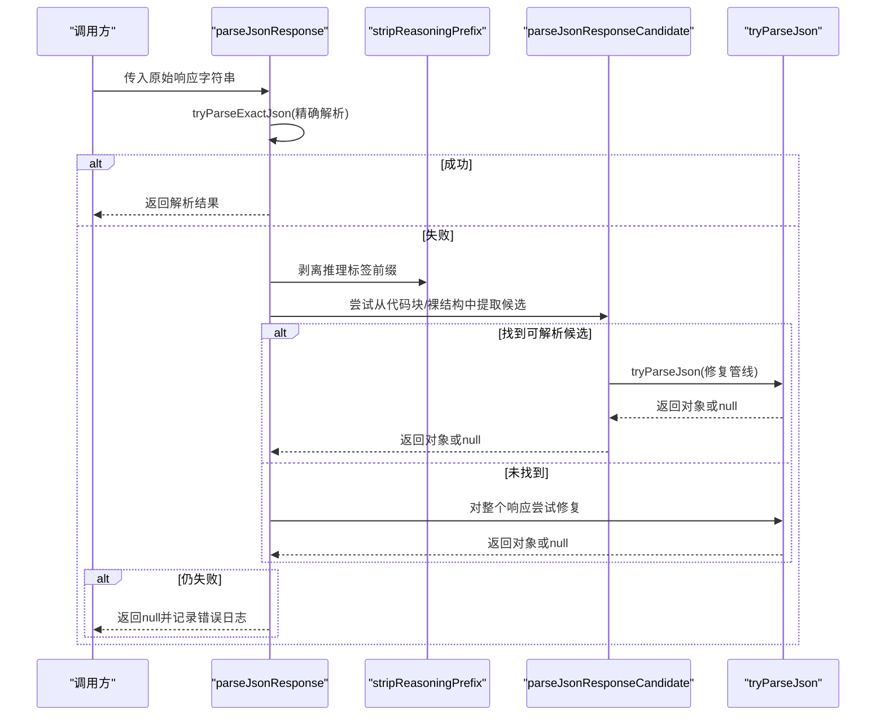
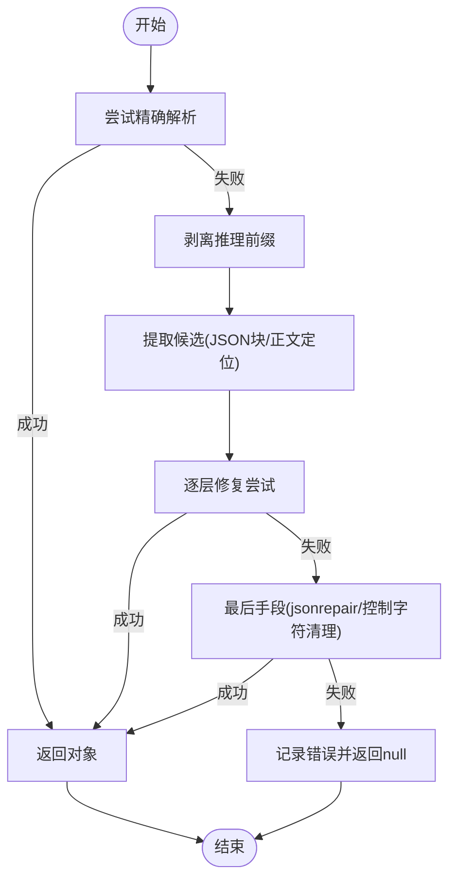

# JSON 修复机制

<cite>
**本文引用的文件**   
- [lib/generation/json-repair.ts](file://lib/generation/json-repair.ts)
- [tests/generation/json-repair.test.ts](file://tests/generation/json-repair.test.ts)
- [lib/pbl/v2/operations/eval-tail-parser.ts](file://lib/pbl/v2/operations/eval-tail-parser.ts)
- [lib/ai/providers.ts](file://lib/ai/providers.ts)
</cite>

## 产品概述
本文件聚焦于 OpenMAIC 项目中与“AI 生成文本到结构化 JSON”相关的容错与修复能力。核心目标是：在 LLM 输出不可靠（包含推理片段、代码块、不完整或转义异常等）时，仍能稳定解析出可用的 JSON 对象，从而驱动课件生成、评估与回放等关键流程。该机制通过分层解析策略、自动修复算法与严格的日志记录，显著降低上游模型输出的不确定性对系统的影响。

## 核心业务流程
- 入口函数 parseJsonResponse 负责整体解析流程编排：先尝试精确解析，再剥离推理前缀后重试，随后按优先级尝试多种候选片段提取与修复，最终失败时输出详细日志并返回空值。
- 底层 tryParseJson 提供多阶段修复管线：直接解析 → 常见 AI 问题修复（属性片段、LaTeX 转义、控制字符、截断补全）→ 第三方 jsonrepair 修复 → 控制字符清理兜底。
- 上层调用方（如评测尾部解析器）会先抽取可能的 JSON 候选（代码块、裸尾随对象），再统一交由 parseJsonResponse 处理，确保一致的容错体验。

**图表来源** 
- [lib/generation/json-repair.ts:35-56](file://lib/generation/json-repair.ts#L35-L56)
- [lib/generation/json-repair.ts:76-161](file://lib/generation/json-repair.ts#L76-L161)
- [lib/generation/json-repair.ts:166-266](file://lib/generation/json-repair.ts#L166-L266)

**章节来源**
- [lib/generation/json-repair.ts:35-56](file://lib/generation/json-repair.ts#L35-L56)
- [lib/generation/json-repair.ts:76-161](file://lib/generation/json-repair.ts#L76-L161)
- [lib/generation/json-repair.ts:166-266](file://lib/generation/json-repair.ts#L166-L266)

## 功能模块清单
- 精确解析与快速路径
  - 职责：优先使用原生 JSON.parse 进行零成本解析，命中则直接返回。
  - 验收要点：对标准 JSON 输入应无额外开销且正确返回。
- 推理前缀剥离
  - 职责：识别并移除 </think>、</thinking>、</reasoning> 等标签及其前后空白，避免干扰后续解析。
  - 验收要点：保留 JSON 字符串内的字面量标签；仅作用于文本前缀。
- 候选提取与定位
  - 职责：从 Markdown 代码块中抽取 JSON；若无代码块，则在正文中定位首个 { 或 [ 并匹配闭合括号，得到候选子串。
  - 验收要点：正确处理嵌套结构与字符串内转义；优先选择最先出现的结构。
- 修复管线（tryParseJson）
  - 职责：依次执行多项修复策略，包括属性片段修正、LaTeX 转义修复、无效转义清理、截断数组/对象补全、jsonrepair 兜底、控制字符清理。
  - 验收要点：每项修复需保证不破坏合法内容；失败时应继续尝试下一项。
- 日志与诊断
  - 职责：记录各阶段的解析错误位置与上下文片段，便于定位问题。
  - 验收要点：错误信息包含位置、上下文切片与阶段标识。

**章节来源**
- [lib/generation/json-repair.ts:9-14](file://lib/generation/json-repair.ts#L9-L14)
- [lib/generation/json-repair.ts:66-74](file://lib/generation/json-repair.ts#L66-L74)
- [lib/generation/json-repair.ts:76-161](file://lib/generation/json-repair.ts#L76-L161)
- [lib/generation/json-repair.ts:166-266](file://lib/generation/json-repair.ts#L166-L266)
- [lib/generation/json-repair.ts:16-33](file://lib/generation/json-repair.ts#L16-L33)

## 数据与状态
- 输入
  - 原始响应字符串（可能包含推理文本、Markdown 代码块、非 JSON 叙述、转义异常、截断等）。
- 中间状态
  - 候选字符串集合（来自代码块、正文定位、完整响应）。
  - 已修复的字符串（逐步应用修复规则）。
- 输出
  - 解析后的对象或 null；失败时附带详细日志。

**图表来源** 
- [lib/generation/json-repair.ts:35-56](file://lib/generation/json-repair.ts#L35-L56)
- [lib/generation/json-repair.ts:76-161](file://lib/generation/json-repair.ts#L76-L161)
- [lib/generation/json-repair.ts:166-266](file://lib/generation/json-repair.ts#L166-L266)

**章节来源**
- [lib/generation/json-repair.ts:35-56](file://lib/generation/json-repair.ts#L35-L56)
- [lib/generation/json-repair.ts:76-161](file://lib/generation/json-repair.ts#L76-L161)
- [lib/generation/json-repair.ts:166-266](file://lib/generation/json-repair.ts#L166-L266)

## 关键约束与边界
- 支持的修复类型与优先级
  - 属性片段修正：将形如 "height: 76" 的误发片段转换为键值对。
  - LaTeX 转义修复：对字符串中的反斜杠+字母进行安全转义，同时保留合法的 JSON 转义序列。
  - 无效转义清理：对非法转义字符进行最小化修正。
  - 截断补全：为未闭合的数组/对象追加缺失的闭合符。
  - 第三方修复：调用 jsonrepair 进行更广泛的语法修复。
  - 控制字符清理：移除或转义控制字符，作为最后兜底。
- 错误检测与验证
  - 每阶段均捕获异常并记录位置与上下文，便于定位。
  - 仅在确认无法恢复时返回 null，避免静默失败。
- 性能优化
  - 优先快速路径（精确解析），减少不必要的修复开销。
  - 候选提取采用线性扫描与括号深度计数，避免昂贵的正则回溯。
  - 修复策略按“低成本到高代价”排序，尽早命中即短路。
- 集成边界
  - 上层模块（如评测尾部解析器）依赖统一的 parseJsonResponse，确保一致行为。
  - 其他组件（如 OpenAI 兼容路径）在发现非法 JSON 时仅记录警告，不改变响应体，由消费端决定如何处理。

**章节来源**
- [lib/generation/json-repair.ts:9-14](file://lib/generation/json-repair.ts#L9-L14)
- [lib/generation/json-repair.ts:186-208](file://lib/generation/json-repair.ts#L186-L208)
- [lib/generation/json-repair.ts:210-226](file://lib/generation/json-repair.ts#L210-L226)
- [lib/generation/json-repair.ts:234-241](file://lib/generation/json-repair.ts#L234-L241)
- [lib/generation/json-repair.ts:243-266](file://lib/generation/json-repair.ts#L243-L266)
- [lib/pbl/v2/operations/eval-tail-parser.ts:56-79](file://lib/pbl/v2/operations/eval-tail-parser.ts#L56-L79)
- [lib/ai/providers.ts:1617-1636](file://lib/ai/providers.ts#L1617-L1636)

## 实际修复示例与常见问题模式
- 属性片段误发
  - 现象：对象中出现 "height: 76" 而非 "height": 76。
  - 处理：修复为键值对，保持其他字段不变。
  - 参考用例：[tests/generation/json-repair.test.ts:6-34](file://tests/generation/json-repair.test.ts#L6-L34)
- 布尔属性片段
  - 现象："fixedRatio: false" 被当作字符串片段。
  - 处理：转为键值对，不影响正常字符串字段。
  - 参考用例：[tests/generation/json-repair.test.ts:36-56](file://tests/generation/json-repair.test.ts#L36-L56)
- 推理前缀干扰
  - 现象：响应以 </think> 等标签开头，其后才是 JSON。
  - 处理：剥离标签前缀后再解析。
  - 参考用例：[tests/generation/json-repair.test.ts:58-83](file://tests/generation/json-repair.test.ts#L58-L83)
- 字符串内字面量标签保护
  - 现象：JSON 字符串中包含 <think> 等字面量。
  - 处理：仅作用于前缀，不修改字符串内部内容。
  - 参考用例：[tests/generation/json-repair.test.ts:98-104](file://tests/generation/json-repair.test.ts#L98-L104)
- LaTeX 转义与无效转义
  - 现象：数学公式中的 \frac、\left 等导致解析失败。
  - 处理：对非 JSON 转义的字母进行安全转义。
  - 实现位置：[lib/generation/json-repair.ts:186-208](file://lib/generation/json-repair.ts#L186-L208)
- 截断数组/对象
  - 现象：响应被截断，缺少闭合符。
  - 处理：统计开闭括号数量并补齐。
  - 实现位置：[lib/generation/json-repair.ts:210-226](file://lib/generation/json-repair.ts#L210-L226)
- 控制字符污染
  - 现象：包含不可见控制字符导致解析失败。
  - 处理：移除或转义控制字符。
  - 实现位置：[lib/generation/json-repair.ts:243-266](file://lib/generation/json-repair.ts#L243-L266)

**章节来源**
- [tests/generation/json-repair.test.ts:6-34](file://tests/generation/json-repair.test.ts#L6-L34)
- [tests/generation/json-repair.test.ts:36-56](file://tests/generation/json-repair.test.ts#L36-L56)
- [tests/generation/json-repair.test.ts:58-83](file://tests/generation/json-repair.test.ts#L58-L83)
- [tests/generation/json-repair.test.ts:98-104](file://tests/generation/json-repair.test.ts#L98-L104)
- [lib/generation/json-repair.ts:186-208](file://lib/generation/json-repair.ts#L186-L208)
- [lib/generation/json-repair.ts:210-226](file://lib/generation/json-repair.ts#L210-L226)
- [lib/generation/json-repair.ts:243-266](file://lib/generation/json-repair.ts#L243-L266)

## 调试方法
- 启用日志观察
  - 查看各阶段错误日志，关注 position 与上下文切片，定位具体失败点。
  - 相关实现：[lib/generation/json-repair.ts:16-33](file://lib/generation/json-repair.ts#L16-L33)
- 检查上游响应
  - 对于 OpenAI 兼容路径，若检测到非法 JSON，会记录警告但不改变响应体，便于排查。
  - 相关实现：[lib/ai/providers.ts:1617-1636](file://lib/ai/providers.ts#L1617-L1636)
- 单元测试覆盖
  - 针对常见错误模式编写用例，确保修复策略有效且不破坏合法输入。
  - 参考用例：[tests/generation/json-repair.test.ts:1-106](file://tests/generation/json-repair.test.ts#L1-L106)

**章节来源**
- [lib/generation/json-repair.ts:16-33](file://lib/generation/json-repair.ts#L16-L33)
- [lib/ai/providers.ts:1617-1636](file://lib/ai/providers.ts#L1617-L1636)
- [tests/generation/json-repair.test.ts:1-106](file://tests/generation/json-repair.test.ts#L1-L106)

## 扩展指南（自定义修复规则）
- 新增修复步骤
  - 在 tryParseJson 的修复管线中插入新的替换逻辑，遵循“低风险优先”的原则。
  - 建议添加对应的单元测试，覆盖典型输入与边界情况。
- 候选提取增强
  - 若存在新的 JSON 包裹格式（如新标记语言），可在 parseJsonResponseCandidate 中增加对应提取逻辑。
- 日志与可观测性
  - 为新修复步骤添加 log.warn/log.debug，便于追踪命中率与副作用。
- 与上层模块协同
  - 确保上层调用方（如评测尾部解析器）继续使用统一的 parseJsonResponse，避免行为漂移。

**章节来源**
- [lib/generation/json-repair.ts:166-266](file://lib/generation/json-repair.ts#L166-L266)
- [lib/generation/json-repair.ts:76-161](file://lib/generation/json-repair.ts#L76-L161)
- [lib/pbl/v2/operations/eval-tail-parser.ts:56-79](file://lib/pbl/v2/operations/eval-tail-parser.ts#L56-L79)