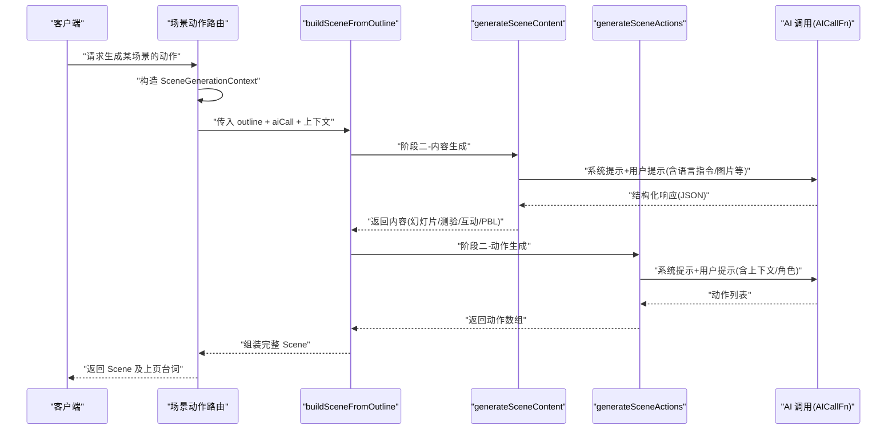
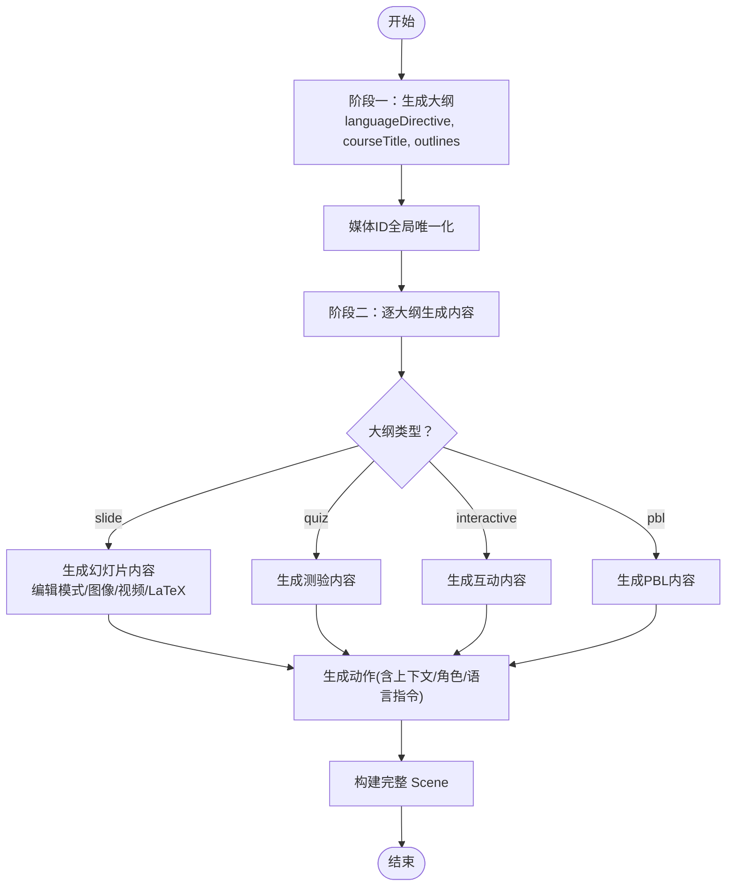
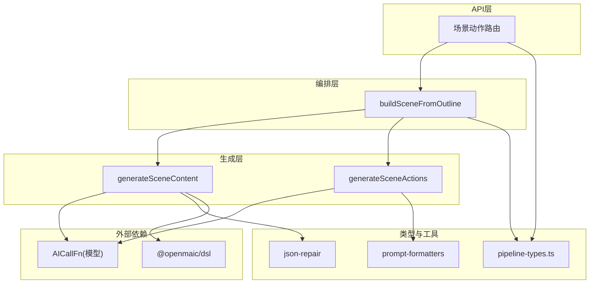
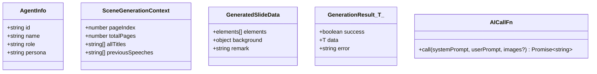
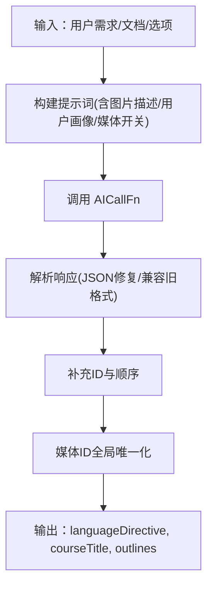
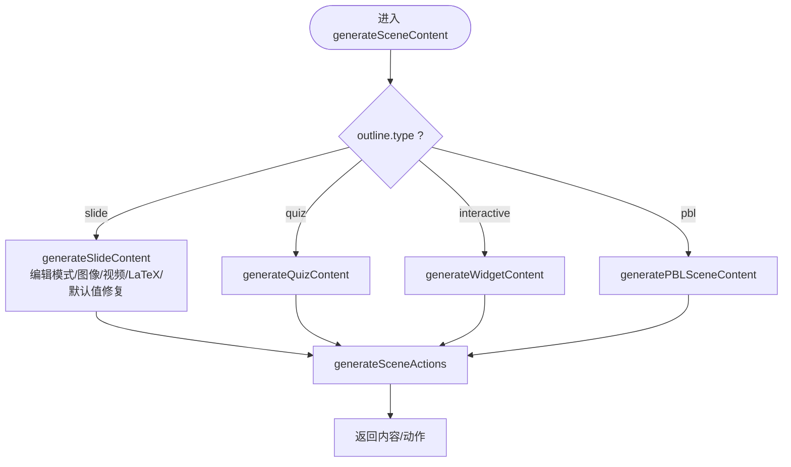
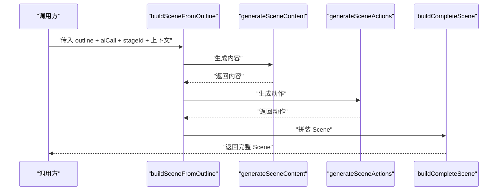
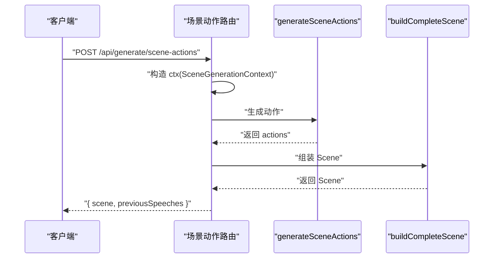
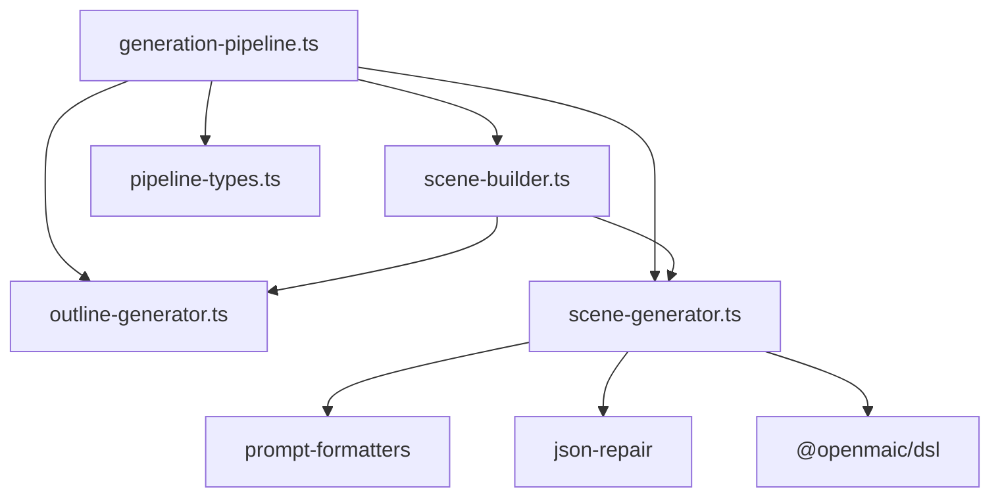

# 两阶段生成流水线

<cite>
**本文引用的文件**   
- [pipeline-types.ts](file://lib/generation/pipeline-types.ts)
- [outline-generator.ts](file://lib/generation/outline-generator.ts)
- [scene-generator.ts](file://lib/generation/scene-generator.ts)
- [scene-builder.ts](file://lib/generation/scene-builder.ts)
- [generation-pipeline.ts](file://lib/generation/generation-pipeline.ts)
- [route.ts（场景动作）](file://app/api/generate/scene-actions/route.ts)
- [resolve-scene-outline.ts](file://lib/agent/client/resolve-scene-outline.ts)
- [slide-edit-directive.test.ts](file://tests/generation/slide-edit-directive.test.ts)
- [scene-generator-language-directive.test.ts](file://tests/generation/scene-generator-language-directive.test.ts)
</cite>

## 产品概述
本仓库实现了“两阶段生成流水线”，用于将用户的自然语言需求自动转化为结构化的课件场景，并进一步生成可交互的演示内容。第一阶段基于用户输入与可选文档素材生成“场景大纲”；第二阶段基于每个大纲分别生成“场景内容”和“场景动作”，最终拼装为完整的 Scene 对象供渲染与回放使用。该流水线贯穿了数据流转、状态管理、错误处理与可扩展的 AI 调用接口，便于初学者理解设计思路，也为开发者提供清晰的扩展点。

## 核心业务流程
- 阶段一：从用户需求生成场景大纲（含语言指令、课程标题、各场景的类型与要点），并对媒体占位符进行全局唯一化。
- 阶段二：对每个大纲依次生成内容与动作，期间维护跨页上下文以保证演讲连贯性，最终组装为完整 Scene。
- 入口与编排：通过构建器统一编排两阶段流程，暴露回调以感知阶段切换；API 层负责上下文构造、日志与错误处理。

**图表来源** 
- [route.ts（场景动作）:136-184](file://app/api/generate/scene-actions/route.ts#L136-L184)
- [scene-builder.ts:68-124](file://lib/generation/scene-builder.ts#L68-L124)
- [scene-generator.ts:197-276](file://lib/generation/scene-generator.ts#L197-L276)

**章节来源**
- [route.ts（场景动作）:136-184](file://app/api/generate/scene-actions/route.ts#L136-L184)
- [scene-builder.ts:68-124](file://lib/generation/scene-builder.ts#L68-L124)

## 功能模块清单
- 类型定义（pipeline-types.ts）
  - AgentInfo：轻量智能体信息，注入到提示词中影响风格与角色。
  - SceneGenerationContext：跨页上下文（当前页码、总页数、所有标题、上一页台词），保障演讲连贯。
  - GeneratedSlideData：AI 生成的幻灯片元素与背景描述，作为中间结构被规范化。
  - GenerationResult<T>：通用成功/失败结果包装，用于阶段一的统一返回。
  - AICallFn：AI 调用抽象，允许替换不同模型或模拟实现，便于测试与扩展。
- 阶段一：大纲生成（outline-generator.ts）
  - 根据用户需求、PDF 文本/图片、是否启用视觉模式等，生成语言指令、课程标题与场景大纲数组。
  - 对媒体占位符 ID 进行全局唯一化，避免跨课程冲突。
  - 提供降级策略（如旧格式兼容、类型回退）。
- 阶段二：场景生成（scene-generator.ts）
  - 按大纲类型分发：幻灯片、测验、互动、PBL。
  - 幻灯片分支支持编辑模式（editDirective + baselineContent）、图像/视频占位解析、LaTeX 渲染、元素默认值修复。
  - 动作生成结合跨页上下文、角色信息与语言指令，输出可执行动作序列。
- 场景构建（scene-builder.ts）
  - 统一编排阶段二的内容与动作生成，封装为完整 Scene。
  - 对外暴露 buildSceneFromOutline 与 buildCompleteScene，便于 SSE 流式与无状态调用。
- 聚合导出（generation-pipeline.ts）
  - 集中重导出类型、工具函数与子模块能力，形成统一的生成管线入口。

**章节来源**
- [pipeline-types.ts:1-65](file://lib/generation/pipeline-types.ts#L1-L65)
- [outline-generator.ts:36-160](file://lib/generation/outline-generator.ts#L36-L160)
- [scene-generator.ts:197-276](file://lib/generation/scene-generator.ts#L197-L276)
- [scene-builder.ts:68-124](file://lib/generation/scene-builder.ts#L68-L124)
- [generation-pipeline.ts:1-47](file://lib/generation/generation-pipeline.ts#L1-L47)

## 数据与状态
- 核心数据模型
  - 阶段一输出：包含 languageDirective、courseTitle、outlines（SceneOutline[]），并由 uniquifyMediaElementIds 保证媒体 ID 全局唯一。
  - 阶段二输入：SceneOutline（含类型、标题、要点、可选配置与媒体占位），以及可选的图片映射、语言指令、角色信息等。
  - 阶段二输出：内容（GeneratedSlideContent / GeneratedQuizContent / GeneratedInteractiveContent / GeneratedPBLContent）与动作（Action[]），最终拼装为 Scene。
- 关键状态流转
  - SceneGenerationContext 在动作生成时传递，包含 pageIndex、totalPages、allTitles、previousSpeeches，确保跨页台词连贯。
  - 编辑模式下，baselineContent 与 editDirective 共同驱动“基于现有幻灯片的重绘/修订”，保持元素一致性。
- 数据所有权边界
  - 大纲由阶段一产出，阶段二仅消费；Scene 由构建器产出，不依赖存储，适合流式传输与无状态调用。
  - 媒体资源通过 imageMapping 与 generatedMediaMapping 分离“已分配图片”和“生成媒体占位”，避免大体积数据进入提示。

**图表来源** 
- [outline-generator.ts:36-160](file://lib/generation/outline-generator.ts#L36-L160)
- [scene-generator.ts:197-276](file://lib/generation/scene-generator.ts#L197-L276)
- [scene-builder.ts:68-124](file://lib/generation/scene-builder.ts#L68-L124)

**章节来源**
- [outline-generator.ts:36-160](file://lib/generation/outline-generator.ts#L36-L160)
- [scene-generator.ts:197-276](file://lib/generation/scene-generator.ts#L197-L276)
- [scene-builder.ts:68-124](file://lib/generation/scene-builder.ts#L68-L124)

## 关键约束与边界
- 非功能性需求
  - 稳定性：JSON 响应需经修复与校验，异常元素会被丢弃而非崩溃。
  - 性能：图像/视频占位采用 ID 引用，避免大体积数据进入提示；视觉模式限制最大图片数量。
  - 可观测性：关键步骤记录日志，便于定位问题。
- 依赖与集成边界
  - AI 调用通过 AICallFn 抽象，可替换为真实模型或测试桩。
  - DSL 规范由 @openmaic/dsl 提供，元素规范化与默认值填充委托给 DSL。
- 业务约束
  - 交互式与 PBL 类型需要相应配置或语言模型能力，否则回退为幻灯片。
  - 编辑模式仅作用于幻灯片类型，其他类型忽略 editDirective。
  - 跨页上下文仅在上页台词范围内传递，避免污染后续页面。

**章节来源**
- [scene-generator.ts:562-784](file://lib/generation/scene-generator.ts#L562-L784)
- [outline-generator.ts:187-214](file://lib/generation/outline-generator.ts#L187-L214)
- [scene-builder.ts:133-145](file://lib/generation/scene-builder.ts#L133-L145)

## 架构概览
两阶段流水线通过“构建器 + 生成器 + 类型抽象”解耦，API 层负责上下文与错误处理，DSL 层负责元素标准化。

**图表来源** 
- [generation-pipeline.ts:1-47](file://lib/generation/generation-pipeline.ts#L1-L47)
- [scene-builder.ts:68-124](file://lib/generation/scene-builder.ts#L68-L124)
- [scene-generator.ts:197-276](file://lib/generation/scene-generator.ts#L197-L276)
- [pipeline-types.ts:1-65](file://lib/generation/pipeline-types.ts#L1-L65)

## 详细组件分析

### 类型体系与作用关系（pipeline-types.ts）
- AgentInfo：轻量角色信息，注入到提示词中以影响生成风格与对话语气。
- SceneGenerationContext：跨页上下文，包含当前页码、总页数、全部标题与上一页台词，用于动作生成时的连贯性控制。
- GeneratedSlideData：AI 输出的幻灯片元素与背景描述，作为中间结构被规范化与修复。
- GenerationResult<T>：统一的成功/失败包装，常用于阶段一的大纲生成结果。
- AICallFn：AI 调用抽象，签名接受系统提示、用户提示与可选图片数组，返回字符串响应。

**图表来源** 
- [pipeline-types.ts:1-65](file://lib/generation/pipeline-types.ts#L1-L65)

**章节来源**
- [pipeline-types.ts:1-65](file://lib/generation/pipeline-types.ts#L1-L65)

### 阶段一：大纲生成（outline-generator.ts）
- 输入：UserRequirements、PDF 文本/图片、是否启用视觉模式、教师上下文等。
- 处理：构建提示词，调用 AI 生成语言指令、课程标题与大纲数组；对媒体占位符 ID 进行全局唯一化。
- 输出：GenerationResult<{ languageDirective, courseTitle, outlines }>。
- 降级：兼容旧格式、类型回退（interactive/pbl 缺失配置时回退为 slide）。

**图表来源** 
- [outline-generator.ts:36-160](file://lib/generation/outline-generator.ts#L36-L160)

**章节来源**
- [outline-generator.ts:36-160](file://lib/generation/outline-generator.ts#L36-L160)

### 阶段二：场景生成（scene-generator.ts）
- 分发逻辑：根据 outline.type 选择分支（slide/quiz/interactive/pbl）。
- 幻灯片分支：
  - 支持编辑模式（editDirective + baselineContent），在不改变未提及内容的前提下修订幻灯片。
  - 图像/视频占位解析：img_N 与 gen_img_/gen_vid_ 占位符分别处理，必要时回退为骨架渲染。
  - LaTeX 渲染：使用 KaTeX 转换为 HTML，失败元素丢弃。
  - 元素默认值修复：委托 DSL 的 normalizeElement，失败元素丢弃。
- 动作生成：结合 SceneGenerationContext、AgentInfo、userProfile、languageDirective，输出 Action[]。
- 错误处理：JSON 解析失败、元素缺失字段、无效引用等情况均记录日志并安全降级。

**图表来源** 
- [scene-generator.ts:197-276](file://lib/generation/scene-generator.ts#L197-L276)
- [scene-generator.ts:562-784](file://lib/generation/scene-generator.ts#L562-L784)

**章节来源**
- [scene-generator.ts:197-276](file://lib/generation/scene-generator.ts#L197-L276)
- [scene-generator.ts:562-784](file://lib/generation/scene-generator.ts#L562-L784)

### 场景构建（scene-builder.ts）
- buildSceneFromOutline：统一编排阶段二的“内容 + 动作”生成，暴露 onPhaseChange 回调以便前端感知进度。
- buildCompleteScene：将内容与动作拼装为完整 Scene，并标注 outlineId 以供编辑器稳定匹配。
- 媒体ID唯一化：uniquifyMediaElementIds 确保跨课程媒体 ID 不冲突。

**图表来源** 
- [scene-builder.ts:68-124](file://lib/generation/scene-builder.ts#L68-L124)
- [scene-builder.ts:133-145](file://lib/generation/scene-builder.ts#L133-L145)

**章节来源**
- [scene-builder.ts:68-124](file://lib/generation/scene-builder.ts#L68-L124)
- [scene-builder.ts:133-145](file://lib/generation/scene-builder.ts#L133-L145)

### API 入口与上下文构造（route.ts）
- 构造 SceneGenerationContext：计算当前页码、总页数、全部标题与上一页台词。
- 调用 generateSceneActions：传入 outline、content、aiCall 与上下文。
- 组装 Scene：若失败则返回错误；成功则提取上页台词并返回。

**图表来源** 
- [route.ts（场景动作）:136-184](file://app/api/generate/scene-actions/route.ts#L136-L184)

**章节来源**
- [route.ts（场景动作）:136-184](file://app/api/generate/scene-actions/route.ts#L136-L184)

### 编辑器大纲匹配（resolve-scene-outline.ts）
- 通过稳定的 outlineId 匹配原始大纲，避免因 Pro 模式重排导致的 order 变化引发错误匹配。
- 若无 outlineId，则基于 Scene 自身推导最小可用大纲，确保不会误用其他幻灯片的大纲。

**章节来源**
- [resolve-scene-outline.ts:1-30](file://lib/agent/client/resolve-scene-outline.ts#L1-L30)

## 依赖分析
- 内部依赖
  - generation-pipeline.ts 集中导出类型与子模块能力，形成统一入口。
  - scene-builder.ts 依赖 outline-generator.ts 的回退策略与 scene-generator.ts 的内容/动作生成。
  - scene-generator.ts 依赖 prompt-formatters、json-repair、@openmaic/dsl 的元素规范化。
- 外部依赖
  - AICallFn 抽象模型调用，便于替换与测试。
  - DSL 提供元素标准化与默认值填充。

**图表来源** 
- [generation-pipeline.ts:1-47](file://lib/generation/generation-pipeline.ts#L1-L47)
- [scene-generator.ts:1-56](file://lib/generation/scene-generator.ts#L1-L56)
- [scene-builder.ts:1-25](file://lib/generation/scene-builder.ts#L1-L25)

**章节来源**
- [generation-pipeline.ts:1-47](file://lib/generation/generation-pipeline.ts#L1-L47)

## 性能考虑
- 媒体占位与映射分离：img_N/gen_img_/gen_vid_ 占位符避免大体积数据进入提示，提升响应速度。
- 视觉模式限制图片数量：MAX_VISION_IMAGES 控制首图数量，降低模型负载。
- 元素规范化与失败丢弃：DSL 规范化失败元素直接丢弃，避免下游崩溃。
- 日志与可观测性：关键路径记录调试信息，便于定位瓶颈与异常。

[本节为通用指导，不直接分析具体文件]

## 故障排查指南
- JSON 解析失败
  - 现象：阶段一/阶段二返回空或 null。
  - 排查：检查 parseJsonResponse 与 tryParseJson 的使用；确认模型输出符合预期结构。
- 元素缺失字段或类型错误
  - 现象：部分元素被丢弃。
  - 排查：查看 fixElementDefaults 与 normalizeElement 的日志；确认必需字段存在且类型正确。
- 图像/视频引用无效
  - 现象：图像/视频元素被移除或保留骨架。
  - 排查：检查 imageMapping 与 generatedMediaMapping 是否包含对应 ID；确认 isImageIdReference 与 isGeneratedImageId 的判断。
- 编辑模式未生效
  - 现象：幻灯片未按预期修订。
  - 排查：确认 editDirective 与 baselineContent 同时传入；检查 EDIT MODE 块是否注入到用户提示。

**章节来源**
- [scene-generator.ts:562-784](file://lib/generation/scene-generator.ts#L562-L784)
- [slide-edit-directive.test.ts:1-171](file://tests/generation/slide-edit-directive.test.ts#L1-L171)

## 结论
两阶段生成流水线通过清晰的分层与抽象，实现了从用户需求到可交互课件的稳定生成。阶段一聚焦结构与规划，阶段二聚焦内容与动作，二者通过类型与上下文紧密协作。API 层负责上下文与错误处理，DSL 层确保元素标准化。该设计既便于初学者理解，也为开发者提供了明确的扩展点（如替换 AICallFn、新增场景类型、定制提示词与后处理）。