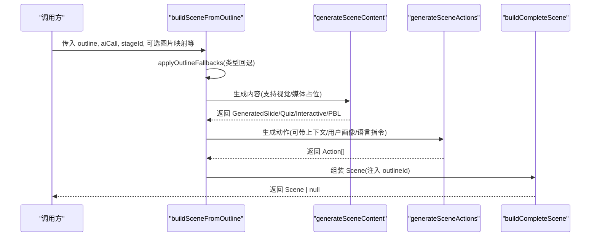
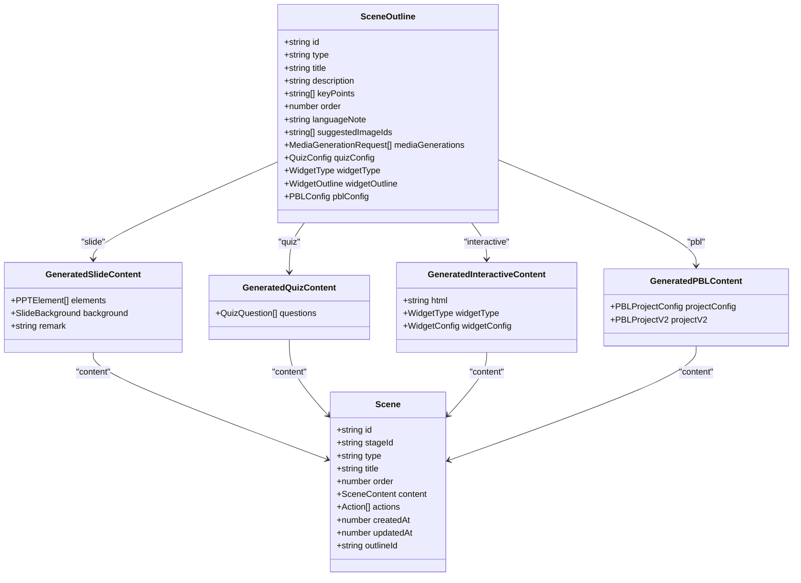
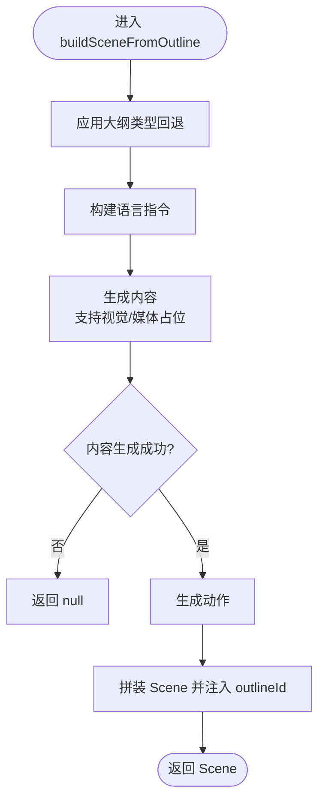
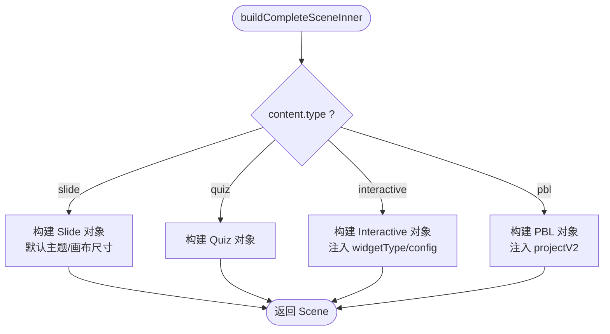
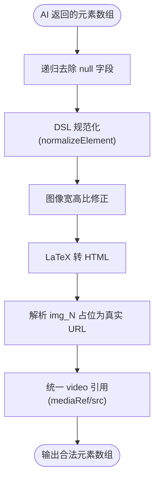
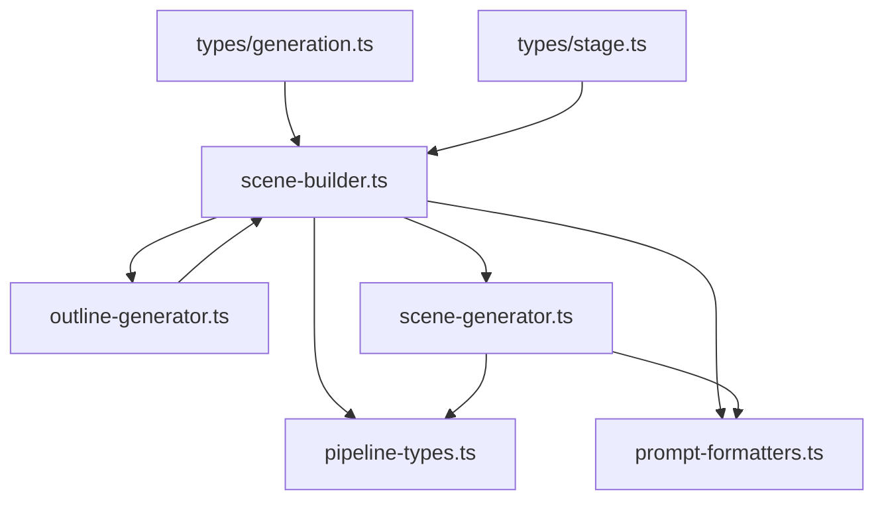

# 场景构建器

<cite>
**本文引用的文件**   
- [lib/generation/scene-builder.ts](file://lib/generation/scene-builder.ts)
- [lib/generation/outline-generator.ts](file://lib/generation/outline-generator.ts)
- [lib/generation/scene-generator.ts](file://lib/generation/scene-generator.ts)
- [lib/types/generation.ts](file://lib/types/generation.ts)
- [lib/types/stage.ts](file://lib/types/stage.ts)
- [lib/generation/pipeline-types.ts](file://lib/generation/pipeline-types.ts)
- [lib/generation/prompt-formatters.ts](file://lib/generation/prompt-formatters.ts)
- [tests/generation/scene-builder-pbl-v2.test.ts](file://tests/generation/scene-builder-pbl-v2.test.ts)
</cite>

## 产品概述
本文件聚焦 OpenMAIC 的“场景构建器”，解释如何将“大纲（SceneOutline）”与“内容（GeneratedContent）”组合为完整的“场景对象（Scene）”。核心函数包括：
- buildSceneFromOutline：从单个大纲生成完整场景（含内容与动作），支持流式阶段回调。
- buildCompleteScene：将大纲、内容与动作拼装为最终 Scene，并注入 outlineId 以便编辑器工具稳定关联。
- uniquifyMediaElementIds：对 LLM 生成的顺序占位 ID 进行全局去重，避免跨课程缩略图污染。

该模块不依赖状态存储，返回的是可直接渲染或持久化的完整 Scene 对象，便于在 SSE 流式输出、预览、重试等场景中复用。

## 核心业务流程
整体流程分为两阶段：
- 阶段一：根据用户需求与文档素材生成“场景大纲”（可能包含语言指令、课程标题、以及每个场景的类型与要点）。
- 阶段二：基于每个大纲生成“场景内容”（幻灯片/测验/交互/PBL）与“播放动作”，再拼装为 Scene。

**图表来源** 
- [lib/generation/scene-builder.ts:68-124](file://lib/generation/scene-builder.ts#L68-L124)
- [lib/generation/scene-generator.ts:197-276](file://lib/generation/scene-generator.ts#L197-L276)

**章节来源**
- [lib/generation/scene-builder.ts:68-124](file://lib/generation/scene-builder.ts#L68-L124)
- [lib/generation/outline-generator.ts:36-159](file://lib/generation/outline-generator.ts#L36-L159)

## 功能模块清单
- 场景构建入口
  - buildSceneFromOutline：串联“内容生成 + 动作生成 + 场景拼装”，支持 onPhaseChange 回调以暴露“content/actions”两个阶段。
  - buildCompleteScene：纯函数式拼装，确保 Scene 字段完备并附加 outlineId。
- 数据校验与格式化处理
  - applyOutlineFallbacks：对不完整的大纲做类型回退（如 interactive/pbl 缺少必要配置时降级为 slide）。
  - sanitizeProceduralSkillOutline：对特定 widget 类型做安全化裁剪。
  - changeOutlineType：统一构造新类型大纲，清理旧配置并回填默认值。
- ID 去重机制
  - uniquifyMediaElementIds：将 LLM 输出的顺序占位 ID（gen_img_N/gen_vid_N）替换为全局唯一 ID，避免跨课程冲突。
- 内容生成与元素规范化
  - generateSceneContent：按大纲类型路由到 slide/quiz/interactive/pbl 分支；处理视觉模式、图像映射、LaTeX 渲染、视频引用归一化等。
  - fixElementDefaults/normalizeElement：修复缺失字段、推导几何信息、丢弃畸形元素，保证 DSL 契约一致性。
  - resolveImageIds/normalizeGeneratedVideoRefs：将 img_N 占位解析为真实 base64/URL，并将 gen_(img|vid)_* 占位保留用于异步回填。
- 提示词与上下文
  - prompt-formatters：构建课程上下文、教师人设、语言指令、视觉图片描述等，提升生成质量与一致性。

**章节来源**
- [lib/generation/scene-builder.ts:35-62](file://lib/generation/scene-builder.ts#L35-L62)
- [lib/generation/outline-generator.ts:187-213](file://lib/generation/outline-generator.ts#L187-L213)
- [lib/generation/scene-generator.ts:445-503](file://lib/generation/scene-generator.ts#L445-L503)
- [lib/generation/scene-generator.ts:319-376](file://lib/generation/scene-generator.ts#L319-L376)
- [lib/generation/scene-generator.ts:378-430](file://lib/generation/scene-generator.ts#L378-L430)
- [lib/generation/prompt-formatters.ts:9-50](file://lib/generation/prompt-formatters.ts#L9-L50)

## 数据与状态
- 核心数据模型
  - SceneOutline：定义场景类型、目标、要点、可选配置（quizConfig/widgetOutline/pblConfig）、建议图片与媒体生成请求等。
  - GeneratedSlideContent / GeneratedQuizContent / GeneratedInteractiveContent / GeneratedPBLContent：各类型的内容产物。
  - Scene：应用层场景对象，包含 id、stageId、type、title、order、content、actions、时间戳，以及可选的 outlineId。
- 关键状态流转
  - 大纲 → 内容 → 动作 → 场景（buildCompleteScene 注入 outlineId）。
  - 媒体占位 ID 的去重与解析：顺序占位 → 全局唯一 → 实际 URL/base64（或保留占位等待回填）。
- 数据所有权边界
  - 构建器不持有状态，仅消费输入并产出 Scene；DSL 层负责元素规范与渲染契约。

**图表来源** 
- [lib/types/generation.ts:125-169](file://lib/types/generation.ts#L125-L169)
- [lib/types/generation.ts:179-206](file://lib/types/generation.ts#L179-L206)
- [lib/types/generation.ts:225-230](file://lib/types/generation.ts#L225-L230)
- [lib/types/stage.ts:105-117](file://lib/types/stage.ts#L105-L117)

**章节来源**
- [lib/types/generation.ts:125-169](file://lib/types/generation.ts#L125-L169)
- [lib/types/stage.ts:105-117](file://lib/types/stage.ts#L105-L117)

## 关键约束与边界
- 非功能性需求
  - 构建器无副作用、无状态依赖，适合并发与重试。
  - 媒体 ID 必须全局唯一，避免跨课程缩略图污染。
  - 元素规范化严格遵循 DSL 契约，畸形元素将被丢弃以保证回放稳定性。
- 依赖与集成边界
  - 依赖 AI 调用接口 AICallFn 与提示词模板；对外暴露 onPhaseChange 回调以适配流式 UI。
  - PBL v2 兼容：同时产出 legacy projectConfig 与 projectV2，便于渐进迁移。
- 业务约束
  - interactive 若无 widgetType+widgetOutline 则降级为 slide。
  - pbl 若无 pblConfig 或语言模型不可用时降级为 slide。
  - 语言指令优先使用课程级 directive，并可叠加 scene-level note。

**章节来源**
- [lib/generation/outline-generator.ts:187-213](file://lib/generation/outline-generator.ts#L187-L213)
- [lib/generation/scene-generator.ts:225-276](file://lib/generation/scene-generator.ts#L225-L276)
- [lib/generation/prompt-formatters.ts:145-152](file://lib/generation/prompt-formatters.ts#L145-L152)

## 详细实现与最佳实践

### buildSceneFromOutline：从大纲到完整场景
- 步骤
  - 应用大纲类型回退（applyOutlineFallbacks）。
  - 构建语言指令文本（buildLanguageText）。
  - 生成内容（generateSceneContent），支持视觉模式、图片映射、媒体占位。
  - 生成动作（generateSceneActions），携带上下文、用户画像、语言指令。
  - 拼装场景（buildCompleteScene），注入 outlineId。
- 错误恢复
  - 内容生成失败直接返回 null；动作生成失败不影响内容存在性。
  - 通过 onPhaseChange 通知前端当前阶段，便于展示进度与重试。

**图表来源** 
- [lib/generation/scene-builder.ts:68-124](file://lib/generation/scene-builder.ts#L68-L124)

**章节来源**
- [lib/generation/scene-builder.ts:68-124](file://lib/generation/scene-builder.ts#L68-L124)

### buildCompleteScene：场景拼装与 ID 去重
- 行为
  - 根据 content.type 选择分支（slide/quiz/interactive/pbl），填充对应 content 结构。
  - 为 slide 设置默认主题与画布尺寸；为 interactive 注入 widgetType/widgetConfig；为 pbl 注入 projectV2（若存在）。
  - 外层包装注入 outlineId，使编辑器工具能稳定定位原始大纲。
- ID 去重
  - uniquifyMediaElementIds：收集所有顺序占位 ID，分配 nanoid 前缀的全局唯一 ID，并在第二遍替换 mediaGenerations.elementId。

**图表来源** 
- [lib/generation/scene-builder.ts:147-252](file://lib/generation/scene-builder.ts#L147-L252)

**章节来源**
- [lib/generation/scene-builder.ts:133-145](file://lib/generation/scene-builder.ts#L133-L145)
- [lib/generation/scene-builder.ts:35-62](file://lib/generation/scene-builder.ts#L35-L62)

### 数据验证与格式化
- 元素规范化
  - fixElementDefaults：调用 DSL normalizeElement，修复缺失字段、推导几何信息；对畸形元素进行丢弃。
  - processLatexElements：使用 KaTeX 渲染 LaTeX 为 HTML，失败则丢弃。
  - resolveImageIds：将 img_N 占位解析为真实 base64/URL；保留 gen_(img|vid)_* 占位用于后续回填。
  - normalizeGeneratedVideoRefs：统一 video 元素的 src/mediaRef 引用，确保只指向有效的生成媒体 ID。
- 大纲类型回退
  - applyOutlineFallbacks：interactive 缺少配置降级为 slide；pbl 缺少配置或语言模型不可用降级为 slide。
  - sanitizeProceduralSkillOutline：对 procedural-skill 类型进行安全裁剪，防止非法字段泄露。

**图表来源** 
- [lib/generation/scene-generator.ts:445-503](file://lib/generation/scene-generator.ts#L445-L503)
- [lib/generation/scene-generator.ts:526-557](file://lib/generation/scene-generator.ts#L526-L557)
- [lib/generation/scene-generator.ts:319-376](file://lib/generation/scene-generator.ts#L319-L376)
- [lib/generation/scene-generator.ts:378-430](file://lib/generation/scene-generator.ts#L378-L430)

**章节来源**
- [lib/generation/scene-generator.ts:445-503](file://lib/generation/scene-generator.ts#L445-L503)
- [lib/generation/scene-generator.ts:526-557](file://lib/generation/scene-generator.ts#L526-L557)
- [lib/generation/scene-generator.ts:319-376](file://lib/generation/scene-generator.ts#L319-L376)
- [lib/generation/scene-generator.ts:378-430](file://lib/generation/scene-generator.ts#L378-L430)

### 状态管理与依赖处理
- 状态管理
  - 构建器本身无状态；onPhaseChange 提供阶段性反馈（content/actions）。
  - SceneGenerationContext 用于跨页连贯性（标题序列、上一页演讲片段）。
- 依赖处理
  - AICallFn：抽象 AI 调用，支持多模态输入（文本+图片）。
  - 提示词构建：buildCourseContext/formatAgentsForPrompt/formatTeacherPersonaForPrompt/buildLanguageText。
  - 媒体映射：assignedImages/imageMapping/generatedMediaMapping 三通道协同。

**章节来源**
- [lib/generation/pipeline-types.ts:18-23](file://lib/generation/pipeline-types.ts#L18-L23)
- [lib/generation/prompt-formatters.ts:9-50](file://lib/generation/prompt-formatters.ts#L9-L50)
- [lib/generation/prompt-formatters.ts:53-72](file://lib/generation/prompt-formatters.ts#L53-L72)
- [lib/generation/prompt-formatters.ts:145-152](file://lib/generation/prompt-formatters.ts#L145-L152)

### 错误恢复策略
- 内容生成失败：返回 null，上层可触发重试或降级。
- 元素规范化失败：丢弃畸形元素，保障回放稳定性。
- 媒体占位未解析：保留占位，前端渲染骨架，待异步回填。
- 类型回退：当大纲不完整时自动降级为 slide，保证流程继续。

**章节来源**
- [lib/generation/scene-builder.ts:106-109](file://lib/generation/scene-builder.ts#L106-L109)
- [lib/generation/scene-generator.ts:470-477](file://lib/generation/scene-generator.ts#L470-L477)
- [lib/generation/scene-generator.ts:344-352](file://lib/generation/scene-generator.ts#L344-L352)
- [lib/generation/outline-generator.ts:187-213](file://lib/generation/outline-generator.ts#L187-L213)

### 性能优化技巧
- 图像元数据索引：fixElementDefaults 中预先建立 imageMetaById Map，O(m) 初始化后 O(1) 查找，避免嵌套 find。
- 视觉模式限流：MAX_VISION_IMAGES 限制传入模型的图片数量，降低延迟与成本。
- 元素规范化短路：stripNulls 提前清理 null 字段，减少 normalizeElement 异常路径。
- 视频引用归一化：一次性过滤有效引用集合，减少重复判断。

**章节来源**
- [lib/generation/scene-generator.ts:445-503](file://lib/generation/scene-generator.ts#L445-L503)
- [lib/generation/scene-generator.ts:378-430](file://lib/generation/scene-generator.ts#L378-L430)

### 使用示例与配置选项
- 基本用法
  - 调用 buildSceneFromOutline，传入 outline、aiCall、stageId，可选 assignedImages/imageMapping/languageModel/visionEnabled/ctx/agents/onPhaseChange/userProfile/languageDirective。
  - 获取 onPhaseChange 回调以更新 UI 进度（content/actions）。
- 配置选项
  - visionEnabled：启用视觉模式，优先传入前 N 张图供模型观察。
  - imageMapping：PDF 提取图片的 id→base64/URL 映射。
  - generatedMediaMapping：AI 生成媒体的 id→URL 映射（用于回填占位）。
  - agents：课堂智能体信息，注入教师人设与角色。
  - languageDirective：课程级语言指令，叠加 scene-level languageNote。
- PBL v2 兼容性
  - GeneratedPBLContent 同时包含 projectConfig 与 projectV2，构建器会保留 projectV2 字段。

**章节来源**
- [lib/generation/scene-builder.ts:68-124](file://lib/generation/scene-builder.ts#L68-L124)
- [lib/generation/scene-generator.ts:197-276](file://lib/generation/scene-generator.ts#L197-L276)
- [tests/generation/scene-builder-pbl-v2.test.ts:8-55](file://tests/generation/scene-builder-pbl-v2.test.ts#L8-L55)

### 自定义构建逻辑指南
- 扩展内容生成
  - 在 generateSceneContent 中添加新的 outline.type 分支，实现对应的生成逻辑与提示词模板。
- 扩展元素规范化
  - 在 fixElementDefaults 或 normalizeElement 中增加对新元素类型的默认值与几何推导。
- 扩展媒体占位
  - 在 resolveImageIds/normalizeGeneratedVideoRefs 中新增占位识别与回填规则。
- 扩展类型回退
  - 在 applyOutlineFallbacks 中补充新类型的回退策略，确保鲁棒性。

**章节来源**
- [lib/generation/scene-generator.ts:248-276](file://lib/generation/scene-generator.ts#L248-L276)
- [lib/generation/outline-generator.ts:187-213](file://lib/generation/outline-generator.ts#L187-L213)

## 依赖分析

**图表来源** 
- [lib/generation/scene-builder.ts:1-25](file://lib/generation/scene-builder.ts#L1-L25)
- [lib/generation/outline-generator.ts:1-21](file://lib/generation/outline-generator.ts#L1-L21)
- [lib/generation/scene-generator.ts:1-56](file://lib/generation/scene-generator.ts#L1-L56)
- [lib/generation/pipeline-types.ts:1-65](file://lib/generation/pipeline-types.ts#L1-L65)
- [lib/generation/prompt-formatters.ts:1-10](file://lib/generation/prompt-formatters.ts#L1-L10)
- [lib/types/generation.ts:1-10](file://lib/types/generation.ts#L1-L10)
- [lib/types/stage.ts:1-18](file://lib/types/stage.ts#L1-L18)

**章节来源**
- [lib/generation/scene-builder.ts:1-25](file://lib/generation/scene-builder.ts#L1-L25)
- [lib/generation/outline-generator.ts:1-21](file://lib/generation/outline-generator.ts#L1-L21)
- [lib/generation/scene-generator.ts:1-56](file://lib/generation/scene-generator.ts#L1-L56)

## 结论
场景构建器以“无状态、强契约、可扩展”为核心设计原则，将大纲与内容可靠地拼装为可渲染的场景对象。通过 ID 去重、元素规范化、类型回退与完善的错误恢复策略，保证了生成过程的稳定性与可维护性。开发者可在不破坏现有契约的前提下，扩展新的内容类型、元素类型与媒体占位规则，以满足多样化教学场景需求。