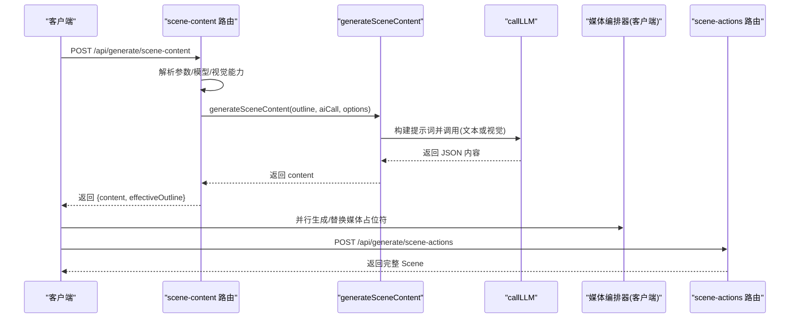
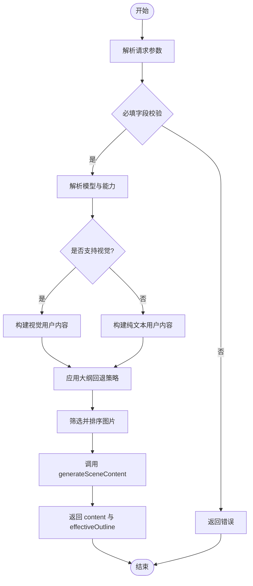
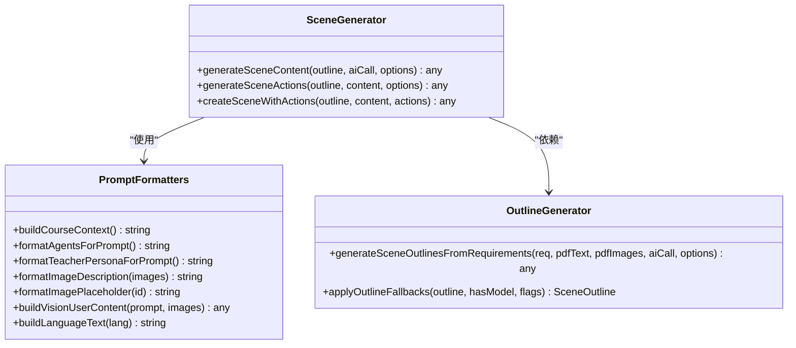
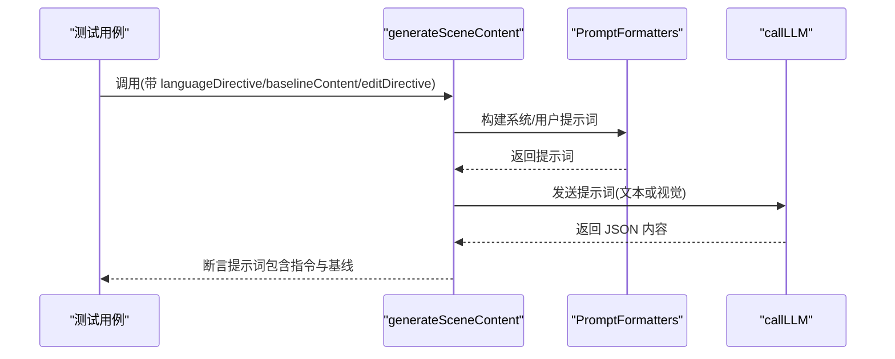
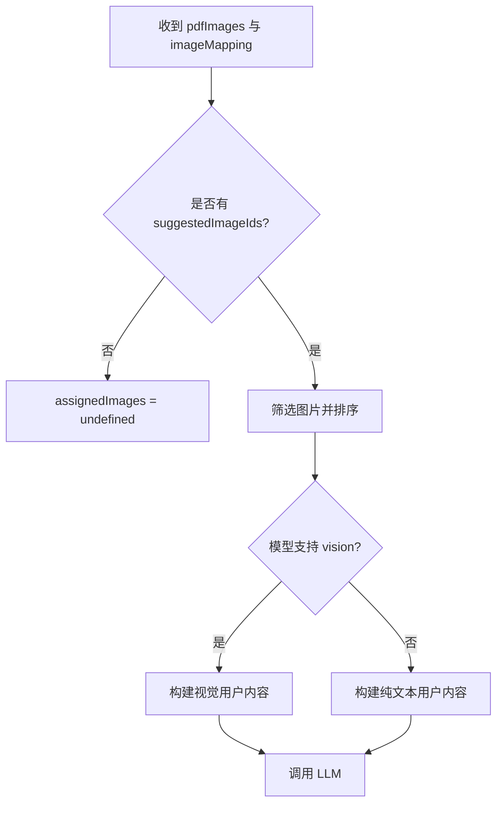
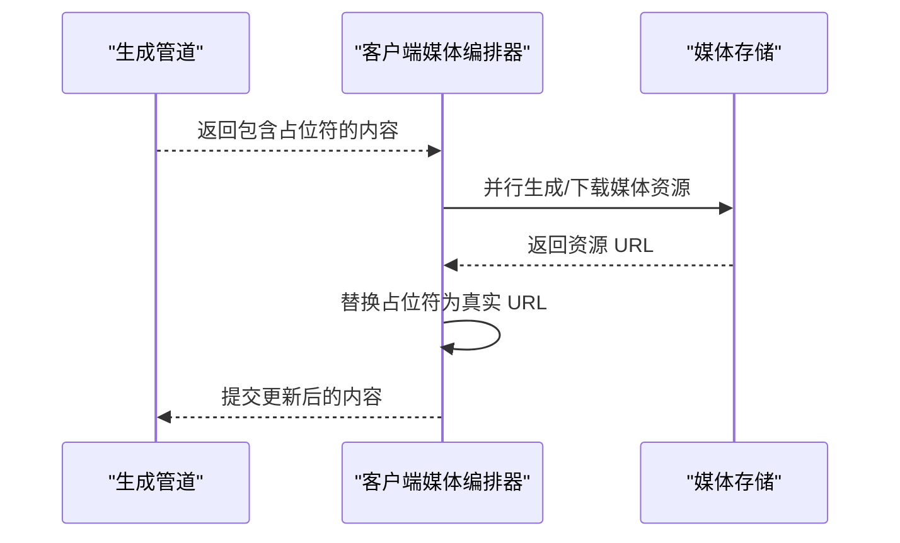

# 内容生成引擎

<cite>
**本文引用的文件**   
- [app/api/generate/scene-content/route.ts](file://app/api/generate/scene-content/route.ts)
- [lib/generation/generation-pipeline.ts](file://lib/generation/generation-pipeline.ts)
- [lib/generation/outline-generator.ts](file://lib/generation/outline-generator.ts)
- [app/api/generate/scene-actions/route.ts](file://app/api/generate/scene-actions/route.ts)
- [tests/generation/scene-generator-language-directive.test.ts](file://tests/generation/scene-generator-language-directive.test.ts)
- [tests/generation/slide-edit-directive.test.ts](file://tests/generation/slide-edit-directive.test.ts)
</cite>

## 产品概述
本文档聚焦 OpenMAIC 的内容生成引擎，围绕 generateSceneContent 函数与两阶段生成管线，解释如何根据场景大纲（SceneOutline）自动生成四类场景内容：幻灯片、测验、交互式内容与 PBL 内容。文档面向初学者与开发者，既提供整体架构与数据流说明，也给出扩展自定义内容生成器的实践指南，并覆盖图片分配、视觉模式、智能体信息、语言指令等关键配置项的作用与使用方式。

## 核心业务流程
- 入口 API：/api/generate/scene-content 接收用户请求，解析模型选择、能力检测（是否支持视觉）、提示词构建与 AI 调用封装，然后调用 generateSceneContent 生成结构化内容。
- 两阶段管线：第一阶段由 outline-generator 基于用户需求生成场景大纲；第二阶段由 scene-generator 的 generateSceneContent 按类型生成具体场景内容。
- 媒体资源：PDF 提取的图片在请求中传入，按 suggestedImageIds 筛选并按视觉能力排序；AI 生成的媒体占位符（如 gen_img_1、gen_vid_1）由客户端并行编排器处理，生成管道仅保留占位 ID。
- 第二半段：/api/generate/scene-actions 基于已生成的内容生成动作（SpeechAction 等），最终组装完整 Scene。

**图表来源** 
- [app/api/generate/scene-content/route.ts:34-197](file://app/api/generate/scene-content/route.ts#L34-L197)
- [lib/generation/generation-pipeline.ts:35-40](file://lib/generation/generation-pipeline.ts#L35-L40)
- [app/api/generate/scene-actions/route.ts:1-33](file://app/api/generate/scene-actions/route.ts#L1-L33)

**章节来源**
- [app/api/generate/scene-content/route.ts:34-197](file://app/api/generate/scene-content/route.ts#L34-L197)
- [lib/generation/generation-pipeline.ts:35-40](file://lib/generation/generation-pipeline.ts#L35-L40)
- [app/api/generate/scene-actions/route.ts:1-33](file://app/api/generate/scene-actions/route.ts#L1-L33)

## 功能模块清单
- 场景内容生成 API（/api/generate/scene-content）
  - 职责：校验输入、解析模型、检测视觉能力、构造 aiCall、应用大纲回退策略、筛选 PDF 图片、调用 generateSceneContent、返回结构化内容。
  - 验收要点：必填字段校验通过；模型与能力正确解析；视觉模式下图片顺序与内容拼接正确；占位符不被替换；错误统一返回。
- 场景动作生成 API（/api/generate/scene-actions）
  - 职责：基于内容与大纲生成 SpeechAction 等动作，组装完整 Scene。
  - 验收要点：动作与内容一致；多模态元素引用正确；错误处理完善。
- 大纲生成（Stage 1）
  - 职责：从用户需求生成语言指令、课程标题与 SceneOutline 列表；支持视觉模式下的图片切片与描述构建。
  - 验收要点：输出结构符合 DSL；图片描述与可用图片集合正确；语言指令可被后续步骤透传。
- 生成管线（Stage 2）
  - 职责：按场景类型分发到对应生成逻辑；构建提示词（含智能体、教师人设、图片描述、语言指令）；处理编辑模式基线；返回标准化内容。
  - 验收要点：各类型输出稳定；占位符保留；编辑模式下基线序列化与指令注入正确。

**章节来源**
- [app/api/generate/scene-content/route.ts:34-197](file://app/api/generate/scene-content/route.ts#L34-L197)
- [app/api/generate/scene-actions/route.ts:1-33](file://app/api/generate/scene-actions/route.ts#L1-L33)
- [lib/generation/outline-generator.ts:32-63](file://lib/generation/outline-generator.ts#L32-L63)
- [lib/generation/generation-pipeline.ts:8-40](file://lib/generation/generation-pipeline.ts#L8-L40)

## 数据与状态
- 输入数据结构
  - SceneOutline：包含 id、type、title、description、keyPoints、order 以及 type-specific 配置（如 quizConfig）。
  - PdfImage/ImageMapping：PDF 提取的图片与映射关系，用于视觉模式下的图片分配。
  - AgentInfo：智能体信息，用于提示词中的角色与行为约束。
  - UserRequirements：用户需求，包含要求文本与语言设置。
- 处理状态
  - effectiveOutline：应用回退策略后的有效大纲。
  - assignedImages：按 suggestedImageIds 筛选并排序的图片集合。
  - generatedMediaMapping：占位符映射（由客户端媒体编排器填充）。
  - languageDirective：语言指令，贯穿提示词构建。
- 输出数据结构
  - GeneratedSlideContent：元素数组、背景、备注。
  - GeneratedQuizContent：问题集合与配置。
  - GeneratedInteractiveContent：交互脚本与资源引用。
  - GeneratedPBLContent：PBL 任务、评估与协作流程。

**图表来源** 
- [app/api/generate/scene-content/route.ts:34-197](file://app/api/generate/scene-content/route.ts#L34-L197)

**章节来源**
- [app/api/generate/scene-content/route.ts:34-197](file://app/api/generate/scene-content/route.ts#L34-L197)

## 关键约束与边界
- 非功能性需求
  - 超时控制：scene-content 路由最大时长 300 秒，scene-actions 路由 60 秒。
  - 错误处理：统一通过 llmApiError 返回，避免泄露内部细节。
  - 并发媒体：媒体生成在客户端并行进行，服务端不阻塞等待。
- 依赖与集成边界
  - 模型能力：vision 能力决定提示词是否携带图片；无 vision 时走纯文本路径。
  - 外部服务：callLLM 负责与 LLM 服务通信；媒体编排器负责图像/视频生成。
- 业务约束
  - 占位符保留：AI 生成的媒体占位符（gen_img_1、gen_vid_1）在服务端不做替换，交由客户端编排器完成。
  - 编辑模式：当存在 baselineContent 或 editDirective 时，需以“编辑模式”提示词引导模型忠实重渲染或执行修改指令。
  - 语言指令：languageDirective 必须注入到所有类型内容的提示词中，确保输出语言一致性。

**章节来源**
- [app/api/generate/scene-content/route.ts:32-33](file://app/api/generate/scene-content/route.ts#L32-L33)
- [app/api/generate/scene-content/route.ts:160-162](file://app/api/generate/scene-content/route.ts#L160-L162)
- [tests/generation/slide-edit-directive.test.ts:59-171](file://tests/generation/slide-edit-directive.test.ts#L59-L171)
- [tests/generation/scene-generator-language-directive.test.ts:57-91](file://tests/generation/scene-generator-language-directive.test.ts#L57-L91)

## 详细组件分析

### generateSceneContent 函数与场景类型分发
- 类型分发
  - slide：生成幻灯片元素、背景与备注。
  - quiz：生成问题集合与难度、题型配置。
  - interactive：生成交互脚本与资源引用。
  - pbl：生成 PBL 任务、评估与协作流程。
- 提示词构建策略
  - 系统提示：定义角色、输出格式与约束。
  - 用户提示：包含大纲、智能体信息、教师人设、图片描述、语言指令与编辑模式指令。
  - 视觉模式：将图片作为多模态输入，按能力限制数量与顺序。
- AI 调用机制
  - 有 vision：使用 buildVisionUserContent 构造多模态消息。
  - 无 vision：使用纯文本 prompt。
  - 重试与输出窗口：maxRetries=0，maxOutputTokens 由模型能力决定。

**图表来源** 
- [lib/generation/generation-pipeline.ts:8-40](file://lib/generation/generation-pipeline.ts#L8-L40)

**章节来源**
- [lib/generation/generation-pipeline.ts:8-40](file://lib/generation/generation-pipeline.ts#L8-L40)

### 提示词构建与语言指令透传
- 语言指令透传
  - 测试验证：slide 与 quiz 的提示词均包含 languageDirective，且模板变量 {{languageDirective}} 会被替换为实际值。
- 编辑模式基线
  - 当提供 baselineContent 或 editDirective 时，提示词进入 EDIT MODE，指导模型忠实重渲染或执行修改指令。
  - 基线中的图片以 id 引用形式序列化，避免 base64 过大；若存在图片元素，提示词会指示“保留图片”。

**图表来源** 
- [tests/generation/scene-generator-language-directive.test.ts:57-91](file://tests/generation/scene-generator-language-directive.test.ts#L57-L91)
- [tests/generation/slide-edit-directive.test.ts:59-171](file://tests/generation/slide-edit-directive.test.ts#L59-L171)

**章节来源**
- [tests/generation/scene-generator-language-directive.test.ts:57-91](file://tests/generation/scene-generator-language-directive.test.ts#L57-L91)
- [tests/generation/slide-edit-directive.test.ts:59-171](file://tests/generation/slide-edit-directive.test.ts#L59-L171)

### 图片分配与视觉模式
- 图片筛选与排序
  - 按 suggestedImageIds 筛选当前大纲相关图片。
  - 使用 sortDocumentImagesForVision 对图片排序，优先高质量或相关性高的图片。
- 视觉模式调用
  - 若模型具备 vision 能力，则使用 buildVisionUserContent 将图片与文本一起发送给 LLM。
  - 若无 vision 能力，则仅传递文本提示词。

**图表来源** 
- [app/api/generate/scene-content/route.ts:145-157](file://app/api/generate/scene-content/route.ts#L145-L157)
- [lib/generation/outline-generator.ts:52-63](file://lib/generation/outline-generator.ts#L52-L63)

**章节来源**
- [app/api/generate/scene-content/route.ts:145-157](file://app/api/generate/scene-content/route.ts#L145-L157)
- [lib/generation/outline-generator.ts:52-63](file://lib/generation/outline-generator.ts#L52-L63)

### 媒体占位符与多模态内容处理
- 占位符策略
  - AI 生成的媒体资源使用占位符（gen_img_1、gen_vid_1），服务端不替换，保持原样。
  - 客户端媒体编排器并行处理这些占位符，生成真实资源后回填。
- 多模态内容
  - 幻灯片元素可包含图像、视频、代码、表格等；交互与 PBL 内容可引用外部资源。
  - 编辑器与渲染器需支持占位符显示与替换。

**图表来源** 
- [app/api/generate/scene-content/route.ts:159-162](file://app/api/generate/scene-content/route.ts#L159-L162)

**章节来源**
- [app/api/generate/scene-content/route.ts:159-162](file://app/api/generate/scene-content/route.ts#L159-L162)

### SceneContentOptions 配置选项详解
- assignedImages：当前大纲分配的图片集合，用于视觉模式提示词。
- imageMapping：PDF 图片 ID 到资源的映射，用于筛选与排序。
- languageModel：语言模型实例，PBL 类型可能单独指定。
- visionEnabled：是否启用视觉模式。
- generatedMediaMapping：媒体占位符到真实资源的映射（客户端填充）。
- agents：智能体信息，用于提示词中的角色与行为约束。
- languageDirective：语言指令，确保输出语言一致性。
- thinkingConfig：思考配置，影响 LLM 推理过程。
- targetLanguage：目标语言，来自用户区域设置。
- userRequirements：用户需求，影响大纲回退与内容生成。
- allowProceduralSkill：是否允许程序化技能（职业模式）。
- baselineContent：编辑模式基线内容，指导忠实重渲染。
- editDirective：编辑模式指令，指导模型执行修改。

**章节来源**
- [app/api/generate/scene-content/route.ts:171-183](file://app/api/generate/scene-content/route.ts#L171-L183)

### 扩展自定义内容生成器
- 扩展点
  - 在 scene-generator 中新增类型分支，实现对应的提示词构建与内容解析。
  - 复用 PromptFormatters 提供的格式化函数，确保提示词风格一致。
- 最佳实践
  - 保持占位符策略一致，不替换媒体占位符。
  - 严格校验输出 JSON 结构，必要时使用 JSON 修复工具。
  - 透传 languageDirective 与 agent 信息，确保内容一致性。
  - 支持编辑模式基线与指令，便于迭代优化。

**章节来源**
- [lib/generation/generation-pipeline.ts:18-26](file://lib/generation/generation-pipeline.ts#L18-L26)
- [lib/generation/generation-pipeline.ts:28-32](file://lib/generation/generation-pipeline.ts#L28-L32)

## 结论
OpenMAIC 的内容生成引擎通过清晰的两阶段管线与模块化设计，实现了从用户需求到多样化场景内容的自动化生成。generateSceneContent 函数作为核心，结合提示词构建策略、视觉模式与占位符机制，确保了内容的一致性与可扩展性。开发者可基于现有扩展点快速定制新的内容类型，同时遵循占位符与语言指令等约束，保证系统的稳定性与可维护性。