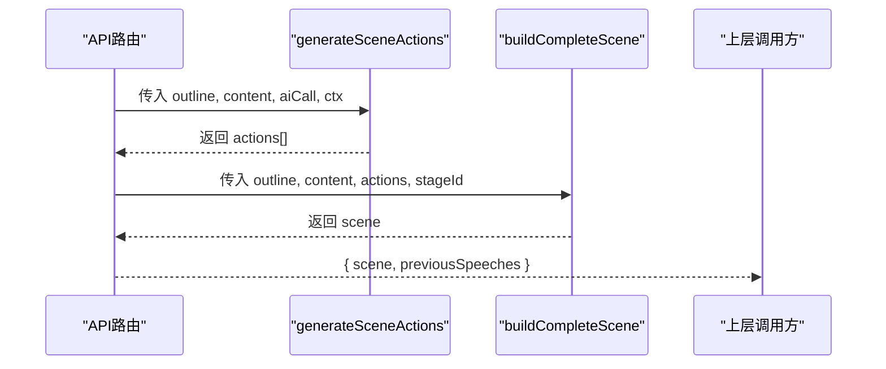
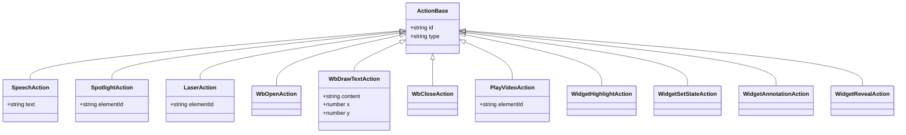
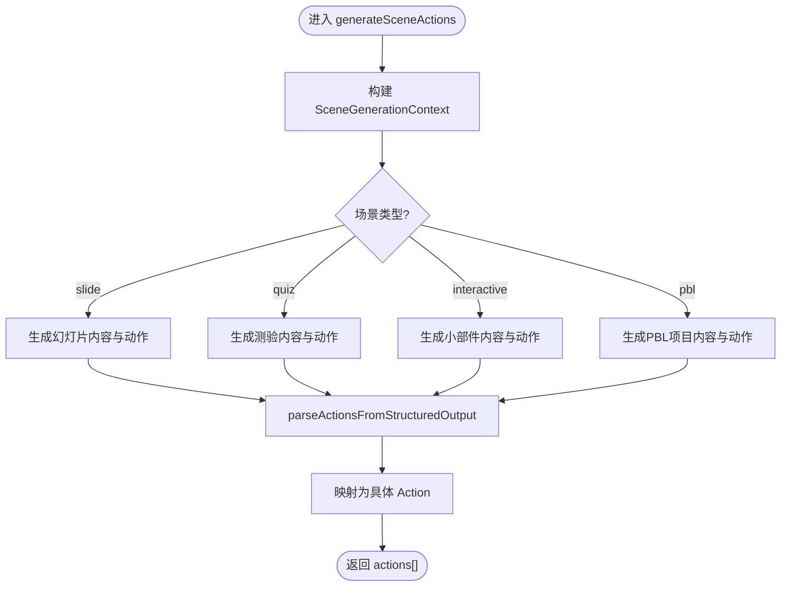
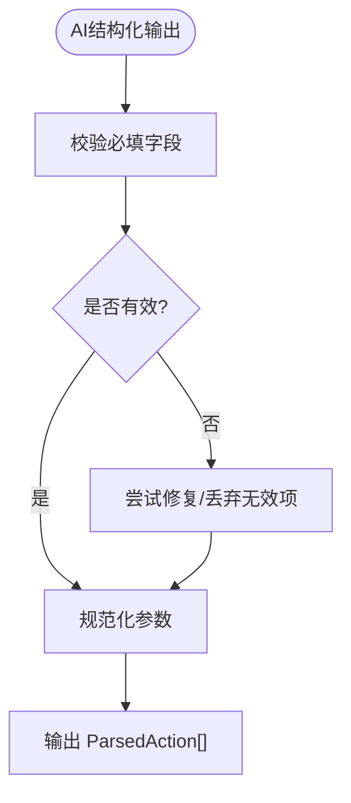
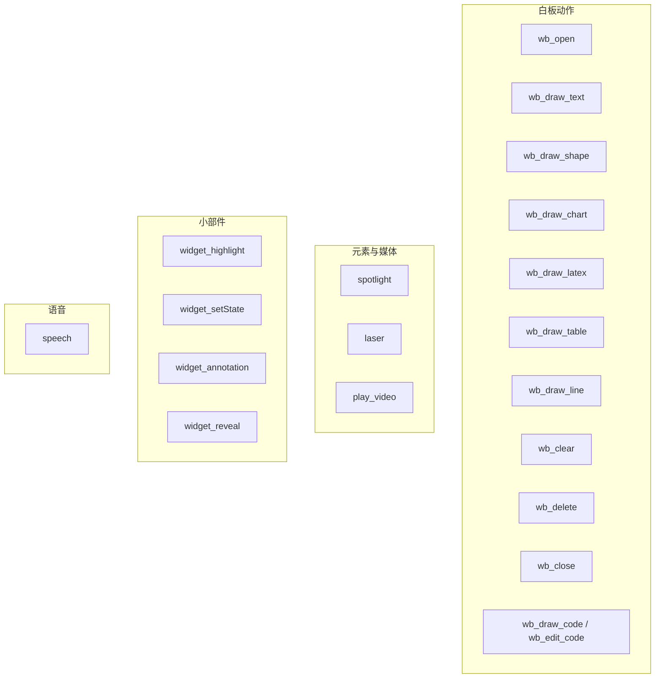
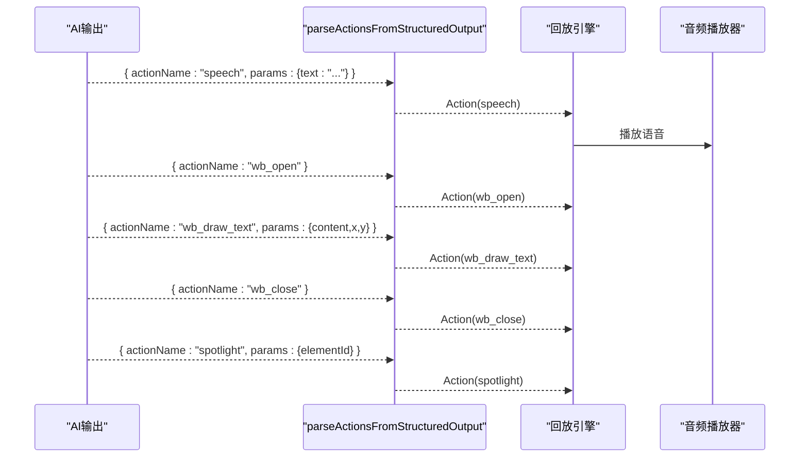
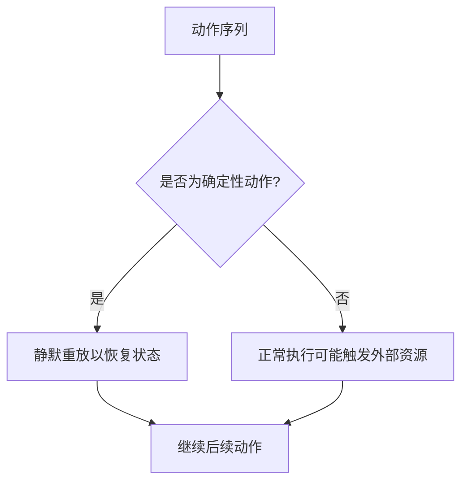
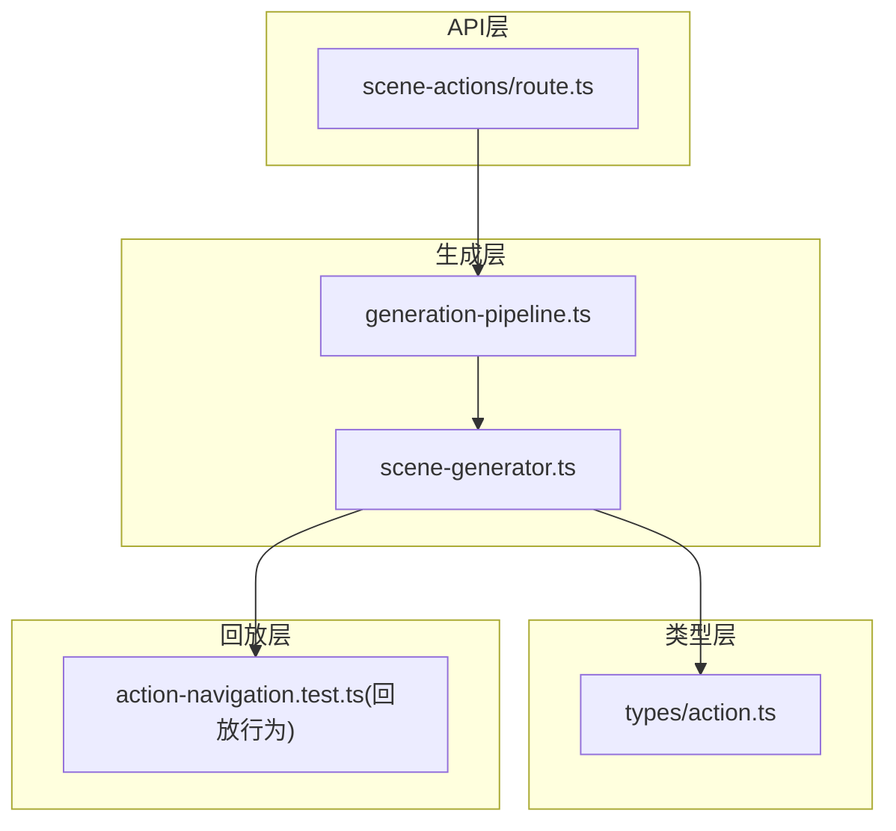
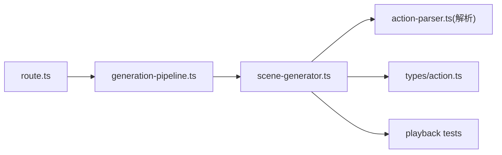

# 动作生成器

<cite>
**本文引用的文件**   
- [app/api/generate/scene-actions/route.ts](file://app/api/generate/scene-actions/route.ts)
- [lib/generation/generation-pipeline.ts](file://lib/generation/generation-pipeline.ts)
- [lib/generation/scene-generator.ts](file://lib/generation/scene-generator.ts)
- [lib/types/action.ts](file://lib/types/action.ts)
- [components/edit/ActionsBar/actions-edit.ts](file://components/edit/ActionsBar/actions-edit.ts)
- [lib/chat/pi/tools/classroom-actions.ts](file://lib/chat/pi/tools/classroom-actions.ts)
- [tests/playback/action-navigation.test.ts](file://tests/playback/action-navigation.test.ts)
</cite>

## 产品概述
本文件聚焦“动作生成器”，即根据场景大纲与内容，自动生成可执行的动作序列（如语音播放、白板绘制、元素操作、特效触发等），并组装为完整的课件场景。该能力是 OpenMAIC 两阶段生成管线中的第二阶段：先生成结构化内容，再基于内容与上下文生成动作，最终拼装出可直接回放或编辑的场景对象。

- 目标用户：课件创作者、课堂教师、AI 编排开发者
- 核心价值：将自然语言与结构化内容转化为“可执行的演示动作”，提升课件的交互性与表现力
- 适用场景：幻灯片讲解、问答测验、互动小部件、PBL 项目页等

## 核心业务流程
- 输入：场景大纲（outline）、已生成的场景内容（content）、AI 调用函数（aiCall）、跨场景上下文（ctx）
- 处理：调用 generateSceneActions 生成动作列表；随后 buildCompleteScene 将大纲、内容、动作组装为完整场景
- 输出：包含 actions 数组的 Scene 对象，以及用于跨场景连贯性的 previousSpeeches

**章节来源**
- [app/api/generate/scene-actions/route.ts:136-176](file://app/api/generate/scene-actions/route.ts#L136-L176)
- [lib/generation/generation-pipeline.ts:35-40](file://lib/generation/generation-pipeline.ts#L35-L40)

## 功能模块清单
- 动作类型与数据结构
  - 统一 Action 类型由 DSL 定义并通过 lib/types/action.ts 重导出，涵盖 speech、spotlight、laser、白板系列（wb_*）、视频播放、讨论、小部件操作等
  - 编辑器侧提供 makeAction 工厂，支持拖拽添加 speech/spotlight/laser 等独立动作
- 动作生成
  - generateSceneActions：根据场景类型（slide/quiz/interactive/pbl）与上下文，驱动 AI 生成动作描述，并解析为可执行 Action
  - parseActionsFromStructuredOutput：将 AI 的结构化输出解析为 ParsedAction，再由生成器转换为具体 Action
- 动作执行与回放
  - 回放引擎对确定性动作（如白板 open/draw）在跳转时静默重放，保证状态一致
  - 对白与特效顺序受动作序列控制，确保时序正确

**章节来源**
- [lib/types/action.ts:1-45](file://lib/types/action.ts#L1-L45)
- [components/edit/ActionsBar/actions-edit.ts:1-27](file://components/edit/ActionsBar/actions-edit.ts#L1-L27)
- [lib/generation/scene-generator.ts:35-36](file://lib/generation/scene-generator.ts#L35-L36)
- [tests/playback/action-navigation.test.ts:302-318](file://tests/playback/action-navigation.test.ts#L302-L318)

## 数据与状态
- Action 数据结构
  - 所有动作均遵循统一的 ActionBase，并扩展各自参数（如 SpeechAction.text、WbDrawTextAction.content/x/y、SpotlightAction.elementId 等）
  - 动作分类常量（如 FIRE_AND_FORGET_ACTIONS、SLIDE_ONLY_ACTIONS、SYNC_ACTIONS）用于运行时行为控制
- 解析中间态
  - ParsedAction：{ actionId, actionName, params }，作为 AI 结构化输出的通用表示
- 场景上下文
  - SceneGenerationContext：包含当前页码、总页数、标题列表、上一场景演讲文本，用于跨场景一致性

**图表来源**
- [lib/types/action.ts:13-39](file://lib/types/action.ts#L13-L39)

**章节来源**
- [lib/types/action.ts:1-45](file://lib/types/action.ts#L1-L45)
- [lib/types/chat.ts:396-400](file://lib/types/chat.ts#L396-L400)

## 关键约束与边界
- 动作生成依赖 AI 结构化输出与提示词工程，需保证模型输出符合预期 schema
- 白板类动作通常需要“打开→绘制→关闭”的工作流，编辑器中不直接支持裸加白板动作
- 回放跳转时对确定性动作进行静默重放，避免重复与状态不一致
- 跨场景连贯性通过 previousSpeeches 传递，确保前后页语音衔接自然

**章节来源**
- [components/edit/ActionsBar/actions-edit.ts:11-15](file://components/edit/ActionsBar/actions-edit.ts#L11-L15)
- [tests/playback/action-navigation.test.ts:302-318](file://tests/playback/action-navigation.test.ts#L302-L318)
- [app/api/generate/scene-actions/route.ts:167-176](file://app/api/generate/scene-actions/route.ts#L167-L176)

## 详细实现说明

### generateSceneActions：如何为场景生成交互动作
- 入口与上下文
  - API 路由构建 SceneGenerationContext（页码、总数、标题、上一场景演讲），并调用 generateSceneActions
- 场景类型分支
  - slide：结合图片/视频占位符、视觉模式、教师人设等提示，生成元素与动作
  - quiz：按配置生成题目与相关动作
  - interactive：根据 widgetType 生成对应小部件内容与动作
  - pbl：使用 v2 规划器生成项目配置与动作
- 动作解析
  - 通过 parseActionsFromStructuredOutput 将 AI 的结构化输出转为 ParsedAction，再映射为具体 Action
- 语言指令
  - languageDirective 会注入到各分支的提示词中，确保动作描述的语言风格一致

**图表来源**
- [lib/generation/scene-generator.ts:197-276](file://lib/generation/scene-generator.ts#L197-L276)
- [lib/generation/scene-generator.ts:35-36](file://lib/generation/scene-generator.ts#L35-L36)

**章节来源**
- [app/api/generate/scene-actions/route.ts:136-154](file://app/api/generate/scene-actions/route.ts#L136-L154)
- [lib/generation/scene-generator.ts:197-276](file://lib/generation/scene-generator.ts#L197-L276)

### parseActionsFromStructuredOutput：解析 AI 动作描述
- 输入：AI 返回的结构化 JSON（包含 actionId、actionName、params）
- 处理：校验字段、规范化参数、识别动作类别
- 输出：ParsedAction 列表，供后续映射为具体 Action
- 错误处理：对非法或缺失字段进行修复或丢弃，保障下游稳定性

**图表来源**
- [lib/types/chat.ts:396-400](file://lib/types/chat.ts#L396-L400)

**章节来源**
- [lib/types/chat.ts:396-400](file://lib/types/chat.ts#L396-L400)

### 动作类型与参数配置
- 语音（speech）
  - 参数：text（要朗读的文本）
  - 用途：配合 TTS 播放，贯穿多场景连贯性
- 白板（wb_*）
  - wb_open：打开白板
  - wb_draw_text：绘制文本（content、x、y）
  - wb_draw_shape：绘制形状（矩形、圆、三角形等）
  - wb_draw_chart：绘制图表
  - wb_draw_latex：绘制 LaTeX
  - wb_draw_table：绘制表格
  - wb_draw_line：绘制线段
  - wb_clear：清空白板
  - wb_delete：删除指定元素
  - wb_close：关闭白板
  - wb_edit_code / wb_draw_code：代码编辑与绘制
- 元素操作
  - spotlight：高亮元素（elementId）
  - laser：激光笔指向（elementId）
  - play_video：播放视频元素（elementId）
- 小部件（widget_*）
  - widget_highlight：高亮小部件区域
  - widget_setState：设置小部件状态
  - widget_annotation：添加标注
  - widget_reveal：揭示隐藏内容

**图表来源**
- [lib/types/action.ts:13-39](file://lib/types/action.ts#L13-L39)
- [lib/chat/pi/tools/classroom-actions.ts:646-696](file://lib/chat/pi/tools/classroom-actions.ts#L646-L696)

**章节来源**
- [lib/types/action.ts:1-45](file://lib/types/action.ts#L1-L45)
- [lib/chat/pi/tools/classroom-actions.ts:646-696](file://lib/chat/pi/tools/classroom-actions.ts#L646-L696)

### 示例：生成 TTS 语音动作、白板绘图动作、元素动画效果
- TTS 语音动作
  - 生成方式：AI 在 speech 分支下输出 { actionName: "speech", params: { text: "..." } }
  - 回放：播放器按顺序播放语音，previousSpeeches 用于跨页连贯
- 白板绘图动作
  - 典型流程：wb_open → wb_draw_text/wb_draw_shape → wb_close
  - 回放跳转：若跳转到目标动作之前，回放引擎会静默重放确定性白板动作以恢复状态
- 元素动画效果
  - spotlight/laser：通过 elementId 指向目标元素，产生高亮或激光效果
  - play_video：触发视频元素播放

**图表来源**
- [tests/playback/action-navigation.test.ts:302-318](file://tests/playback/action-navigation.test.ts#L302-L318)

**章节来源**
- [tests/playback/action-navigation.test.ts:302-318](file://tests/playback/action-navigation.test.ts#L302-L318)

### 动作与场景内容的关联机制和执行顺序控制
- 关联机制
  - 动作通过 elementId 与场景元素绑定（如 spotlight、laser、play_video）
  - 白板动作作用于全局白板画布，不依赖特定元素
- 执行顺序
  - 动作按数组顺序执行，speech 与媒体播放严格同步
  - 回放引擎在跳转时，对确定性动作（如 wb_open/draw）进行静默重放，确保状态一致且不重复触发非确定性动作

**图表来源**
- [tests/playback/action-navigation.test.ts:302-318](file://tests/playback/action-navigation.test.ts#L302-L318)

**章节来源**
- [tests/playback/action-navigation.test.ts:302-318](file://tests/playback/action-navigation.test.ts#L302-L318)

### 面向初学者的设计理念与扩展方法
- 设计理念
  - 统一 Action 契约：所有动作遵循同一基类，便于渲染与回放
  - 结构化输出驱动：AI 输出标准化结构，降低解析复杂度
  - 确定性优先：回放时对确定性动作进行状态恢复，保证可预测性
- 自定义动作扩展
  - 在 DSL 层新增 Action 类型并重导出
  - 在 classroom-actions 工具注册新动作的参数与描述
  - 在生成器中增加对应分支，将 AI 输出映射为新 Action
  - 在回放引擎中实现新动作的执行逻辑

**章节来源**
- [lib/types/action.ts:1-45](file://lib/types/action.ts#L1-L45)
- [lib/chat/pi/tools/classroom-actions.ts:646-696](file://lib/chat/pi/tools/classroom-actions.ts#L646-L696)

## 架构总览

**图表来源**
- [app/api/generate/scene-actions/route.ts:136-176](file://app/api/generate/scene-actions/route.ts#L136-L176)
- [lib/generation/generation-pipeline.ts:35-40](file://lib/generation/generation-pipeline.ts#L35-L40)
- [lib/generation/scene-generator.ts:197-276](file://lib/generation/scene-generator.ts#L197-L276)
- [lib/types/action.ts:1-45](file://lib/types/action.ts#L1-L45)
- [tests/playback/action-navigation.test.ts:302-318](file://tests/playback/action-navigation.test.ts#L302-L318)

## 依赖分析
- 模块耦合
  - route.ts 依赖 generation-pipeline 与 scene-generator
  - scene-generator 依赖 action-parser（解析结构化输出）与 types/action（动作类型）
  - playback 测试验证动作执行与跳转行为
- 外部依赖
  - AI 调用（aiCall）与提示词模板（buildPrompt）
  - DSL 动作类型与常量（@openmaic/dsl）

**图表来源**
- [app/api/generate/scene-actions/route.ts:136-176](file://app/api/generate/scene-actions/route.ts#L136-L176)
- [lib/generation/generation-pipeline.ts:35-40](file://lib/generation/generation-pipeline.ts#L35-L40)
- [lib/generation/scene-generator.ts:197-276](file://lib/generation/scene-generator.ts#L197-L276)
- [lib/types/action.ts:1-45](file://lib/types/action.ts#L1-L45)

**章节来源**
- [app/api/generate/scene-actions/route.ts:136-176](file://app/api/generate/scene-actions/route.ts#L136-L176)
- [lib/generation/generation-pipeline.ts:35-40](file://lib/generation/generation-pipeline.ts#L35-L40)
- [lib/generation/scene-generator.ts:197-276](file://lib/generation/scene-generator.ts#L197-L276)
- [lib/types/action.ts:1-45](file://lib/types/action.ts#L1-L45)
- [tests/playback/action-navigation.test.ts:302-318](file://tests/playback/action-navigation.test.ts#L302-L318)

## 性能考虑
- 动作解析与映射应尽量避免重复计算，必要时缓存 ParsedAction 映射
- 白板确定性动作在回放跳转时静默重放，减少不必要的 I/O 与渲染开销
- 跨场景 previousSpeeches 仅保留必要文本，避免过大负载

## 故障排查指南
- AI 输出不符合 schema
  - 检查 parseActionsFromStructuredOutput 的修复策略与日志
  - 确认提示词中动作定义与参数约束
- 白板动作状态异常
  - 确认 wb_open → draw → wb_close 的完整性
  - 回放跳转后是否触发了静默重放
- 元素动作未生效
  - 核对 elementId 是否与场景元素一致
  - 检查动作是否在 SLIDE_ONLY_ACTIONS 限制内

**章节来源**
- [lib/types/chat.ts:396-400](file://lib/types/chat.ts#L396-L400)
- [tests/playback/action-navigation.test.ts:302-318](file://tests/playback/action-navigation.test.ts#L302-L318)

## 结论
动作生成器通过统一的 Action 契约与结构化 AI 输出，将场景内容转化为可执行的演示序列。其设计兼顾了可扩展性、回放确定性与跨场景连贯性。开发者可在 DSL 与生成器层轻松扩展新的动作类型，以满足多样化的教学与展示需求。