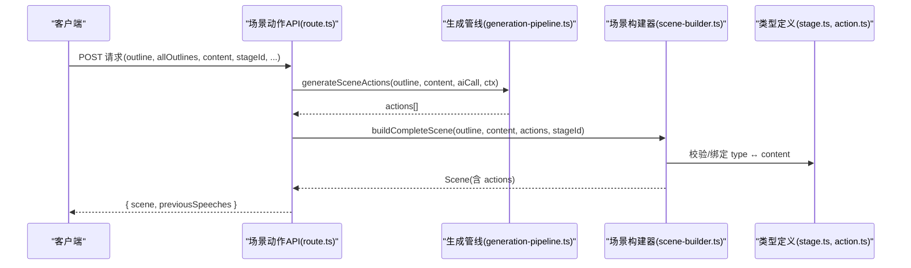
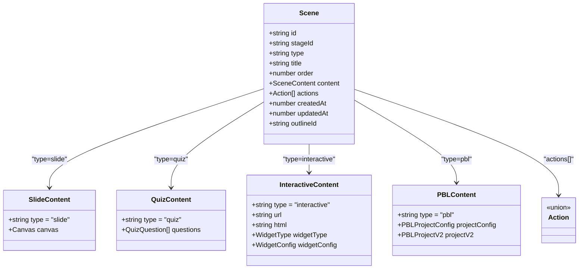
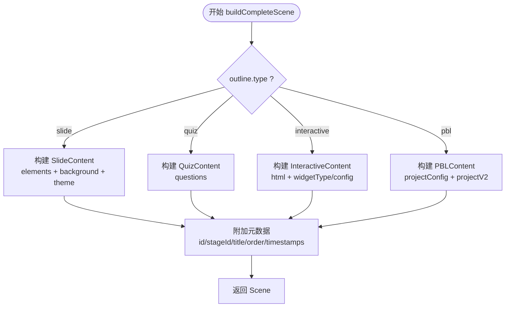

# 场景构建器

<cite>
**本文引用的文件**   
- [scene-builder.ts](file://lib/generation/scene-builder.ts)
- [generation-pipeline.ts](file://lib/generation/generation-pipeline.ts)
- [scene-generator.ts](file://lib/generation/scene-generator.ts)
- [stage.ts](file://lib/types/stage.ts)
- [action.ts](file://lib/types/action.ts)
- [route.ts（场景动作 API）](file://app/api/generate/scene-actions/route.ts)
- [widgets.ts](file://lib/types/widgets.ts)
- [planner.ts（PBL v2 规划器）](file://lib/pbl/v2/agents/planner.ts)
- [scene-types.ts（PBL v2 场景视觉）](file://components/scene-renderers/pbl/v2/scene-stage/scene-types.ts)
- [scene-builder-pbl-v2.test.ts](file://tests/generation/scene-builder-pbl-v2.test.ts)
</cite>

## 产品概述
本文件面向“场景构建器”，聚焦 createSceneWithActions / buildCompleteScene 如何将 AI 生成的内容与动作组合为完整的 Scene 对象，并覆盖四类场景（幻灯片、测验、交互式 HTML、PBL）的构建差异与特殊处理。文档同时解释 Scene 数据模型（元数据、内容对象、动作数组、渲染配置等），给出复杂交互与 PBL 项目的构建示例，说明版本兼容性与向后兼容策略，帮助初学者理解整体流程并为开发者提供自定义场景类型的扩展指南。

## 核心业务流程
- 两阶段生成管线：先根据大纲生成内容（content），再基于内容生成动作（actions），最后组装为完整 Scene。
- 关键入口：
  - 流式构建：buildSceneFromOutline（SSE 流式推进 content → actions → 组装）。
  - 直接组装：buildCompleteScene（给定 outline + content + actions + stageId 返回 Scene）。
  - API 集成：scene-actions 路由调用 generateSceneActions 后使用 buildCompleteScene 组装并返回。
- 跨场景上下文：pageIndex、totalPages、allTitles、previousSpeeches 用于保持连贯性。
- 语言与能力：languageDirective、visionEnabled、agents、userProfile 影响提示词与生成质量。

图表来源 
- [route.ts（场景动作 API）:35-184](file://app/api/generate/scene-actions/route.ts#L35-L184)
- [generation-pipeline.ts:1-48](file://lib/generation/generation-pipeline.ts#L1-L48)
- [scene-builder.ts:68-145](file://lib/generation/scene-builder.ts#L68-L145)
- [stage.ts:105-117](file://lib/types/stage.ts#L105-L117)
- [action.ts:1-45](file://lib/types/action.ts#L1-L45)

章节来源
- [route.ts（场景动作 API）:35-184](file://app/api/generate/scene-actions/route.ts#L35-L184)
- [generation-pipeline.ts:1-48](file://lib/generation/generation-pipeline.ts#L1-L48)
- [scene-builder.ts:68-145](file://lib/generation/scene-builder.ts#L68-L145)

## 功能模块清单
- 场景构建器（scene-builder.ts）
  - 职责：将 outline + content + actions + stageId 组装为 Scene；对 slide/quiz/interactive/pbl 分别处理；附加 outlineId 稳定标识。
  - 验收要点：四种类型均能产出合法 Scene；时间戳、ID、order、title 正确；PBL 支持 projectV2 字段透传。
- 生成管线（generation-pipeline.ts）
  - 职责：统一导出 outline/content/actions 生成与 scene builder；暴露 buildCompleteScene 供外部使用。
  - 验收要点：符号重导出稳定；可被 API 与编辑器工具复用。
- 场景内容生成（scene-generator.ts）
  - 职责：按 outline.type 分发到 slide/quiz/interactive/pbl 的内容生成；包含图像解析、LaTeX 渲染、视频引用归一化、widget 推断与转换等。
  - 验收要点：各分支产出符合对应 Generated*Content 结构；错误元素丢弃而非崩溃；向后兼容 legacy interactiveConfig。
- 类型系统（stage.ts, action.ts, widgets.ts）
  - 职责：定义 Scene 泛型实例、AppSceneContent 四元联合、Action 集合、Widget 配置等。
  - 验收要点：type 与 content 强绑定；新增类型需更新联合与构建逻辑。
- PBL v2 规划器（planner.ts）
  - 职责：生成 PBLProjectV2（里程碑、微任务、角色、评估等），并可设置项目级场景视觉（caption/bg/accent/motifs）。
  - 验收要点：输出符合 PBLProjectV2 结构；场景视觉仅用于装饰且可安全降级。
- PBL v2 场景视觉（scene-types.ts）
  - 职责：对 scenario.sceneVisual 进行白名单/正则校验与默认值回退，确保渲染安全。
  - 验收要点：缺失或非法值时回退中性配色与空 motifs。

章节来源
- [scene-builder.ts:133-252](file://lib/generation/scene-builder.ts#L133-L252)
- [generation-pipeline.ts:1-48](file://lib/generation/generation-pipeline.ts#L1-L48)
- [scene-generator.ts:197-276](file://lib/generation/scene-generator.ts#L197-L276)
- [stage.ts:60-117](file://lib/types/stage.ts#L60-L117)
- [action.ts:1-45](file://lib/types/action.ts#L1-L45)
- [widgets.ts:1-213](file://lib/types/widgets.ts#L1-L213)
- [planner.ts（PBL v2 规划器）:974-993](file://lib/pbl/v2/agents/planner.ts#L974-L993)
- [scene-types.ts（PBL v2 场景视觉）:1-35](file://components/scene-renderers/pbl/v2/scene-stage/scene-types.ts#L1-L35)

## 数据与状态
- Scene 数据结构（应用层 AppScene）
  - id：场景唯一标识（nanoid）。
  - stageId：所属舞台 ID。
  - type：场景类型（slide | quiz | interactive | pbl）。
  - title/order：标题与顺序。
  - content：与 type 绑定的内容对象（SlideContent | QuizContent | InteractiveContent | PBLContent）。
  - actions：播放动作数组（Action[]）。
  - createdAt/updatedAt：时间戳。
  - outlineId：由构建器附加的稳定标识，便于编辑工具通过 ID 而非 order 关联原始大纲。
- 内容对象
  - SlideContent：canvas（viewportSize/viewportRatio/theme/elements/background）。
  - QuizContent：questions。
  - InteractiveContent：url/html；可选 widgetType/widgetConfig（Ultra 模式）。
  - PBLContent：projectConfig（v1）与 projectV2（v2，运行时/评估/线程等）。
- 动作系统（Action）
  - 统一 Action 集合（演讲、聚光、白板绘制、视频播放、讨论、控件交互等），由 DSL 契约集中管理。
- 状态流转
  - buildSceneFromOutline：outline 经 applyOutlineFallbacks → generateSceneContent → generateSceneActions → buildCompleteScene。
  - buildCompleteSceneInner：按 outline.type 分支构造不同 content 结构并返回 Scene。

图表来源 
- [stage.ts:60-117](file://lib/types/stage.ts#L60-L117)
- [action.ts:1-45](file://lib/types/action.ts#L1-L45)
- [scene-builder.ts:147-252](file://lib/generation/scene-builder.ts#L147-L252)

章节来源
- [stage.ts:60-117](file://lib/types/stage.ts#L60-L117)
- [action.ts:1-45](file://lib/types/action.ts#L1-L45)
- [scene-builder.ts:133-252](file://lib/generation/scene-builder.ts#L133-L252)

## 关键约束与边界
- 类型与内容绑定
  - Scene 的 type 必须与 content.type 一致；构建器在分支中强制绑定，避免不一致。
- 兼容性处理
  - 旧版 interactiveConfig → 新 widgetType/widgetOutline 自动转换；缺失时回退 simulation。
  - PBL 同时保留 projectConfig（v1）与 projectV2（v2），构建器透传 projectV2。
  - 媒体 ID 去重：uniquifyMediaElementIds 将 LLM 生成的顺序占位符替换为全局唯一 ID，避免跨课程缩略图污染。
- 错误与健壮性
  - 元素规范化失败则丢弃该元素，不中断整个场景构建。
  - LaTeX 渲染失败移除对应元素；图片/视频引用无效时清理或降级。
- 性能考量
  - 图像映射与视频引用采用 Map/Set 索引，降低 O(n^2) 风险。
  - 大文本/二进制数据（如 base64）不在 baseline 中传递，避免提示词膨胀。
- 版本与向后兼容
  - JSON Schema 根只覆盖 DSL 合同内的 slide/quiz；interactive/pbl 由应用侧维护自身 schema。
  - PBL v2 的场景视觉（sceneVisual）仅用于装饰，缺失/非法即回退中性配色。

章节来源
- [scene-builder.ts:35-62](file://lib/generation/scene-builder.ts#L35-L62)
- [scene-generator.ts:108-192](file://lib/generation/scene-generator.ts#L108-L192)
- [scene-generator.ts:319-430](file://lib/generation/scene-generator.ts#L319-L430)
- [scene-generator.ts:445-503](file://lib/generation/scene-generator.ts#L445-L503)
- [schema-roots.ts:1-24](file://packages/@openmaic/dsl/src/schema-roots.ts#L1-L24)
- [scene-types.ts（PBL v2 场景视觉）:1-35](file://components/scene-renderers/pbl/v2/scene-stage/scene-types.ts#L1-L35)

## 不同类型场景的构建差异与特殊处理
- 幻灯片（slide）
  - 构建：生成 elements（text/image/video/chart/latex/…），背景 background，主题 theme；每个元素分配唯一 id。
  - 特殊处理：图像 src 从 img_N 解析为真实 URL；gen_img_/gen_vid_ 占位符保留以便异步回填；video mediaRef 归一化；LaTeX 转 HTML。
- 测验（quiz）
  - 构建：questions 数组，题型与难度由 outline.quizConfig 控制。
- 交互式 HTML（interactive）
  - 构建：html 字符串；可选 widgetType/widgetConfig（simulation/diagram/code/game/visualization3d/procedural-skill）。
  - 特殊处理：legacy interactiveConfig 自动转换为 widgetType 与 widgetOutline；缺失时回退 simulation。
- PBL（pbl）
  - 构建：projectConfig（v1）与 projectV2（v2）并存；projectV2 包含里程碑、微任务、角色、提交、评估、线程、事件等。
  - 特殊处理：场景视觉（scenario.sceneVisual）仅用于装饰，严格白名单校验与回退。

图表来源 
- [scene-builder.ts:147-252](file://lib/generation/scene-builder.ts#L147-L252)

章节来源
- [scene-builder.ts:147-252](file://lib/generation/scene-builder.ts#L147-L252)
- [scene-generator.ts:562-784](file://lib/generation/scene-generator.ts#L562-L784)
- [scene-generator.ts:789-800](file://lib/generation/scene-generator.ts#L789-L800)
- [scene-generator.ts:197-276](file://lib/generation/scene-generator.ts#L197-L276)

## 具体示例
- 构建带有复杂交互的交互式场景
  - 输入：outline.type=interactive，content.html 为嵌入页面，widgetType=code，widgetConfig 包含 starterCode/testCases/hints/solution。
  - 构建过程：interactive 分支将 html 与 widget 配置写入 content；actions 可由 generateSceneActions 生成（如 widget_highlight/setState/annotation/reveal）。
  - 参考路径：
    - 内容生成与 widget 推断：[scene-generator.ts:197-276](file://lib/generation/scene-generator.ts#L197-L276)
    - Widget 类型与配置：[widgets.ts:1-213](file://lib/types/widgets.ts#L1-L213)
    - 动作系统：[action.ts:1-45](file://lib/types/action.ts#L1-L45)
- 处理 PBL 项目的场景结构
  - 输入：outline.type=pbl，content.projectV2 由 Planner 生成（milestones/microtasks/roles/submissions/evaluations/threads/engagementEvents）。
  - 构建过程：pbl 分支将 projectV2 透传到 content.projectV2；scene.content.type='pbl'。
  - 参考路径：
    - PBL v2 规划器（set_scene_visual 等）：[planner.ts（PBL v2 规划器）:974-993](file://lib/pbl/v2/agents/planner.ts#L974-L993)
    - 场景视觉安全化：[scene-types.ts（PBL v2 场景视觉）:1-35](file://components/scene-renderers/pbl/v2/scene-stage/scene-types.ts#L1-L35)
    - 构建断言示例：[scene-builder-pbl-v2.test.ts:49-56](file://tests/generation/scene-builder-pbl-v2.test.ts#L49-L56)

章节来源
- [scene-generator.ts:197-276](file://lib/generation/scene-generator.ts#L197-L276)
- [widgets.ts:1-213](file://lib/types/widgets.ts#L1-L213)
- [action.ts:1-45](file://lib/types/action.ts#L1-L45)
- [planner.ts（PBL v2 规划器）:974-993](file://lib/pbl/v2/agents/planner.ts#L974-L993)
- [scene-types.ts（PBL v2 场景视觉）:1-35](file://components/scene-renderers/pbl/v2/scene-stage/scene-types.ts#L1-L35)
- [scene-builder-pbl-v2.test.ts:49-56](file://tests/generation/scene-builder-pbl-v2.test.ts#L49-L56)

## 场景版本兼容性与向后兼容机制
- 合同与应用侧分离
  - @openmaic/dsl 合同仅覆盖 slide/quiz 的 SceneContent；interactive/pbl 由应用侧扩展，各自维护 schema。
- 旧版交互配置迁移
  - interactiveConfig → widgetType/widgetOutline 自动推断与转换；缺失时回退 simulation。
- PBL v1/v2 共存
  - PBLContent 同时包含 projectConfig（v1）与 projectV2（v2），构建器透传 projectV2，保证新旧运行环境兼容。
- 媒体 ID 全局唯一化
  - uniquifyMediaElementIds 将 gen_img_/gen_vid_ 占位符替换为 nanoid，避免跨课程冲突。
- 场景视觉安全降级
  - PBL v2 的 sceneVisual 仅用于装饰，非法或缺失时使用中性配色与空 motifs。

章节来源
- [schema-roots.ts:1-24](file://packages/@openmaic/dsl/src/schema-roots.ts#L1-L24)
- [scene-generator.ts:108-192](file://lib/generation/scene-generator.ts#L108-L192)
- [scene-builder.ts:35-62](file://lib/generation/scene-builder.ts#L35-L62)
- [scene-types.ts（PBL v2 场景视觉）:1-35](file://components/scene-renderers/pbl/v2/scene-stage/scene-types.ts#L1-L35)

## 面向初学者的构建流程总览
- 步骤 1：准备 outline（含 type、title、description、keyPoints、quizConfig/interactiveConfig/pblConfig 等）。
- 步骤 2：调用 generateSceneContent 生成对应 content（slide/quiz/interactive/pbl）。
- 步骤 3：调用 generateSceneActions 生成 actions（演讲、聚光、白板、视频、讨论、控件交互等）。
- 步骤 4：调用 buildCompleteScene 组装 Scene（附加 id/stageId/title/order/timestamps/outlineId）。
- 步骤 5：将 Scene 持久化或渲染（播放器消费 Scene.content 与 Scene.actions）。

章节来源
- [scene-builder.ts:68-124](file://lib/generation/scene-builder.ts#L68-L124)
- [generation-pipeline.ts:1-48](file://lib/generation/generation-pipeline.ts#L1-L48)
- [route.ts（场景动作 API）:136-176](file://app/api/generate/scene-actions/route.ts#L136-L176)

## 为开发者提供的自定义场景类型构建指南
- 新增类型需完成三处扩展：
  - 类型定义：在 AppSceneContent 联合中添加新 Content 类型（参考 InteractiveContent/PBLContent）。
  - 构建分支：在 buildCompleteSceneInner 中增加 case，将 outline.type 与 content 字段绑定。
  - 生成管线：在 generateSceneContent 中增加分支，实现新内容的生成逻辑（必要时添加向后兼容转换）。
- 注意事项：
  - 保持 type 与 content.type 一致，避免类型漂移。
  - 对不可信模型输出做规范化与容错（丢弃坏元素、回退默认值）。
  - 若涉及媒体资源，确保 ID 唯一化与引用归一化。
  - 若为新特性，考虑是否需要在 DSL 合同外维护独立 schema。

章节来源
- [stage.ts:88-117](file://lib/types/stage.ts#L88-L117)
- [scene-builder.ts:147-252](file://lib/generation/scene-builder.ts#L147-L252)
- [scene-generator.ts:197-276](file://lib/generation/scene-generator.ts#L197-L276)