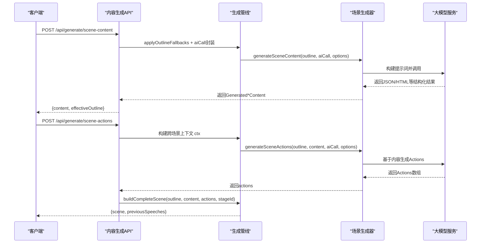
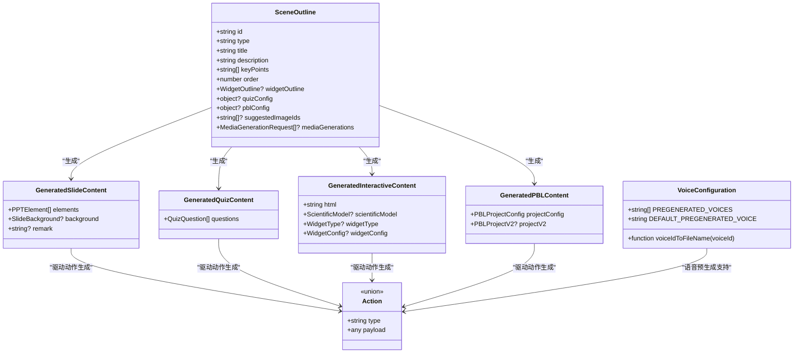
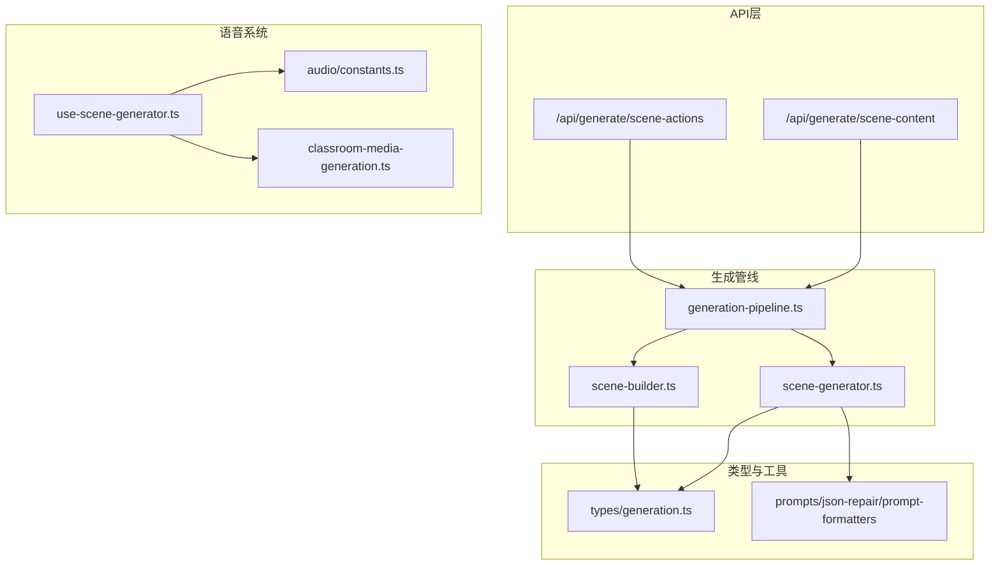
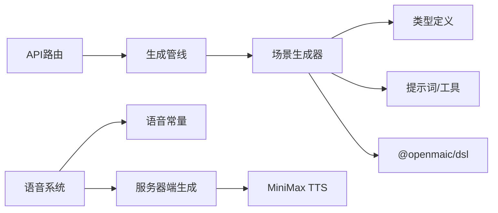

# 场景生成器

<cite>
**本文引用的文件**   
- [scene-generator.ts](file://lib/generation/scene-generator.ts)
- [generation-pipeline.ts](file://lib/generation/generation-pipeline.ts)
- [route.ts（内容生成）](file://app/api/generate/scene-content/route.ts)
- [route.ts（动作生成）](file://app/api/generate/scene-actions/route.ts)
- [generation.ts（类型定义）](file://lib/types/generation.ts)
- [use-scene-generator.ts](file://lib/hooks/use-scene-generator.ts)
- [constants.ts](file://lib/audio/constants.ts)
- [classroom-media-generation.ts](file://lib/server/classroom-media-generation.ts)
- [scene-generator-language-directive.test.ts](file://tests/generation/scene-generator-language-directive.test.ts)
</cite>

## 更新摘要
**变更内容**   
- 新增 forceVoice 选项支持，允许绕过智能体和设置解析直接使用 MiniMax TTS 与指定语音
- 增强预生成管道功能，支持高效创建所有语音变体
- 保持优先级顺序：当未强制使用时教师代理语音配置优先于全局设置
- 更新 SceneContentOptions 和 SceneActionsOptions 接口以支持新的语音控制机制

## 产品概述
本章节聚焦 OpenMAIC 的"场景生成器"，即根据大纲（SceneOutline）自动生成具体场景内容（幻灯片、测验、交互式 HTML、PBL），并进一步生成播放动作（Actions），最终拼装为可播放的完整 Scene。其核心价值在于：
- 将自然语言与结构化大纲转化为多模态课件内容，支持文本、图片、视频、交互组件等元素。
- 通过两阶段流水线（先内容后动作）提升可控性与一致性，便于跨场景连贯性控制。
- 提供统一的配置接口（SceneContentOptions、SceneActionsOptions），支撑不同场景类型的差异化生成策略。
- **新增 forceVoice 选项**：支持绕过智能体和设置解析，直接使用 MiniMax TTS 与指定语音，实现高效的预生成管道。
- 面向初学者提供清晰的数据结构与扩展指南，帮助开发者自定义新的场景类型或行为。

## 核心业务流程
整体流程分为两步：
1. 内容生成：根据 SceneOutline 调用 generateSceneContent，产出对应类型的 Generated*Content。
2. 动作生成：基于内容与上下文调用 generateSceneActions，产出 Actions 列表，并通过 buildCompleteScene 组装为完整 Scene。

**图表来源** 
- [route.ts（内容生成）:34-197](file://app/api/generate/scene-content/route.ts#L34-L197)
- [route.ts（动作生成）:35-184](file://app/api/generate/scene-actions/route.ts#L35-L184)
- [generation-pipeline.ts:34-40](file://lib/generation/generation-pipeline.ts#L34-L40)
- [scene-generator.ts:197-276](file://lib/generation/scene-generator.ts#L197-L276)

**章节来源**
- [route.ts（内容生成）:34-197](file://app/api/generate/scene-content/route.ts#L34-L197)
- [route.ts（动作生成）:35-184](file://app/api/generate/scene-actions/route.ts#L35-L184)
- [generation-pipeline.ts:34-40](file://lib/generation/generation-pipeline.ts#L34-L40)

## 功能模块清单
- 内容生成器（generateSceneContent）
  - 职责：按 outline.type 分发到 slide/quiz/interactive/pbl 分支，生成对应结构的内容。
  - 关键点：支持编辑模式（editDirective/baselineContent）、视觉能力（visionEnabled）、媒体占位符（gen_img_*/gen_vid_*）解析、LaTeX 渲染、图像比例修正。
- 动作生成器（generateSceneActions）
  - 职责：基于已生成的内容，结合跨场景上下文（页码、总页数、历史演讲文本等）生成 Actions。
  - 关键点：统一注入 languageDirective；对不同类型场景构造差异化提示词；输出 speech/play_video/widget_xxx 等动作。
- 场景装配器（buildCompleteScene/createSceneWithActions）
  - 职责：将 outline、content、actions 合并为完整 Scene，确保字段一致性与可播放性。
  - 关键点：提取 previousSpeeches 用于跨场景连贯；处理 PBL v2 兼容结构。
- **语音预生成系统**
  - 职责：支持 forceVoice 选项，绕过智能体和设置解析直接使用 MiniMax TTS。
  - 关键点：PREGENERATED_VOICES 常量定义支持的语音列表，voiceIdToFileName 函数处理文件名安全转换。

**章节来源**
- [scene-generator.ts:197-276](file://lib/generation/scene-generator.ts#L197-L276)
- [route.ts（动作生成）:136-176](file://app/api/generate/scene-actions/route.ts#L136-L176)
- [generation-pipeline.ts:34-40](file://lib/generation/generation-pipeline.ts#L34-L40)
- [use-scene-generator.ts:245-439](file://lib/hooks/use-scene-generator.ts#L245-L439)

## 数据与状态
- 输入类型
  - SceneOutline：描述场景意图、要点、可选配置（quizConfig、widgetType、pblConfig 等）。
  - PdfImage/ImageMapping：PDF 抽取图片及其映射，供内容生成时引用。
  - MediaGenerationRequest：AI 生成媒体请求（image/video），以占位 ID 形式参与后续回填。
- 输出类型
  - GeneratedSlideContent：包含 elements（PPTElement[]）、background、remark。
  - GeneratedQuizContent：questions 数组。
  - GeneratedInteractiveContent：html 字符串及可选 widgetConfig。
  - GeneratedPBLContent：projectConfig（兼容旧版）与 projectV2（新版结构）。
- 关键状态流转
  - 内容生成阶段：AI 返回 JSON/HTML → 规范化（normalizeElement）→ 修复默认值与比例 → 解析占位符 → 输出稳定结构。
  - 动作生成阶段：内容 + 上下文 → AI 生成 Actions → 校验与标准化 → 装配为 Scene。
  - 跨场景连贯：previousSpeeches 在相邻场景间传递，保证叙述一致性。
  - **语音预生成阶段**：支持 PREGENERATED_VOICES 列表，为每个 speech action 同时合成多种语音变体。

**图表来源** 
- [generation.ts（类型定义）:125-206](file://lib/types/generation.ts#L125-L206)
- [scene-generator.ts:197-276](file://lib/generation/scene-generator.ts#L197-L276)
- [constants.ts:55-69](file://lib/audio/constants.ts#L55-L69)

**章节来源**
- [generation.ts（类型定义）:125-206](file://lib/types/generation.ts#L125-L206)
- [scene-generator.ts:197-276](file://lib/generation/scene-generator.ts#L197-L276)
- [constants.ts:55-69](file://lib/audio/constants.ts#L55-L69)

## 关键约束与边界
- 非功能性需求
  - 超时限制：内容生成最大时长 300s，动作生成 60s。
  - 视觉预算：MAX_VISION_IMAGES 限制传入模型的图片数量，优先高优先级图片。
  - 健壮性：对模型返回的 null/缺失字段进行清理与修复，避免下游崩溃。
- 依赖与集成边界
  - 媒体资源由客户端并行生成，服务端仅保留占位 ID，后续回填。
  - 模型选择通过 resolveModelFromRequest 动态决定，支持 thinking 配置。
- 业务约束
  - 幻灯片编辑模式需保持已有图片不被删除（baseline 中 image 元素存在时强制 KEEP）。
  - 动作生成需考虑跨场景连贯（previousSpeeches）与用户画像（userProfile）。
  - PBL v2 需同时输出兼容结构与新版结构，保障平滑迁移。
  - **语音优先级**：当未使用 forceVoice 时，教师代理语音配置优先于全局设置。

**章节来源**
- [route.ts（内容生成）:32-33](file://app/api/generate/scene-content/route.ts#L32-L33)
- [route.ts（动作生成）:33-33](file://app/api/generate/scene-actions/route.ts#L33-L33)
- [scene-generator.ts:578-604](file://lib/generation/scene-generator.ts#L578-L604)
- [scene-generator.ts:677-710](file://lib/generation/scene-generator.ts#L677-L710)
- [use-scene-generator.ts:263-281](file://lib/hooks/use-scene-generator.ts#L263-L281)

## 详细实现说明

### 核心函数一：generateSceneContent
- 作用：根据 outline.type 分发到 slide/quiz/interactive/pbl 分支，生成对应内容。
- 关键逻辑
  - interactive：若缺少 widgetType，则回退为 simulation；统一走 generateWidgetContent。
  - slide：构建提示词（含 assignedImages、mediaGenerations、teacherContext），支持 EDIT MODE（editDirective/baselineContent），解析 LaTeX、修复元素默认值、解析 img_id/gen_* 占位符。
  - quiz：按 quizConfig 生成题目。
  - pbl：调用 PBL v2 规划器，输出兼容结构与新版结构。
- 错误处理
  - 解析失败返回 null；缺失必填字段记录警告并丢弃无效元素。
- 性能考量
  - 使用 Map 索引 PDF 图片元信息，降低 O(n×m) 查找复杂度。
  - 视觉图片切片控制在 MAX_VISION_IMAGES 内。

**章节来源**
- [scene-generator.ts:197-276](file://lib/generation/scene-generator.ts#L197-L276)
- [scene-generator.ts:562-784](file://lib/generation/scene-generator.ts#L562-L784)
- [scene-generator.ts:319-376](file://lib/generation/scene-generator.ts#L319-L376)
- [scene-generator.ts:445-503](file://lib/generation/scene-generator.ts#L445-L503)

### 核心函数二：generateSceneActions
- 作用：基于已生成的内容，结合上下文生成 Actions。
- 关键逻辑
  - 构建 SceneGenerationContext（pageIndex、totalPages、allTitles、previousSpeeches）。
  - 注入 languageDirective 到所有分支的提示词，确保语言一致性。
  - 针对不同场景类型构造差异化 prompt，输出 speech/play_video/widget_xxx 等动作。
- 错误处理
  - 解析失败返回空数组；异常由上层统一捕获并返回标准错误。

**章节来源**
- [route.ts（动作生成）:136-176](file://app/api/generate/scene-actions/route.ts#L136-L176)
- [scene-generator-language-directive.test.ts:94-187](file://tests/generation/scene-generator-language-directive.test.ts#L94-L187)

### 核心函数三：createSceneWithActions（buildCompleteScene）
- 作用：将 outline、content、actions 组装为完整 Scene。
- 关键逻辑
  - 填充 stageId、actions、content 字段。
  - 提取 previousSpeeches（speech 动作文本）用于跨场景连贯。
  - PBL 场景保留 projectV2 结构以便渲染层增量迁移。
- 错误处理
  - 组装失败返回 null，上层返回 500 错误。

**章节来源**
- [route.ts（动作生成）:158-176](file://app/api/generate/scene-actions/route.ts#L158-L176)
- [generation-pipeline.ts:42-47](file://lib/generation/generation-pipeline.ts#L42-L47)

### 新增功能：forceVoice 语音控制选项
- 作用：绕过智能体和设置解析，直接使用 MiniMax TTS 与指定语音。
- 关键逻辑
  - 在 generateAndStoreTTS 函数中检查 forceVoice 参数。
  - 当 forceVoice 存在时，跳过 agent/settings 解析，直接使用 minimax-tts 提供商。
  - 保持优先级顺序：教师代理语音配置 > 全局设置 > forceVoice 强制选项。
- 预生成管道
  - 使用 PREGENERATED_VOICES 常量定义支持的语音列表。
  - 为每个 speech action 同时合成多种语音变体，支持即时切换。
  - 使用 voiceIdToFileName 函数确保文件名安全转换。

**章节来源**
- [use-scene-generator.ts:245-439](file://lib/hooks/use-scene-generator.ts#L245-L439)
- [constants.ts:55-69](file://lib/audio/constants.ts#L55-L69)
- [classroom-media-generation.ts:230-290](file://lib/server/classroom-media-generation.ts#L230-L290)

### 配置选项：SceneContentOptions 与 SceneActionsOptions
- SceneContentOptions
  - assignedImages/imageMapping：PDF 图片及其映射，用于内容生成时引用。
  - languageModel/visionEnabled：模型与视觉能力开关。
  - generatedMediaMapping：AI 生成媒体占位符回填映射。
  - agents/languageDirective/thinkingConfig/targetLanguage/userRequirements/allowProceduralSkill：教师人设、语言指令、思考配置、目标语言、用户需求、是否允许程序化技能。
  - editDirective/baselineContent：幻灯片编辑模式专用，用于基于现有内容进行修订。
- SceneActionsOptions
  - ctx：跨场景上下文（页码、总数、标题列表、历史演讲）。
  - agents/userProfile/languageDirective：智能体信息、用户画像、语言指令。
- **新增语音控制选项**
  - forceVoice：强制使用指定语音ID，绕过智能体和设置解析。
  - PREGENERATED_VOICES：预生成语音列表，支持多语音变体同步生成。

**章节来源**
- [scene-generator.ts:67-100](file://lib/generation/scene-generator.ts#L67-L100)
- [use-scene-generator.ts:250-258](file://lib/hooks/use-scene-generator.ts#L250-L258)
- [constants.ts:55-69](file://lib/audio/constants.ts#L55-L69)

### 不同类型场景的生成示例
- 幻灯片（slide）
  - 输入：title/description/keyPoints/suggestedImageIds/mediaGenerations。
  - 输出：elements（text/image/shape/chart/latex/line 等）、background、remark。
  - 特殊：EDIT MODE 下保留 baseline 中的 image 元素，禁止删除。
- 测验（quiz）
  - 输入：quizConfig（questionCount/difficulty/questionTypes）。
  - 输出：questions（single/multiple/text）。
- 交互式 HTML（interactive）
  - 输入：widgetType/widgetOutline（simulation/code/diagram/game/visualization3d）。
  - 输出：html 字符串，可选 scientificModel 与 widgetConfig。
- PBL（pbl）
  - 输入：pblConfig（projectTopic/projectDescription/targetSkills/scenarioRoleplay/scenarioBrief）。
  - 输出：projectConfig（兼容旧版）+ projectV2（新版结构）。

**章节来源**
- [scene-generator.ts:248-276](file://lib/generation/scene-generator.ts#L248-L276)
- [generation.ts（类型定义）:125-206](file://lib/types/generation.ts#L125-L206)

### 媒体资源处理流程
- PDF 图片：assignedImages + imageMapping → 视觉模式切片 → 提示词注入 → 生成内容引用 img_N → 后端解析为 base64 URL。
- AI 生成媒体：mediaGenerations（image/video）→ 占位符 gen_img_*/gen_vid_* → 前端并行生成 → 回填 generatedMediaMapping → 替换占位符。
- 视频引用规范化：normalizeGeneratedVideoRefs 确保 mediaRef/src 一致性，移除无效引用。
- **语音预生成流程**：PREGENERATED_VOICES → 为每个语音生成音频文件 → 存储到 IndexedDB → 支持运行时切换。

**章节来源**
- [scene-generator.ts:319-376](file://lib/generation/scene-generator.ts#L319-376)
- [scene-generator.ts:378-430](file://lib/generation/scene-generator.ts#L378-430)
- [route.ts（内容生成）:145-162](file://app/api/generate/scene-content/route.ts#L145-162)
- [use-scene-generator.ts:389-414](file://lib/hooks/use-scene-generator.ts#L389-414)

### 错误处理策略
- 输入校验：缺失必填字段返回 400 错误。
- 模型调用异常：统一转换为 llmApiError，携带模型信息与错误详情。
- 内容解析失败：返回 null，上层记录日志并返回 500。
- 元素规范化失败：丢弃无效元素，避免下游崩溃。
- **语音生成错误**：单个语音生成失败不影响其他语音，记录详细错误信息并继续处理。

**章节来源**
- [route.ts（内容生成）:65-78](file://app/api/generate/scene-content/route.ts#L65-78)
- [route.ts（动作生成）:64-80](file://app/api/generate/scene-actions/route.ts#L64-80)
- [scene-generator.ts:445-503](file://lib/generation/scene-generator.ts#L445-503)
- [use-scene-generator.ts:397-410](file://lib/hooks/use-scene-generator.ts#L397-410)

## 架构概览

**图表来源** 
- [generation-pipeline.ts:8-47](file://lib/generation/generation-pipeline.ts#L8-L47)
- [scene-generator.ts:1-56](file://lib/generation/scene-generator.ts#L1-L56)
- [use-scene-generator.ts:245-439](file://lib/hooks/use-scene-generator.ts#L245-L439)
- [constants.ts:55-69](file://lib/audio/constants.ts#L55-L69)
- [classroom-media-generation.ts:230-290](file://lib/server/classroom-media-generation.ts#L230-L290)
- [generation.ts（类型定义）:1-34](file://lib/types/generation.ts#L1-L34)

## 依赖分析
- 组件耦合
  - API 层依赖 generation-pipeline 暴露的统一入口，解耦具体实现。
  - scene-generator 依赖 types/generation 与 prompts/utils，保持低耦合。
  - **语音系统**：use-scene-generator 依赖 audio/constants 和 server 端的 classroom-media-generation。
- 外部依赖
  - callLLM：大模型调用封装，支持 vision 与 thinking 配置。
  - @openmaic/dsl：DSL 元素规范化与默认值填充。
  - MiniMax TTS：语音合成服务，支持多语音变体预生成。
- 潜在循环依赖
  - 当前无直接循环，pipeline 作为 barrel 导出，避免重复导入。

**图表来源** 
- [generation-pipeline.ts:8-47](file://lib/generation/generation-pipeline.ts#L8-L47)
- [scene-generator.ts:1-56](file://lib/generation/scene-generator.ts#L1-L56)
- [use-scene-generator.ts:245-439](file://lib/hooks/use-scene-generator.ts#L245-L439)
- [constants.ts:55-69](file://lib/audio/constants.ts#L55-L69)

**章节来源**
- [generation-pipeline.ts:8-47](file://lib/generation/generation-pipeline.ts#L8-L47)
- [scene-generator.ts:1-56](file://lib/generation/scene-generator.ts#L1-L56)
- [use-scene-generator.ts:245-439](file://lib/hooks/use-scene-generator.ts#L245-L439)

## 性能考虑
- 视觉图片切片：MAX_VISION_IMAGES 控制输入大小，避免超限。
- 元素规范化：O(n) 遍历 + Map 索引，避免嵌套查找。
- 媒体回填：占位符机制减少同步阻塞，前端并行生成。
- 超时控制：API 层设置 maxDuration，防止长任务阻塞。
- **语音预生成优化**：
  - 并发控制：支持 parallelSceneConcurrency 配置语音生成并发度。
  - 失败重试：单个语音生成失败不影响其他语音，支持重试机制。
  - 缓存策略：IndexedDB 存储音频文件，避免重复生成。

[本节为通用指导，不直接分析具体文件]

## 故障排查指南
- 常见问题
  - 图片未显示：检查 imageMapping 是否包含对应 img_N；确认 isImageIdReference 判断逻辑。
  - 视频无法播放：验证 normalizeGeneratedVideoRefs 是否正确转换 mediaRef/src。
  - 语言不一致：确认 languageDirective 是否贯穿所有分支（测试用例覆盖）。
  - **语音问题**：检查 forceVoice 参数是否正确传递，确认 MiniMax TTS 提供商配置。
- 调试建议
  - 启用 logger 查看中间步骤日志（如 image resolution、element fixing）。
  - 使用测试用例中的 makeCapturingAiCall 捕获提示词，验证指令注入。
  - **语音调试**：检查 PREGENERATED_VOICES 列表，验证 voiceIdToFileName 转换结果。

**章节来源**
- [scene-generator-language-directive.test.ts:26-43](file://tests/generation/scene-generator-language-directive.test.ts#L26-L43)
- [scene-generator.ts:722-751](file://lib/generation/scene-generator.ts#L722-L751)
- [use-scene-generator.ts:397-410](file://lib/hooks/use-scene-generator.ts#L397-L410)

## 结论
OpenMAIC 的场景生成器通过清晰的两阶段流水线、统一的配置接口与健壮的异常处理，实现了从大纲到多模态课件的高效生成。**新增的 forceVoice 选项**进一步增强了系统的灵活性，支持绕过智能体和设置解析直接使用 MiniMax TTS 与指定语音，使预生成管道能够高效创建所有语音变体。系统保持了良好的优先级顺序，当未强制使用时教师代理语音配置优先于全局设置。开发者可基于 SceneContentOptions/SceneActionsOptions 扩展新场景类型，或通过修改提示词与后处理逻辑定制行为。建议在新增类型时遵循现有分支模式，并确保语言指令与媒体占位符的正确处理。

[本节为总结性内容，不直接分析具体文件]