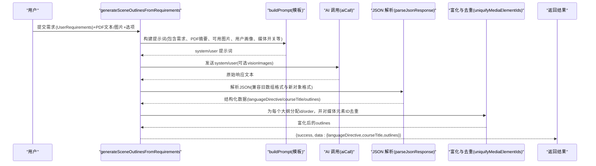
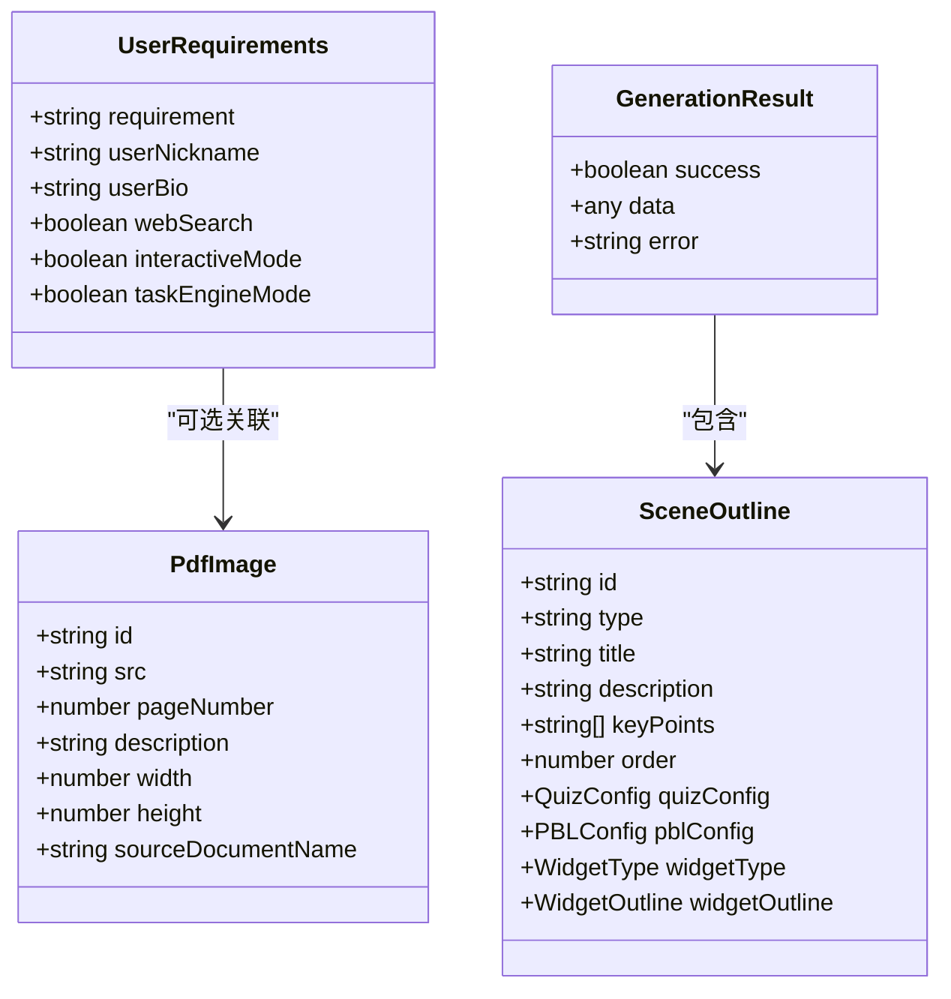
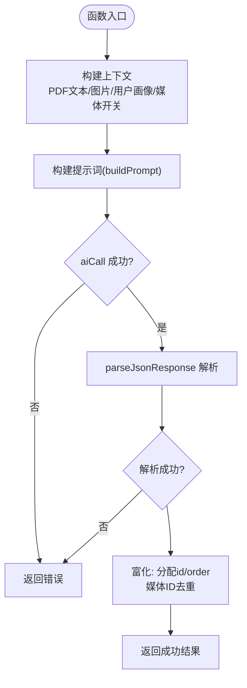
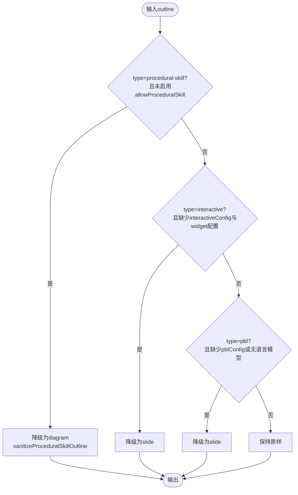
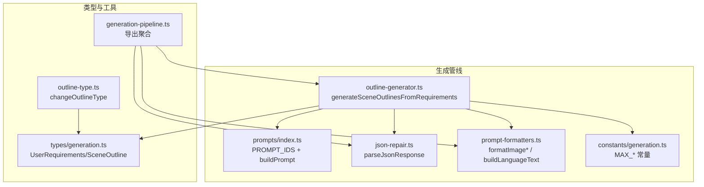
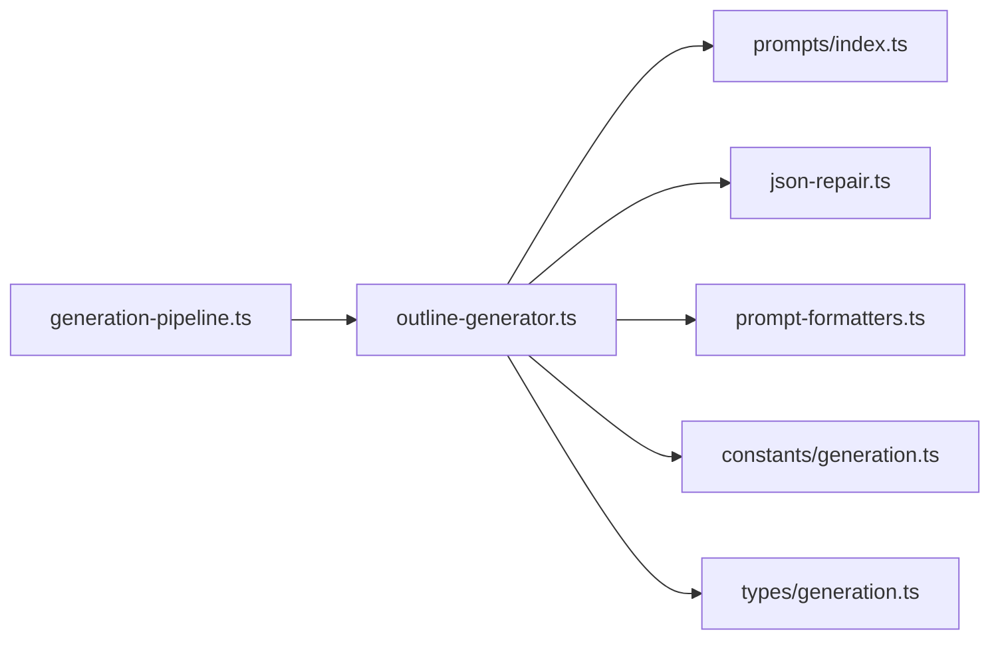

# 大纲生成器

<cite>
**本文引用的文件**   
- [lib/generation/outline-generator.ts](file://lib/generation/outline-generator.ts)
- [lib/types/generation.ts](file://lib/types/generation.ts)
- [lib/prompts/index.ts](file://lib/prompts/index.ts)
- [lib/generation/json-repair.ts](file://lib/generation/json-repair.ts)
- [lib/generation/prompt-formatters.ts](file://lib/generation/prompt-formatters.ts)
- [lib/constants/generation.ts](file://lib/constants/generation.ts)
- [lib/generation/outline-type.ts](file://lib/generation/outline-type.ts)
- [lib/generation/generation-pipeline.ts](file://lib/generation/generation-pipeline.ts)
- [lib/pbl/v2/operations/proficiency.ts](file://lib/pbl/v2/operations/proficiency.ts)
- [lib/agent/client/resolve-scene-outline.ts](file://lib/agent/client/resolve-scene-outline.ts)
- [tests/generation/scene-generator-language-directive.test.ts](file://tests/generation/scene-generator-language-directive.test.ts)
</cite>

## 产品概述
本模块是 OpenMAIC 的“大纲生成器”，负责将用户的自然语言需求（可附带 PDF 文本与图片）转换为结构化的课件场景大纲，并输出课程标题、语言指令与各页场景的类型化大纲。该能力作为两阶段生成系统的第一阶段，为后续的内容生成与动作编排提供稳定输入。

核心价值：
- 将模糊需求转化为结构化、可执行的课件大纲（幻灯片/测验/交互/PBL）。
- 支持多模态输入（PDF 文本与图片），在视觉模式下优先注入关键图像给模型。
- 通过语言指令（languageDirective）贯穿后续内容生成，确保语言风格一致。
- 内置降级策略与错误恢复，保证在 LLM 返回异常或字段缺失时仍可产出可用结果。

适用场景：
- 教师快速生成课程大纲与页面规划。
- 基于已有教材（PDF）自动抽取要点并映射到课件结构。
- 需要强语言控制的教学内容生成（如双语教学、特定术语规范等）。

## 核心业务流程
整体流程分为“提示词构建 → AI 调用 → JSON 解析与校验 → 富化与去重 → 降级处理”五个步骤：

**图表来源** 
- [lib/generation/outline-generator.ts:36-159](file://lib/generation/outline-generator.ts#L36-L159)
- [lib/prompts/index.ts:26-49](file://lib/prompts/index.ts#L26-L49)
- [lib/generation/json-repair.ts:35-56](file://lib/generation/json-repair.ts#L35-L56)

**章节来源**
- [lib/generation/outline-generator.ts:36-159](file://lib/generation/outline-generator.ts#L36-L159)
- [lib/prompts/index.ts:26-49](file://lib/prompts/index.ts#L26-L49)
- [lib/generation/json-repair.ts:35-56](file://lib/generation/json-repair.ts#L35-L56)

## 功能模块清单
- 需求与上下文组装
  - 职责：聚合用户需求、学生画像、PDF 文本与图片描述、媒体能力开关、研究/教师上下文。
  - 验收要点：正确裁剪 PDF 文本长度；按视觉预算限制图片数量；构造用户画像段落。
- 提示词构建
  - 职责：使用 PROMPT_IDS.REQUIREMENTS_TO_OUTLINES 模板，插入变量生成 system/user 消息。
  - 验收要点：模板存在且成功返回；变量替换完整无遗漏。
- AI 调用与多模态
  - 职责：调用 aiCall(system,user,visionImages)，在开启视觉模式时传入前 N 张图。
  - 验收要点：visionImages 仅含有效映射的图片；text-only 模式不传图。
- JSON 解析与容错
  - 职责：解析新对象格式或旧数组格式；修复常见 LLM 输出问题（代码块、转义、截断等）。
  - 验收要点：失败时记录详细日志；回退到默认语言指令；对 courseTitle 做长度保护。
- 富化与去重
  - 职责：为每个大纲补全 id/order；统一媒体元素 ID，避免重复。
  - 验收要点：顺序从 1 开始递增；媒体元素 ID 全局唯一。
- 降级与类型修正
  - 职责：applyOutlineFallbacks 对不完整/不支持的类型进行降级（如 interactive→slide、pbl→slide）。
  - 验收要点：保留必要字段；记录警告；保证最终大纲可被下游消费。

**章节来源**
- [lib/generation/outline-generator.ts:36-159](file://lib/generation/outline-generator.ts#L36-L159)
- [lib/generation/json-repair.ts:76-161](file://lib/generation/json-repair.ts#L76-L161)
- [lib/generation/outline-generator.ts:187-213](file://lib/generation/outline-generator.ts#L187-L213)

## 数据与状态
- 输入模型
  - UserRequirements：单一自由文本需求，可选学生昵称/背景、是否启用网页搜索与交互模式等。
  - PdfImage：从 PDF 提取的图片元数据（id、src、页码、尺寸、描述、来源文档信息等）。
  - ImageMapping：图片 id → base64 URL 的映射，用于视觉模式。
- 输出模型
  - SceneOutline：每页大纲，包含 type/title/description/keyPoints/order，以及 quizConfig/pblConfig/widgetType/widgetOutline 等类型化配置。
  - GenerationResult：包裹 success/data/error 的结构，data 包含 languageDirective、courseTitle、outlines。
- 状态流转
  - 原始 outlines 经富化后进入渲染/编辑管线；若 scene 缺少 outlineId，则通过 resolveSceneOutline 回退到基于 scene 自身派生的大纲。
  - PBL 难度信号会扫描 prior scenes 的关键词以推断难度，影响后续生成策略。

**图表来源** 
- [lib/types/generation.ts:75-82](file://lib/types/generation.ts#L75-L82)
- [lib/types/generation.ts:125-169](file://lib/types/generation.ts#L125-L169)

**章节来源**
- [lib/types/generation.ts:75-82](file://lib/types/generation.ts#L75-L82)
- [lib/types/generation.ts:125-169](file://lib/types/generation.ts#L125-L169)
- [lib/agent/client/resolve-scene-outline.ts:18-30](file://lib/agent/client/resolve-scene-outline.ts#L18-L30)
- [lib/pbl/v2/operations/proficiency.ts:232-271](file://lib/pbl/v2/operations/proficiency.ts#L232-L271)

## 关键约束与边界
- 非功能性约束
  - PDF 文本最大字符数限制（MAX_PDF_CONTENT_CHARS），防止超长输入。
  - 视觉模式最多传入 MAX_VISION_IMAGES 张图片，超出部分转为纯文本描述。
  - courseTitle 长度上限（防御性截断），避免下游存储列溢出。
- 依赖与集成边界
  - 提示词模板必须存在（REQUIREMENTS_TO_OUTLINES），否则直接返回失败。
  - aiCall 需支持多模态（visionImages）与 JSON 输出。
  - JSON 解析依赖 jsonrepair 与自定义修复策略，需容忍 LLM 的不规范输出。
- 业务约束
  - 交互式场景必须提供 interactiveConfig 或 widgetType+widgetOutline，否则降级为 slide。
  - PBL 场景必须提供 pblConfig 且具备语言模型能力，否则降级为 slide。
  - 程序技能类（procedural-skill）需在允许开关下才生效，否则降级为 diagram。

**章节来源**
- [lib/constants/generation.ts:6-10](file://lib/constants/generation.ts#L6-L10)
- [lib/generation/outline-generator.ts:95-113](file://lib/generation/outline-generator.ts#L95-L113)
- [lib/generation/outline-generator.ts:187-213](file://lib/generation/outline-generator.ts#L187-L213)

## 详细实现说明

### generateSceneOutlinesFromRequirements 工作原理
- 提示词构建
  - 使用 buildPrompt(PROMPT_IDS.REQUIREMENTS_TO_OUTLINES, vars) 生成 system/user 提示词。
  - 变量包括：requirement、pdfContent（截断）、availableImages（视觉占位或文本描述）、userProfile、hasSourceImages、imageEnabled、videoEnabled、mediaEnabled、researchContext、teacherContext。
- AI 调用
  - 当 visionEnabled 且 imageMapping 存在时，按优先级排序图片，取前 N 张作为 visionImages；其余转为文本描述。
  - 调用 aiCall(system,user,visionImages) 获取原始响应。
- JSON 解析与验证
  - parseJsonResponse 支持多种 LLM 输出形态（代码块、裸 JSON、带推理标签的前缀等），并尝试修复转义、截断等问题。
  - 兼容旧数组格式（直接返回 SceneOutline[]）与新对象格式（{languageDirective,courseTitle,outlines}）。
  - 对 courseTitle 做长度保护；缺失 languageDirective 时使用默认值 DEFAULT_LANGUAGE_DIRECTIVE。
- 富化与去重
  - 为每个 outline 分配 id（nanoid）与 order（从 1 开始）。
  - 调用 uniquifyMediaElementIds 对媒体元素 ID 去重，避免重复引用。
- 返回值
  - 成功：{success:true, data:{languageDirective,courseTitle,outlines}}
  - 失败：{success:false,error:...}

**图表来源** 
- [lib/generation/outline-generator.ts:36-159](file://lib/generation/outline-generator.ts#L36-L159)
- [lib/generation/json-repair.ts:35-56](file://lib/generation/json-repair.ts#L35-L56)

**章节来源**
- [lib/generation/outline-generator.ts:36-159](file://lib/generation/outline-generator.ts#L36-L159)
- [lib/generation/json-repair.ts:35-56](file://lib/generation/json-repair.ts#L35-L56)

### applyOutlineFallbacks 降级策略与错误恢复
- 规则
  - 若类型为 interactive 但缺少 interactiveConfig 且无 widgetType+widgetOutline，降级为 slide。
  - 若类型为 pbl 但缺少 pblConfig 或无语言模型能力，降级为 slide。
  - 若类型为 procedural-skill 但未启用 allowProceduralSkill，降级为 diagram（sanitizeProceduralSkillOutline）。
- 行为
  - 记录警告日志，便于追踪降级原因。
  - 保持共享字段（title/description/keyPoints/order）不变，仅调整类型与必要配置。
- 用途
  - 保障下游渲染与编辑管线始终能拿到合法的大纲结构。

**图表来源** 
- [lib/generation/outline-generator.ts:187-213](file://lib/generation/outline-generator.ts#L187-L213)

**章节来源**
- [lib/generation/outline-generator.ts:187-213](file://lib/generation/outline-generator.ts#L187-L213)

### 不同课程类型的生成示例（概念性）
- 幻灯片（slide）
  - 典型结构：标题、要点列表、配图建议、备注。
  - 适合知识点讲解、概念引入、案例展示。
- 测验（quiz）
  - 典型结构：题目数量、难度、题型（单选/多选/简答）。
  - 适合知识巩固与即时反馈。
- 交互（interactive）
  - 典型结构：widgetType（simulation/diagram/code/game/visualization3d/procedural-skill）+ widgetOutline。
  - 适合模拟实验、流程图绘制、编程挑战、游戏化学习、3D可视化、操作流程演练。
- 项目式学习（pbl）
  - 典型结构：projectTopic/projectDescription/targetSkills，可选 scenarioRoleplay/scenarioBrief。
  - 适合跨学科综合任务与角色扮演情境。

注意：以上为概念性示例，实际字段由 SceneOutline 定义与模板驱动。

**章节来源**
- [lib/types/generation.ts:125-169](file://lib/types/generation.ts#L125-L169)

### 配置参数说明
- generateSceneOutlinesFromRequirements 参数
  - requirements：UserRequirements（需求文本与学生画像）。
  - pdfText/pdfImages：PDF 文本与图片集合（可选）。
  - aiCall：AI 调用函数（支持多模态）。
  - options：
    - visionEnabled/imageMapping：视觉模式开关与图片映射。
    - imageGenerationEnabled/videoGenerationEnabled：媒体生成能力开关。
    - researchContext/teacherContext：研究与教师上下文注入。
- 常量
  - MAX_PDF_CONTENT_CHARS：PDF 文本最大字符数。
  - MAX_VISION_IMAGES：视觉模式最大图片数。

**章节来源**
- [lib/generation/outline-generator.ts:36-109](file://lib/generation/outline-generator.ts#L36-L109)
- [lib/constants/generation.ts:6-10](file://lib/constants/generation.ts#L6-L10)

### 性能优化建议
- 控制输入规模
  - 严格限制 PDF 文本长度与视觉图片数量，减少模型负载与延迟。
- 复用与缓存
  - 对相同需求与素材的请求可考虑缓存提示词与中间结果（如用户画像、教师人设）。
- 并行与流式
  - 若后续阶段依赖 outlines，可在解析成功后尽早启动第二阶段（内容生成），减少等待时间。
- 降级优先
  - 遇到解析失败或字段缺失时尽快降级，避免阻塞主流程。

[本节为通用指导，不直接分析具体文件]

## 架构总览

**图表来源** 
- [lib/generation/outline-generator.ts:36-159](file://lib/generation/outline-generator.ts#L36-L159)
- [lib/prompts/index.ts:26-49](file://lib/prompts/index.ts#L26-L49)
- [lib/generation/json-repair.ts:35-56](file://lib/generation/json-repair.ts#L35-L56)
- [lib/generation/prompt-formatters.ts:78-101](file://lib/generation/prompt-formatters.ts#L78-L101)
- [lib/constants/generation.ts:6-10](file://lib/constants/generation.ts#L6-L10)
- [lib/types/generation.ts:75-82](file://lib/types/generation.ts#L75-L82)
- [lib/generation/outline-type.ts:23-96](file://lib/generation/outline-type.ts#L23-L96)
- [lib/generation/generation-pipeline.ts:31-32](file://lib/generation/generation-pipeline.ts#L31-L32)

## 依赖分析
- 组件耦合
  - outline-generator 依赖 prompts（模板）、json-repair（解析）、prompt-formatters（格式化）、constants（常量）、types（数据结构）。
  - generation-pipeline 作为聚合层，对外暴露统一的 API。
- 外部依赖
  - aiCall 抽象了具体的 LLM 提供商，支持多模态与 JSON 输出。
  - jsonrepair 库用于修复不规范 JSON。
- 潜在循环
  - 当前模块间为单向依赖，未见循环导入。

**图表来源** 
- [lib/generation/outline-generator.ts:1-21](file://lib/generation/outline-generator.ts#L1-L21)
- [lib/generation/generation-pipeline.ts:31-32](file://lib/generation/generation-pipeline.ts#L31-L32)

**章节来源**
- [lib/generation/outline-generator.ts:1-21](file://lib/generation/outline-generator.ts#L1-L21)
- [lib/generation/generation-pipeline.ts:31-32](file://lib/generation/generation-pipeline.ts#L31-L32)

## 故障排查指南
- 常见问题
  - 提示词模板不存在：检查 PROMPT_IDS.REQUIREMENTS_TO_OUTLINES 是否加载成功。
  - JSON 解析失败：查看日志中的 raw response 片段，确认是否存在代码块、转义错误或截断。
  - 类型降级：确认 interactive/pbl 的配置是否完整；检查语言模型能力开关。
- 调试建议
  - 打印 availableImagesText 与 userProfile 以确认上下文注入是否正确。
  - 在 aiCall 前后记录 system/user 与 visionImages，定位提示词问题。
  - 对 courseTitle 与 outlines 的长度与结构进行断言，确保下游兼容性。

**章节来源**
- [lib/generation/outline-generator.ts:111-113](file://lib/generation/outline-generator.ts#L111-L113)
- [lib/generation/json-repair.ts:48-56](file://lib/generation/json-repair.ts#L48-L56)
- [lib/generation/outline-generator.ts:187-213](file://lib/generation/outline-generator.ts#L187-L213)

## 结论
大纲生成器通过严谨的提示词构建、健壮的 JSON 解析与完善的降级策略，将用户需求高效转化为可用的课件大纲。其模块化设计与清晰的职责划分，使得扩展新的场景类型与媒体能力变得简单可靠。开发者可在此基础上定制生成逻辑，满足更多教学场景需求。

[本节为总结性内容，不直接分析具体文件]