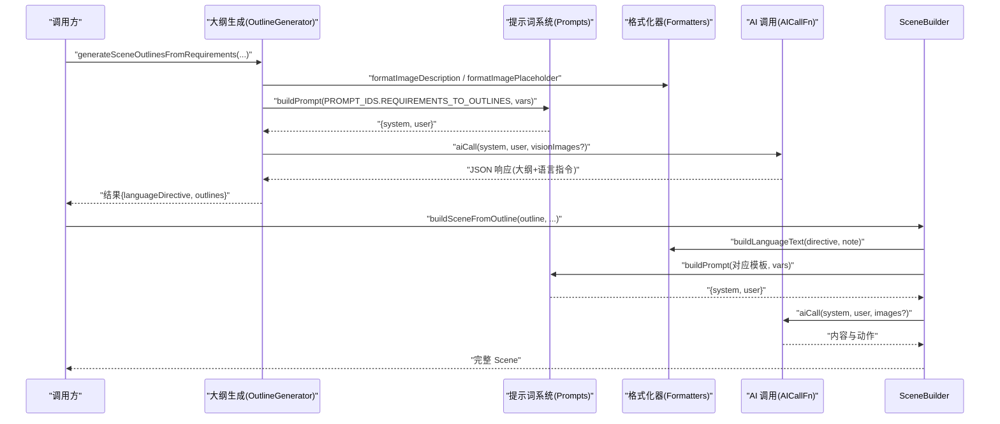
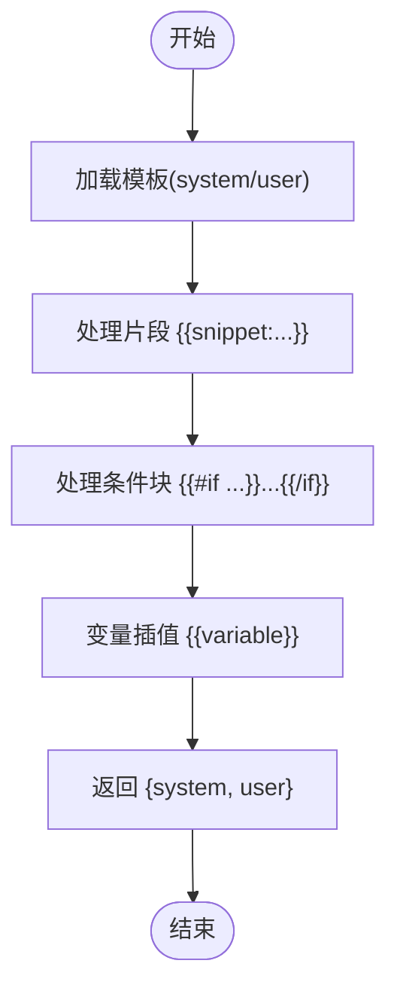
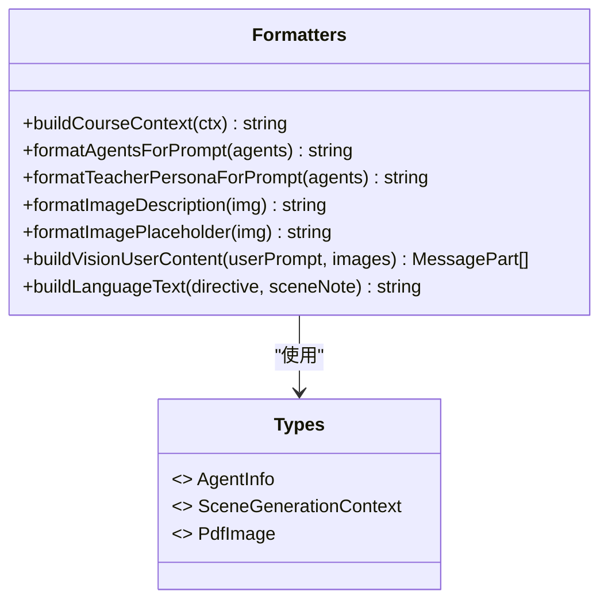
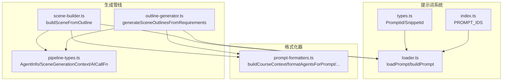
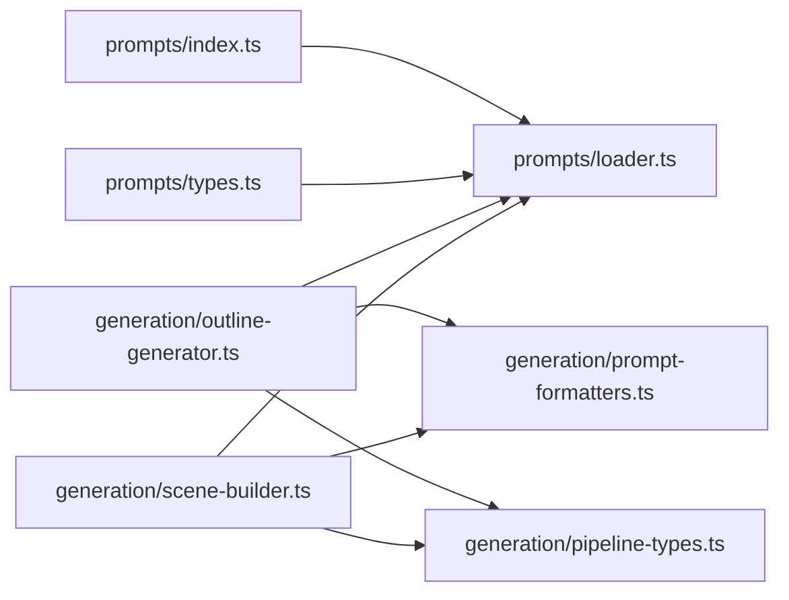

# 提示词格式化器

<cite>
**本文引用的文件**   
- [lib/generation/prompt-formatters.ts](file://lib/generation/prompt-formatters.ts)
- [lib/prompts/index.ts](file://lib/prompts/index.ts)
- [lib/prompts/loader.ts](file://lib/prompts/loader.ts)
- [lib/prompts/types.ts](file://lib/prompts/types.ts)
- [lib/generation/outline-generator.ts](file://lib/generation/outline-generator.ts)
- [lib/generation/scene-builder.ts](file://lib/generation/scene-builder.ts)
- [lib/generation/pipeline-types.ts](file://lib/generation/pipeline-types.ts)
</cite>

## 产品概述
本文件聚焦于 OpenMAIC 的“提示词格式化器”子系统，系统化说明以下函数的职责、输入输出与使用场景：
- buildCourseContext：为动作/内容生成注入课程上下文（页码、标题序列、过渡约束等）
- formatAgentsForPrompt：将智能体列表格式化为提示词片段
- formatTeacherPersonaForPrompt：提取教师人设并注入风格约束
- formatImageDescription：将 PDF 图片元信息转为文本描述
- formatImagePlaceholder：为视觉模式生成简短占位符（不含描述）
- buildVisionUserContent：构建多模态用户消息数组（文本与图像交错）
- buildLanguageText：根据课程级指令与场景级备注拼接语言指令

同时解释提示词模板系统的设计原则、变量替换机制、条件块与片段复用，以及多语言支持策略。提供实际构建示例、最佳实践与调试技巧，帮助初学者理解提示词工程概念，并为开发者扩展自定义模板提供指南。

## 核心业务流程
- 大纲生成阶段：根据用户需求与可选 PDF 内容/图片，调用模板系统组装 system/user 提示词，必要时附带视觉图像，得到结构化大纲与语言指令。
- 场景构建阶段：基于大纲生成内容与动作，注入课程上下文、智能体信息与语言指令，确保跨页连贯性与角色一致性。
- 视觉增强阶段：在需要时以“占位符 + 真实图像”的方式向模型传递图像尺寸与比例信息，辅助布局决策。

图表来源
- [lib/generation/outline-generator.ts:96-116](file://lib/generation/outline-generator.ts#L96-L116)
- [lib/generation/scene-builder.ts:85-124](file://lib/generation/scene-builder.ts#L85-L124)
- [lib/prompts/loader.ts:128-145](file://lib/prompts/loader.ts#L128-L145)

章节来源
- [lib/generation/outline-generator.ts:36-160](file://lib/generation/outline-generator.ts#L36-L160)
- [lib/generation/scene-builder.ts:68-124](file://lib/generation/scene-builder.ts#L68-L124)
- [lib/prompts/loader.ts:128-145](file://lib/prompts/loader.ts#L128-L145)

## 功能模块清单
- 提示词模板系统
  - 职责：从文件加载模板、处理片段包含、条件块与变量插值，返回 system/user 提示词对。
  - 关键能力：{{snippet:name}} 片段复用、{{#if flag}}...{{/if}} 条件块、{{variable}} 变量替换。
  - 适用场景：所有 LLM 调用前的提示词组装。
  - 验收要点：缺失片段应报错；未匹配变量保持原样；对象类型自动 JSON 序列化。

- 提示词格式化器
  - 职责：将业务数据（课程上下文、智能体、图片元信息、语言指令）转换为稳定格式的字符串或消息数组。
  - 关键能力：跨页过渡约束、教师人设注入、PDF 图片描述/占位符、多模态消息构造。
  - 适用场景：大纲生成、内容生成、动作生成、视觉增强。
  - 验收要点：空输入安全返回空串；维度/比例计算正确；data URI 剥离；图像与文本交错顺序稳定。

- 管线类型定义
  - 职责：统一 AgentInfo、SceneGenerationContext、AICallFn 等类型，保证各阶段数据契约一致。
  - 适用场景：跨模块传递上下文与回调签名。

章节来源
- [lib/prompts/index.ts:16-23](file://lib/prompts/index.ts#L16-L23)
- [lib/prompts/loader.ts:28-48](file://lib/prompts/loader.ts#L28-L48)
- [lib/prompts/loader.ts:58-68](file://lib/prompts/loader.ts#L58-L68)
- [lib/prompts/loader.ts:107-118](file://lib/prompts/loader.ts#L107-L118)
- [lib/prompts/loader.ts:128-145](file://lib/prompts/loader.ts#L128-L145)
- [lib/generation/pipeline-types.ts:8-23](file://lib/generation/pipeline-types.ts#L8-L23)
- [lib/generation/pipeline-types.ts:60-65](file://lib/generation/pipeline-types.ts#L60-L65)

## 数据与状态
- 核心数据结构
  - AgentInfo：智能体标识、名称、角色与人设片段。
  - SceneGenerationContext：当前页码、总页数、标题序列、上一页演讲文本，用于跨页连贯性。
  - PdfImage：图片 ID、页面、尺寸、来源文档名、描述等元信息。
  - AICallFn：统一的 AI 调用签名，支持传入 system/user 与可选图像数组。

- 关键状态流转
  - 大纲阶段：用户需求 + PDF 文本/图片 → 模板变量 → system/user → AI → 结构化大纲 + 语言指令。
  - 场景阶段：大纲 + 语言指令 + 课程上下文 + 智能体 → 模板变量 → system/user → AI → 内容与动作。
  - 视觉阶段：按序插入文本与图像，附带尺寸/比例，使模型具备布局先验。

- 数据所有权边界
  - 模板系统负责静态模板与片段管理；格式化器负责动态数据拼装；管线类型定义契约；调用方负责资源映射与错误处理。

章节来源
- [lib/generation/pipeline-types.ts:8-23](file://lib/generation/pipeline-types.ts#L8-L23)
- [lib/generation/pipeline-types.ts:60-65](file://lib/generation/pipeline-types.ts#L60-L65)

## 关键约束与边界
- 非功能性需求
  - 模板加载失败需快速失败（如片段缺失抛错），避免污染提示词。
  - 变量插值对未定义键保持原样，便于调试与渐进式启用。
  - 对象类型变量自动 JSON 序列化，避免字符串化歧义。

- 依赖与集成边界
  - 模板系统依赖文件系统读取 templates/{promptId} 与 snippets/*.md。
  - 格式化器不直接访问文件系统，仅做数据到文本的转换。
  - 视觉模式要求图像源为 http(s) URL 或 base64（剥离 data URI 前缀）。

- 业务约束
  - 同一课堂会话内禁止重复问候语；引用前文需使用“我们刚讲过/第 N 页提到”等表述。
  - 教师人设不得出现在幻灯片上，幻灯片应保持中立专业。
  - 媒体元素 ID 需全局唯一，避免跨课程缩略图污染。

章节来源
- [lib/prompts/loader.ts:28-38](file://lib/prompts/loader.ts#L28-L38)
- [lib/prompts/loader.ts:107-118](file://lib/prompts/loader.ts#L107-L118)
- [lib/generation/prompt-formatters.ts:24-39](file://lib/generation/prompt-formatters.ts#L24-L39)
- [lib/generation/prompt-formatters.ts:65-72](file://lib/generation/prompt-formatters.ts#L65-L72)
- [lib/generation/scene-builder.ts:35-62](file://lib/generation/scene-builder.ts#L35-L62)

## 详细组件分析

### 提示词模板系统
- 设计原则
  - 文件化存储：templates/{promptId}/system.md 与 user.md（可选）。
  - 片段复用：{{snippet:name}} 引入 snippets/*.md 内容。
  - 条件块：{{#if flag}}...{{/if}} 控制内容开关，不支持嵌套以保持可审查性。
  - 变量插值：{{variable}} 支持字符串与对象（自动 JSON 序列化）。

- 处理流程
  - loadSnippet：按路径读取片段，缺失时报错。
  - processSnippets：正则替换片段标记为实际内容。
  - processConditionalBlocks：按条件名布尔值决定是否保留块内容。
  - interpolateVariables：按 key 替换变量，未匹配则保留原占位符。
  - buildPrompt：组合上述步骤，返回 {system, user}。

图表来源
- [lib/prompts/loader.ts:28-48](file://lib/prompts/loader.ts#L28-L48)
- [lib/prompts/loader.ts:58-68](file://lib/prompts/loader.ts#L58-L68)
- [lib/prompts/loader.ts:107-118](file://lib/prompts/loader.ts#L107-L118)
- [lib/prompts/loader.ts:128-145](file://lib/prompts/loader.ts#L128-L145)

章节来源
- [lib/prompts/index.ts:16-23](file://lib/prompts/index.ts#L16-L23)
- [lib/prompts/loader.ts:28-48](file://lib/prompts/loader.ts#L28-L48)
- [lib/prompts/loader.ts:58-68](file://lib/prompts/loader.ts#L58-L68)
- [lib/prompts/loader.ts:107-118](file://lib/prompts/loader.ts#L107-L118)
- [lib/prompts/loader.ts:128-145](file://lib/prompts/loader.ts#L128-L145)
- [lib/prompts/types.ts:8-30](file://lib/prompts/types.ts#L8-L30)

### 提示词格式化器
- buildCourseContext(ctx?: SceneGenerationContext): string
  - 输入：课程上下文（当前页、总页数、标题序列、上一页演讲文本）。
  - 输出：一段包含课程大纲、位置与过渡约束的文本。
  - 适用场景：动作/内容生成时注入跨页连贯性。
  - 关键点：首页/末页/中间页差异化提示；禁止重复问候；引用前文规范。

- formatAgentsForPrompt(agents?: AgentInfo[]): string
  - 输入：智能体列表（id、name、role、persona 可选）。
  - 输出：结构化列表文本，供模型识别参与角色。
  - 适用场景：对话编排、角色扮演、任务分配。

- formatTeacherPersonaForPrompt(agents?: AgentInfo[]): string
  - 输入：智能体列表。
  - 输出：教师人设摘要与风格约束（强调不在幻灯片出现教师姓名/身份）。
  - 适用场景：内容生成时的语气与表达风格对齐。

- formatImageDescription(img: PdfImage): string
  - 输入：单张图片元信息（ID、页面、尺寸、来源文档名、描述）。
  - 输出：人类可读的描述行，含尺寸与比例（如有）。
  - 适用场景：纯文本模式下的图片上下文注入。

- formatImagePlaceholder(img: PdfImage): string
  - 输入：同 formatImageDescription。
  - 输出：简短占位符（不含描述），标注“见附图”。
  - 适用场景：视觉模式，模型可直接看到图像，仅需尺寸/比例先验。

- buildVisionUserContent(userPrompt: string, images: Array<{id, src, width?, height?}>): Array<MessagePart>
  - 输入：用户文本与图像数组（支持 data URI 与 http(s) URL）。
  - 输出：Vercel AI SDK 兼容的多模态消息数组（text 与 image 交错）。
  - 适用场景：需要模型结合图像进行布局/理解的任务。
  - 关键点：剥离 data URI 前缀；为每幅图附加尺寸/比例文本标签。

- buildLanguageText(directive?: string, sceneNote?: string): string
  - 输入：课程级语言指令与场景级备注。
  - 输出：合并后的语言指令文本。
  - 适用场景：确保生成内容语言风格与用户要求一致。

图表来源
- [lib/generation/prompt-formatters.ts:9-50](file://lib/generation/prompt-formatters.ts#L9-L50)
- [lib/generation/prompt-formatters.ts:53-72](file://lib/generation/prompt-formatters.ts#L53-L72)
- [lib/generation/prompt-formatters.ts:78-101](file://lib/generation/prompt-formatters.ts#L78-L101)
- [lib/generation/prompt-formatters.ts:109-139](file://lib/generation/prompt-formatters.ts#L109-L139)
- [lib/generation/prompt-formatters.ts:145-152](file://lib/generation/prompt-formatters.ts#L145-L152)
- [lib/generation/pipeline-types.ts:8-23](file://lib/generation/pipeline-types.ts#L8-L23)

章节来源
- [lib/generation/prompt-formatters.ts:9-50](file://lib/generation/prompt-formatters.ts#L9-L50)
- [lib/generation/prompt-formatters.ts:53-72](file://lib/generation/prompt-formatters.ts#L53-L72)
- [lib/generation/prompt-formatters.ts:78-101](file://lib/generation/prompt-formatters.ts#L78-L101)
- [lib/generation/prompt-formatters.ts:109-139](file://lib/generation/prompt-formatters.ts#L109-L139)
- [lib/generation/prompt-formatters.ts:145-152](file://lib/generation/prompt-formatters.ts#L145-L152)

### 典型使用示例（无代码，仅路径指引）
- 大纲生成中组装提示词与视觉图像
  - 参考路径：[lib/generation/outline-generator.ts:96-116](file://lib/generation/outline-generator.ts#L96-L116)
  - 要点：根据 visionEnabled 选择占位符或描述；构造 availableImagesText；通过 buildPrompt 获取 system/user；必要时传入 visionImages。

- 场景构建中注入语言指令与上下文
  - 参考路径：[lib/generation/scene-builder.ts:85-124](file://lib/generation/scene-builder.ts#L85-L124)
  - 要点：使用 buildLanguageText 合并课程级指令与场景备注；将 ctx、agents、userProfile 等注入模板变量。

- 多模态消息构建
  - 参考路径：[lib/generation/prompt-formatters.ts:109-139](file://lib/generation/prompt-formatters.ts#L109-L139)
  - 要点：文本与图像交错；为每幅图附加尺寸/比例；剥离 data URI 前缀。

章节来源
- [lib/generation/outline-generator.ts:96-116](file://lib/generation/outline-generator.ts#L96-L116)
- [lib/generation/scene-builder.ts:85-124](file://lib/generation/scene-builder.ts#L85-L124)
- [lib/generation/prompt-formatters.ts:109-139](file://lib/generation/prompt-formatters.ts#L109-L139)

## 架构总览

图表来源
- [lib/prompts/index.ts:26-49](file://lib/prompts/index.ts#L26-L49)
- [lib/prompts/loader.ts:73-101](file://lib/prompts/loader.ts#L73-L101)
- [lib/prompts/types.ts:8-30](file://lib/prompts/types.ts#L8-L30)
- [lib/generation/prompt-formatters.ts:9-152](file://lib/generation/prompt-formatters.ts#L9-L152)
- [lib/generation/outline-generator.ts:96-116](file://lib/generation/outline-generator.ts#L96-L116)
- [lib/generation/scene-builder.ts:85-124](file://lib/generation/scene-builder.ts#L85-L124)
- [lib/generation/pipeline-types.ts:8-23](file://lib/generation/pipeline-types.ts#L8-L23)

## 依赖分析
- 组件耦合
  - 模板系统与格式化器解耦：前者负责静态模板与变量处理，后者专注动态数据拼装。
  - 生成管线依赖格式化器与模板系统，但不直接操作文件系统。
- 外部依赖
  - 文件系统：模板与片段文件读取。
  - Vercel AI SDK：多模态消息结构（text/image 交错）。
- 潜在循环依赖
  - 当前无循环导入；类型定义位于独立文件，降低耦合。
- 接口契约
  - AICallFn 统一 AI 调用签名；SceneGenerationContext 与 AgentInfo 作为上下文契约。

图表来源
- [lib/prompts/index.ts:16-23](file://lib/prompts/index.ts#L16-L23)
- [lib/prompts/loader.ts:73-101](file://lib/prompts/loader.ts#L73-L101)
- [lib/generation/outline-generator.ts:96-116](file://lib/generation/outline-generator.ts#L96-L116)
- [lib/generation/scene-builder.ts:85-124](file://lib/generation/scene-builder.ts#L85-L124)
- [lib/generation/prompt-formatters.ts:9-152](file://lib/generation/prompt-formatters.ts#L9-L152)
- [lib/generation/pipeline-types.ts:8-23](file://lib/generation/pipeline-types.ts#L8-L23)

章节来源
- [lib/prompts/index.ts:16-23](file://lib/prompts/index.ts#L16-L23)
- [lib/prompts/loader.ts:73-101](file://lib/prompts/loader.ts#L73-L101)
- [lib/generation/prompt-formatters.ts:9-152](file://lib/generation/prompt-formatters.ts#L9-L152)
- [lib/generation/outline-generator.ts:96-116](file://lib/generation/outline-generator.ts#L96-L116)
- [lib/generation/scene-builder.ts:85-124](file://lib/generation/scene-builder.ts#L85-L124)
- [lib/generation/pipeline-types.ts:8-23](file://lib/generation/pipeline-types.ts#L8-L23)

## 性能考虑
- 模板加载与处理
  - 片段与条件块处理为正则替换，开销低；建议缓存已加载模板以提升高频调用性能。
- 多模态消息构建
  - 图像数量受 MAX_VISION_IMAGES 限制，避免过长上下文；data URI 剥离一次即可。
- 字符串拼接
  - 使用数组 join 方式减少内存碎片；避免在热路径中频繁创建大字符串。

## 故障排查指南
- 模板加载失败
  - 现象：buildPrompt 返回 null 或抛出错误。
  - 排查：确认 templates/{promptId}/system.md 存在；检查 snippet 名称拼写；查看日志输出。
  - 参考路径：[lib/prompts/loader.ts:73-101](file://lib/prompts/loader.ts#L73-L101)

- 片段缺失
  - 现象：loadSnippet 抛错。
  - 排查：确认 snippets/*.md 存在且命名符合约定；修复后重启服务。
  - 参考路径：[lib/prompts/loader.ts:28-38](file://lib/prompts/loader.ts#L28-L38)

- 变量未替换
  - 现象：提示词中出现 {{varName}} 未被替换。
  - 排查：检查变量名是否为 camelCase（kebab-case 不会替换）；确认 variables 对象包含该键。
  - 参考路径：[lib/prompts/loader.ts:107-118](file://lib/prompts/loader.ts#L107-L118)

- 多模态图像无效
  - 现象：模型无法解析图像。
  - 排查：确认图像为 http(s) URL 或 base64；data URI 前缀已被剥离；尺寸/比例信息正确。
  - 参考路径：[lib/generation/prompt-formatters.ts:109-139](file://lib/generation/prompt-formatters.ts#L109-L139)

- 跨页重复问候
  - 现象：非首页仍出现问候语。
  - 排查：检查 buildCourseContext 的位置提示是否生效；确认 pageIndex 与 totalPages 设置正确。
  - 参考路径：[lib/generation/prompt-formatters.ts:24-39](file://lib/generation/prompt-formatters.ts#L24-L39)

章节来源
- [lib/prompts/loader.ts:28-38](file://lib/prompts/loader.ts#L28-L38)
- [lib/prompts/loader.ts:73-101](file://lib/prompts/loader.ts#L73-L101)
- [lib/prompts/loader.ts:107-118](file://lib/prompts/loader.ts#L107-L118)
- [lib/generation/prompt-formatters.ts:24-39](file://lib/generation/prompt-formatters.ts#L24-L39)
- [lib/generation/prompt-formatters.ts:109-139](file://lib/generation/prompt-formatters.ts#L109-L139)

## 结论
本文件系统性梳理了 OpenMAIC 的提示词格式化器与模板系统，明确了各函数的输入输出、适用场景与设计原则，并通过流程图与时序图展示了关键数据流与调用关系。遵循本文的最佳实践与调试指南，开发者可高效扩展自定义模板、优化多模态提示构建，并确保跨页连贯性与多语言一致性。