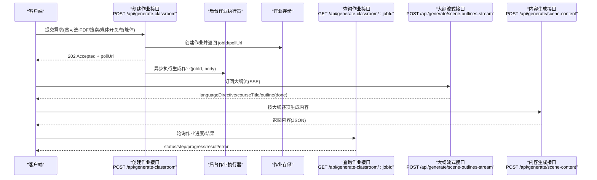
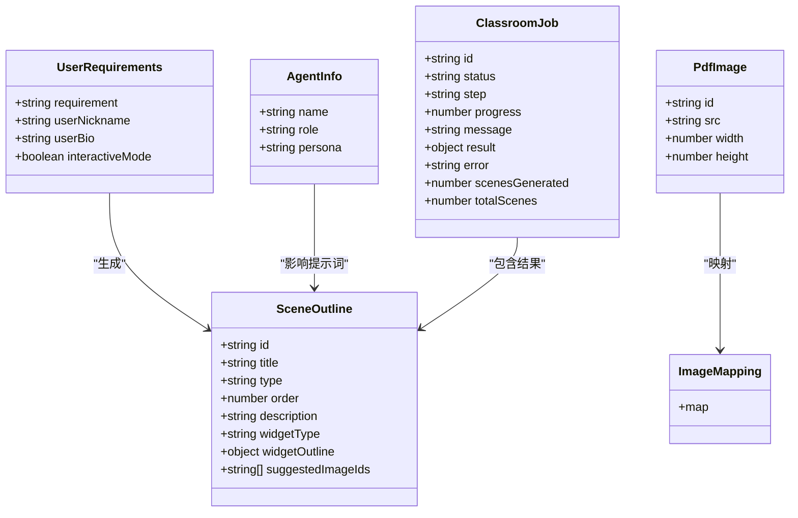

# 课程生成系统

<cite>
**本文引用的文件**   
- [app/api/generate-classroom/route.ts](file://app/api/generate-classroom/route.ts)
- [app/api/generate-classroom/[jobId]/route.ts](file://app/api/generate-classroom/[jobId]/route.ts)
- [app/api/generate/scene-outlines-stream/route.ts](file://app/api/generate/scene-outlines-stream/route.ts)
- [app/api/generate/scene-content/route.ts](file://app/api/generate/scene-content/route.ts)
- [lib/generation/generation-pipeline.ts](file://lib/generation/generation-pipeline.ts)
- [lib/generation/outline-generator.ts](file://lib/generation/outline-generator.ts)
</cite>

## 目录
- 产品概述
- 核心业务流程
- 功能模块清单
- 数据与状态
- 关键约束与边界

## 产品概述
本系统是一个 AI 驱动的交互式课件（MAIC）生成与课堂管理平台，核心目标是通过自然语言需求快速生成结构化课件，并支持课堂实时互动、编辑与回放。系统采用两阶段生成流水线：第一阶段基于用户需求生成结构化大纲；第二阶段根据大纲逐场景生成内容（幻灯片、测验、交互组件、PBL 等），并可并行生成媒体元素与动作。前端使用 Next.js + React + Zustand，AI 编排层结合 LangGraph 与 Vercel AI SDK，课件格式为自定义 DSL。

## 核心业务流程
两阶段生成流水线围绕“大纲生成 → 内容生成”展开，配合任务队列与 SSE 流式输出，提供可观测、可重试、可扩展的生成体验。

**图表来源** 
- [app/api/generate-classroom/route.ts:14-73](file://app/api/generate-classroom/route.ts#L14-L73)
- [app/api/generate-classroom/[jobId]/route.ts](file://app/api/generate-classroom/[jobId]/route.ts#L14-L55)
- [app/api/generate/scene-outlines-stream/route.ts:285-652](file://app/api/generate/scene-outlines-stream/route.ts#L285-L652)
- [app/api/generate/scene-content/route.ts:34-206](file://app/api/generate/scene-content/route.ts#L34-L206)

**章节来源**
- [app/api/generate-classroom/route.ts:14-73](file://app/api/generate-classroom/route.ts#L14-L73)
- [app/api/generate-classroom/[jobId]/route.ts:14-55](file://app/api/generate-classroom/[jobId]/route.ts#L14-L55)
- [app/api/generate/scene-outlines-stream/route.ts:285-652](file://app/api/generate/scene-outlines-stream/route.ts#L285-L652)
- [app/api/generate/scene-content/route.ts:34-206](file://app/api/generate/scene-content/route.ts#L34-L206)

## 功能模块清单
- 课程生成作业管理
  - 职责：接收用户需求，创建异步作业，返回可轮询的 jobId 与 pollUrl；提供作业状态查询。
  - 验收要点：必填字段校验、错误码规范、异步启动、轮询响应包含进度与结果。
- 大纲流式生成
  - 职责：基于用户需求与可选 PDF/图像/研究上下文，通过 LLM 流式输出结构化大纲，支持语言指令与课程标题提取、增量解析、重试与心跳保活。
  - 验收要点：SSE 事件类型完整、增量 JSON 解析稳定、异常重试、资源上限保护。
- 场景内容生成
  - 职责：依据单个大纲条目生成具体课件内容（文本、媒体占位、交互配置等），支持视觉模型与多模态输入。
  - 验收要点：参数校验、模型能力检测、降级策略、错误映射。
- 提示词与格式化
  - 职责：构建不同模式的提示词模板，格式化教师人设、学生画像、可用图像描述与视觉消息。
  - 验收要点：模板 ID 路由、变量注入、模式切换（普通/交互/任务引擎）。
- JSON 修复与解析
  - 职责：对 LLM 输出的不完整/不规范 JSON 进行修复与解析，保障下游稳定性。
  - 验收要点：兼容旧数组格式、包装对象格式、长度与安全限制。
- 大纲回退与规范化
  - 职责：将不符合预期的大纲条目回退为安全类型（如 slide），确保渲染可用性。
  - 验收要点：条件判断、日志告警、字段清理。

**章节来源**
- [lib/generation/generation-pipeline.ts:1-48](file://lib/generation/generation-pipeline.ts#L1-L48)
- [lib/generation/outline-generator.ts:1-214](file://lib/generation/outline-generator.ts#L1-L214)
- [app/api/generate/scene-outlines-stream/route.ts:1-652](file://app/api/generate/scene-outlines-stream/route.ts#L1-L652)
- [app/api/generate/scene-content/route.ts:1-206](file://app/api/generate/scene-content/route.ts#L1-L206)

## 数据与状态
- 核心数据模型
  - 用户需求 UserRequirements：包含 requirement、userNickname、userBio、interactiveMode 等。
  - 大纲 SceneOutline：包含 id、title、type、order、description、widgetType/widgetOutline、suggestedImageIds 等。
  - 图像信息 PdfImage/ImageMapping：用于文档图像与源图映射。
  - 智能体 AgentInfo：用于构建教师人设与上下文。
- 关键状态流转
  - 作业状态：pending → running → succeeded/failed，包含 step、progress、message、error、result 等。
  - 大纲流事件：languageDirective → courseTitle → outline（多次）→ done/error/retry。
- 数据所有权边界
  - 作业存储负责持久化与读取；流式接口负责实时推送；内容生成接口负责单条大纲到内容的转换。

**图表来源** 
- [lib/generation/outline-generator.ts:1-214](file://lib/generation/outline-generator.ts#L1-L214)
- [app/api/generate/scene-outlines-stream/route.ts:1-652](file://app/api/generate/scene-outlines-stream/route.ts#L1-L652)
- [app/api/generate/scene-content/route.ts:1-206](file://app/api/generate/scene-content/route.ts#L1-L206)

**章节来源**
- [lib/generation/outline-generator.ts:1-214](file://lib/generation/outline-generator.ts#L1-L214)
- [app/api/generate/scene-outlines-stream/route.ts:1-652](file://app/api/generate/scene-outlines-stream/route.ts#L1-L652)
- [app/api/generate/scene-content/route.ts:1-206](file://app/api/generate/scene-content/route.ts#L1-L206)

## 关键约束与边界
- 非功能性需求
  - 超时与保活：SSE 心跳间隔 15 秒，最大流缓冲 512KB，防止内存膨胀与连接超时。
  - 重试机制：大纲流最多尝试 3 次（初始 + 2 次重试），空结果或解析失败触发重试事件。
  - 模型能力检测：自动识别 vision 能力，选择 text-only 或 messages 多模态调用。
  - 资源限制：PDF 文本截取上限、视觉图像数量上限、课程标题长度限制。
- 依赖与集成边界
  - 模型解析：通过 resolveModelFromRequest 从请求头/体动态选择模型与思考配置。
  - 提示词模板：通过 PROMPT_IDS 路由不同模式（普通/交互/任务引擎）。
  - 外部服务：Web 搜索、TTS、图像/视频生成开关由请求参数控制。
- 业务约束
  - 交互模式与任务引擎模式互斥：taskEngineMode 启用时仅允许特定 widgetType。
  - 无交互配置或语言模型时，PBL/Interactive 回退为 Slide。
  - 媒体元素 ID 全局唯一化，避免冲突。

**章节来源**
- [app/api/generate/scene-outlines-stream/route.ts:285-652](file://app/api/generate/scene-outlines-stream/route.ts#L285-L652)
- [app/api/generate/scene-content/route.ts:34-206](file://app/api/generate/scene-content/route.ts#L34-L206)
- [lib/generation/outline-generator.ts:1-214](file://lib/generation/outline-generator.ts#L1-L214)