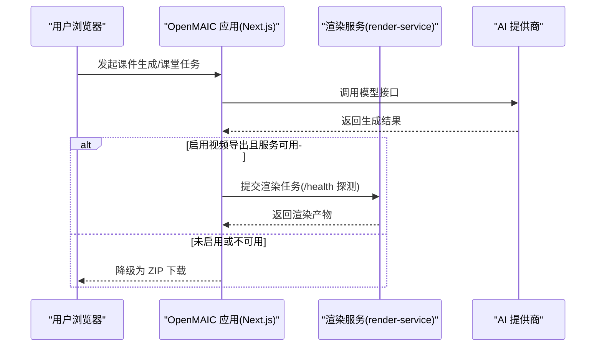
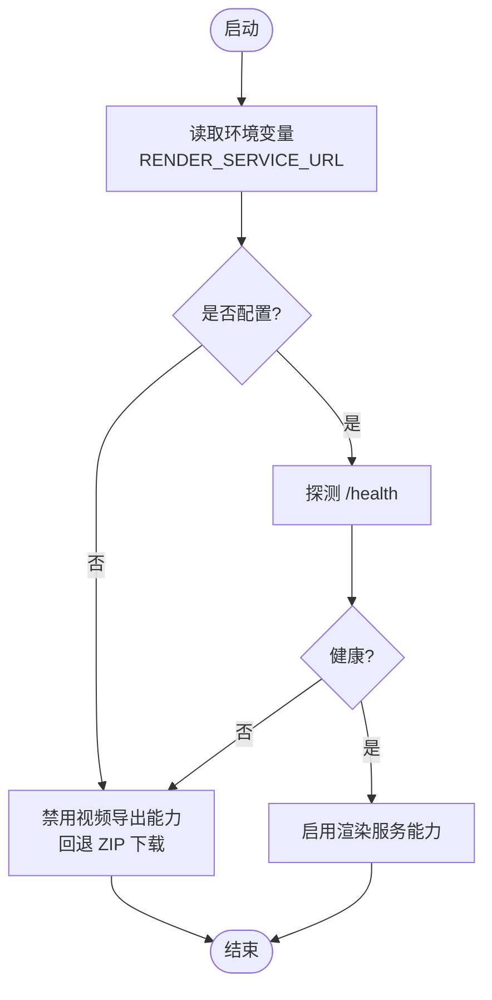
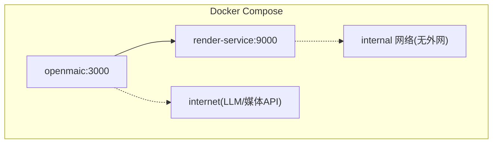
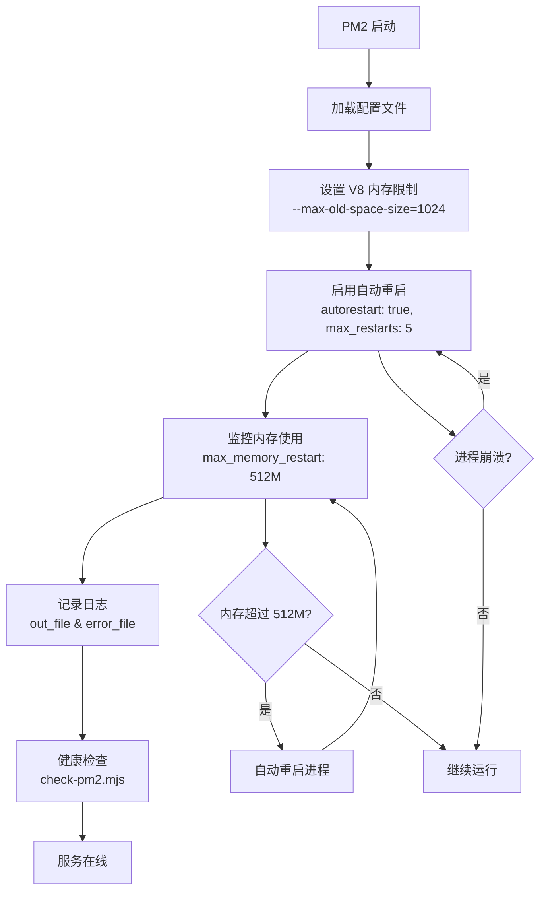
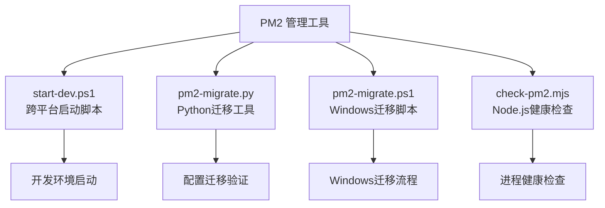

# 部署与配置

<cite>
**本文引用的文件**   
- [Dockerfile](file://Dockerfile)
- [docker-compose.yml](file://docker-compose.yml)
- [render-service/Dockerfile](file://render-service/Dockerfile)
- [vercel.json](file://vercel.json)
- [next.config.ts](file://next.config.ts)
- [package.json](file://package.json)
- [ecosystem.dev.config.cjs](file://ecosystem.dev.config.cjs)
- [scripts/check-pm2.mjs](file://scripts/check-pm2.mjs)
- [scripts/pm2-migrate.ps1](file://scripts/pm2-migrate.ps1)
- [scripts/start-dev.ps1](file://scripts/start-dev.ps1)
- [scripts/pm2-migrate.py](file://scripts/pm2-migrate.py)
- [scripts/service-ecosystem.config.cjs](file://scripts/service-ecosystem.config.cjs)
- [lib/server/render-service.ts](file://lib/server/render-service.ts)
- [lib/config/feature-flags.ts](file://lib/config/feature-flags.ts)
</cite>

## 更新摘要
**所做更改**
- 更新了PM2开发环境配置章节，移除了Windows特定的批处理脚本引用
- 新增了跨平台PowerShell脚本和Node.js工具的详细说明
- 增强了PM2进程管理和健康检查机制的描述
- 更新了故障诊断工具部分，反映新的脚本生态系统

## 产品概述
OpenMAIC 是一个 AI 驱动的交互式课件（MAIC）生成与课堂管理平台，支持自然语言生成结构化课件、课堂实时互动（问答/讨论/测验）、课件编辑与回放。前端基于 Next.js + React，AI 编排层使用 LangGraph + Vercel AI SDK，核心业务模块位于 lib/ 目录，包含编排、生成、回放、智能体、课堂管理、编辑器与导出等能力。项目提供多种部署方式：Docker 容器化、Vercel 云平台以及传统服务器部署，并内置可选的隔离渲染服务用于 MP4 视频导出。

## 核心业务流程
- 用户通过 Web 界面发起课件生成或课堂任务，Next.js 应用处理请求并调用外部 AI 提供商（LLM/TTS/图像/视频等）。
- 当启用视频导出时，应用将渲染任务转发至独立的 render-service；该服务在隔离网络中运行 Chromium + FFmpeg，完成页面渲染与视频合成后返回结果。
- 应用根据环境变量与运行时健康检查动态启用/降级功能，例如未配置渲染服务时自动回退为 ZIP 下载路径。



**图表来源** 
- [docker-compose.yml:1-80](file://docker-compose.yml#L1-L80)
- [lib/server/render-service.ts:15-60](file://lib/server/render-service.ts#L15-L60)

**章节来源**
- [docker-compose.yml:1-80](file://docker-compose.yml#L1-L80)
- [lib/server/render-service.ts:15-60](file://lib/server/render-service.ts#L15-L60)

## 功能模块清单
- 应用主服务（Next.js）
  - 职责：Web 前端与 API 路由、安全响应头、子路径部署、独立构建输出。
  - 验收要点：端口监听、环境变量生效、安全头设置、basePath 正确。
- 渲染服务（render-service）
  - 职责：Chromium + FFmpeg 渲染 MP4，隔离网络与出站限制，并发与队列控制。
  - 验收要点：/health 可达、并发参数生效、iptables 出站封锁日志、资源限制生效。
- 依赖与环境
  - 职责：Node 版本、包管理器、构建脚本、外部依赖（sharp、canvas、字体等）。
  - 验收要点：pnpm 安装成功、构建产物完整、运行时库齐全。

**章节来源**
- [Dockerfile:1-54](file://Dockerfile#L1-L54)
- [render-service/Dockerfile:1-64](file://render-service/Dockerfile#L1-L64)
- [package.json:1-177](file://package.json#L1-L177)

## 数据与状态
- 渲染服务可用性状态
  - 由环境变量 RENDER_SERVICE_URL 决定是否启用；应用侧通过 /health 探测判断健康度。
  - 未配置或不可达时，UI 与后端均降级到 ZIP 下载路径。
- 功能开关
  - NEXT_PUBLIC_* 前缀的环境变量在构建期注入客户端；服务端开关不使用 NEXT_PUBLIC_ 前缀。
  - 示例开关包括编辑器模式、Pi 聊天、职业任务引擎等。
- 构建与运行环境
  - Node 22、pnpm 10.28、standalone 输出（非 Vercel），子路径 basePath 支持。



**图表来源** 
- [lib/server/render-service.ts:15-60](file://lib/server/render-service.ts#L15-L60)
- [lib/config/feature-flags.ts:1-39](file://lib/config/feature-flags.ts#L1-L39)

**章节来源**
- [lib/server/render-service.ts:15-60](file://lib/server/render-service.ts#L15-L60)
- [lib/config/feature-flags.ts:1-39](file://lib/config/feature-flags.ts#L1-L39)

## 关键约束与边界
- 容器与网络
  - 应用默认绑定 127.0.0.1:3000，仅本地可访问；渲染服务暴露 9000 端口并通过内部网络互通。
  - 渲染服务所在网络为 internal，禁止访问宿主与互联网；entrypoint 通过 iptables 进一步限制出站。
- 资源与安全
  - 渲染服务内存上限 4GB，并发与队列参数可调；需要 CAP_NET_ADMIN 以启用出站封锁。
  - 应用侧设置严格的安全响应头（CSP、X-Frame-Options、HSTS 等），生产环境启用 HSTS。
- 构建与平台
  - Next.js standalone 输出适用于自托管；Vercel 部署通过 vercel.json 指定函数超时与构建命令。
  - Node 版本要求 >= 20.9.0，pnpm 10.28；部分原生依赖需系统库（cairo/pango/jpeg/giflib/librsvg）。

**章节来源**
- [docker-compose.yml:1-80](file://docker-compose.yml#L1-L80)
- [render-service/Dockerfile:1-64](file://render-service/Dockerfile#L1-L64)
- [next.config.ts:1-40](file://next.config.ts#L1-L40)
- [vercel.json:1-12](file://vercel.json#L1-L12)
- [package.json:1-177](file://package.json#L1-L177)

## 部署指南

### Docker 容器化部署
- 镜像构建
  - 应用镜像：多阶段构建，基础镜像 node:22-alpine，安装 pnpm，编译依赖与构建产物，最终 runner 镜像仅包含运行时与静态资源。
  - 渲染服务镜像：基于 Debian bookworm-slim，安装 Chromium、FFmpeg、字体与 ca-certificates，使用 puppeteer 指向系统 Chromium。
- 服务编排
  - openmaic 服务：映射 127.0.0.1:3000，挂载 .env.local 与数据卷，设置 RENDER_SERVICE_URL 指向 render-service。
  - render-service 服务：仅随 profile video-export 启动，暴露 9000 端口，限制内存 4GB，添加 NET_ADMIN 能力。
- 启动命令
  - 普通启动：docker compose up --build
  - 启用视频导出：docker compose --profile video-export up --build



**图表来源** 
- [docker-compose.yml:1-80](file://docker-compose.yml#L1-L80)

**章节来源**
- [Dockerfile:1-54](file://Dockerfile#L1-L54)
- [render-service/Dockerfile:1-64](file://render-service/Dockerfile#L1-L64)
- [docker-compose.yml:1-80](file://docker-compose.yml#L1-L80)

### Vercel 云平台部署
- 框架与构建
  - framework: nextjs，installCommand: pnpm install，buildCommand: pnpm build。
  - API 函数最大执行时长 300s，适合长耗时任务（如生成/导出）。
- 环境变量
  - 在 Vercel 项目设置中配置 NEXT_PUBLIC_* 与服务端环境变量（如 OPENMAIC_ENABLE_VOCATIONAL、RENDER_SERVICE_URL 等）。
- 注意事项
  - 渲染服务通常不在 Vercel 上运行，建议通过外部服务 URL 接入；若不可用则自动降级。

**章节来源**
- [vercel.json:1-12](file://vercel.json#L1-L12)
- [lib/config/feature-flags.ts:1-39](file://lib/config/feature-flags.ts#L1-L39)

### 传统服务器部署
- 前置条件
  - Node >= 20.9.0，pnpm 10.28，系统库（cairo/pango/jpeg/giflib/librsvg）用于 sharp/canvas。
- 构建与运行
  - 执行 pnpm install 与 pnpm build，生成 standalone 输出；使用 pnpm start 启动服务。
- 反向代理
  - 建议使用 Nginx/Caddy 作为反向代理，开启 HTTPS（SSL 证书）、Gzip/Brotli 压缩、缓存策略与速率限制。
- 环境变量
  - 通过 .env.local 或系统环境变量注入 NEXT_PUBLIC_BASE_PATH、OPENMAIC_ENABLE_VOCATIONAL、RENDER_SERVICE_URL 等。

**章节来源**
- [package.json:1-177](file://package.json#L1-L177)
- [next.config.ts:1-40](file://next.config.ts#L1-L40)

### PM2 开发环境部署
**更新** PM2 进程管理器配置，提供跨平台的开发环境稳定运行保障。

- PM2 配置文件
  - 配置文件位置：`ecosystem.dev.config.cjs`
  - 应用名称：`openmaic`
  - 启动脚本：直接运行 Next.js dev 命令，端口 3010
  - 工作目录：固定到配置文件所在目录

- 内存管理与优化
  - V8 旧空间限制：设置为 1GB（`--max-old-space-size=1024`）
  - 内存重启阈值：512MB，防止 FatalOOM 崩溃
  - 自动重启：启用 autorestart，最大重启次数 5 次
  - 重启延迟：2 秒，避免频繁重启循环

- 日志管理
  - 输出日志：`./logs/pm2-openmaic-out.log`
  - 错误日志：`./logs/pm2-openmaic-err.log`
  - 合并日志：启用 merge_logs，时间戳：启用 time

- 跨平台启动脚本
  - **PowerShell 脚本**：`scripts/start-dev.ps1` - 主要的跨平台启动脚本
  - **Python 迁移脚本**：`scripts/pm2-migrate.py` - 用于PM2配置迁移和验证
  - **PowerShell 迁移脚本**：`scripts/pm2-migrate.ps1` - Windows专用迁移脚本
  - **服务生态配置**：`scripts/service-ecosystem.config.cjs` - 聚合多个应用的PM2配置

- 健康检查与监控
  - 集成健康检查脚本：`scripts/check-pm2.mjs`
  - 支持检查多个必需应用的在线状态（philochora, openmaic）
  - 提供详细的进程状态信息输出

- 启动与管理命令
  ```bash
  # 启动或重载配置
  pm2 startOrReload ecosystem.dev.config.cjs --only openmaic
  
  # 停止服务
  pm2 stop openmaic
  
  # 重启服务（更新环境变量）
  pm2 restart openmaic --update-env
  
  # 查看日志
  pm2 logs openmaic
  ```

- 跨平台脚本生态系统
  - **PowerShell 脚本**：`scripts/start-dev.ps1` - 主要启动脚本，支持双应用启动
  - **Python 工具**：`scripts/pm2-migrate.py` - 跨平台PM2迁移工具
  - **Node.js 检查器**：`scripts/check-pm2.mjs` - 健康检查工具
  - **PowerShell 迁移**：`scripts/pm2-migrate.ps1` - Windows专用迁移流程



**图表来源** 
- [ecosystem.dev.config.cjs:21-52](file://ecosystem.dev.config.cjs#L21-L52)
- [scripts/check-pm2.mjs:13-51](file://scripts/check-pm2.mjs#L13-L51)

**章节来源**
- [ecosystem.dev.config.cjs:1-55](file://ecosystem.dev.config.cjs#L1-L55)
- [scripts/check-pm2.mjs:1-52](file://scripts/check-pm2.mjs#L1-L52)
- [scripts/start-dev.ps1:1-36](file://scripts/start-dev.ps1#L1-L36)
- [scripts/pm2-migrate.py:1-105](file://scripts/pm2-migrate.py#L1-L105)
- [scripts/pm2-migrate.ps1:1-31](file://scripts/pm2-migrate.ps1#L1-L31)
- [scripts/service-ecosystem.config.cjs:1-28](file://scripts/service-ecosystem.config.cjs#L1-L28)

## 环境变量与配置文件

### 应用环境变量（Next.js）
- NEXT_PUBLIC_BASE_PATH：子路径部署（如 /openmaic），独立运行留空。
- NEXT_PUBLIC_MAIC_EDITOR_ENABLED：启用 Pro 编辑器开关（客户端可见）。
- NEXT_PUBLIC_PI_CHAT_ENABLED：启用 Pi 聊天运行时（客户端可见）。
- OPENMAIC_ENABLE_VOCATIONAL：启用职业任务引擎（服务端）。
- RENDER_SERVICE_URL：渲染服务地址（如 http://render-service:9000），未设置则禁用视频导出能力。
- ALLOWED_FRAME_ANCESTORS：扩展 CSP frame-ancestors 白名单。
- NODE_ENV=production：生产环境启用 HSTS 等安全头。

**章节来源**
- [next.config.ts:1-40](file://next.config.ts#L1-L40)
- [lib/config/feature-flags.ts:1-39](file://lib/config/feature-flags.ts#L1-L39)
- [lib/server/render-service.ts:15-60](file://lib/server/render-service.ts#L15-L60)

### 渲染服务环境变量
- PORT=9000：服务监听端口。
- RENDER_MAX_CONCURRENCY：并发渲染数量（每个渲染驱动 Chromium + FFmpeg）。
- RENDER_MAX_JOBS_PER_USER：每用户并发限制（默认 0，关闭 per-user 限制）。
- PRODUCER_TMP_PROJECT_DIR=/tmp/openmaic-renders：临时工作目录。

**章节来源**
- [docker-compose.yml:1-80](file://docker-compose.yml#L1-L80)
- [render-service/Dockerfile:1-64](file://render-service/Dockerfile#L1-L64)

### PM2 开发环境配置
- NODE_ENV=development：开发环境标识
- 内存限制：--max-old-space-size=1024（1GB）
- 自动重启：autorestart=true，max_restarts=5
- 内存阈值：max_memory_restart='512M'

**章节来源**
- [ecosystem.dev.config.cjs:34-51](file://ecosystem.dev.config.cjs#L34-L51)

### 配置文件与提供者
- server-providers.yml：可选挂载，集中管理各 AI 提供商配置（密钥、baseUrl、模型列表等）。
- 运行时配置：应用内设置面板支持动态配置 provider（apiKey、baseUrl、models），持久化于 localStorage。

**章节来源**
- [docker-compose.yml:1-80](file://docker-compose.yml#L1-L80)
- [components/settings/index.tsx:344-565](file://components/settings/index.tsx#L344-L565)

## SSL 证书与反向代理
- 反向代理推荐
  - Nginx：启用 HTTPS、HTTP/2、Gzip/Brotli、缓存、限流、IP 白名单。
  - Caddy：自动申请/续期 Let's Encrypt 证书，简化 TLS 配置。
- 安全响应头
  - X-Frame-Options/SAMEORIGIN、Content-Security-Policy（frame-ancestors）、X-Content-Type-Options、Referrer-Policy、Permissions-Policy、Strict-Transport-Security（生产环境）。
- 子路径部署
  - 通过 NEXT_PUBLIC_BASE_PATH 配置 basePath，确保静态资源与路由正确解析。

**章节来源**
- [next.config.ts:1-40](file://next.config.ts#L1-L40)

## 负载均衡与高可用
- 多实例部署
  - 使用容器编排（Kubernetes/Docker Swarm）横向扩展 openmaic 实例，配合负载均衡器（Nginx/HAProxy/云 LB）。
- 渲染服务高可用
  - 多副本 render-service 配合队列（如 Redis/RabbitMQ）分发渲染任务，避免单点瓶颈。
- 会话与状态
  - 无状态应用设计，会话与状态存储于外部（IndexedDB/后端存储），便于水平扩展。

[本节为概念性内容，不直接分析具体文件]

## 监控与日志
- 应用日志
  - 使用 createLogger 创建命名日志器（如 RenderService），记录健康检查失败与错误信息。
- 渲染服务日志
  - 启动日志包含 egress lockdown active 提示；健康检查 /health 返回 ok 字段。
- PM2 日志管理
  - 输出日志：`./logs/pm2-openmaic-out.log`
  - 错误日志：`./logs/pm2-openmaic-err.log`
  - 合并日志和时间戳功能
- 指标采集
  - 建议集成 Prometheus/Grafana 采集 CPU、内存、请求延迟与错误率；对渲染任务队列长度与成功率进行监控。

**章节来源**
- [lib/server/render-service.ts:1-60](file://lib/server/render-service.ts#L1-L60)
- [ecosystem.dev.config.cjs:43-46](file://ecosystem.dev.config.cjs#L43-L46)

## 性能调优
- 渲染服务
  - 调整 RENDER_MAX_CONCURRENCY 与 RENDER_MAX_JOBS_PER_USER，结合内存限制（mem_limit 4GB）评估并发上限。
  - 优化字体与资源预加载，减少渲染时间。
- 应用服务
  - 启用 HTTP/2、Gzip/Brotli、CDN 缓存静态资源；合理设置 proxyClientMaxBodySize（当前 200mb）。
  - 使用 standalone 输出减少运行时体积，提升冷启动速度。
- PM2 内存优化
  - V8 旧空间限制 1GB，防止内存泄漏导致的 FatalOOM
  - 512MB 内存阈值触发自动重启，保护系统稳定性
  - 自动重启机制确保服务在高负载下的可用性

**章节来源**
- [docker-compose.yml:1-80](file://docker-compose.yml#L1-L80)
- [next.config.ts:1-40](file://next.config.ts#L1-L40)
- [ecosystem.dev.config.cjs:31-51](file://ecosystem.dev.config.cjs#L31-L51)

## 安全加固
- 网络安全
  - 渲染服务使用 internal 网络，entrypoint 通过 iptables 阻断出站连接，防止不受信任的 Chromium 访问外部。
- 应用安全
  - 严格 CSP、X-Frame-Options、HSTS、Permissions-Policy；生产环境启用 Strict-Transport-Security。
- 权限最小化
  - 容器以非 root 用户运行（nextjs/render），仅授予必要能力（CAP_NET_ADMIN 用于 iptables）。

**章节来源**
- [docker-compose.yml:1-80](file://docker-compose.yml#L1-L80)
- [render-service/Dockerfile:1-64](file://render-service/Dockerfile#L1-L64)
- [next.config.ts:1-40](file://next.config.ts#L1-L40)

## 备份与恢复
- 数据卷
  - openmaic-data 卷用于持久化应用数据（如上传文件、缓存），定期快照备份。
- 渲染临时目录
  - /tmp/openmaic-renders 为渲染工作目录，无需持久化；清理策略按容器生命周期管理。
- 配置备份
  - .env.local、server-providers.yml 等配置文件纳入版本管理与备份流程。
- PM2 配置备份
  - ecosystem.dev.config.cjs 配置文件应纳入版本控制
  - 定期备份 PM2 进程列表和状态

**章节来源**
- [docker-compose.yml:1-80](file://docker-compose.yml#L1-L80)
- [ecosystem.dev.config.cjs:1-55](file://ecosystem.dev.config.cjs#L1-L55)

## 扩展部署与灾难恢复
- 扩展方案
  - 微服务拆分：将渲染服务独立部署，通过消息队列解耦；应用服务多副本无状态扩展。
- 灾难恢复
  - 多区域部署渲染服务与应用实例；定期演练故障切换与数据恢复流程。
- 灰度发布
  - 使用蓝绿/金丝雀发布策略，逐步放量新版本，降低风险。
- PM2 进程管理
  - 支持进程自动重启和故障恢复
  - 提供健康检查和状态监控

[本节为概念性内容，不直接分析具体文件]

## 部署检查清单
- 基础环境
  - Node >= 20.9.0，pnpm 10.28，系统库安装完成。
- 构建与运行
  - pnpm install 与 pnpm build 成功，standalone 输出存在。
- 环境变量
  - NEXT_PUBLIC_BASE_PATH、OPENMAIC_ENABLE_VOCATIONAL、RENDER_SERVICE_URL 等已配置。
- 容器与网络
  - openmaic 绑定 127.0.0.1:3000，render-service 暴露 9000，internal 网络连通。
- 健康检查
  - /health 返回 ok，渲染服务日志显示 egress lockdown active。
- 安全头
  - CSP、X-Frame-Options、HSTS 等响应头正确设置。
- PM2 配置验证
  - V8 内存限制设置为 1GB
  - 自动重启功能正常
  - 内存阈值 512MB 触发重启
  - 日志文件正确生成

**章节来源**
- [package.json:1-177](file://package.json#L1-L177)
- [docker-compose.yml:1-80](file://docker-compose.yml#L1-L80)
- [next.config.ts:1-40](file://next.config.ts#L1-L40)
- [ecosystem.dev.config.cjs:31-51](file://ecosystem.dev.config.cjs#L31-L51)

## 故障诊断工具
**更新** 故障诊断工具已更新为跨平台脚本生态系统。

- 健康检查
  - 应用：GET /health（若实现）；渲染服务：GET /health。
  - PM2 健康检查：`pnpm run check:pm2` 或 `pm2 jlist --no-color | node scripts/check-pm2.mjs`
- 日志查看
  - docker logs <container> 查看启动与健康检查日志；关注 egress lockdown 与错误堆栈。
  - PM2 日志：`pm2 logs openmaic` 查看应用日志
  - 手动日志文件：`./logs/pm2-openmaic-out.log` 和 `./logs/pm2-openmaic-err.log`
- 网络连通
  - 在 openmaic 容器内 curl http://render-service:9000/health 验证连通性。
- 资源监控
  - 使用 docker stats 观察 CPU/内存占用；对渲染服务重点监控并发与队列长度。
  - PM2 进程监控：`pm2 monit` 查看进程状态和资源使用情况
- **跨平台PM2管理工具**
  - **PowerShell 启动脚本**：`scripts/start-dev.ps1` - 跨平台开发环境启动
  - **Python 迁移工具**：`scripts/pm2-migrate.py` - 跨平台PM2配置迁移和验证
  - **PowerShell 迁移脚本**：`scripts/pm2-migrate.ps1` - Windows专用迁移流程
  - **Node.js 健康检查**：`scripts/check-pm2.mjs` - 进程状态验证



**图表来源** 
- [scripts/start-dev.ps1:1-36](file://scripts/start-dev.ps1#L1-L36)
- [scripts/pm2-migrate.py:1-105](file://scripts/pm2-migrate.py#L1-L105)
- [scripts/pm2-migrate.ps1:1-31](file://scripts/pm2-migrate.ps1#L1-L31)
- [scripts/check-pm2.mjs:1-52](file://scripts/check-pm2.mjs#L1-L52)

**章节来源**
- [docker-compose.yml:1-80](file://docker-compose.yml#L1-L80)
- [lib/server/render-service.ts:1-60](file://lib/server/render-service.ts#L1-L60)
- [scripts/check-pm2.mjs:1-52](file://scripts/check-pm2.mjs#L1-L52)
- [scripts/pm2-migrate.py:1-105](file://scripts/pm2-migrate.py#L1-L105)
- [scripts/pm2-migrate.ps1:1-31](file://scripts/pm2-migrate.ps1#L1-L31)
- [ecosystem.dev.config.cjs:43-51](file://ecosystem.dev.config.cjs#L43-L51)

## Next.js 构建配置详解

### serverExternalPackages 配置
**更新** 已添加 'shiki' 到 serverExternalPackages 数组以修复独立部署时的模块解析问题。

Next.js 的 `serverExternalPackages` 配置用于指定在 standalone 部署时应保持为外部依赖的包，而不是被打包进应用。这对于大型第三方库特别重要，可以避免重复打包和运行时模块解析问题。

当前配置包括：
- `@earendil-works/pi-ai`：Pi AI 相关功能
- `@earendil-works*pi-agent-core`：Pi 智能体核心功能  
- `shiki`：代码语法高亮库

### Shiki 语法高亮库的使用
Shiki 是应用中的代码语法高亮核心库，在以下组件中使用：

1. **AI 元素代码块组件** (`components/ai-elements/code-block.tsx`)
   - 使用 `codeToHtml` 函数进行代码高亮
   - 支持浅色和深色主题
   - 提供行号显示功能

2. **幻灯片渲染器代码元素** (`packages/@openmaic/renderer/src/elements/code/BaseCodeElement.tsx`)
   - 动态导入 Shiki 进行按需加载
   - 支持多种编程语言的高亮
   - 提供打字机效果的代码展示

### Standalone 部署注意事项
**新增** 由于 Shiki 已被添加到 serverExternalPackages，standalone 部署现在可以正确处理模块解析：

- 构建时不会尝试将 Shiki 打包进应用
- 运行时从系统依赖中正确解析 Shiki 模块
- 避免了 `Cannot find module 'shiki'` 等运行时错误
- 减少了应用包大小，提升加载性能

**章节来源**
- [next.config.ts:9](file://next.config.ts#L9)
- [components/ai-elements/code-block.tsx:15](file://components/ai-elements/code-block.tsx#L15)
- [packages/@openmaic/renderer/src/elements/code/BaseCodeElement.tsx:14](file://packages/@openmaic/renderer/src/elements/code/BaseCodeElement.tsx#L14)

## 代码块渲染功能部署指南

### Shiki 依赖管理
Shiki 库在应用中用于代码语法高亮，支持多种编程语言：
- Python、JavaScript、TypeScript、JSON
- Go、Rust、Java、C、C++
- HTML、CSS、Bash、SQL、YAML、Markdown
- JSX、TSX

### 构建优化
- Shiki 被标记为外部依赖，避免重复打包
- 按需加载机制减少初始加载时间
- 支持动态语言注册和主题切换

### 部署验证
部署后应验证以下功能：
- 代码块正常显示语法高亮
- 浅色/深色主题切换正常
- 复制按钮功能正常
- 行号显示功能正常

**章节来源**
- [package.json:125](file://package.json#L125)
- [components/ai-elements/code-block.tsx:52-71](file://components/ai-elements/code-block.tsx#L52-L71)
- [packages/@openmaic/renderer/src/elements/code/BaseCodeElement.tsx:17-36](file://packages/@openmaic/renderer/src/elements/code/BaseCodeElement.tsx#L17-L36)

## PM2 开发环境故障排除

### 常见问题与解决方案
- **FatalOOM 崩溃**
  - 症状：进程因内存不足崩溃
  - 解决方案：V8 内存限制已设置为 1GB，自动重启阈值 512MB
  - 预防措施：监控系统内存使用情况

- **进程无法启动**
  - 检查端口 3010 是否被占用
  - 验证配置文件路径是否正确
  - 查看 PM2 日志文件定位问题

- **自动重启循环**
  - 检查 max_restarts 配置（当前为 5 次）
  - 查看错误日志确定根本原因
  - 适当调整 restart_delay 时间间隔

### PM2 管理命令参考
```bash
# 查看所有进程状态
pm2 list

# 查看详细信息
pm2 show openmaic

# 实时监控
pm2 monit

# 查看日志
pm2 logs openmaic --lines 100

# 重启进程
pm2 restart openmaic

# 删除进程
pm2 delete openmaic
```

### 跨平台脚本使用指南
- **PowerShell 启动脚本**：`.\scripts\start-dev.ps1`
  - 自动检查中间件冲突和端口占用
  - 支持双应用（openmaic + philochora）启动
  - 提供完整的启动流程和验证

- **Python 迁移工具**：`python scripts/pm2-migrate.py`
  - 跨平台PM2配置迁移
  - 自动清理旧进程和配置
  - 验证日志路径正确性

- **PowerShell 迁移脚本**：`.\scripts\pm2-migrate.ps1`
  - Windows专用迁移流程
  - 详细的状态记录和日志输出
  - 自动化的PM2进程管理

**章节来源**
- [ecosystem.dev.config.cjs:31-51](file://ecosystem.dev.config.cjs#L31-L51)
- [scripts/check-pm2.mjs:1-52](file://scripts/check-pm2.mjs#L1-L52)
- [scripts/start-dev.ps1:1-36](file://scripts/start-dev.ps1#L1-L36)
- [scripts/pm2-migrate.py:1-105](file://scripts/pm2-migrate.py#L1-L105)
- [scripts/pm2-migrate.ps1:1-31](file://scripts/pm2-migrate.ps1#L1-L31)