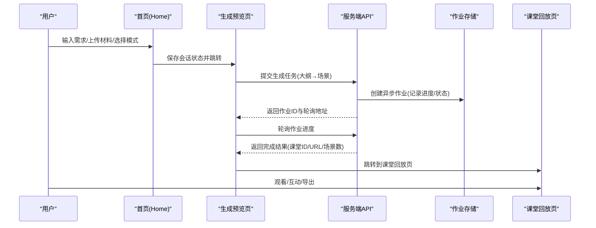
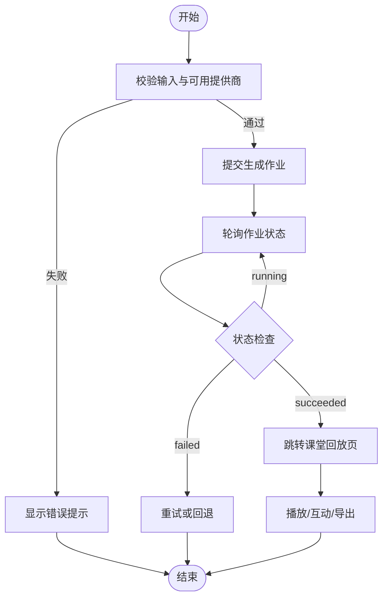

# 项目概述

<cite>
**本文引用的文件**   
- [README-zh.md](file://README-zh.md)
- [package.json](file://package.json)
- [app/layout.tsx](file://app/layout.tsx)
- [app/page.tsx](file://app/page.tsx)
- [lib/server/classroom-job-store.ts](file://lib/server/classroom-job-store.ts)
</cite>

## 产品概述
OpenMAIC（Open Multi-Agent Interactive Classroom）是一个开源的 AI 驱动交互式课件与课堂管理平台。它能够将任意主题或文档快速转化为包含幻灯片、测验、交互式模拟与项目制学习（PBL）的沉浸式课堂体验，并由 AI 教师与 AI 同学进行语音讲解、白板绘图与实时讨论。平台支持一键生成课堂、多智能体互动教学、课件编辑导出，以及通过 OpenClaw 在飞书/Slack/Telegram 等聊天应用中直接生成课堂。

- 目标用户：教师、学生、内容创作者与培训讲师
- 核心价值：降低课件制作门槛、提升课堂互动性与参与度、提供可编辑与可导出的标准化课件资产
- 适用场景：在线课程、翻转课堂、企业内训、竞赛辅导、跨学科探究式学习

**章节来源**
- [README-zh.md:50-63](file://README-zh.md#L50-L63)

## 核心业务流程
OpenMAIC 的核心流程围绕“输入需求 → 两阶段生成 → 课堂回放与互动 → 导出”展开：

- 关键交互节点
  - 首页输入区：需求文本、附件材料、是否启用网页搜索与深度交互模式
  - 生成预览页：展示大纲与场景生成进度，支持重试与错误提示
  - 课堂回放页：播放幻灯片、问答、白板、测验与 PBL 活动
  - 导出：PPTX、HTML、ZIP（含媒体资源）

**章节来源**
- [app/page.tsx:98-149](file://app/page.tsx#L98-L149)
- [app/page.tsx:317-409](file://app/page.tsx#L317-L409)
- [lib/server/classroom-job-store.ts:194-224](file://lib/server/classroom-job-store.ts#L194-L224)

## 功能模块清单
- 课堂生成流水线
  - 职责：两阶段生成（大纲 → 场景），支持多种场景类型（幻灯片、测验、交互式 HTML、PBL）
  - 用户价值：从自然语言或文档快速产出完整课堂结构
  - 验收要点：大纲质量、场景多样性、生成稳定性与错误恢复
- 多智能体编排与互动
  - 职责：基于 LangGraph 的状态机管理智能体轮次、讨论与问答
  - 用户价值：AI 教师与同学的实时协作与引导
  - 验收要点：对话流畅性、角色人设一致性、白板与动作执行
- 回放引擎与动作执行
  - 职责：驱动课堂回放状态机（idle → playing → live），执行 28+ 动作（语音、白板绘图/文字/形状/图表、聚光灯、激光笔等）
  - 用户价值：真实课堂般的视听体验与操作反馈
  - 验收要点：时序同步、动作渲染正确性、跨设备适配
- 编辑器与导出
  - 职责：幻灯片级编辑（拖拽、缩放、旋转、多选）、导出 PPTX/HTML/ZIP
  - 用户价值：二次创作与离线使用
  - 验收要点：编辑保真度、导出兼容性、离线资源内联
- 设置与服务商集成
  - 职责：LLM/TTS/ASR/图像/视频提供商配置与校验
  - 用户价值：灵活接入多家厂商与本地模型（如 Lemonade、VoxCPM2）
  - 验收要点：配置生效、鉴权安全、降级策略
- OpenClaw 集成
  - 职责：在聊天应用中一键生成与查看课堂
  - 用户价值：零门槛使用，无需命令行
  - 验收要点：技能安装、访问码/自托管模式、异步任务跟踪

**章节来源**
- [README-zh.md:402-477](file://README-zh.md#L402-L477)
- [README-zh.md:479-516](file://README-zh.md#L479-L516)
- [README-zh.md:567-584](file://README-zh.md#L567-L584)

## 数据与状态
- 核心数据模型
  - 课堂（Stage）：包含多个场景（Slide/Quiz/Interactive/PBL），每个场景有元素集合与元数据
  - DSL（@openmaic/dsl）：统一的课件描述格式，贯穿导入、编辑、渲染与导出
  - 作业（ClassroomGenerationJob）：异步生成任务的进度、状态与结果
- 关键状态流转
  - 生成作业：pending → running → succeeded/failed，包含 step、progress、message、completedAt、error 等字段
  - 回放状态：idle → playing → live，驱动场景切换与动作触发
- 数据所有权边界
  - 前端：Zustand 状态、IndexedDB 缓存（媒体与草稿）、浏览器本地存储（偏好）
  - 后端：作业存储、媒体代理、外部服务调用（LLM/TTS/ASR/图片/视频）
  - 导入/导出：MAIC ZIP 与 PPTX 转换由 @openmaic/importer 与 pptxgenjs 处理

**章节来源**
- [lib/server/classroom-job-store.ts:194-224](file://lib/server/classroom-job-store.ts#L194-L224)
- [README-zh.md:672-677](file://README-zh.md#L672-L677)

## 关键约束与边界
- 技术栈与环境
  - Node.js ≥ 20.9.0；pnpm ≥ 10；Next.js 16 + React 19；LangGraph 1.1；Tailwind CSS 4
  - 可选：Docker Compose、Render Service（MP4 导出）、MinerU（高级文档解析）、VoxCPM2（TTS 克隆）
- 依赖与集成边界
  - LLM/TTS/ASR/图像/视频提供商需按环境变量或 server-providers.yml 配置
  - 访问控制：ACCESS_CODE 用于共享部署保护
  - 离线能力：导出时内联 CDN 资源为 data: URI，实现完全离线播放
- 业务约束
  - 生成前必须存在可用的 LLM 提供商与具体模型
  - 深度交互模式与职教任务模式受特性开关控制
  - 导入/导出格式兼容性与资源可用性影响最终效果

**章节来源**
- [package.json:1-28](file://package.json#L1-L28)
- [README-zh.md:84-136](file://README-zh.md#L84-L136)
- [README-zh.md:223-262](file://README-zh.md#L223-L262)
- [README-zh.md:264-302](file://README-zh.md#L264-L302)
- [app/layout.tsx:1-49](file://app/layout.tsx#L1-L49)